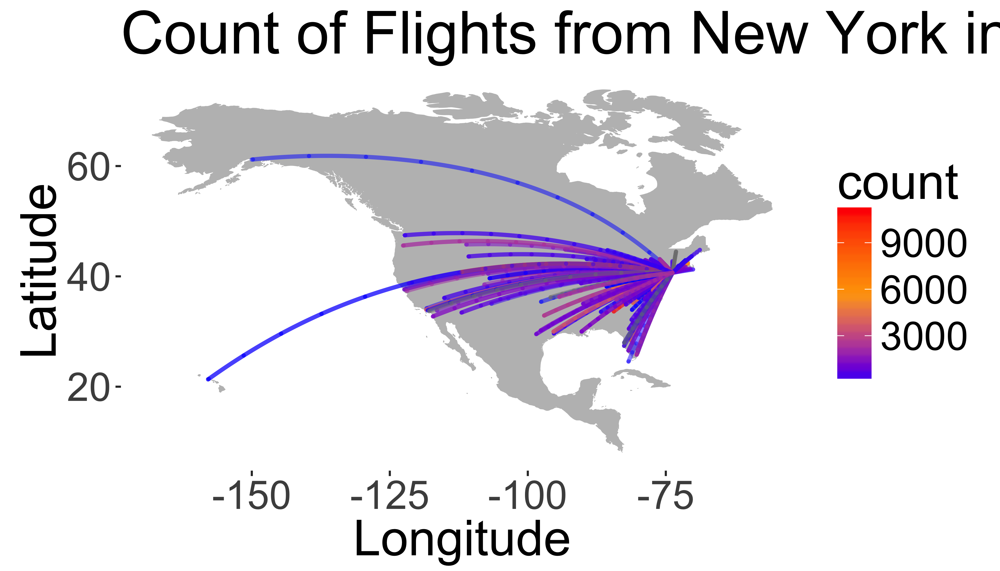

# Data Wrangling


<div>
<object data="02_assets/02_DataWrangling.pdf" type="application/pdf" width="100%" height="600px"> 
  <p>It appears you don't have a PDF plugin for this browser.
   No biggie... you can <a href="02_assets/02_DataWrangling.pdf">click here to
  download the PDF file.</a></p>  
 </object>
 </div>
 <p><a href="02_assets/02_DataWrangling.pdf">Download the PDF of the presentation</a></p>  

[<i class="fa fa-file-code-o fa-3x" aria-hidden="true"></i> The R Script associated with this page is available here](02_DataWrangling.R).  Download this file and open it (or copy-paste into a new script) with RStudio so you can follow along.  


# RStudio Shortcuts

## Running code
* `ctrl-R` (or `command-R`) to run current line
* Highlight `code` in script and run `ctrl-R` (or `command-R`) to run selection
* Buttons: 

## Switching windows
* `ctrl-1`: script window
* `ctrl-2`: console window

> Try to run today's script without using your mouse/trackpad

# Data wrangling

## Useful packages: [`dplyr`](https://cran.rstudio.com/web/packages/dplyr/vignettes/introduction.html)  and [`tidyr`]()

[Cheat sheets on website](https://www.rstudio.com/resources/cheatsheets/) for [Data Wrangling](https://www.rstudio.com/wp-content/uploads/2015/02/data-wrangling-cheatsheet.pdf)


```r
library(dplyr)
library(tidyr)
```
Remember use `install.packages("dplyr")` to install a new package.

###  Example operations from [here](https://cran.rstudio.com/web/packages/dplyr/vignettes/introduction.html)

## New York City Flights
Data from [US Bureau of Transportation Statistics](http://www.transtats.bts.gov/DatabaseInfo.asp?DB_ID=120&Link=0) (see `?nycflights13`)

```r
library(nycflights13)
```
Check out the `flights` object

```r
head(flights)
```

```
## # A tibble: 6 × 19
##    year month   day dep_time sched_dep_time
##   <int> <int> <int>    <int>          <int>
## 1  2013     1     1      517            515
## 2  2013     1     1      533            529
## 3  2013     1     1      542            540
## 4  2013     1     1      544            545
## 5  2013     1     1      554            600
## 6  2013     1     1      554            558
## # ... with 14 more variables: dep_delay <dbl>,
## #   arr_time <int>, sched_arr_time <int>,
## #   arr_delay <dbl>, carrier <chr>, flight <int>,
## #   tailnum <chr>, origin <chr>, dest <chr>,
## #   air_time <dbl>, distance <dbl>, hour <dbl>,
## #   minute <dbl>, time_hour <dttm>
```

### Object _Structure_
Check out data _structure_ with `glimpse()`

```r
glimpse(flights)
```

```
## Observations: 336,776
## Variables: 19
## $ year           <int> 2013, 2013, 2013, 2013...
## $ month          <int> 1, 1, 1, 1, 1, 1, 1, 1...
## $ day            <int> 1, 1, 1, 1, 1, 1, 1, 1...
## $ dep_time       <int> 517, 533, 542, 544, 55...
## $ sched_dep_time <int> 515, 529, 540, 545, 60...
## $ dep_delay      <dbl> 2, 4, 2, -1, -6, -4, -...
## $ arr_time       <int> 830, 850, 923, 1004, 8...
## $ sched_arr_time <int> 819, 830, 850, 1022, 8...
## $ arr_delay      <dbl> 11, 20, 33, -18, -25, ...
## $ carrier        <chr> "UA", "UA", "AA", "B6"...
## $ flight         <int> 1545, 1714, 1141, 725,...
## $ tailnum        <chr> "N14228", "N24211", "N...
## $ origin         <chr> "EWR", "LGA", "JFK", "...
## $ dest           <chr> "IAH", "IAH", "MIA", "...
## $ air_time       <dbl> 227, 227, 160, 183, 11...
## $ distance       <dbl> 1400, 1416, 1089, 1576...
## $ hour           <dbl> 5, 5, 5, 5, 6, 5, 6, 6...
## $ minute         <dbl> 15, 29, 40, 45, 0, 58,...
## $ time_hour      <dttm> 2013-01-01 05:00:00, ...
```

# `dplyr` "verbs"

* `select()` and `rename()`: Extract existing variables
* `filter()` and `slice()`: Extract existing observations
* `arrange()`
* `distinct()`
* `mutate()` and `transmute()`: Derive new variables
* `summarise()`: Change the unit of analysis
* `sample_n()` and `sample_frac()`

## Useful select functions

* "`-`"  Select everything but
* "`:`"  Select range
* `contains()` Select columns whose name contains a character string
* `ends_with()` Select columns whose name ends with a string
* `everything()` Select every column
* `matches()` Select columns whose name matches a regular expression
* `num_range()` Select columns named x1, x2, x3, x4, x5
* `one_of()` Select columns whose names are in a group of names
* `starts_with()` Select columns whose name starts with a character string

### `select()` examples
Select only the `year`, `month`, and `day` columns:

```r
select(flights,year, month, day)
```

```
## # A tibble: 336,776 × 3
##     year month   day
##    <int> <int> <int>
## 1   2013     1     1
## 2   2013     1     1
## 3   2013     1     1
## 4   2013     1     1
## 5   2013     1     1
## 6   2013     1     1
## 7   2013     1     1
## 8   2013     1     1
## 9   2013     1     1
## 10  2013     1     1
## # ... with 336,766 more rows
```

### `select()` examples

Select everything _except_ the `tailnum`:

```r
select(flights,-tailnum)
```

```
## # A tibble: 336,776 × 18
##     year month   day dep_time sched_dep_time
##    <int> <int> <int>    <int>          <int>
## 1   2013     1     1      517            515
## 2   2013     1     1      533            529
## 3   2013     1     1      542            540
## 4   2013     1     1      544            545
## 5   2013     1     1      554            600
## 6   2013     1     1      554            558
## 7   2013     1     1      555            600
## 8   2013     1     1      557            600
## 9   2013     1     1      557            600
## 10  2013     1     1      558            600
## # ... with 336,766 more rows, and 13 more
## #   variables: dep_delay <dbl>, arr_time <int>,
## #   sched_arr_time <int>, arr_delay <dbl>,
## #   carrier <chr>, flight <int>, origin <chr>,
## #   dest <chr>, air_time <dbl>, distance <dbl>,
## #   hour <dbl>, minute <dbl>, time_hour <dttm>
```

Select all columns containing the string `"time"`:

```r
select(flights,contains("time"))
```

```
## # A tibble: 336,776 × 6
##    dep_time sched_dep_time arr_time
##       <int>          <int>    <int>
## 1       517            515      830
## 2       533            529      850
## 3       542            540      923
## 4       544            545     1004
## 5       554            600      812
## 6       554            558      740
## 7       555            600      913
## 8       557            600      709
## 9       557            600      838
## 10      558            600      753
## # ... with 336,766 more rows, and 3 more
## #   variables: sched_arr_time <int>,
## #   air_time <dbl>, time_hour <dttm>
```

You can also rename columns with `select()`

```r
select(flights,year,carrier,destination=dest)
```

```
## # A tibble: 336,776 × 3
##     year carrier destination
##    <int>   <chr>       <chr>
## 1   2013      UA         IAH
## 2   2013      UA         IAH
## 3   2013      AA         MIA
## 4   2013      B6         BQN
## 5   2013      DL         ATL
## 6   2013      UA         ORD
## 7   2013      B6         FLL
## 8   2013      EV         IAD
## 9   2013      B6         MCO
## 10  2013      AA         ORD
## # ... with 336,766 more rows
```

## `filter()` observations

Filter all flights that departed on on January 1st:


```r
filter(flights, month == 1, day == 1)
```

```
## # A tibble: 842 × 19
##     year month   day dep_time sched_dep_time
##    <int> <int> <int>    <int>          <int>
## 1   2013     1     1      517            515
## 2   2013     1     1      533            529
## 3   2013     1     1      542            540
## 4   2013     1     1      544            545
## 5   2013     1     1      554            600
## 6   2013     1     1      554            558
## 7   2013     1     1      555            600
## 8   2013     1     1      557            600
## 9   2013     1     1      557            600
## 10  2013     1     1      558            600
## # ... with 832 more rows, and 14 more variables:
## #   dep_delay <dbl>, arr_time <int>,
## #   sched_arr_time <int>, arr_delay <dbl>,
## #   carrier <chr>, flight <int>, tailnum <chr>,
## #   origin <chr>, dest <chr>, air_time <dbl>,
## #   distance <dbl>, hour <dbl>, minute <dbl>,
## #   time_hour <dttm>
```


## _Base_ R method
This is equivalent to the more verbose code in base R:


```r
flights[flights$month == 1 & flights$day == 1, ]
```

```
## # A tibble: 842 × 19
##     year month   day dep_time sched_dep_time
##    <int> <int> <int>    <int>          <int>
## 1   2013     1     1      517            515
## 2   2013     1     1      533            529
## 3   2013     1     1      542            540
## 4   2013     1     1      544            545
## 5   2013     1     1      554            600
## 6   2013     1     1      554            558
## 7   2013     1     1      555            600
## 8   2013     1     1      557            600
## 9   2013     1     1      557            600
## 10  2013     1     1      558            600
## # ... with 832 more rows, and 14 more variables:
## #   dep_delay <dbl>, arr_time <int>,
## #   sched_arr_time <int>, arr_delay <dbl>,
## #   carrier <chr>, flight <int>, tailnum <chr>,
## #   origin <chr>, dest <chr>, air_time <dbl>,
## #   distance <dbl>, hour <dbl>, minute <dbl>,
## #   time_hour <dttm>
```

Compare with `dplyr` method: 

```r
filter(flights, month == 1, day == 1)`
```


<div class="well">
Filter the `flights` data set to keep only evening flights (`dep_time` after 1600) in June.

<button data-toggle="collapse" class="btn btn-primary btn-sm round" data-target="#demo1">Show Solution</button>
<div id="demo1" class="collapse">


```r
filter(flights,dep_time>1600,month==6)
```

```
## # A tibble: 10,117 × 19
##     year month   day dep_time sched_dep_time
##    <int> <int> <int>    <int>          <int>
## 1   2013     6     1     1602           1505
## 2   2013     6     1     1602           1605
## 3   2013     6     1     1602           1610
## 4   2013     6     1     1603           1610
## 5   2013     6     1     1603           1545
## 6   2013     6     1     1605           1608
## 7   2013     6     1     1605           1600
## 8   2013     6     1     1605           1614
## 9   2013     6     1     1608           1600
## 10  2013     6     1     1609           1615
## # ... with 10,107 more rows, and 14 more
## #   variables: dep_delay <dbl>, arr_time <int>,
## #   sched_arr_time <int>, arr_delay <dbl>,
## #   carrier <chr>, flight <int>, tailnum <chr>,
## #   origin <chr>, dest <chr>, air_time <dbl>,
## #   distance <dbl>, hour <dbl>, minute <dbl>,
## #   time_hour <dttm>
```
</div>
</div>


## Other _boolean_ expressions
`filter()` is similar to `subset()` except it handles any number of filtering conditions joined together with `&`. 

You can also use other boolean operators, such as _OR_ ("|"):

```r
filter(flights, month == 1 | month == 2)
```

```
## # A tibble: 51,955 × 19
##     year month   day dep_time sched_dep_time
##    <int> <int> <int>    <int>          <int>
## 1   2013     1     1      517            515
## 2   2013     1     1      533            529
## 3   2013     1     1      542            540
## 4   2013     1     1      544            545
## 5   2013     1     1      554            600
## 6   2013     1     1      554            558
## 7   2013     1     1      555            600
## 8   2013     1     1      557            600
## 9   2013     1     1      557            600
## 10  2013     1     1      558            600
## # ... with 51,945 more rows, and 14 more
## #   variables: dep_delay <dbl>, arr_time <int>,
## #   sched_arr_time <int>, arr_delay <dbl>,
## #   carrier <chr>, flight <int>, tailnum <chr>,
## #   origin <chr>, dest <chr>, air_time <dbl>,
## #   distance <dbl>, hour <dbl>, minute <dbl>,
## #   time_hour <dttm>
```

<div class="well">
Filter the `flights` data set to keep only 'redeye' flights where the departure time
(`dep_time`) is "after" the arrival time (`arr_time`), indicating it arrived the next day:

<button data-toggle="collapse" class="btn btn-primary btn-sm round" data-target="#demo2">Show Solution</button>
<div id="demo2" class="collapse"> <br>


```r
filter(flights,dep_time>arr_time)
```

```
## # A tibble: 10,633 × 19
##     year month   day dep_time sched_dep_time
##    <int> <int> <int>    <int>          <int>
## 1   2013     1     1     1929           1920
## 2   2013     1     1     1939           1840
## 3   2013     1     1     2058           2100
## 4   2013     1     1     2102           2108
## 5   2013     1     1     2108           2057
## 6   2013     1     1     2120           2130
## 7   2013     1     1     2121           2040
## 8   2013     1     1     2128           2135
## 9   2013     1     1     2134           2045
## 10  2013     1     1     2136           2145
## # ... with 10,623 more rows, and 14 more
## #   variables: dep_delay <dbl>, arr_time <int>,
## #   sched_arr_time <int>, arr_delay <dbl>,
## #   carrier <chr>, flight <int>, tailnum <chr>,
## #   origin <chr>, dest <chr>, air_time <dbl>,
## #   distance <dbl>, hour <dbl>, minute <dbl>,
## #   time_hour <dttm>
```
</div>
</div>


## Select rows with `slice()`:

```r
slice(flights, 1:10)
```

```
## # A tibble: 10 × 19
##     year month   day dep_time sched_dep_time
##    <int> <int> <int>    <int>          <int>
## 1   2013     1     1      517            515
## 2   2013     1     1      533            529
## 3   2013     1     1      542            540
## 4   2013     1     1      544            545
## 5   2013     1     1      554            600
## 6   2013     1     1      554            558
## 7   2013     1     1      555            600
## 8   2013     1     1      557            600
## 9   2013     1     1      557            600
## 10  2013     1     1      558            600
## # ... with 14 more variables: dep_delay <dbl>,
## #   arr_time <int>, sched_arr_time <int>,
## #   arr_delay <dbl>, carrier <chr>, flight <int>,
## #   tailnum <chr>, origin <chr>, dest <chr>,
## #   air_time <dbl>, distance <dbl>, hour <dbl>,
## #   minute <dbl>, time_hour <dttm>
```


## `arrange()` rows

`arrange()` is similar to `filter()` except it reorders instead of filtering.  


```r
arrange(flights, year, month, day)
```

```
## # A tibble: 336,776 × 19
##     year month   day dep_time sched_dep_time
##    <int> <int> <int>    <int>          <int>
## 1   2013     1     1      517            515
## 2   2013     1     1      533            529
## 3   2013     1     1      542            540
## 4   2013     1     1      544            545
## 5   2013     1     1      554            600
## 6   2013     1     1      554            558
## 7   2013     1     1      555            600
## 8   2013     1     1      557            600
## 9   2013     1     1      557            600
## 10  2013     1     1      558            600
## # ... with 336,766 more rows, and 14 more
## #   variables: dep_delay <dbl>, arr_time <int>,
## #   sched_arr_time <int>, arr_delay <dbl>,
## #   carrier <chr>, flight <int>, tailnum <chr>,
## #   origin <chr>, dest <chr>, air_time <dbl>,
## #   distance <dbl>, hour <dbl>, minute <dbl>,
## #   time_hour <dttm>
```

_Base_ R method:

```r
flights[order(flights$year, flights$month, flights$day), ]
```


## Descending order: `desc()`


```r
arrange(flights, desc(arr_delay))
```

```
## # A tibble: 336,776 × 19
##     year month   day dep_time sched_dep_time
##    <int> <int> <int>    <int>          <int>
## 1   2013     1     9      641            900
## 2   2013     6    15     1432           1935
## 3   2013     1    10     1121           1635
## 4   2013     9    20     1139           1845
## 5   2013     7    22      845           1600
## 6   2013     4    10     1100           1900
## 7   2013     3    17     2321            810
## 8   2013     7    22     2257            759
## 9   2013    12     5      756           1700
## 10  2013     5     3     1133           2055
## # ... with 336,766 more rows, and 14 more
## #   variables: dep_delay <dbl>, arr_time <int>,
## #   sched_arr_time <int>, arr_delay <dbl>,
## #   carrier <chr>, flight <int>, tailnum <chr>,
## #   origin <chr>, dest <chr>, air_time <dbl>,
## #   distance <dbl>, hour <dbl>, minute <dbl>,
## #   time_hour <dttm>
```

_Base_ R method:

```r
flights[order(desc(flights$arr_delay)), ]
```


## Distinct: Find distinct rows


```r
distinct(
  select(flights,carrier)
)
```

```
## # A tibble: 16 × 1
##    carrier
##      <chr>
## 1       UA
## 2       AA
## 3       B6
## 4       DL
## 5       EV
## 6       MQ
## 7       US
## 8       WN
## 9       VX
## 10      FL
## 11      AS
## 12      9E
## 13      F9
## 14      HA
## 15      YV
## 16      OO
```


## Mutate: Derive new variables

Adds columns with calculations based on other columns.


Average air speed (miles/hour):

```r
select(
  mutate(flights,ave_speed=distance/(air_time/60)),
  distance, air_time,ave_speed)
```

```
## # A tibble: 336,776 × 3
##    distance air_time ave_speed
##       <dbl>    <dbl>     <dbl>
## 1      1400      227  370.0441
## 2      1416      227  374.2731
## 3      1089      160  408.3750
## 4      1576      183  516.7213
## 5       762      116  394.1379
## 6       719      150  287.6000
## 7      1065      158  404.4304
## 8       229       53  259.2453
## 9       944      140  404.5714
## 10      733      138  318.6957
## # ... with 336,766 more rows
```


## Chaining Operations
Performing multiple operations sequentially with a _pipe_ character

1. Group by a variable
2. Select some columns
3. Summarize observations
4. Filter by results


With temporary objects:

```r
a1 <- group_by(flights, year, month, day)
a2 <- select(a1, arr_delay, dep_delay)
```

```
## Adding missing grouping variables: `year`, `month`, `day`
```

```r
a3 <- summarise(a2,
                arr = mean(arr_delay, na.rm = TRUE),
                dep = mean(dep_delay, na.rm = TRUE))
a4 <- filter(a3, arr > 30 | dep > 30)
head(a4)
```

```
## Source: local data frame [6 x 5]
## Groups: year, month [3]
## 
##    year month   day      arr      dep
##   <int> <int> <int>    <dbl>    <dbl>
## 1  2013     1    16 34.24736 24.61287
## 2  2013     1    31 32.60285 28.65836
## 3  2013     2    11 36.29009 39.07360
## 4  2013     2    27 31.25249 37.76327
## 5  2013     3     8 85.86216 83.53692
## 6  2013     3    18 41.29189 30.11796
```

If you don’t want to save the intermediate results: wrap the function calls inside each other:


```r
filter(
  summarise(
    select(
      group_by(flights, year, month, day),
      arr_delay, dep_delay
    ),
    arr = mean(arr_delay, na.rm = TRUE),
    dep = mean(dep_delay, na.rm = TRUE)
  ),
  arr > 30 | dep > 30
)
```

```
## Adding missing grouping variables: `year`, `month`, `day`
```

```
## Source: local data frame [49 x 5]
## Groups: year, month [11]
## 
##     year month   day      arr      dep
##    <int> <int> <int>    <dbl>    <dbl>
## 1   2013     1    16 34.24736 24.61287
## 2   2013     1    31 32.60285 28.65836
## 3   2013     2    11 36.29009 39.07360
## 4   2013     2    27 31.25249 37.76327
## 5   2013     3     8 85.86216 83.53692
## 6   2013     3    18 41.29189 30.11796
## 7   2013     4    10 38.41231 33.02368
## 8   2013     4    12 36.04814 34.83843
## 9   2013     4    18 36.02848 34.91536
## 10  2013     4    19 47.91170 46.12783
## # ... with 39 more rows
```

Arguments are distant from function -> difficult to read!  


## Chaining Operations

`%>%` allows you to _pipe_ together various commands

`x %>% f(y)` turns into `f(x, y)`


So you can use it to rewrite multiple operations that you can read left-to-right, top-to-bottom:

```r
flights %>%
  group_by(year, month, day) %>%
  select(arr_delay, dep_delay) %>%
  summarise(
    arr = mean(arr_delay, na.rm = TRUE),
    dep = mean(dep_delay, na.rm = TRUE)
  ) %>%
  filter(arr > 30 | dep > 30)
```

```
## Adding missing grouping variables: `year`, `month`, `day`
```

```
## Source: local data frame [49 x 5]
## Groups: year, month [11]
## 
##     year month   day      arr      dep
##    <int> <int> <int>    <dbl>    <dbl>
## 1   2013     1    16 34.24736 24.61287
## 2   2013     1    31 32.60285 28.65836
## 3   2013     2    11 36.29009 39.07360
## 4   2013     2    27 31.25249 37.76327
## 5   2013     3     8 85.86216 83.53692
## 6   2013     3    18 41.29189 30.11796
## 7   2013     4    10 38.41231 33.02368
## 8   2013     4    12 36.04814 34.83843
## 9   2013     4    18 36.02848 34.91536
## 10  2013     4    19 47.91170 46.12783
## # ... with 39 more rows
```


## Analyze by group with `group_by()`
Perform operations by _group_: mean departure delay by airport (`origin`)


```r
flights %>%
  group_by(origin) %>%
  summarise(meanDelay = mean(dep_delay,na.rm=T))
```

```
## # A tibble: 3 × 2
##   origin meanDelay
##    <chr>     <dbl>
## 1    EWR  15.10795
## 2    JFK  12.11216
## 3    LGA  10.34688
```

Perform operations by _group_: mean and sd departure delay by airline (`carrier`)


```r
flights %>% 
  group_by(carrier) %>%  
  summarise(meanDelay = mean(dep_delay,na.rm=T),
            sdDelay =   sd(dep_delay,na.rm=T))
```

```
## # A tibble: 16 × 3
##    carrier meanDelay  sdDelay
##      <chr>     <dbl>    <dbl>
## 1       9E 16.725769 45.90604
## 2       AA  8.586016 37.35486
## 3       AS  5.804775 31.36303
## 4       B6 13.022522 38.50337
## 5       DL  9.264505 39.73505
## 6       EV 19.955390 46.55235
## 7       F9 20.215543 58.36265
## 8       FL 18.726075 52.66160
## 9       HA  4.900585 74.10990
## 10      MQ 10.552041 39.18457
## 11      OO 12.586207 43.06599
## 12      UA 12.106073 35.71660
## 13      US  3.782418 28.05633
## 14      VX 12.869421 44.81510
## 15      WN 17.711744 43.34435
## 16      YV 18.996330 49.17227
```


<div class="well">
Flights from which `origin` airport go the farthest (on average)?   Hint: Group by airport (`origin`) then calculate the maximum flight distance (`distance`).

<button data-toggle="collapse" class="btn btn-primary btn-sm round" data-target="#demo2a">Show Solution</button>
<div id="demo2a" class="collapse">


```r
flights %>% 
  group_by(origin) %>%  
  summarise(meanDist = mean(distance,na.rm=T))
```

```
## # A tibble: 3 × 2
##   origin  meanDist
##    <chr>     <dbl>
## 1    EWR 1056.7428
## 2    JFK 1266.2491
## 3    LGA  779.8357
```

</div>
</div>

<div class="well">
Which destination airport (`dest`) is the farthest (`distance`) from NYC?

<button data-toggle="collapse" class="btn btn-primary btn-sm round" data-target="#demo3">Show Solution</button>
<div id="demo3" class="collapse">


```r
flights %>% 
  arrange(desc(distance)) %>% 
  select(dest,distance) %>% 
  slice(1)
```

```
## # A tibble: 1 × 2
##    dest distance
##   <chr>    <dbl>
## 1   HNL     4983
```

> Which airport is that?

</div>
</div>


# Combining data sets

## `dplyr` _join_ methods


* `left_join(a, b, by = "x1")` Join matching rows from b to a.
* `right_join(a, b, by = "x1")` Join matching rows from a to b.
* `inner_join(a, b, by = "x1")` Retain only rows in both sets.
* `full_join(a, b, by = "x1")` Join data. Retain all values, all rows.


### Left Join
`left_join(a, b, by = "x1")` Join matching rows from b to a.


### Right Join
`right_join(a, b, by = "x1")` Join matching rows from a to b.


### Inner Join
`inner_join(a, b, by = "x1")` Retain only rows in both sets.


### Full Join
`full_join(a, b, by = "x1")` Join data. Retain all values, all rows.


```r
flights%>%
  select(-year,-month,-day,-hour,-minute,-dep_time,-dep_delay)%>%
  glimpse()
```

```
## Observations: 336,776
## Variables: 12
## $ sched_dep_time <int> 515, 529, 540, 545, 60...
## $ arr_time       <int> 830, 850, 923, 1004, 8...
## $ sched_arr_time <int> 819, 830, 850, 1022, 8...
## $ arr_delay      <dbl> 11, 20, 33, -18, -25, ...
## $ carrier        <chr> "UA", "UA", "AA", "B6"...
## $ flight         <int> 1545, 1714, 1141, 725,...
## $ tailnum        <chr> "N14228", "N24211", "N...
## $ origin         <chr> "EWR", "LGA", "JFK", "...
## $ dest           <chr> "IAH", "IAH", "MIA", "...
## $ air_time       <dbl> 227, 227, 160, 183, 11...
## $ distance       <dbl> 1400, 1416, 1089, 1576...
## $ time_hour      <dttm> 2013-01-01 05:00:00, ...
```

Let's look at the `airports` data table (`?airports` for documentation):

```r
glimpse(airports)
```

```
## Observations: 1,396
## Variables: 7
## $ faa  <chr> "04G", "06A", "06C", "06N", "09J...
## $ name <chr> "Lansdowne Airport", "Moton Fiel...
## $ lat  <dbl> 41.13047, 32.46057, 41.98934, 41...
## $ lon  <dbl> -80.61958, -85.68003, -88.10124,...
## $ alt  <int> 1044, 264, 801, 523, 11, 1593, 7...
## $ tz   <dbl> -5, -5, -6, -5, -4, -4, -5, -5, ...
## $ dst  <chr> "A", "A", "A", "A", "A", "A", "A...
```


<div class="well">What is the name of the destination airport farthest from the NYC airports?
Hints:

* Use a _join_ to connect the `flights` dataset and `airports` dataset.
* Figure out which column connects the two tables.
* You may need to rename the column names before joining.

<button data-toggle="collapse" class="btn btn-primary btn-sm round" data-target="#demo4">Show Solution</button>
<div id="demo4" class="collapse"> <br>


```r
select(airports,
       dest=faa,
       destName=name)%>%
  right_join(flights)%>% 
  arrange(desc(distance)) %>% 
  slice(1) %>% 
  select(destName)
```

```
## Joining, by = "dest"
```

```
## # A tibble: 1 × 1
##        destName
##           <chr>
## 1 Honolulu Intl
```
</div>

</div>


## Plot the `flights` data

The section below shows some 'advanced' coding to extract the geographic locations for all flights and plotting.  This is just meant as an example to illustrate how one might use these functions to perform a mini-analysis that results in a map.  

### Join destination airports


```r
library(geosphere)
library(maps)
library(ggplot2)
library(sp)
library(rgeos)
```

```
## rgeos version: 0.3-20, (SVN revision 535)
##  GEOS runtime version: 3.4.2-CAPI-1.8.2 r3921 
##  Linking to sp version: 1.2-3 
##  Polygon checking: TRUE
```


```r
data=
  select(airports,
         dest=faa,
         destName=name,
         destLat=lat,
         destLon=lon)%>%
  right_join(flights)%>%
  group_by(dest,
           destLon,
           destLat,
           distance)%>%
  summarise(count=n())%>%
  ungroup()%>%
  select(destLon,
         destLat,
         count,
         distance)%>%
  mutate(id=row_number())%>%
  na.omit()
```

```
## Joining, by = "dest"
```

```r
NYCll=airports%>%filter(faa=="JFK")%>%select(lon,lat)  # get NYC coordinates

# calculate great circle routes
rts <- gcIntermediate(as.matrix(NYCll),
                      as.matrix(select(data,destLon,destLat)),
                      1000,
                      addStartEnd=TRUE,
                      sp=TRUE)
rts.ff <- fortify(
  as(rts,"SpatialLinesDataFrame")) # convert into something ggplot can plot

## join with count of flights
rts.ff$id=as.integer(rts.ff$id)
gcircles <- left_join(rts.ff,
                      data,
                      by="id") # join attributes, we keep them all, just in case
```


Now build a basemap using data in the `maps` package.


```r
base = ggplot()
worldmap <- map_data("world",
                     ylim = c(10, 70),
                     xlim = c(-160, -80))
wrld <- c(geom_polygon(
  aes(long, lat, group = group),
  size = 0.1,
  colour = "grey",
  fill = "grey",
  alpha = 1,
  data = worldmap
))
```

Now draw the map using `ggplot`

```r
base + wrld +
  geom_path(
    data = gcircles,
    aes(
      long,
      lat,
      col = count,
      group = group,
      order = as.factor(distance)
    ),
    alpha = 0.5,
    lineend = "round",
    lwd = 1
  ) +
  coord_equal() +
  scale_colour_gradientn(colours = c("blue", "orange", "red"),
                         guide = "colourbar") +
  theme(panel.background = element_rect(fill = 'white', colour = 'white')) +
  labs(y = "Latitude", x = "Longitude",
       title = "Count of Flights from New York in 2013")
```

<!-- -->

## Colophon
This exercise based on code from [here](http://spatial.ly/2012/06/mapping-worlds-biggest-airlines/).
