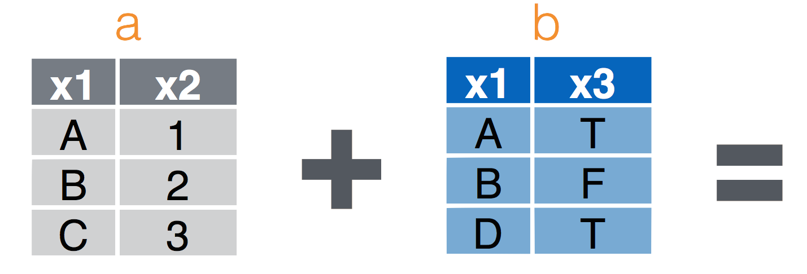
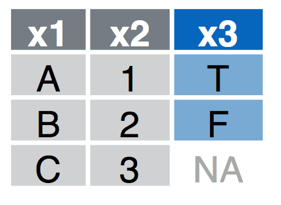
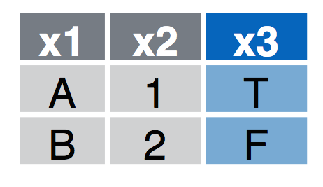
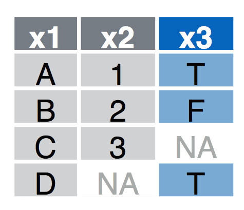

[<i class="fas fa-desktop fa-3x" aria-hidden="true"></i> Presentation](presentations/day_07.html){target="_blank"}  

[<i class="fa fa-file-code-o fa-3x" aria-hidden="true"></i> R Script](scripts/03b_DataWrangling.R){target="_blank"}  Download this file and open it (or copy-paste into a new script) with RStudio so you can follow along.  


```r
library(tidyverse)
library(nycflights13)
```


# Combining data sets

## `dplyr` _join_ methods


* `left_join(a, b, by = "x1")` Join matching rows from b to a.
* `right_join(a, b, by = "x1")` Join matching rows from a to b.
* `inner_join(a, b, by = "x1")` Retain only rows in both sets.
* `full_join(a, b, by = "x1")` Join data. Retain all values, all rows.


### Left Join
`left_join(a, b, by = "x1")` Join matching rows from b to a.




### Right Join
`right_join(a, b, by = "x1")` Join matching rows from a to b.


### Inner Join
`inner_join(a, b, by = "x1")` Retain only rows in both sets.




### Full Join
`full_join(a, b, by = "x1")` Join data. Retain all values, all rows.





```r
flights%>%
  select(-year,-month,-day,-hour,-minute,-dep_time,-dep_delay)%>%
  glimpse()
```

```
## Observations: 336,776
## Variables: 12
## $ sched_dep_time <int> 515, 529, 540, 545, 600, 558, 600, 600, 600, 60...
## $ arr_time       <int> 830, 850, 923, 1004, 812, 740, 913, 709, 838, 7...
## $ sched_arr_time <int> 819, 830, 850, 1022, 837, 728, 854, 723, 846, 7...
## $ arr_delay      <dbl> 11, 20, 33, -18, -25, 12, 19, -14, -8, 8, -2, -...
## $ carrier        <chr> "UA", "UA", "AA", "B6", "DL", "UA", "B6", "EV",...
## $ flight         <int> 1545, 1714, 1141, 725, 461, 1696, 507, 5708, 79...
## $ tailnum        <chr> "N14228", "N24211", "N619AA", "N804JB", "N668DN...
## $ origin         <chr> "EWR", "LGA", "JFK", "JFK", "LGA", "EWR", "EWR"...
## $ dest           <chr> "IAH", "IAH", "MIA", "BQN", "ATL", "ORD", "FLL"...
## $ air_time       <dbl> 227, 227, 160, 183, 116, 150, 158, 53, 140, 138...
## $ distance       <dbl> 1400, 1416, 1089, 1576, 762, 719, 1065, 229, 94...
## $ time_hour      <dttm> 2013-01-01 05:00:00, 2013-01-01 05:00:00, 2013...
```

Let's look at the `airports` data table (`?airports` for documentation):

```r
glimpse(airports)
```

```
## Observations: 1,458
## Variables: 8
## $ faa   <chr> "04G", "06A", "06C", "06N", "09J", "0A9", "0G6", "0G7", ...
## $ name  <chr> "Lansdowne Airport", "Moton Field Municipal Airport", "S...
## $ lat   <dbl> 41.13047, 32.46057, 41.98934, 41.43191, 31.07447, 36.371...
## $ lon   <dbl> -80.61958, -85.68003, -88.10124, -74.39156, -81.42778, -...
## $ alt   <int> 1044, 264, 801, 523, 11, 1593, 730, 492, 1000, 108, 409,...
## $ tz    <dbl> -5, -6, -6, -5, -5, -5, -5, -5, -5, -8, -5, -6, -5, -5, ...
## $ dst   <chr> "A", "A", "A", "A", "A", "A", "A", "A", "U", "A", "A", "...
## $ tzone <chr> "America/New_York", "America/Chicago", "America/Chicago"...
```

Now [complete the task here](CS_04.html) by yourself or in small groups.


# Extras

If you made it through the material above, here's an example of some more 'advanced' coding to extract the geographic locations for all flights and plotting the connections as 'great circles' on a map.  This is just meant as an example to illustrate how one might use these functions to perform a more advanced analysis and spatial visualization.  

### Join destination airports


```r
library(geosphere)
library(rgdal)
library(maps)
library(ggplot2)
library(sp)
library(rgeos)
```


```r
data=
  select(airports,
         dest=faa,
         destName=name,
         destLat=lat,
         destLon=lon)%>%
  right_join(flights)%>%
  group_by(dest,
           destLon,
           destLat,
           distance)%>%
  summarise(count=n())%>%
  ungroup()%>%
  select(destLon,
         destLat,
         count,
         distance)%>%
  mutate(id=row_number())%>%
  na.omit()
```

```
## Joining, by = "dest"
```

```r
NYCll=airports%>%filter(faa=="JFK")%>%select(lon,lat)  # get NYC coordinates

# calculate great circle routes
rts <- gcIntermediate(as.matrix(NYCll),
                      as.matrix(select(data,destLon,destLat)),
                      1000,
                      addStartEnd=TRUE,
                      sp=TRUE)
rts.ff <- fortify(
  as(rts,"SpatialLinesDataFrame")) # convert into something ggplot can plot

## join with count of flights
rts.ff$id=as.integer(rts.ff$id)
gcircles <- left_join(rts.ff,
                      data,
                      by="id") # join attributes, we keep them all, just in case
```


Now build a basemap using data in the `maps` package.


```r
base = ggplot()
worldmap <- map_data("world",
                     ylim = c(10, 70),
                     xlim = c(-160, -80))
wrld <- c(geom_polygon(
  aes(long, lat, group = group),
  size = 0.1,
  colour = "grey",
  fill = "grey",
  alpha = 1,
  data = worldmap
))
```

Now draw the map using `ggplot`

```r
base + wrld +
  geom_path(
    data = gcircles,
    aes(
      long,
      lat,
      col = count,
      group = group,
    ),
    alpha = 0.5,
    lineend = "round",
    lwd = 1
  ) +
  coord_equal() +
  scale_colour_gradientn(colours = c("blue", "orange", "red"),
                         guide = "colourbar") +
  theme(panel.background = element_rect(fill = 'white', colour = 'white')) +
  labs(y = "Latitude", x = "Longitude",
       title = "Count of Flights from New York in 2013")
```

<!-- -->

## Colophon
This exercise based on code from [here](http://spatial.ly/2012/06/mapping-worlds-biggest-airlines/).
