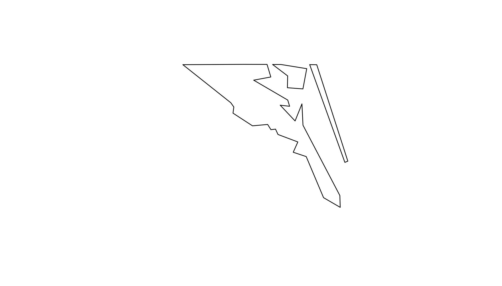
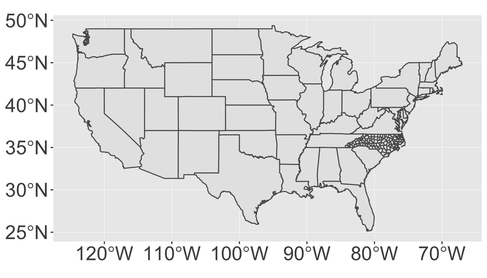
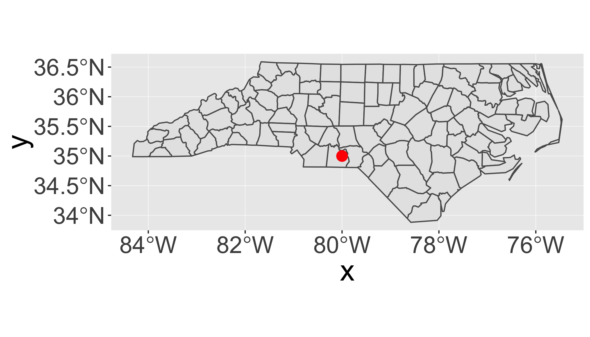
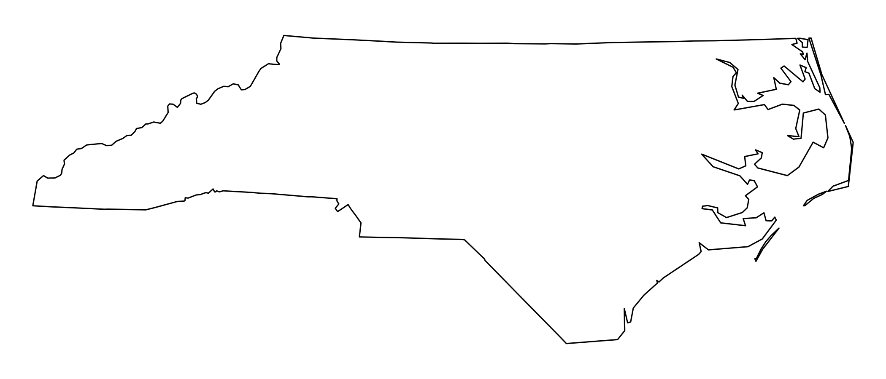
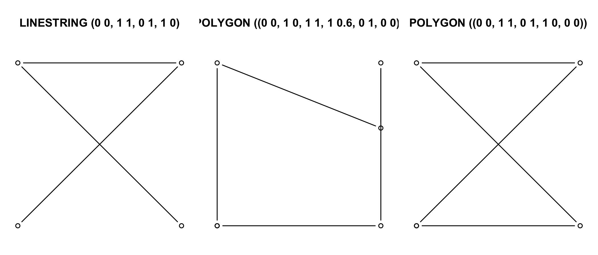
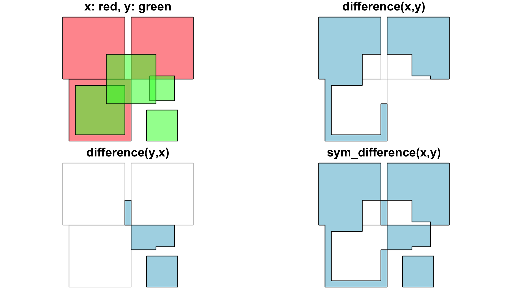
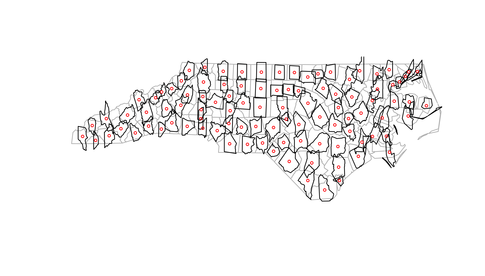

<div class="extraswell">
<button data-toggle="collapse" class="btn btn-link" data-target="#pres">View Presentation </button> [Open presentation in a new tab](presentations/day_08_spatial.html){target="_blank"}
<div id="pres" class="collapse">
<div class="embed-responsive embed-responsive-16by9">
  <iframe class="embed-responsive-item" src="presentations/day_08_spatial.html" allowfullscreen></iframe>
_Click on presentation and then use the space bar to advance to the next slide or escape key to show an overview._
</div>
</div>
</div>


## Download

| [<i class="fas fa-code fa-2x" aria-hidden="true"></i><br>  R Script](scripts/04_Spatial_with_sf_nocomments.R) | [<i class="fa fa-file-code-o fa-2x"></i> <br> Commented R Script](scripts/04_Spatial_with_sf.R) | [<i class="far fa-file-alt fa-2x"></i> <br>  Rmd Script](scripts/04_Spatial_with_sf.Rmd)|
|:--:|:-:|:-:|

# Spatial packages

In R, there are two main lineages of tools for dealing with spatial data: sp and sf.

-   `sp` has been around for a while (the first release was in 2005), and it has a rich ecosystem of tools built on top of it. However, it uses a rather complex data structure, which can make it challenging to use.

-   `sf` is newer (first released in October 2016!) so it doesn't have such a rich ecosystem. However, it's much easier to use and fits in very naturally with the tidyverse, and the ecosystem around it will grow rapidly.

In this class, we're going to use sf, so start by installing it(if you haven't already):


```r
install.packages("sf")
```


```r
library(tidyverse)
library(sf)
library(maps)
```

[Simple features](https://en.wikipedia.org/wiki/Simple_Features) or [_simple feature access_](http://www.opengeospatial.org/standards/sfa) refers to a formal standard (ISO 19125-1:2004) that describes how objects in the real world can be represented in computers, with emphasis on the _spatial_ geometry of these objects. It also describes how such objects can be stored in and retrieved from databases, and which geometrical operations should be defined for them.

The standard is widely implemented in spatial databases (such as PostGIS), commercial GIS (e.g., [ESRI ArcGIS](http://www.esri.com/)) and forms the vector data basis for libraries such as [GDAL](http://www.gdal.org/). A subset of simple features forms the [GeoJSON](http://geojson.org/) standard.

If you work with PostGis or GeoJSON you may have come across the [WKT (well-known text)](https://en.wikipedia.org/wiki/Well-known_text) format, for example like these: 

    POINT (30 10)
    LINESTRING (30 10, 10 30, 40 40)
    POLYGON ((30 10, 40 40, 20 40, 10 20, 30 10))

`sf` implements this standard natively in R. Data are structured and conceptualized very differently from the `sp` approach.

In `sf` spatial objects are stored as a simple data frame with a special column that contains the information for the geographic coordinates. That special column is a list with the same length as the number of rows in the data frame. Each of the individual list elements then can be of any length needed to hold the coordinates that correspond to an individual feature.  

# Data I/O

## Loading data


To read spatial data in R, use `read_sf()`. The following example reads an example dataset built into the sf package:

```r
# The counties of North Carolina
file=system.file("shape/nc.shp", package = "sf")
file
```

```
## [1] "/Library/Frameworks/R.framework/Versions/3.5/Resources/library/sf/shape/nc.shp"
```

```r
nc <- read_sf(file,
  quiet = T,  
  stringsAsFactors = FALSE
)
```

I recommend always setting `quiet = TRUE` and `stringsAsFactors = FALSE`.

Here we're loading from a **shapefile** which is the way spatial data is most commonly stored. Despite the name a shapefile isn't just one file, but is a collection of files that have the same name, but different extensions. Typically you'll have four files:

*  `.shp` contains the geometry, and `.shx` contains an index into that geometry.
*  `.dbf` contains metadata about each geometry (the other columns in the data frame).
*  `.prf` contains the coordinate system and projection information. You'll learn more about that shortly.

`read_sf()` can read in the majority of spatial file formats, so don't worry if your data isn't in a shapefile; the chances are `read_sf()` will still be able to read it.

## Converting data

If you get a spatial object created by another package, us `st_as_sf()` to convert it to sf. For example, you can take data from the maps package (included in base R) and convert it to sf:


```r
nz_map <- maps::map("nz", plot = FALSE) #load a 'map' in non-sf format
nz_sf <- st_as_sf(nz_map)  # convert it to sf format
```

# Data structure

`nc` is a data frame, and not a tibble, so when printing, it's a good idea to use `head()` so you only see the first few rows:


```r
head(nc)
```

```
## Simple feature collection with 6 features and 14 fields
## geometry type:  MULTIPOLYGON
## dimension:      XY
## bbox:           xmin: -81.74107 ymin: 36.07282 xmax: -75.77316 ymax: 36.58965
## epsg (SRID):    4267
## proj4string:    +proj=longlat +datum=NAD27 +no_defs
## # A tibble: 6 x 15
##    AREA PERIMETER CNTY_ CNTY_ID NAME  FIPS  FIPSNO CRESS_ID BIR74 SID74
##   <dbl>     <dbl> <dbl>   <dbl> <chr> <chr>  <dbl>    <int> <dbl> <dbl>
## 1 0.114      1.44  1825    1825 Ashe  37009  37009        5  1091     1
## 2 0.061      1.23  1827    1827 Alle… 37005  37005        3   487     0
## 3 0.143      1.63  1828    1828 Surry 37171  37171       86  3188     5
## 4 0.07       2.97  1831    1831 Curr… 37053  37053       27   508     1
## 5 0.153      2.21  1832    1832 Nort… 37131  37131       66  1421     9
## 6 0.097      1.67  1833    1833 Hert… 37091  37091       46  1452     7
## # ... with 5 more variables: NWBIR74 <dbl>, BIR79 <dbl>, SID79 <dbl>,
## #   NWBIR79 <dbl>, geometry <MULTIPOLYGON [°]>
```

```r
head(nz_sf)
```

```
## Simple feature collection with 6 features and 1 field
## geometry type:  POLYGON
## dimension:      XY
## bbox:           xmin: 166.458 ymin: -46.91705 xmax: 175.552 ymax: -36.09273
## epsg (SRID):    4326
## proj4string:    +proj=longlat +datum=WGS84 +no_defs
##                         geometry                    ID
## 1 POLYGON ((166.458 -45.93695...        Anchor.Island 
## 2 POLYGON ((174.2599 -41.2092...       Arapawa.Island 
## 3 POLYGON ((166.58 -46.31315,...          Coal.Island 
## 4 POLYGON ((167.5798 -46.8738...       Codfish.Island 
## 5 POLYGON ((173.9064 -40.8492...     D'Urville.Island 
## 6 POLYGON ((175.5359 -36.3915... Great.Barrier.Island
```

This is an ordinary data frame, with one exception: the **geometry** column. This column contains **simple features**, a standard way of representing two dimesional geometries like points, lines, polygons, multilines, and multipolygons. Multilines and multipolygons are nededed to represent geographic phenomena like a river with multiple branches, or a state made up of multiple islands.


```r
nc$geometry
```

```
## Geometry set for 100 features 
## geometry type:  MULTIPOLYGON
## dimension:      XY
## bbox:           xmin: -84.32385 ymin: 33.88199 xmax: -75.45698 ymax: 36.58965
## epsg (SRID):    4267
## proj4string:    +proj=longlat +datum=NAD27 +no_defs
## First 5 geometries:
```

```
## MULTIPOLYGON (((-81.47276 36.23436, -81.54084 3...
```

```
## MULTIPOLYGON (((-81.23989 36.36536, -81.24069 3...
```

```
## MULTIPOLYGON (((-80.45634 36.24256, -80.47639 3...
```

```
## MULTIPOLYGON (((-76.00897 36.3196, -76.01735 36...
```

```
## MULTIPOLYGON (((-77.21767 36.24098, -77.23461 3...
```

Use `plot()` to show the geometry. You'll learn how to use ggplot2 for more complex data visualisations later.


```r
plot(nc$geometry)
```

<!-- -->

## Manipulating with dplyr

Since an `sf` object is just a data frame, you can manipulate it with dplyr. The following example gives you a taste:


```r
nz_sf %>%
  mutate(area = as.numeric(st_area(geometry))) %>%
  filter(area > 1e10)
```

```
## Simple feature collection with 2 features and 2 fields
## geometry type:  POLYGON
## dimension:      XY
## bbox:           xmin: 166.3961 ymin: -46.74155 xmax: 178.5629 ymax: -34.39895
## epsg (SRID):    4326
## proj4string:    +proj=longlat +datum=WGS84 +no_defs
##              ID         area                       geometry
## 1 North.Island  113469632351 POLYGON ((172.7433 -34.4421...
## 2 South.Island  150444467051 POLYGON ((172.6391 -40.5135...
```

`st_area()` returns an object with units (i.e. *m*<sup>2</sup>), which is precise, but a little annoying to work with. I used `as.numeric()` to convert to a regular numeric vector.

## Geometry

The geometry column is a list-column. In brief, they're the richest and most complex type of column because a list can contain any other data structure, including other lists.

It's worthwhile to pull out one piece so you can see what's going on under the hood:


```r
str(nc$geometry[[1]])
```

```
## List of 1
##  $ :List of 1
##   ..$ : num [1:27, 1:2] -81.5 -81.5 -81.6 -81.6 -81.7 ...
##  - attr(*, "class")= chr [1:3] "XY" "MULTIPOLYGON" "sfg"
```

```r
plot(nc$geometry[[1]])
```

<!-- -->

Note the use of `[[` to extract a single element, here, the first polygon.

This is a list of lists of matrices:

-   The top-level list has one element for each "landmass" in the county. However, we can find a more interesting case:


```r
n <- nc$geometry %>% map_int(length)
    table(n)
```

```
## n
##  1  2  3 
## 94  4  2
```

```r
    interesting <- nc$geometry[n == 3][[1]]
    plot(interesting)
```

<!-- -->


```r
str(interesting)
```

```
## List of 3
##  $ :List of 1
##   ..$ : num [1:26, 1:2] -76 -76 -76 -76 -76.1 ...
##  $ :List of 1
##   ..$ : num [1:7, 1:2] -76 -76 -75.9 -75.9 -76 ...
##  $ :List of 1
##   ..$ : num [1:5, 1:2] -75.9 -75.9 -75.8 -75.8 -75.9 ...
##  - attr(*, "class")= chr [1:3] "XY" "MULTIPOLYGON" "sfg"
```

* This is a county made up of three non-contiguous pieces.
* The second-level list is not used in this dataset, but is needed when you have a landmass that contains a lake. (Or a landmass that contains a lake which has an island which has a pond).
* Each row of the matrix gives the location of a point on the boundary of the polygon.

## Coordinate system

To correctly plot spatial data, you need to know exactly what the numeric positions mean, i.e. what are they in reference to? This is called the **coordinate reference system** or CRS. Often spatial data is described in terms of latitude and longitude. You can check this with `st_is_longlat()`:


```r
st_is_longlat(nc)
```

```
## [1] TRUE
```

You might think that if you know the latitude and longitude of a point, you know exactly where it is on the Earth. However, things are not quite so simple, because latitude and longitude are based on the assumption that the Earth is a smooth ellipsoid, which is not true. Because different approximations work better in differently places, most countries have their own approximation: this is called the **geodetic datum**, or just **datum** for short.

Take two minutes and watch this [simple explanation of the datum](https://www.youtube.com/watch?v=xKGlMp__jog):
<iframe width="560" height="315" src="https://www.youtube.com/embed/xKGlMp__jog" frameborder="0" allow="autoplay; encrypted-media" allowfullscreen></iframe>

To get the datum and other coordinate system metadata, use `st_crs()`:


```r
st_crs(nc)
```

```
## Coordinate Reference System:
##   EPSG: 4267 
##   proj4string: "+proj=longlat +datum=NAD27 +no_defs"
```

Here the datum is "NAD27", the [North American Datum](https://en.wikipedia.org/wiki/North_American_Datum) of 1927 (NAD27)

In this class, you won't have to worry too much about the datum as sf and ggplot2 will take care of the details for you. But it's good to know why it exists and how to identify it if something goes wrong.

# Spatial Visualization


## Setup

Since sf is so new, support for it in ggplot2 is also very new. That means you'll need to a recent version of ggplot2.  Check that the install has succeeded by loading the tidyverse (you should have done this above) and then running `?geom_sf`. If you can't find the documentation for `geom_sf`, something has gone wrong. The first thing to try is restarting R so that you have a clean session. Installing ggplot2 is tricky if you already have it loaded!

Let's load two datasets:

```r
nc <- sf::st_read(system.file("shape/nc.shp", package = "sf"), quiet = TRUE)
states <- sf::st_as_sf(maps::map("state", plot = FALSE, fill = TRUE))
```

#### `geom_sf()`

The easiest way to get started is to supply an sf object to `geom_sf()`:


```r
ggplot() +
  geom_sf(data = nc)
```

<!-- -->

You can also write this as:

```r
ggplot(nc) +
  geom_sf()
```

Notice that ggplot2 takes care of setting the aspect ratio correctly.

You can supply other aesthetics: for polygons, `fill` is most useful:


```r
ggplot() +
  geom_sf(aes(fill = AREA), data = nc, colour = "white")
```

<!-- -->

When you include multiple layers, ggplot2 will take care of ensuring that they all have a common CRS so that it makes sense to overlay them.


```r
ggplot() +
  geom_sf(data = states) + 
  geom_sf(data = nc)
```

<!-- -->

You can combine `geom_sf()` with other geoms. In this case, `x` and `y` positions are assumed be in the same CRS as the sf object (typically these will be longitude and latitude).


```r
ggplot() +
  geom_sf(data = nc) +
  annotate("point", x = -80, y = 35, colour = "red", size = 4)
```

<!-- -->

#### `coord_sf()`

You'll need to use `coord_sf()` for two reasons:

1. You want to zoom into a specified region of the plot by using `xlim` and `ylim`


```r
ggplot() +
  geom_sf(data = nc) +
  annotate("point", x = -80, y = 35, colour = "red", size = 4) + 
  coord_sf(xlim = c(-81, -79), ylim = c(34, 36))
```

<!-- -->

2.  You want to override to use a specific projection. If you don't specify the `crs` argument, it just uses the one provided in the first layer. The following example uses "USA\_Contiguous\_Albers\_Equal\_Area\_Conic". The easiest way to supply the CRS is as a EPSG ID. I found this ID (102003) with a little googling.


```r
ggplot() +
  geom_sf(data = states) +
  coord_sf(crs = st_crs(102003))
```

<!-- -->


## Reading and writing

As we've seen above, reading spatial data from an external file can be done by


```r
filename <- system.file("shape/nc.shp", package="sf")
nc <- st_read(filename)
```

```
## Reading layer `nc' from data source `/Library/Frameworks/R.framework/Versions/3.5/Resources/library/sf/shape/nc.shp' using driver `ESRI Shapefile'
## Simple feature collection with 100 features and 14 fields
## geometry type:  MULTIPOLYGON
## dimension:      XY
## bbox:           xmin: -84.32385 ymin: 33.88199 xmax: -75.45698 ymax: 36.58965
## epsg (SRID):    4267
## proj4string:    +proj=longlat +datum=NAD27 +no_defs
```
we can suppress the output by adding argument `quiet=TRUE` or
by using the otherwise nearly identical but more quiet

```r
nc <- read_sf(filename)
```

Writing takes place in the same fashion, using `st_write`:


```r
st_write(nc, "nc.shp")
```

If we repeat this, we get an error message that the file already
exists, and we can overwrite by


```r
st_write(nc, "nc.shp", delete_layer = TRUE)
```

or its quiet alternative that does this by default,


```r
write_sf(nc, "nc.shp") # silently overwrites
```

## Geometrical operations {#geometrycollection}

The standard for simple feature access defines a number of geometrical operations.

`st_is_valid` and `st_is_simple` return a boolean indicating whether
a geometry is valid or simple.


```r
st_is_valid(nc[1:2,])
```

```
## [1] TRUE TRUE
```

`st_distance` returns a dense numeric matrix with distances
between geometries. `st_relate` returns a character matrix with the
[DE9-IM](https://en.wikipedia.org/wiki/DE-9IM#Illustration) values
for each pair of geometries:


```r
nc_nad83 = st_transform(nc, 32119) # reproject to NAD83 / North Carolina
st_distance(nc_nad83[c(1,4,22),], nc_nad83[c(1, 33,55,56),])
```

```
## Units: m
##           [,1]     [,2]      [,3]     [,4]
## [1,]      0.00 312176.2 128338.51 475608.8
## [2,] 440548.35 114938.1 590417.79      0.0
## [3,]  18943.74 352708.6  78754.75 517511.6
```

```r
st_relate(nc_nad83[1:5,], nc_nad83[1:4,])
```

```
##      [,1]        [,2]        [,3]        [,4]       
## [1,] "2FFF1FFF2" "FF2F11212" "FF2FF1212" "FF2FF1212"
## [2,] "FF2F11212" "2FFF1FFF2" "FF2F11212" "FF2FF1212"
## [3,] "FF2FF1212" "FF2F11212" "2FFF1FFF2" "FF2FF1212"
## [4,] "FF2FF1212" "FF2FF1212" "FF2FF1212" "2FFF1FFF2"
## [5,] "FF2FF1212" "FF2FF1212" "FF2FF1212" "FF2FF1212"
```

The commands `st_intersects`, `st_disjoint`, `st_touches`,
`st_crosses`, `st_within`, `st_contains`, `st_overlaps`,
`st_equals`, `st_covers`, `st_covered_by`, `st_equals_exact` and
`st_is_within_distance` return a sparse matrix with matching (TRUE)
indexes, or a full logical matrix:


```r
st_intersects(nc_nad83[1:5,], nc_nad83[1:4,])
```

```
## Sparse geometry binary predicate list of length 5, where the predicate was `intersects'
##  1: 1, 2
##  2: 1, 2, 3
##  3: 2, 3
##  4: 4
##  5: (empty)
```

```r
st_intersects(nc_nad83[1:5,], nc_nad83[1:4,], sparse = FALSE)
```

```
##       [,1]  [,2]  [,3]  [,4]
## [1,]  TRUE  TRUE FALSE FALSE
## [2,]  TRUE  TRUE  TRUE FALSE
## [3,] FALSE  TRUE  TRUE FALSE
## [4,] FALSE FALSE FALSE  TRUE
## [5,] FALSE FALSE FALSE FALSE
```

The commands `st_buffer`, `st_boundary`, `st_convexhull`,
`st_union_cascaded`, `st_simplify`, `st_triangulate`,
`st_polygonize`, `st_centroid`, `st_segmentize`, and `st_union`
return new geometries, e.g.:


```r
sel <- c(1,5,14)
geom = st_geometry(nc_nad83)
buf <- st_buffer(geom, dist = 30000)
plot(buf, border = 'red')
plot(geom, add = TRUE)
plot(st_buffer(geom, -5000), add = TRUE, border = 'blue')
```

<!-- -->

Commands `st_intersection`, `st_union`, `st_difference`,
`st_sym_difference` return new geometries that are a function of
pairs of geometries:


```r
par(mar = rep(0,4))
u <- st_union(nc_nad83)
plot(u)
```

<!-- -->

The following code shows how computing an intersection between two polygons
may yield a `GEOMETRYCOLLECTION` with a point, line and polygon:


```r
opar <- par(mfrow = c(1, 2))
a <- st_polygon(list(cbind(c(0,0,7.5,7.5,0),c(0,-1,-1,0,0))))
b <- st_polygon(list(cbind(c(0,1,2,3,4,5,6,7,7,0),c(1,0,.5,0,0,0.5,-0.5,-0.5,1,1))))
plot(a, ylim = c(-1,1))
title("intersecting two polygons:")
plot(b, add = TRUE, border = 'red')
(i <- st_intersection(a,b))
```

```
## GEOMETRYCOLLECTION (POINT (1 0), LINESTRING (4 0, 3 0), POLYGON ((5.5 0, 7 0, 7 -0.5, 6 -0.5, 5.5 0)))
```

```r
plot(a, ylim = c(-1,1))
title("GEOMETRYCOLLECTION")
plot(b, add = TRUE, border = 'red')
plot(i, add = TRUE, col = 'green', lwd = 2)
```

<!-- -->

```r
par(opar)
```

## Non-valid geometries

Invalid geometries are for instance self-intersecting lines (left) or polygons with slivers (middle) or self-intersections (right).


```r
x1 <- st_linestring(cbind(c(0,1,0,1),c(0,1,1,0)))
x2 <- st_polygon(list(cbind(c(0,1,1,1,0,0),c(0,0,1,0.6,1,0))))
x3 <- st_polygon(list(cbind(c(0,1,0,1,0),c(0,1,1,0,0))))
st_is_simple(st_sfc(x1))
```

```
## [1] FALSE
```

```r
st_is_valid(st_sfc(x2,x3))
```

```
## [1] FALSE FALSE
```

<!-- -->

# Units

Where possible geometric operations such as `st_distance()`, `st_length()` and `st_area()` report results with a units attribute appropriate for the CRS:


```r
a <- st_area(nc[1,])
attributes(a)
```

```
## $units
## $numerator
## [1] "m" "m"
## 
## $denominator
## character(0)
## 
## attr(,"class")
## [1] "symbolic_units"
## 
## $class
## [1] "units"
```

The **units** package can be used to convert between units:


```r
units::set_units(a, km^2) # result in square kilometers
```

```
## 1137.389 km^2
```

```r
units::set_units(a, ha) # result in hectares
```

```
## 113738.9 ha
```

The result can be stripped of their attributes if needs be:


```r
as.numeric(a)
```

```
## [1] 1137388604
```

## Geometrical operations

All geometrical operations `st_op(x)` or or `st_op2(x,y)` work
both for `sf` objects as well as `sfc` objects `x` and `y`; since
the operations work on the geometries, the non-geometries parts of
an `sf` object are simply discarded. Also, all binary operations
`st_op2(x,y)` called with a single argument, as `st_op2(x)`, are
handled as `st_op2(x,x)`.

We will illustrate the geometrical operations on a very simple dataset:


```r
b0 = st_polygon(list(rbind(c(-1,-1), c(1,-1), c(1,1), c(-1,1), c(-1,-1))))
b1 = b0 + 2
b2 = b0 + c(-0.2, 2)
x = st_sfc(b0, b1, b2)
a0 = b0 * 0.8
a1 = a0 * 0.5 + c(2, 0.7)
a2 = a0 + 1
a3 = b0 * 0.5 + c(2, -0.5)
y = st_sfc(a0,a1,a2,a3)
plot(x, border = 'red')
plot(y, border = 'green', add = TRUE)
```

<!-- -->

### Unary operations

`st_is_valid` returns whether polygon geometries are topologically valid:

```r
b0 = st_polygon(list(rbind(c(-1,-1), c(1,-1), c(1,1), c(-1,1), c(-1,-1))))
b1 = st_polygon(list(rbind(c(-1,-1), c(1,-1), c(1,1), c(0,-1), c(-1,-1))))
st_is_valid(st_sfc(b0,b1))
```

```
## [1]  TRUE FALSE
```
and `st_is_simple` whether line geometries are simple:

```r
s = st_sfc(st_linestring(rbind(c(0,0), c(1,1))), 
	st_linestring(rbind(c(0,0), c(1,1),c(0,1),c(1,0))))
st_is_simple(s)
```

```
## [1]  TRUE FALSE
```

`st_area` returns the area of polygon geometries, `st_length` the
length of line geometries:

```r
st_area(x)
```

```
## [1] 4 4 4
```

```r
st_area(st_sfc(st_point(c(0,0))))
```

```
## [1] 0
```

```r
st_length(st_sfc(st_linestring(rbind(c(0,0),c(1,1),c(1,2))), st_linestring(rbind(c(0,0),c(1,0)))))
```

```
## [1] 2.414214 1.000000
```

```r
st_length(st_sfc(st_multilinestring(list(rbind(c(0,0),c(1,1),c(1,2))),rbind(c(0,0),c(1,0))))) # ignores 2nd part!
```

```
## [1] 2.414214
```

### Binary operations: distance and relate
`st_distance` computes the shortest distance matrix between geometries; this is
a dense matrix:

```r
st_distance(x,y)
```

```
##           [,1] [,2] [,3]     [,4]
## [1,] 0.0000000  0.6    0 0.500000
## [2,] 0.2828427  0.0    0 1.000000
## [3,] 0.2000000  0.8    0 1.220656
```
`st_relate` returns a dense character matrix with the DE9-IM relationships
between each pair of geometries:

```r
st_relate(x,y)
```

```
##      [,1]        [,2]        [,3]        [,4]       
## [1,] "212FF1FF2" "FF2FF1212" "212101212" "FF2FF1212"
## [2,] "FF2FF1212" "212101212" "212101212" "FF2FF1212"
## [3,] "FF2FF1212" "FF2FF1212" "212101212" "FF2FF1212"
```
element [i,j] of this matrix has nine characters, refering to relationship between x[i] and y[j], encoded as $I_xI_y,I_xB_y,I_xE_y,B_xI_y,B_xB_y,B_xE_y,E_xI_y,E_xB_y,E_xE_y$ where $I$ refers to interior, $B$ to boundary, and $E$ to exterior, and e.g. $B_xI_y$ the dimensionality of the intersection of the the boundary $B_x$ of x[i] and the interior $I_y$ of y[j], which is one of {0,1,2,F}, indicating zero-, one-, two-dimension intersection, and (F) no intersection, respectively.


Reading from left-to-right and top-to-bottom, the DE-9IM(a,b) string code is '212101212', the compact representation of $I_xI_y=2,I_xB_y=1,I_xE_y=2,B_xI_y=1,B_xB_y=0,B_xE_y=1,E_xI_y=2,E_xB_y=1,E_xE_y=2$. Figure from [here](https://en.wikipedia.org/wiki/DE-9IM#Illustration).

### Binary logical operations: 
Binary logical operations return either a sparse matrix

```r
st_intersects(x,y)
```

```
## Sparse geometry binary predicate list of length 3, where the predicate was `intersects'
##  1: 1, 3
##  2: 2, 3
##  3: 3
```
or a dense matrix

```r
st_intersects(x, x, sparse = FALSE)
```

```
##      [,1]  [,2]  [,3]
## [1,] TRUE  TRUE  TRUE
## [2,] TRUE  TRUE FALSE
## [3,] TRUE FALSE  TRUE
```

```r
st_intersects(x, y, sparse = FALSE)
```

```
##       [,1]  [,2] [,3]  [,4]
## [1,]  TRUE FALSE TRUE FALSE
## [2,] FALSE  TRUE TRUE FALSE
## [3,] FALSE FALSE TRUE FALSE
```
where list element `i` of a sparse matrix contains the indices of
the `TRUE` elements in row `i` of the the dense matrix. For large
geometry sets, dense matrices take up a lot of memory and are
mostly filled with `FALSE` values, hence the default is to return
a sparse matrix.

`st_intersects` returns for every geometry pair whether they
intersect (dense matrix), or which elements intersect (sparse).

Other binary predicates include (using sparse for readability):


```r
st_disjoint(x, y, sparse = FALSE)
```

```
##       [,1]  [,2]  [,3] [,4]
## [1,] FALSE  TRUE FALSE TRUE
## [2,]  TRUE FALSE FALSE TRUE
## [3,]  TRUE  TRUE FALSE TRUE
```

```r
st_touches(x, y, sparse = FALSE)
```

```
##       [,1]  [,2]  [,3]  [,4]
## [1,] FALSE FALSE FALSE FALSE
## [2,] FALSE FALSE FALSE FALSE
## [3,] FALSE FALSE FALSE FALSE
```

```r
st_crosses(s, s, sparse = FALSE)
```

```
##       [,1]  [,2]
## [1,] FALSE FALSE
## [2,] FALSE FALSE
```

```r
st_within(x, y, sparse = FALSE)
```

```
##       [,1]  [,2]  [,3]  [,4]
## [1,] FALSE FALSE FALSE FALSE
## [2,] FALSE FALSE FALSE FALSE
## [3,] FALSE FALSE FALSE FALSE
```

```r
st_contains(x, y, sparse = FALSE)
```

```
##       [,1]  [,2]  [,3]  [,4]
## [1,]  TRUE FALSE FALSE FALSE
## [2,] FALSE FALSE FALSE FALSE
## [3,] FALSE FALSE FALSE FALSE
```

```r
st_overlaps(x, y, sparse = FALSE)
```

```
##       [,1]  [,2] [,3]  [,4]
## [1,] FALSE FALSE TRUE FALSE
## [2,] FALSE  TRUE TRUE FALSE
## [3,] FALSE FALSE TRUE FALSE
```

```r
st_equals(x, y, sparse = FALSE)
```

```
##       [,1]  [,2]  [,3]  [,4]
## [1,] FALSE FALSE FALSE FALSE
## [2,] FALSE FALSE FALSE FALSE
## [3,] FALSE FALSE FALSE FALSE
```

```r
st_covers(x, y, sparse = FALSE)
```

```
##       [,1]  [,2]  [,3]  [,4]
## [1,]  TRUE FALSE FALSE FALSE
## [2,] FALSE FALSE FALSE FALSE
## [3,] FALSE FALSE FALSE FALSE
```

```r
st_covered_by(x, y, sparse = FALSE)
```

```
##       [,1]  [,2]  [,3]  [,4]
## [1,] FALSE FALSE FALSE FALSE
## [2,] FALSE FALSE FALSE FALSE
## [3,] FALSE FALSE FALSE FALSE
```

```r
st_covered_by(y, y, sparse = FALSE)
```

```
##       [,1]  [,2]  [,3]  [,4]
## [1,]  TRUE FALSE FALSE FALSE
## [2,] FALSE  TRUE FALSE FALSE
## [3,] FALSE FALSE  TRUE FALSE
## [4,] FALSE FALSE FALSE  TRUE
```

```r
st_equals_exact(x, y,0.001, sparse = FALSE)
```

```
##       [,1]  [,2]  [,3]  [,4]
## [1,] FALSE FALSE FALSE FALSE
## [2,] FALSE FALSE FALSE FALSE
## [3,] FALSE FALSE FALSE FALSE
```

### Operations returning a geometry


```r
u = st_union(x)
plot(u)
```

<!-- -->


```r
par(mfrow=c(1,2), mar = rep(0,4))
plot(st_buffer(u, 0.2))
plot(u, border = 'red', add = TRUE)
plot(st_buffer(u, 0.2), border = 'grey')
plot(u, border = 'red', add = TRUE)
plot(st_buffer(u, -0.2), add = TRUE)
```

<!-- -->


```r
plot(st_boundary(x))
```

<!-- -->


```r
par(mfrow = c(1:2))
plot(st_convex_hull(x))
plot(st_convex_hull(u))
```

<!-- -->

```r
par(mfrow = c(1,1))
```


```r
par(mfrow=c(1,2))
plot(x)
plot(st_centroid(x), add = TRUE, col = 'red')
plot(x)
plot(st_centroid(u), add = TRUE, col = 'red')
```

<!-- -->

The intersection of two geometries is the geometry covered by both; it is obtained by `st_intersection`:

```r
plot(x)
plot(y, add = TRUE)
plot(st_intersection(st_union(x),st_union(y)), add = TRUE, col = 'red')
```

<!-- -->

To get _everything but_ the intersection, use `st_difference` or st_sym_difference`:

```r
par(mfrow=c(2,2), mar = c(0,0,1,0))
plot(x, col = '#ff333388'); 
plot(y, add=TRUE, col='#33ff3388')
title("x: red, y: green")
plot(x, border = 'grey')
plot(st_difference(st_union(x),st_union(y)), col = 'lightblue', add = TRUE)
title("difference(x,y)")
plot(x, border = 'grey')
plot(st_difference(st_union(y),st_union(x)), col = 'lightblue', add = TRUE)
title("difference(y,x)")
plot(x, border = 'grey')
plot(st_sym_difference(st_union(y),st_union(x)), col = 'lightblue', add = TRUE)
title("sym_difference(x,y)")
```

<!-- -->

Function `st_segmentize` adds points to straight line sections of a lines or polygon object:

```r
par(mfrow=c(1,3),mar=c(1,1,0,0))
pts = rbind(c(0,0),c(1,0),c(2,1),c(3,1))
ls = st_linestring(pts)
plot(ls)
points(pts)
ls.seg = st_segmentize(ls, 0.3)
plot(ls.seg)
pts = ls.seg
points(pts)
pol = st_polygon(list(rbind(c(0,0),c(1,0),c(1,1),c(0,1),c(0,0))))
pol.seg = st_segmentize(pol, 0.3)
plot(pol.seg, col = 'grey')
points(pol.seg[[1]])
```

<!-- -->

Function `st_polygonize` polygonizes a multilinestring, as far as the points form a closed polygon:

```r
par(mfrow=c(1,2),mar=c(0,0,1,0))
mls = st_multilinestring(list(matrix(c(0,0,0,1,1,1,0,0),,2,byrow=TRUE)))
x = st_polygonize(mls)
plot(mls, col = 'grey')
title("multilinestring")
plot(x, col = 'grey')
title("polygon")
```

<!-- -->

Further reading:
1. Much of the material below was taken from the [sf vignettes available here](https://cran.r-project.org/web/packages/sf/vignettes).
2. S. Scheider, B. Gräler, E. Pebesma, C. Stasch, 2016. Modelling spatio-temporal information generation. Int J of Geographic Information Science, 30 (10), 1980-2008. ([pdf](http://pebesma.staff.ifgi.de/generativealgebra.pdf))
3. Stasch, C., S. Scheider, E. Pebesma, W. Kuhn, 2014. Meaningful Spatial Prediction and Aggregation. Environmental Modelling & Software, 51, (149–165, [open access](http://dx.doi.org/10.1016/j.envsoft.2013.09.006)).
