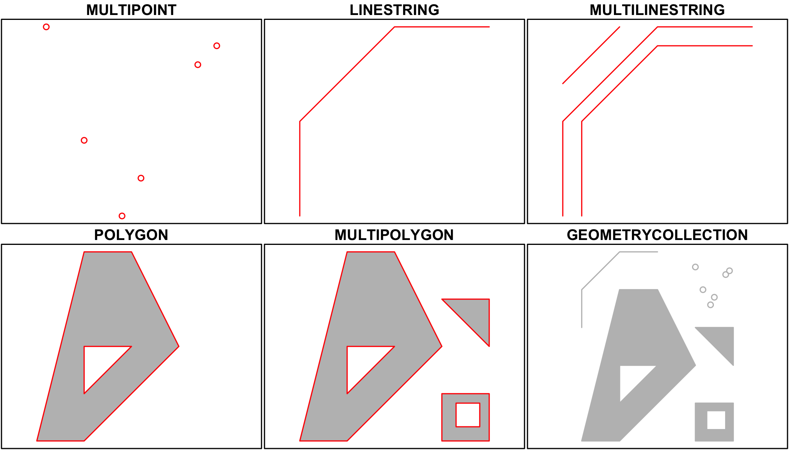
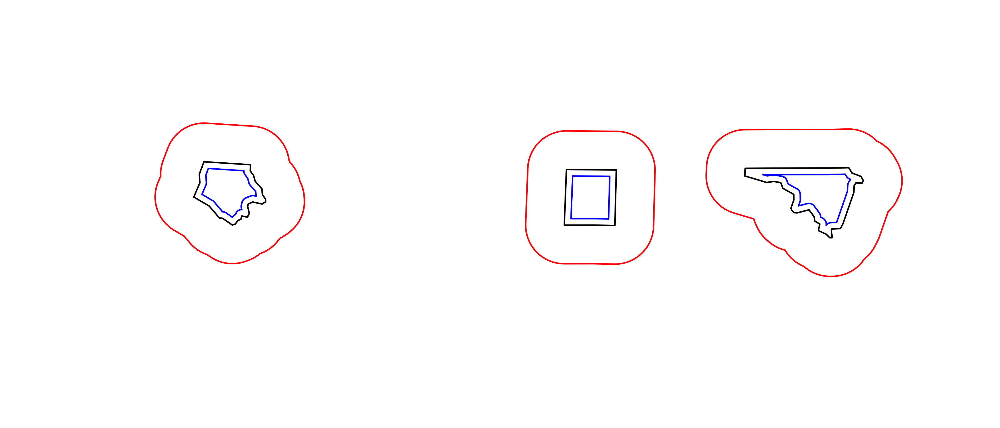
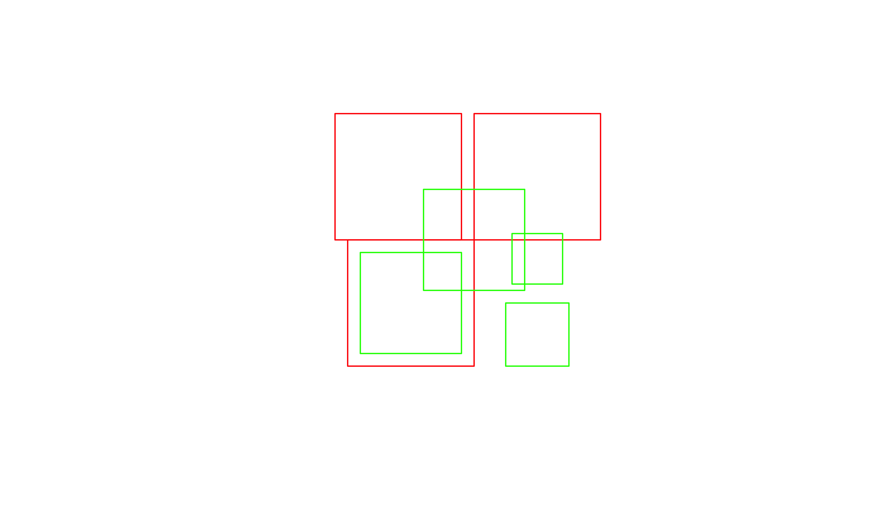
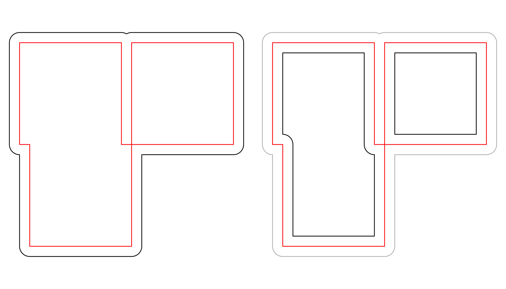
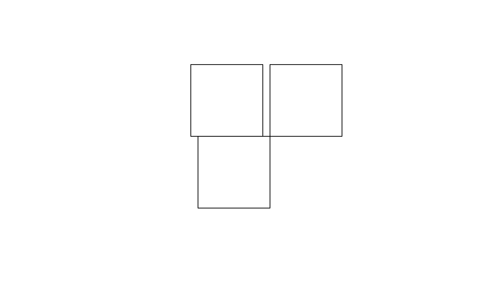
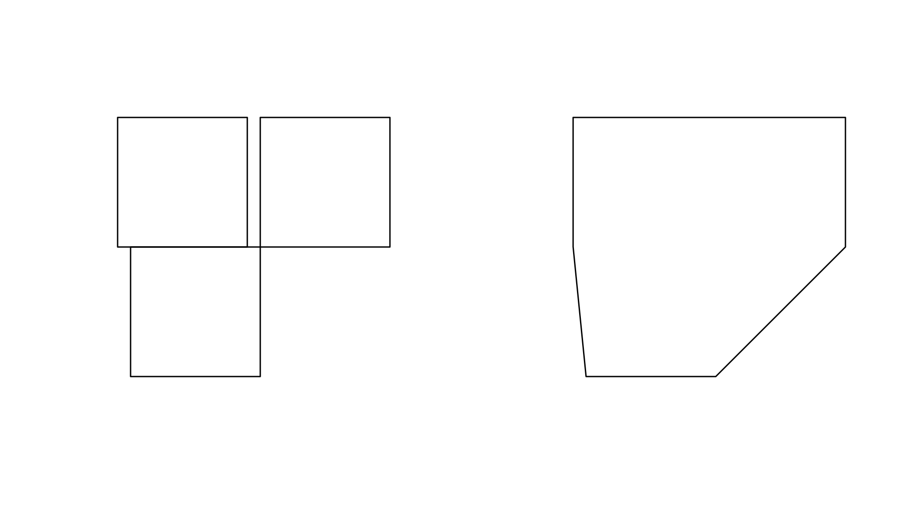
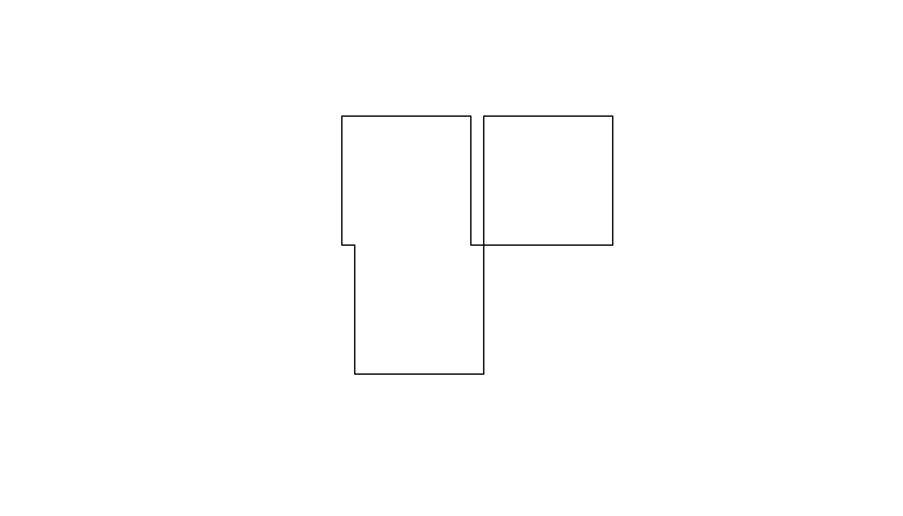
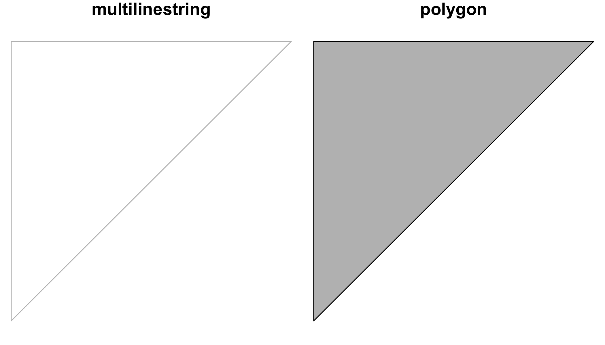

<div>
<iframe src="04_assets/04_Presentation.html" width=100% height=400px></iframe>

[<i class="fa fa-file-code-o fa-3x" aria-hidden="true"></i> The R Script associated with this page is available here](scripts/04_Spatial_with_sf.R).  Download this file and open it (or copy-paste into a new script) with RStudio so you can follow along.  

# Setup

You may need to install a few of these packages with `install.packages()` or using the GUI. Note, much of the material below was taken from the [sf vignettes available here](https://cran.r-project.org/web/packages/sf/vignettes).

## Load packages

```r
library(rgdal)
library(rgeos)
library(sf)
library(ggplot2)
library(dplyr)
library(tidyr)
library(maptools)
```

# Background

There are currently two main approaches in R to handle geographic vector data. 

## The `sp` package

The first package to provide classes and methods for spatial data types in R is called [`sp`](https://cran.r-project.org/package=sp)[^1]. Development of the `sp` package began in the early 2000s in an attempt to standardize how spatial data would be treated in R and to allow for better interoperability between different analysis packages that use spatial data. The package (first release on CRAN in 2005) provides classes and methods to create _points_, _lines_, _polygons_, and _grids_ and to operate on them. About 350 of the spatial analysis packages use the spatial data types that are implemented in `sp` i.e. they "depend" on the `sp` package and many more are indirectly dependent.

[^1]: R Bivand (2011) [Introduction to representing spatial objects in R](http://geostat-course.org/system/files/monday_slides.pdf)


The foundational structure for any spatial object in `sp` is the `Spatial` class. It has two "slots" ([new-style S4 class objects in R have pre-defined components called slots](http://stackoverflow.com/a/4714080)):

* a __bounding box__ 
      
* a __CRS class object__ to define the Coordinate Reference System 

This basic structure is then extended, depending on the characteristics of the spatial object (point, line, polygon).

To build up a spatial object in `sp` we could follow these steps:  

### I. Create geometric objects (topology)

__Points__ (which may have 2 or 3 dimensions) are the most basic spatial data objects. They are generated out of either a single coordinate or a set of coordinates, like a two-column matrix or a dataframe with a column for latitude and one for longitude.  
__Lines__ are generated out of `Line` objects. A `Line` object is a spaghetti collection of 2D coordinates[^2] and is generated out of a two-column matrix or a dataframe with a column for latitude and one for longitude. A `Lines` object is a __list__ of one or more `Line` objects, for example all the contours at a single elevation.  
__Polygons__ are generated out of `Polygon` objects. A `Polygon` object is a spaghetti collection of 2D coordinates with equal first and last coordinates and is generated out of a two-column matrix or a dataframe with a column for latitude and one for longitude. A `Polygons` object is a __list__ of one or more `Polygon` objects, for example islands belonging to the same country.

[^2]: Coordinates should be of type double and will be promoted if not.

See here for a very simple example for how to create a `Line` object:

```r
ln <- Line(matrix(runif(6), ncol=2))
str(ln)
```

```
## Formal class 'Line' [package "sp"] with 1 slot
##   ..@ coords: num [1:3, 1:2] 0.409 0.663 0.971 0.293 0.988 ...
```
See here for a very simple example for how to create a `Lines` object:

```r
lns <- Lines(list(ln), ID = "a") # this contains just one Line!
str(lns)
```

```
## Formal class 'Lines' [package "sp"] with 2 slots
##   ..@ Lines:List of 1
##   .. ..$ :Formal class 'Line' [package "sp"] with 1 slot
##   .. .. .. ..@ coords: num [1:3, 1:2] 0.409 0.663 0.971 0.293 0.988 ...
##   ..@ ID   : chr "a"
```

 
### II. Create spatial objects `Spatial*` object (`*` stands for Points, Lines, or Polygons). 

This step adds the bounding box (automatically) and the slot for the Coordinate Reference System or CRS (which needs to be filled with a value manually). `SpatialPoints` can be directly generated out of the coordinates.  `SpatialLines` and `SpatialPolygons` objects are generated using lists of `Lines` or `Polygons` objects respectively (more below).

See here for how to create a `SpatialLines` object:

```r
sp_lns <- SpatialLines(list(lns))
str(sp_lns)
```

```
## Formal class 'SpatialLines' [package "sp"] with 3 slots
##   ..@ lines      :List of 1
##   .. ..$ :Formal class 'Lines' [package "sp"] with 2 slots
##   .. .. .. ..@ Lines:List of 1
##   .. .. .. .. ..$ :Formal class 'Line' [package "sp"] with 1 slot
##   .. .. .. .. .. .. ..@ coords: num [1:3, 1:2] 0.409 0.663 0.971 0.293 0.988 ...
##   .. .. .. ..@ ID   : chr "a"
##   ..@ bbox       : num [1:2, 1:2] 0.40923 0.00417 0.97139 0.98836
##   .. ..- attr(*, "dimnames")=List of 2
##   .. .. ..$ : chr [1:2] "x" "y"
##   .. .. ..$ : chr [1:2] "min" "max"
##   ..@ proj4string:Formal class 'CRS' [package "sp"] with 1 slot
##   .. .. ..@ projargs: chr NA
```
 
### III. Add attributes (_Optional_:) 

Add a data frame with attribute data, which will turn your `Spatial*` object into a `Spatial*DataFrame` object.  The points in a `SpatialPoints` object may be associated with a row of attributes to create a `SpatialPointsDataFrame` object. The coordinates and attributes may, but do not have to be keyed to each other using ID values.  
`SpatialLinesDataFrame` and `SpatialPolygonsDataFrame` objects are defined using `SpatialLines` and `SpatialPolygons` objects and data frames. The ID fields are here required to match the data frame row names.

See here for how to create a `SpatialLinesDataframe`:


```r
dfr <- data.frame(id = "a", use = "road", cars_per_hour = 10) # note how we use the ID from above!
sp_lns_dfr <- SpatialLinesDataFrame(sp_lns, dfr, match.ID = "id")
str(sp_lns_dfr)
```

```
## Formal class 'SpatialLinesDataFrame' [package "sp"] with 4 slots
##   ..@ data       :'data.frame':	1 obs. of  3 variables:
##   .. ..$ id           : Factor w/ 1 level "a": 1
##   .. ..$ use          : Factor w/ 1 level "road": 1
##   .. ..$ cars_per_hour: num 10
##   ..@ lines      :List of 1
##   .. ..$ :Formal class 'Lines' [package "sp"] with 2 slots
##   .. .. .. ..@ Lines:List of 1
##   .. .. .. .. ..$ :Formal class 'Line' [package "sp"] with 1 slot
##   .. .. .. .. .. .. ..@ coords: num [1:3, 1:2] 0.409 0.663 0.971 0.293 0.988 ...
##   .. .. .. ..@ ID   : chr "a"
##   ..@ bbox       : num [1:2, 1:2] 0.40923 0.00417 0.97139 0.98836
##   .. ..- attr(*, "dimnames")=List of 2
##   .. .. ..$ : chr [1:2] "x" "y"
##   .. .. ..$ : chr [1:2] "min" "max"
##   ..@ proj4string:Formal class 'CRS' [package "sp"] with 1 slot
##   .. .. ..@ projargs: chr NA
```

A number of spatial methods are available for the classes in `sp`. Common ones include:

function | and what it does
------------ | ------------------------------------------------------
`bbox()` | returns the bounding box coordinates
`proj4string()` | sets or retrieves projection attributes using the CRS object.
`CRS()` | creates an object of class of coordinate reference system arguments
`spplot()` | plots a separate map of all the attributes unless specified otherwise
`coordinates()` | set or retrieve the spatial coordinates. For spatial polygons it returns the centroids.
`over(a, b)` | used for example to retrieve the polygon or grid indices on a set of points
`spsample()` | sampling of spatial points within the spatial extent of objects

## The `sf` package

The second package, first released on CRAN in late October 2016, is called [`sf`](https://cran.r-project.org/package=sf)[^3]. It implements a formal standard called ["Simple Features"](https://en.wikipedia.org/wiki/Simple_Features) that specifies a storage and access model of spatial geometries (point, line, polygon). A feature geometry is called simple when it consists of points connected by straight line pieces, and does not intersect itself. This standard has been adopted widely, not only by spatial databases such as PostGIS, but also more recent standards such as GeoJSON. 

[^3]: E. Pebesma & R. Bivand (2016)[Spatial data in R: simple features and
future perspectives](http://pebesma.staff.ifgi.de/pebesma_sfr.pdf)


[Simple features](https://en.wikipedia.org/wiki/Simple_Features) or [_simple feature access_](http://www.opengeospatial.org/standards/sfa) refers to a formal standard (ISO 19125-1:2004) that describes how objects in the real world can be represented in computers, with emphasis on the _spatial_ geometry of these objects. It also describes how such objects can be stored in and retrieved from databases, and which geometrical operations should be defined for them.

The standard is widely implemented in spatial
databases (such as PostGIS), commercial GIS (e.g., [ESRI
ArcGIS](http://www.esri.com/)) and forms the vector data basis for
libraries such as [GDAL](http://www.gdal.org/). A subset of
simple features forms the [GeoJSON](http://geojson.org/) standard.

If you work with PostGis or GeoJSON you may have come across the [WKT (well-known text)](https://en.wikipedia.org/wiki/Well-known_text) format, for example like these: 

    POINT (30 10)
    LINESTRING (30 10, 10 30, 40 40)
    POLYGON ((30 10, 40 40, 20 40, 10 20, 30 10))

`sf` implements this standard natively in R. Data are structured and conceptualized very differently from the `sp` approach.

In `sf` spatial objects are stored as a simple data frame with a special column that contains the information for the geographic coordinates. That special column is a list with the same length as the number of rows in the data frame. Each of the individual list elements then can be of any length needed to hold the coordinates that correspond to an individual feature.  

To create a spatial object manually the basic steps would be:  

### I. Create geometric objects (topology)  

Geometric objects (simple features) can be created from a numeric vector, matrix or a list with the coordinates. They are called `sfg` objects for Simple Feature Geometry.

See here for an example of how a LINESTRING `sfg` object is created:

```r
lnstr_sfg <- st_linestring(matrix(runif(6), ncol=2)) 
class(lnstr_sfg)
```

```
## [1] "XY"         "LINESTRING" "sfg"
```

### II. Combine all individual single feature objects for the special column. 

In order to work our way towards a data frame for all features we create what is called an `sfc` object with all individual features, which stands for Simple Feature Collection. The `sfc` object also holds the bounding box and the projection information.

See here for an example of how a `sfc` object is created:

```r
(lnstr_sfc <- st_sfc(lnstr_sfg)) # just one feature here
```

```
## Geometry set for 1 feature 
## geometry type:  LINESTRING
## dimension:      XY
## bbox:           xmin: 0.06690928 ymin: 0.397197 xmax: 0.68381 ymax: 0.891195
## epsg (SRID):    NA
## proj4string:    NA
```

```
## LINESTRING (0.06690928 0.6273856, 0.68381 0.891...
```

```r
class(lnstr_sfc) 
```

```
## [1] "sfc_LINESTRING" "sfc"
```

### III. Add attributes. 

We now combine the dataframe with the attributes and the simple feature collection.
See here how its done.

```r
(lnstr_sf <- st_sf(dfr , lnstr_sfc))
```

```
## Simple feature collection with 1 feature and 3 fields
## geometry type:  LINESTRING
## dimension:      XY
## bbox:           xmin: 0.06690928 ymin: 0.397197 xmax: 0.68381 ymax: 0.891195
## epsg (SRID):    NA
## proj4string:    NA
##   id  use cars_per_hour                      lnstr_sfc
## 1  a road            10 LINESTRING (0.06690928 0.62...
```

```r
class(lnstr_sf)
```

```
## [1] "sf"         "data.frame"
```

There are many methods available in the `sf` package, to find out use `methods(class="sp")`

Here are some of the other highlights of `sf` you might be interested in:

* provides **fast** I/O, particularly relevant for large files 
* directly reads from and writes to spatial **databases** such as PostGIS
* stay tuned for a new `ggplot` release that will be able to read and plot the `sf` format without the need of conversion to a data frame, like the `sp` format

Note that `sp` and `sf` are not the only way spatial objects are conceptualized in R. Other spatial packages may use their own class definitions for spatial data (for example `spatstat`). Usually you can find functions that convert `sp` and increasingly `sf` objects to and from these formats.


## sf: objects with simple features

As we usually do not work with geometries of single simple features,
but with datasets consisting of sets of features with attributes, the
two are put together in `sf` (simple feature) objects.  The following
command reads the `nc` dataset from a file that is contained in the
`sf` package:


```r
file=system.file("shape/nc.shp", package="sf")
file
```

```
## [1] "/Library/Frameworks/R.framework/Versions/3.4/Resources/library/sf/shape/nc.shp"
```

```r
nc <- st_read(file)
```

```
## Reading layer `nc' from data source `/Library/Frameworks/R.framework/Versions/3.4/Resources/library/sf/shape/nc.shp' using driver `ESRI Shapefile'
## Simple feature collection with 100 features and 14 fields
## geometry type:  MULTIPOLYGON
## dimension:      XY
## bbox:           xmin: -84.32385 ymin: 33.88199 xmax: -75.45698 ymax: 36.58965
## epsg (SRID):    4267
## proj4string:    +proj=longlat +datum=NAD27 +no_defs
```

(Note that you will rarely use `system.file` but instead give a `filename` directly, and that shapefiles consist of more than one file, all with identical basename, which reside in the same directory.)

The short report printed gives the file name, the driver (ESRI Shapefile), mentions that there are 100 features (records, represented as rows) and 14
fields (attributes, represented as columns). This object is of class


```r
class(nc)
```

```
## [1] "sf"         "data.frame"
```
meaning it extends (and "is" a) `data.frame`, but with a single
list-column with geometries, which is held in the column with name


```r
attr(nc, "sf_column")
```

```
## [1] "geometry"
```

If we print the first three features, we see their attribute values
and an abridged version of the geometry


```r
print(nc[9:15], n = 3)
```
which would give the following output:


In the output we see:

* in green a simple feature: a single record, or `data.frame` row, consisting of attributes and geometry
* in blue a single simple feature geometry (an object of class `sfg`)
* in red a simple feature list-column (an object of class `sfc`, which is a column in the `data.frame`)
* that although geometries are native R objects, they are printed as [well-known text](#wkb)

Methods for `sf` objects are

```r
methods(class = "sf")
```

```
##  [1] [                     [[<-                  $<-                  
##  [4] aggregate             anti_join             arrange              
##  [7] as.data.frame         cbind                 coerce               
## [10] dbDataType            dbWriteTable          distinct             
## [13] extent                extract               filter               
## [16] full_join             gather                group_by             
## [19] identify              initialize            inner_join           
## [22] left_join             mask                  merge                
## [25] mutate                nest                  plot                 
## [28] print                 rasterize             rbind                
## [31] rename                right_join            sample_frac          
## [34] sample_n              select                semi_join            
## [37] separate              show                  slice                
## [40] slotsFromS3           spread                st_agr               
## [43] st_agr<-              st_as_sf              st_bbox              
## [46] st_boundary           st_buffer             st_cast              
## [49] st_centroid           st_collection_extract st_convex_hull       
## [52] st_coordinates        st_crs                st_crs<-             
## [55] st_difference         st_geometry           st_geometry<-        
## [58] st_intersection       st_is                 st_line_merge        
## [61] st_node               st_point_on_surface   st_polygonize        
## [64] st_precision          st_segmentize         st_set_precision     
## [67] st_simplify           st_snap               st_sym_difference    
## [70] st_transform          st_triangulate        st_union             
## [73] st_voronoi            st_wrap_dateline      st_write             
## [76] st_zm                 summarise             transmute            
## [79] ungroup               unite                 unnest               
## see '?methods' for accessing help and source code
```

It is also possible to create `data.frame` objects with geometry list-columns that are not of class `sf`, e.g. by

```r
nc.no_sf <- as.data.frame(nc)
class(nc.no_sf)
```

```
## [1] "data.frame"
```

However, such objects:

* no longer register which column is the geometry list-column
* no longer have a plot method, and
* lack all of the other dedicated methods listed above for class `sf`

## sfc: simple feature geometry list-column

The column in the `sf` data.frame that contains the geometries is a list, of class `sfc`.
We can retrieve the geometry list-column in this case by `nc$geom` or `nc[[15]]`, but the
more general way uses `st_geometry`:


```r
nc_geom <- st_geometry(nc)
```

Geometries are printed in abbreviated form, but we can
can view a complete geometry by selecting it, e.g. the first one by


```r
nc_geom[[1]]
```

```
## MULTIPOLYGON (((-81.47276 36.23436, -81.54084 36.27251, -81.56198 36.27359, -81.63306 36.34069, -81.74107 36.39178, -81.69828 36.47178, -81.7028 36.51934, -81.67 36.58965, -81.3453 36.57286, -81.34754 36.53791, -81.32478 36.51368, -81.31332 36.4807, -81.26624 36.43721, -81.26284 36.40504, -81.24069 36.37942, -81.23989 36.36536, -81.26424 36.35241, -81.32899 36.3635, -81.36137 36.35316, -81.36569 36.33905, -81.35413 36.29972, -81.36745 36.2787, -81.40639 36.28505, -81.41233 36.26729, -81.43104 36.26072, -81.45289 36.23959, -81.47276 36.23436)))
```

The way this is printed is called _well-known text_, and is part of the standards. The word `MULTIPOLYGON` is followed by three parenthesis, because it can consist of multiple polygons, in the form of `MULTIPOLYGON(POL1,POL2)`, where `POL1` might consist of an exterior ring and zero or more interior rings, as of `(EXT1,HOLE1,HOLE2)`. Sets of coordinates are held together with parenthesis, so we get `((crds_ext)(crds_hole1)(crds_hole2))` where `crds_` is a comma-separated set of coordinates of a ring. This leads to the case above, where `MULTIPOLYGON(((crds_ext)))` refers to the exterior ring (1), without holes (2), of the first polygon (3) - hence three parentheses.

We can see there is a single polygon with no rings:


```r
plot(nc[1])
plot(nc[1,1], col = 'grey', add = TRUE)
```

<!-- -->

but some of the polygons in this dataset have multiple exterior rings; they can be identified by

```r
w <- which(sapply(nc_geom, length) > 1)
plot(nc[w,1], col = 2:7)
```

<!-- -->

Following the `MULTIPOLYGON` datastructure, in R we have a list of lists of lists of matrices. For instance,
we get the coordinate pairs of the second exterior ring (first ring is always exterior) for the geometry
of feature 4 by


```r
nc_geom[[4]][[2]][[1]]
```

```
##           [,1]     [,2]
## [1,] -76.02717 36.55672
## [2,] -75.99866 36.55665
## [3,] -75.91192 36.54253
## [4,] -75.92480 36.47398
## [5,] -75.97728 36.47802
## [6,] -75.97629 36.51793
## [7,] -76.02717 36.55672
```

Geometry columns have their own class,


```r
class(nc_geom)
```

```
## [1] "sfc_MULTIPOLYGON" "sfc"
```

Methods for geometry list-columns include

```r
methods(class = 'sfc')
```

```
##  [1] [                     [<-                   as.data.frame        
##  [4] c                     coerce                format               
##  [7] fortify               identify              initialize           
## [10] obj_sum               Ops                   print                
## [13] rep                   scale_type            show                 
## [16] slotsFromS3           st_as_binary          st_as_text           
## [19] st_bbox               st_boundary           st_buffer            
## [22] st_cast               st_centroid           st_collection_extract
## [25] st_convex_hull        st_coordinates        st_crs               
## [28] st_crs<-              st_difference         st_geometry          
## [31] st_intersection       st_is                 st_line_merge        
## [34] st_node               st_point_on_surface   st_polygonize        
## [37] st_precision          st_segmentize         st_set_precision     
## [40] st_simplify           st_snap               st_sym_difference    
## [43] st_transform          st_triangulate        st_union             
## [46] st_voronoi            st_wrap_dateline      st_write             
## [49] st_zm                 str                   summary              
## [52] type_sum             
## see '?methods' for accessing help and source code
```

Coordinate reference systems (`st_crs` and `st_transform`) are discussed in the section on [coordinate reference systems](#crs).
`st_as_wkb` and `st_as_text` convert geometry list-columns into well-known-binary or well-known-text, explained [below](#wkb).
`st_bbox` retrieves the coordinate bounding box.

Attributes include

```r
attributes(nc_geom)
```

```
## $n_empty
## [1] 0
## 
## $crs
## Coordinate Reference System:
##   EPSG: 4267 
##   proj4string: "+proj=longlat +datum=NAD27 +no_defs"
## 
## $class
## [1] "sfc_MULTIPOLYGON" "sfc"             
## 
## $precision
## [1] 0
## 
## $bbox
##      xmin      ymin      xmax      ymax 
## -84.32385  33.88199 -75.45698  36.58965
```

## Mixed geometry types

The class of `nc_geom` is `c("sfc_MULTIPOLYGON", "sfc")`: `sfc`
is shared with all geometry types, and `sfc_TYPE` with `TYPE`
indicating the type of the particular geometry at hand.

There are two "special" types: `GEOMETRYCOLLECTION`, and `GEOMETRY`.
`GEOMETRYCOLLECTION` indicates that each of the geometries may contain
a mix of geometry types, as in

```r
mix <- st_sfc(st_geometrycollection(list(st_point(1:2))),
    st_geometrycollection(list(st_linestring(matrix(1:4,2)))))
class(mix)
```

```
## [1] "sfc_GEOMETRYCOLLECTION" "sfc"
```
Still, the geometries are here of a single type.

The second `GEOMETRY`, indicates that the geometries in the geometry
list-column are of varying type:

```r
mix <- st_sfc(st_point(1:2), st_linestring(matrix(1:4,2)))
class(mix)
```

```
## [1] "sfc_GEOMETRY" "sfc"
```

These two are fundamentally different: `GEOMETRY` is a superclass without instances, `GEOMETRYCOLLECTION` is a geometry instance. `GEOMETRY` list-columns occur when we read in a data source with a mix of geometry types. `GEOMETRYCOLLECTION` *is* a single feature's geometry: the intersection of two feature polygons may consist of points, lines and polygons, see the example [below](#geometrycollection).

## sfg: simple feature geometry

Simple feature geometry (`sfg`) objects carry the geometry for a
single feature, e.g. a point, linestring or polygon.

Simple feature geometries are implemented as R native data, using the following rules

1. a single POINT is a numeric vector
2. a set of points, e.g. in a LINESTRING or ring of a POLYGON is a `matrix`, each row containing a point
3. any other set is a `list`

Creator functions are rarely used in practice, since we typically
bulk read and write spatial data. They are useful for illustration:


```r
(x <- st_point(c(1,2)))
```

```
## POINT (1 2)
```

```r
str(x)
```

```
## Classes 'XY', 'POINT', 'sfg'  num [1:2] 1 2
```

```r
(x <- st_point(c(1,2,3)))
```

```
## POINT Z (1 2 3)
```

```r
str(x)
```

```
## Classes 'XYZ', 'POINT', 'sfg'  num [1:3] 1 2 3
```

```r
(x <- st_point(c(1,2,3), "XYM"))
```

```
## POINT M (1 2 3)
```

```r
str(x)
```

```
## Classes 'XYM', 'POINT', 'sfg'  num [1:3] 1 2 3
```

```r
(x <- st_point(c(1,2,3,4)))
```

```
## POINT ZM (1 2 3 4)
```

```r
str(x)
```

```
## Classes 'XYZM', 'POINT', 'sfg'  num [1:4] 1 2 3 4
```

```r
st_zm(x, drop = TRUE, what = "ZM")
```

```
## POINT (1 2)
```
This means that we can represent 2-, 3- or 4-dimensional
coordinates. All geometry objects inherit from `sfg` (simple feature
geometry), but also have a type (e.g. `POINT`), and a dimension
(e.g. `XYM`) class name. A figure illustrates six of the seven most
common types.

With the exception of the `POINT` which has a single point as
geometry, the remaining six common single simple feature geometry
types that correspond to single features (single records, or rows
in a `data.frame`) are created like this


```r
p <- rbind(c(3.2,4), c(3,4.6), c(3.8,4.4), c(3.5,3.8), c(3.4,3.6), c(3.9,4.5))
(mp <- st_multipoint(p))
```

```
## MULTIPOINT (3.2 4, 3 4.6, 3.8 4.4, 3.5 3.8, 3.4 3.6, 3.9 4.5)
```

```r
s1 <- rbind(c(0,3),c(0,4),c(1,5),c(2,5))
(ls <- st_linestring(s1))
```

```
## LINESTRING (0 3, 0 4, 1 5, 2 5)
```

```r
s2 <- rbind(c(0.2,3), c(0.2,4), c(1,4.8), c(2,4.8))
s3 <- rbind(c(0,4.4), c(0.6,5))
(mls <- st_multilinestring(list(s1,s2,s3)))
```

```
## MULTILINESTRING ((0 3, 0 4, 1 5, 2 5), (0.2 3, 0.2 4, 1 4.8, 2 4.8), (0 4.4, 0.6 5))
```

```r
p1 <- rbind(c(0,0), c(1,0), c(3,2), c(2,4), c(1,4), c(0,0))
p2 <- rbind(c(1,1), c(1,2), c(2,2), c(1,1))
pol <-st_polygon(list(p1,p2))
p3 <- rbind(c(3,0), c(4,0), c(4,1), c(3,1), c(3,0))
p4 <- rbind(c(3.3,0.3), c(3.8,0.3), c(3.8,0.8), c(3.3,0.8), c(3.3,0.3))[5:1,]
p5 <- rbind(c(3,3), c(4,2), c(4,3), c(3,3))
(mpol <- st_multipolygon(list(list(p1,p2), list(p3,p4), list(p5))))
```

```
## MULTIPOLYGON (((0 0, 1 0, 3 2, 2 4, 1 4, 0 0), (1 1, 1 2, 2 2, 1 1)), ((3 0, 4 0, 4 1, 3 1, 3 0), (3.3 0.3, 3.3 0.8, 3.8 0.8, 3.8 0.3, 3.3 0.3)), ((3 3, 4 2, 4 3, 3 3)))
```

```r
(gc <- st_geometrycollection(list(mp, mpol, ls)))
```

```
## GEOMETRYCOLLECTION (MULTIPOINT (3.2 4, 3 4.6, 3.8 4.4, 3.5 3.8, 3.4 3.6, 3.9 4.5), MULTIPOLYGON (((0 0, 1 0, 3 2, 2 4, 1 4, 0 0), (1 1, 1 2, 2 2, 1 1)), ((3 0, 4 0, 4 1, 3 1, 3 0), (3.3 0.3, 3.3 0.8, 3.8 0.8, 3.8 0.3, 3.3 0.3)), ((3 3, 4 2, 4 3, 3 3))), LINESTRING (0 3, 0 4, 1 5, 2 5))
```

The objects created are shown here:

<!-- -->

Geometries can also be empty, as in


```r
x <- st_geometrycollection()
length(x)
```

```
## [1] 0
```

## Well-known text, well-known binary, precision {#wkb}

### WKT and WKB

Well-known text (WKT) and well-known binary (WKB) are two encodings
for simple feature geometries. Well-known text, e.g. seen in

```r
x <- st_linestring(matrix(10:1,5))
st_as_text(x)
```

```
## [1] "LINESTRING (10 5, 9 4, 8 3, 7 2, 6 1)"
```
(but without the leading `## [1]` and quotes), is
human-readable. Coordinates are usually floating point numbers,
and moving large amounts of information as text is slow and
imprecise. For that reason, we use well-known binary (WKB) encoding


```r
st_as_binary(x)
```

```
##  [1] 01 02 00 00 00 05 00 00 00 00 00 00 00 00 00 24 40 00 00 00 00 00 00
## [24] 14 40 00 00 00 00 00 00 22 40 00 00 00 00 00 00 10 40 00 00 00 00 00
## [47] 00 20 40 00 00 00 00 00 00 08 40 00 00 00 00 00 00 1c 40 00 00 00 00
## [70] 00 00 00 40 00 00 00 00 00 00 18 40 00 00 00 00 00 00 f0 3f
```

WKT and WKB can both be transformed back into R native objects by


```r
st_as_sfc("LINESTRING(10 5, 9 4, 8 3, 7 2, 6 1)")[[1]]
```

```
## LINESTRING (10 5, 9 4, 8 3, 7 2, 6 1)
```

```r
st_as_sfc(structure(list(st_as_binary(x)), class = "WKB"))[[1]]
```

```
## LINESTRING (10 5, 9 4, 8 3, 7 2, 6 1)
```

GDAL, GEOS, spatial databases and GIS read and write WKB which
is fast and precise. Conversion between R native objects and WKB
is done by package `sf` in compiled (C++/Rcpp) code, making this a
reusable and fast route for I/O of simple feature geometries in R.

## Reading and writing

As we've seen above, reading spatial data from an external file can be done by


```r
filename <- system.file("shape/nc.shp", package="sf")
nc <- st_read(filename)
```

```
## Reading layer `nc' from data source `/Library/Frameworks/R.framework/Versions/3.4/Resources/library/sf/shape/nc.shp' using driver `ESRI Shapefile'
## Simple feature collection with 100 features and 14 fields
## geometry type:  MULTIPOLYGON
## dimension:      XY
## bbox:           xmin: -84.32385 ymin: 33.88199 xmax: -75.45698 ymax: 36.58965
## epsg (SRID):    4267
## proj4string:    +proj=longlat +datum=NAD27 +no_defs
```
we can suppress the output by adding argument `quiet=TRUE` or
by using the otherwise nearly identical but more quiet

```r
nc <- read_sf(filename)
```

Writing takes place in the same fashion, using `st_write`:


```r
st_write(nc, "nc.shp")
```

```
## Writing layer `nc' to data source `nc.shp' using driver `ESRI Shapefile'
## features:       100
## fields:         14
## geometry type:  Multi Polygon
```

If we repeat this, we get an error message that the file already
exists, and we can overwrite by


```r
st_write(nc, "nc.shp", delete_layer = TRUE)
```

```
## Deleting layer `nc' using driver `ESRI Shapefile'
## Writing layer `nc' to data source `/Users/adamw/Documents/repos/SpatialDataScience/nc.shp' using driver `ESRI Shapefile'
## features:       100
## fields:         14
## geometry type:  Multi Polygon
```

or its quiet alternative that does this by default,


```r
write_sf(nc, "nc.shp") # silently overwrites
```

### Driver-specific options

The `dsn` and `layer` arguments to `st_read` and `st_write`
denote a data source name and optionally a layer name.  Their exact
interpretation as well as the options they support vary per driver,
the [GDAL driver documentation](http://www.gdal.org/ogr_formats.html)
is best consulted for this.  For instance, a PostGIS table in
database `postgis` might be read by


```r
meuse <- st_read("PG:dbname=postgis", "meuse")
```

where the `PG:` string indicates this concerns the PostGIS driver,
followed by database name, and possibly port and user credentials.
When the `layer` and `driver` arguments are not specified, `st_read`
tries to guess them from the datasource, or else simply reads the
first layer, giving a warning in case there are more.

`st_read` typically reads the coordinate reference system as
`proj4string`, but not the EPSG (SRID).  GDAL cannot retrieve SRID
(EPSG code) from `proj4string` strings, and, when needed, it has
to be set by the user. See also the section on [crs](crs).

`st_drivers()` returns a `data.frame` listing available drivers,
and their metadata: names, whether a driver can write, and whether
it is a raster and/or vector driver. All drivers can read. Reading
of some common data formats is illustrated below:

`st_layers(dsn)` lists the layers present in data source `dsn`,
and gives the number of fields, features and geometry type for each
layer:

```r
st_layers(system.file("osm/overpass.osm", package="sf"))
```

```
## Driver: OSM 
## Available layers:
##         layer_name       geometry_type features fields
## 1           points               Point       NA     10
## 2            lines         Line String       NA      9
## 3 multilinestrings   Multi Line String       NA      4
## 4    multipolygons       Multi Polygon       NA     25
## 5  other_relations Geometry Collection       NA      4
```
we see that in this case, the number of features is `NA` because
for this xml file the whole file needs to be read, which may be
costly for large files. We can force counting by

```r
Sys.setenv(OSM_USE_CUSTOM_INDEXING="NO")
st_layers(system.file("osm/overpass.osm", package="sf"), do_count = TRUE)
```

```
## Driver: OSM 
## Available layers:
##         layer_name       geometry_type features fields
## 1           points               Point        1     10
## 2            lines         Line String        0      9
## 3 multilinestrings   Multi Line String        0      4
## 4    multipolygons       Multi Polygon        0     25
## 5  other_relations Geometry Collection        0      4
```

Another example of reading kml and kmz files is:

```r
# Download .shp data
u_shp <- "http://coagisweb.cabq.gov/datadownload/biketrails.zip"
download.file(u_shp, "biketrails.zip")
unzip("biketrails.zip")
u_kmz <- "http://coagisweb.cabq.gov/datadownload/BikePaths.kmz"
download.file(u_kmz, "BikePaths.kmz")
# Read file formats
biketrails_shp <- st_read("biketrails.shp")
if(Sys.info()[1] == "Linux") # may not work if not Linux
  biketrails_kmz <- st_read("BikePaths.kmz")
u_kml = "http://www.northeastraces.com/oxonraces.com/nearme/safe/6.kml"
download.file(u_kml, "bikeraces.kml")
bikraces <- st_read("bikeraces.kml")
```

### Create, read, update and delete {#crud}

GDAL provides the
[crud](https://en.wikipedia.org/wiki/Create,_read,_update_and_delete)
(create, read, update, delete) functions to persistent storage.
`st_read` (or `read_sf`) are used for reading. `st_write` (or `write_sf`)
creates, and has the following arguments to control update and delete:

* `update=TRUE` causes an existing data source to be updated, if it
exists; this options is by default `TRUE` for all database drivers,
where the database is updated by adding a table.
* `delete_layer=TRUE` causes `st_write` try to open the the data
source and delete the layer; no errors are given if the data source is
not present, or the layer does not exist in the data source.
* `delete_dsn=TRUE` causes `st_write` to delete the data source when
present, before writing the layer in a newly created data source. No
error is given when the data source does not exist. This option
should be handled with care, as it may wipe complete directories
or databases.


### Directly reading and writing to spatial databases

Two further functions, `st_read_db` and `st_write_db` attempt to
read and write from spatial databases, directly reading WKB or WKT
without using GDAL. The advantage over `st_read` may be that instead
of a complete table, the result of a (spatial) query may be fetched,
limiting the amount of data that is read into R, and potentially
benefiting from the spatial index of the database. Although intended
to use the DBI interface, current use and testing of these functions
are limited to PostGIS.

## Coordinate reference systems and transformations {#crs}

Coordinate reference systems (CRS) are like measurement units for
coordinates: they specify which location on Earth a particular
coordinate pair refers to. We saw above that `sfc` objects
(geometry list-columns) have two attributes to store a CRS: `epsg`
and `proj4string`.  This implies that all geometries in a geometry
list-column must have the same CRS. Both may be `NA`, e.g. in case
the CRS is unknown, or when we work with local coordinate systems
(e.g. inside a building, a body, or an abstract space).

`proj4string` is a generic, string-based description of a CRS,
understood by the [PROJ.4](http://proj4.org/) library. It defines
projection types and (often) defines parameter values for particular
projections, and hence can cover an infinite amount of different
projections.  This library (also used by GDAL) provides functions
to convert or transform between different CRS.  `epsg` is the
integer ID for a particular, known CRS that can be resolved into a
`proj4string`. There is no (known, simple and general) way to resolve
`proj4string` values into `epsg` IDs.

The importance of having `epsg` values stored with data besides
`proj4string` values is that the `epsg` refers to particular,
well-known CRS, whose parameters may change (improve) over time;
fixing only the `proj4string` may remove the possibility to benefit
from such improvements, and limit the provenance of datasets.

Coordinate reference system transformations can be carried out using
`st_transform`, e.g. converting longitudes/latitudes in NAD27 to
web mercator (EPSG:3857) can be done by


```r
nc.web_mercator <- st_transform(nc, 3857)
st_geometry(nc.web_mercator)[[4]][[2]][[1]][1:3,]
```

```
##          [,1]    [,2]
## [1,] -8463306 4377498
## [2,] -8460133 4377489
## [3,] -8450476 4375532
```

## Conversion, including to and from sp

`sf` objects and objects deriving from `Spatial` (package `sp`) can be coerced both ways:


```r
# anticipate that sp::CRS will expand proj4strings:
p4s <- "+proj=longlat +datum=NAD27 +no_defs +ellps=clrk66 +nadgrids=@conus,@alaska,@ntv2_0.gsb,@ntv1_can.dat"
st_crs(nc) <- p4s
```

```
## Warning: st_crs<- : replacing crs does not reproject data; use st_transform
## for that
```

```r
# anticipate geometry column name changes:
names(nc)[15] = "geometry"
attr(nc, "sf_column") = "geometry"
nc.sp <- as(nc, "Spatial")
class(nc.sp)
```

```
## [1] "SpatialPolygonsDataFrame"
## attr(,"package")
## [1] "sp"
```

```r
nc2 <- st_as_sf(nc.sp)
#all.equal(nc, nc2)
```

As the `Spatial*` objects only support `MULTILINESTRING` and `MULTIPOLYGON`, `LINESTRING` and `POLYGON` geometries
are automatically coerced into their `MULTI` form. When converting `Spatial*` into `sf`, if all geometries consist of a single
`POLYGON` (possibly with holes), a `POLYGON` and otherwise all geometries are returned as `MULTIPOLYGON`: a
mix of `POLYGON` and `MULTIPOLYGON` (such as common in shapefiles) is not created. Argument `forceMulti=TRUE`
will override this, and create `MULTIPOLYGON`s in all cases. For `LINES` the situation is identical.

## Geometrical operations {#geometrycollection}

The standard for simple feature access defines a number of geometrical operations.

`st_is_valid` and `st_is_simple` return a boolean indicating whether
a geometry is valid or simple.


```r
st_is_valid(nc[1:2,])
```

```
## [1] TRUE TRUE
```

`st_distance` returns a dense numeric matrix with distances
between geometries. `st_relate` returns a character matrix with the
[DE9-IM](https://en.wikipedia.org/wiki/DE-9IM#Illustration) values
for each pair of geometries:


```r
x = st_transform(nc, 32119)
st_distance(x[c(1,4,22),], x[c(1, 33,55,56),])
```

```
## Units: m
##           [,1]     [,2]      [,3]     [,4]
## [1,]      0.00 312176.2 128338.51 475608.8
## [2,] 440548.35 114938.1 590417.79      0.0
## [3,]  18943.74 352708.6  78754.75 517511.6
```

```r
st_relate(nc[1:5,], nc[1:4,])
```

```
## although coordinates are longitude/latitude, st_relate assumes that they are planar
```

```
##      [,1]        [,2]        [,3]        [,4]       
## [1,] "2FFF1FFF2" "FF2F11212" "FF2FF1212" "FF2FF1212"
## [2,] "FF2F11212" "2FFF1FFF2" "FF2F11212" "FF2FF1212"
## [3,] "FF2FF1212" "FF2F11212" "2FFF1FFF2" "FF2FF1212"
## [4,] "FF2FF1212" "FF2FF1212" "FF2FF1212" "2FFF1FFF2"
## [5,] "FF2FF1212" "FF2FF1212" "FF2FF1212" "FF2FF1212"
```

The commands `st_intersects`, `st_disjoint`, `st_touches`,
`st_crosses`, `st_within`, `st_contains`, `st_overlaps`,
`st_equals`, `st_covers`, `st_covered_by`, `st_equals_exact` and
`st_is_within_distance` return a sparse matrix with matching (TRUE)
indexes, or a full logical matrix:


```r
st_intersects(nc[1:5,], nc[1:4,])
```

```
## although coordinates are longitude/latitude, st_intersects assumes that they are planar
```

```
## Sparse geometry binary predicate list of length 5, where the predicate was `intersects'
##  1: 1, 2
##  2: 1, 2, 3
##  3: 2, 3
##  4: 4
##  5: (empty)
```

```r
st_intersects(nc[1:5,], nc[1:4,], sparse = FALSE)
```

```
## although coordinates are longitude/latitude, st_intersects assumes that they are planar
```

```
##       [,1]  [,2]  [,3]  [,4]
## [1,]  TRUE  TRUE FALSE FALSE
## [2,]  TRUE  TRUE  TRUE FALSE
## [3,] FALSE  TRUE  TRUE FALSE
## [4,] FALSE FALSE FALSE  TRUE
## [5,] FALSE FALSE FALSE FALSE
```

The commands `st_buffer`, `st_boundary`, `st_convexhull`,
`st_union_cascaded`, `st_simplify`, `st_triangulate`,
`st_polygonize`, `st_centroid`, `st_segmentize`, and `st_union`
return new geometries, e.g.:


```r
sel <- c(1,5,14)
geom = st_geometry(nc.web_mercator[sel,])
buf <- st_buffer(geom, dist = 30000)
plot(buf, border = 'red')
plot(geom, add = TRUE)
plot(st_buffer(geom, -5000), add = TRUE, border = 'blue')
```

<!-- -->

Commands `st_intersection`, `st_union`, `st_difference`,
`st_sym_difference` return new geometries that are a function of
pairs of geometries:


```r
par(mar = rep(0,4))
u <- st_union(nc)
plot(u)
```

<!-- -->

The following code shows how computing an intersection between two polygons
may yield a `GEOMETRYCOLLECTION` with a point, line and polygon:


```r
opar <- par(mfrow = c(1, 2))
a <- st_polygon(list(cbind(c(0,0,7.5,7.5,0),c(0,-1,-1,0,0))))
b <- st_polygon(list(cbind(c(0,1,2,3,4,5,6,7,7,0),c(1,0,.5,0,0,0.5,-0.5,-0.5,1,1))))
plot(a, ylim = c(-1,1))
title("intersecting two polygons:")
plot(b, add = TRUE, border = 'red')
(i <- st_intersection(a,b))
```

```
## GEOMETRYCOLLECTION (POINT (1 0), LINESTRING (4 0, 3 0), POLYGON ((5.5 0, 7 0, 7 -0.5, 6 -0.5, 5.5 0)))
```

```r
plot(a, ylim = c(-1,1))
title("GEOMETRYCOLLECTION")
plot(b, add = TRUE, border = 'red')
plot(i, add = TRUE, col = 'green', lwd = 2)
```

<!-- -->

```r
par(opar)
```

## Non-valid geometries

Invalid geometries are for instance self-intersecting lines (left) or polygons with slivers (middle) or self-intersections (right).


```r
x1 <- st_linestring(cbind(c(0,1,0,1),c(0,1,1,0)))
x2 <- st_polygon(list(cbind(c(0,1,1,1,0,0),c(0,0,1,0.6,1,0))))
x3 <- st_polygon(list(cbind(c(0,1,0,1,0),c(0,1,1,0,0))))
st_is_simple(st_sfc(x1))
```

```
## [1] FALSE
```

```r
st_is_valid(st_sfc(x2,x3))
```

```
## [1] FALSE FALSE
```

<!-- -->

# Units

Where possible geometric operations such as `st_distance()`, `st_length()` and `st_area()` report results with a units attribute appropriate for the CRS:


```r
a <- st_area(nc[1,])
attributes(a)
```

```
## $units
## $numerator
## [1] "m" "m"
## 
## $denominator
## character(0)
## 
## attr(,"class")
## [1] "symbolic_units"
## 
## $class
## [1] "units"
```

The **units** package can be used to convert between units:


```r
units::set_units(a, km^2) # result in square kilometers
```

```
## 1137.389 km^2
```

```r
units::set_units(a, ha) # result in hectares
```

```
## 113738.9 ha
```

The result can be stripped of their attributes if needs be:


```r
as.numeric(a)
```

```
## [1] 1137388604
```

# How attributes relate to geometries

(This will eventually be the topic of a new vignette; now here to explain the last attribute of `sf` objects)

The standard documents about simple features are very detailed about the geometric aspects of features, but say nearly nothing about attributes, except that their values should be understood in another reference system (their units of measurement, e.g. as implemented in the package [**units**](https://CRAN.R-project.org/package=units)). But there is more to it. For variables like air temperature, interpolation usually makes sense, for others like human body temperature it doesn't. The difference is that air temperature is a field, which continues between sensors, where body temperature is an object property that doesn't extend beyond the body -- in spatial statistics bodies would be called a point pattern, their temperature the point marks. For geometries that have a non-zero size (positive length or area), attribute values may refer to the every sub-geometry (every point), or may summarize the geometry. For example, a state's population density summarizes the whole state, and is not a meaningful estimate of population density for a give point inside the state without the context of the state. On the other hand, land use or geological maps give polygons with constant land use or geology, every point inside the polygon is of that class.
Some properties are spatially [extensive](https://en.wikipedia.org/wiki/Intensive_and_extensive_properties), meaning that attributes would summed up when two geometries are merged: population is an example. Other properties are spatially intensive, and should be averaged, with population density the example.

Simple feature objects of class `sf` have an _agr_ attribute that points to the _attribute-geometry-relationship_, how attributes relate to their geometry. It can be defined at creation time:


```r
nc <- st_read(system.file("shape/nc.shp", package="sf"),
    agr = c(AREA = "aggregate", PERIMETER = "aggregate", CNTY_ = "identity",
        CNTY_ID = "identity", NAME = "identity", FIPS = "identity", FIPSNO = "identity",
        CRESS_ID = "identity", BIR74 = "aggregate", SID74 = "aggregate", NWBIR74 = "aggregate",
        BIR79 = "aggregate", SID79 = "aggregate", NWBIR79 = "aggregate"))
```

```
## Reading layer `nc' from data source `/Library/Frameworks/R.framework/Versions/3.4/Resources/library/sf/shape/nc.shp' using driver `ESRI Shapefile'
## Simple feature collection with 100 features and 14 fields
## Attribute-geometry relationship: 0 constant, 8 aggregate, 6 identity
## geometry type:  MULTIPOLYGON
## dimension:      XY
## bbox:           xmin: -84.32385 ymin: 33.88199 xmax: -75.45698 ymax: 36.58965
## epsg (SRID):    4267
## proj4string:    +proj=longlat +datum=NAD27 +no_defs
```

```r
st_agr(nc)
```

```
##      AREA PERIMETER     CNTY_   CNTY_ID      NAME      FIPS    FIPSNO 
## aggregate aggregate  identity  identity  identity  identity  identity 
##  CRESS_ID     BIR74     SID74   NWBIR74     BIR79     SID79   NWBIR79 
##  identity aggregate aggregate aggregate aggregate aggregate aggregate 
## Levels: constant aggregate identity
```

```r
data(meuse, package = "sp")
meuse_sf <- st_as_sf(meuse, coords = c("x", "y"), crs = 28992, agr = "constant")
st_agr(meuse_sf)
```

```
##  cadmium   copper     lead     zinc     elev     dist       om    ffreq 
## constant constant constant constant constant constant constant constant 
##     soil     lime  landuse   dist.m 
## constant constant constant constant 
## Levels: constant aggregate identity
```

When not specified, this field is filled with `NA` values, but if non-`NA`, it has one
of three possibilities

| value | meaning                           |
|-------| ----------------------------------|
| constant | a variable that has a constant value at every location over a spatial extent; examples: soil type, climate zone, land use |
| aggregate | values are summary values (aggregates) over the geometry, e.g. population density, dominant land use |
| identity | values identify the geometry: they refer to (the whole of) this and only this geometry |

With this information (still to be done) we can for instance

* either return missing values or generate warnings when a _aggregate_ value at a point location inside a polygon is retrieved, or
* list the implicit assumptions made when retrieving attribute values at points inside a polygon when `relation_to_geometry` is missing.
* decide what to do with attributes when a geometry is split: do nothing in case the attribute is constant, give an error or warning in case it is an aggregate, change the `relation_to_geometry` to _constant_ in case it was _identity_.


### Simple feature geometries manipulation
Simple features can be manipulated including:

* type transformations (e.g., `POLYGON` to `MULTIPOLYGON`)
* affine transformation (shift, scale, rotate)
* transformation into a different coordinate reference system 
* geometrical operations, e.g. finding the centroid of a polygon, detecting whether pairs of feature geometries intersect, or find the union (overlap) of two polygons.

## Coordinate reference systems conversion and transformation

### Getting and setting coordinate reference systems of sf objects

The coordinate reference system of objects of class `sf` or `sfc` is
obtained by `st_crs`, and replaced by `st_crs<-`:

```r
geom = st_sfc(st_point(c(0,1)), st_point(c(11,12)))
s = st_sf(a = 15:16, geometry = geom)
st_crs(s)
```

```
## Coordinate Reference System: NA
```

```r
s1 = s
st_crs(s1) <- 4326
st_crs(s1)
```

```
## Coordinate Reference System:
##   EPSG: 4326 
##   proj4string: "+proj=longlat +datum=WGS84 +no_defs"
```

```r
s2 = s
st_crs(s2) <- "+proj=longlat +datum=WGS84"
all.equal(s1, s2)
```

```
## [1] TRUE
```
an alternative, more pipe-friendly version of `st_crs<-` is 

```r
s1 %>% st_set_crs(4326)
```

```
## Simple feature collection with 2 features and 1 field
## geometry type:  POINT
## dimension:      XY
## bbox:           xmin: 0 ymin: 1 xmax: 11 ymax: 12
## epsg (SRID):    4326
## proj4string:    +proj=longlat +datum=WGS84 +no_defs
##    a      geometry
## 1 15   POINT (0 1)
## 2 16 POINT (11 12)
```

### Coordinate reference system transformations

If we change the coordinate reference system from one non-missing
value into another non-missing value, the crs is is changed without
modifying any coordinates, but a warning is issued that this
did not reproject values:

```r
s3 <- s1 %>% st_set_crs(4326) %>% st_set_crs(3857)
```

```
## Warning: st_crs<- : replacing crs does not reproject data; use st_transform
## for that
```
A cleaner way to do this that better expresses intention and does
not generate this warning is to first wipe the CRS by assigning it 
a missing value, and then setting it to the intended value.

```r
s3 <- s1  %>% st_set_crs(NA) %>% st_set_crs(3857)
```
To carry out a coordinate conversion or transformation, we use
`st_transform`

```r
s3 <- s1 %>% st_transform(3857)
s3
```

```
## Simple feature collection with 2 features and 1 field
## geometry type:  POINT
## dimension:      XY
## bbox:           xmin: 0 ymin: 111325.1 xmax: 1224514 ymax: 1345708
## epsg (SRID):    3857
## proj4string:    +proj=merc +a=6378137 +b=6378137 +lat_ts=0.0 +lon_0=0.0 +x_0=0.0 +y_0=0 +k=1.0 +units=m +nadgrids=@null +wktext +no_defs
##    a                geometry
## 1 15      POINT (0 111325.1)
## 2 16 POINT (1224514 1345708)
```
for which we see that coordinates are actually modified (projected).

## Geometrical operations

All geometrical operations `st_op(x)` or or `st_op2(x,y)` work
both for `sf` objects as well as `sfc` objects `x` and `y`; since
the operations work on the geometries, the non-geometries parts of
an `sf` object are simply discarded. Also, all binary operations
`st_op2(x,y)` called with a single argument, as `st_op2(x)`, are
handled as `st_op2(x,x)`.

We will illustrate the geometrical operations on a very simple dataset:


```r
b0 = st_polygon(list(rbind(c(-1,-1), c(1,-1), c(1,1), c(-1,1), c(-1,-1))))
b1 = b0 + 2
b2 = b0 + c(-0.2, 2)
x = st_sfc(b0, b1, b2)
a0 = b0 * 0.8
a1 = a0 * 0.5 + c(2, 0.7)
a2 = a0 + 1
a3 = b0 * 0.5 + c(2, -0.5)
y = st_sfc(a0,a1,a2,a3)
plot(x, border = 'red')
plot(y, border = 'green', add = TRUE)
```

<!-- -->

### Unary operations

`st_is_valid` returns whether polygon geometries are topologically valid:

```r
b0 = st_polygon(list(rbind(c(-1,-1), c(1,-1), c(1,1), c(-1,1), c(-1,-1))))
b1 = st_polygon(list(rbind(c(-1,-1), c(1,-1), c(1,1), c(0,-1), c(-1,-1))))
st_is_valid(st_sfc(b0,b1))
```

```
## [1]  TRUE FALSE
```
and `st_is_simple` whether line geometries are simple:

```r
s = st_sfc(st_linestring(rbind(c(0,0), c(1,1))), 
	st_linestring(rbind(c(0,0), c(1,1),c(0,1),c(1,0))))
st_is_simple(s)
```

```
## [1]  TRUE FALSE
```

`st_area` returns the area of polygon geometries, `st_length` the
length of line geometries:

```r
st_area(x)
```

```
## [1] 4 4 4
```

```r
st_area(st_sfc(st_point(c(0,0))))
```

```
## [1] 0
```

```r
st_length(st_sfc(st_linestring(rbind(c(0,0),c(1,1),c(1,2))), st_linestring(rbind(c(0,0),c(1,0)))))
```

```
## [1] 2.414214 1.000000
```

```r
st_length(st_sfc(st_multilinestring(list(rbind(c(0,0),c(1,1),c(1,2))),rbind(c(0,0),c(1,0))))) # ignores 2nd part!
```

```
## [1] 2.414214
```

### Binary operations: distance and relate
`st_distance` computes the shortest distance matrix between geometries; this is
a dense matrix:

```r
st_distance(x,y)
```

```
##           [,1] [,2] [,3]     [,4]
## [1,] 0.0000000  0.6    0 0.500000
## [2,] 0.2828427  0.0    0 1.000000
## [3,] 0.2000000  0.8    0 1.220656
```
`st_relate` returns a dense character matrix with the DE9-IM relationships
between each pair of geometries:

```r
st_relate(x,y)
```

```
##      [,1]        [,2]        [,3]        [,4]       
## [1,] "212FF1FF2" "FF2FF1212" "212101212" "FF2FF1212"
## [2,] "FF2FF1212" "212101212" "212101212" "FF2FF1212"
## [3,] "FF2FF1212" "FF2FF1212" "212101212" "FF2FF1212"
```
element [i,j] of this matrix has nine characters, refering to relationship between x[i] and y[j], encoded as $I_xI_y,I_xB_y,I_xE_y,B_xI_y,B_xB_y,B_xE_y,E_xI_y,E_xB_y,E_xE_y$ where $I$ refers to interior, $B$ to boundary, and $E$ to exterior, and e.g. $B_xI_y$ the dimensionality of the intersection of the the boundary $B_x$ of x[i] and the interior $I_y$ of y[j], which is one of {0,1,2,F}, indicating zero-, one-, two-dimension intersection, and (F) no intersection, respectively.


Reading from left-to-right and top-to-bottom, the DE-9IM(a,b) string code is '212101212', the compact representation of $I_xI_y=2,I_xB_y=1,I_xE_y=2,B_xI_y=1,B_xB_y=0,B_xE_y=1,E_xI_y=2,E_xB_y=1,E_xE_y=2$. Figure from [here](https://en.wikipedia.org/wiki/DE-9IM#Illustration).

### Binary logical operations: 
Binary logical operations return either a sparse matrix

```r
st_intersects(x,y)
```

```
## Sparse geometry binary predicate list of length 3, where the predicate was `intersects'
##  1: 1, 3
##  2: 2, 3
##  3: 3
```
or a dense matrix

```r
st_intersects(x, x, sparse = FALSE)
```

```
##      [,1]  [,2]  [,3]
## [1,] TRUE  TRUE  TRUE
## [2,] TRUE  TRUE FALSE
## [3,] TRUE FALSE  TRUE
```

```r
st_intersects(x, y, sparse = FALSE)
```

```
##       [,1]  [,2] [,3]  [,4]
## [1,]  TRUE FALSE TRUE FALSE
## [2,] FALSE  TRUE TRUE FALSE
## [3,] FALSE FALSE TRUE FALSE
```
where list element `i` of a sparse matrix contains the indices of
the `TRUE` elements in row `i` of the the dense matrix. For large
geometry sets, dense matrices take up a lot of memory and are
mostly filled with `FALSE` values, hence the default is to return
a sparse matrix.

`st_intersects` returns for every geometry pair whether they
intersect (dense matrix), or which elements intersect (sparse).

Other binary predicates include (using sparse for readability):


```r
st_disjoint(x, y, sparse = FALSE)
```

```
##       [,1]  [,2]  [,3] [,4]
## [1,] FALSE  TRUE FALSE TRUE
## [2,]  TRUE FALSE FALSE TRUE
## [3,]  TRUE  TRUE FALSE TRUE
```

```r
st_touches(x, y, sparse = FALSE)
```

```
##       [,1]  [,2]  [,3]  [,4]
## [1,] FALSE FALSE FALSE FALSE
## [2,] FALSE FALSE FALSE FALSE
## [3,] FALSE FALSE FALSE FALSE
```

```r
st_crosses(s, s, sparse = FALSE)
```

```
##       [,1]  [,2]
## [1,] FALSE FALSE
## [2,] FALSE FALSE
```

```r
st_within(x, y, sparse = FALSE)
```

```
##       [,1]  [,2]  [,3]  [,4]
## [1,] FALSE FALSE FALSE FALSE
## [2,] FALSE FALSE FALSE FALSE
## [3,] FALSE FALSE FALSE FALSE
```

```r
st_contains(x, y, sparse = FALSE)
```

```
##       [,1]  [,2]  [,3]  [,4]
## [1,]  TRUE FALSE FALSE FALSE
## [2,] FALSE FALSE FALSE FALSE
## [3,] FALSE FALSE FALSE FALSE
```

```r
st_overlaps(x, y, sparse = FALSE)
```

```
##       [,1]  [,2] [,3]  [,4]
## [1,] FALSE FALSE TRUE FALSE
## [2,] FALSE  TRUE TRUE FALSE
## [3,] FALSE FALSE TRUE FALSE
```

```r
st_equals(x, y, sparse = FALSE)
```

```
##       [,1]  [,2]  [,3]  [,4]
## [1,] FALSE FALSE FALSE FALSE
## [2,] FALSE FALSE FALSE FALSE
## [3,] FALSE FALSE FALSE FALSE
```

```r
st_covers(x, y, sparse = FALSE)
```

```
##       [,1]  [,2]  [,3]  [,4]
## [1,]  TRUE FALSE FALSE FALSE
## [2,] FALSE FALSE FALSE FALSE
## [3,] FALSE FALSE FALSE FALSE
```

```r
st_covered_by(x, y, sparse = FALSE)
```

```
##       [,1]  [,2]  [,3]  [,4]
## [1,] FALSE FALSE FALSE FALSE
## [2,] FALSE FALSE FALSE FALSE
## [3,] FALSE FALSE FALSE FALSE
```

```r
st_covered_by(y, y, sparse = FALSE)
```

```
##       [,1]  [,2]  [,3]  [,4]
## [1,]  TRUE FALSE FALSE FALSE
## [2,] FALSE  TRUE FALSE FALSE
## [3,] FALSE FALSE  TRUE FALSE
## [4,] FALSE FALSE FALSE  TRUE
```

```r
st_equals_exact(x, y,0.001, sparse = FALSE)
```

```
##       [,1]  [,2]  [,3]  [,4]
## [1,] FALSE FALSE FALSE FALSE
## [2,] FALSE FALSE FALSE FALSE
## [3,] FALSE FALSE FALSE FALSE
```

### Operations returning a geometry


```r
u = st_union(x)
plot(u)
```

<!-- -->


```r
par(mfrow=c(1,2), mar = rep(0,4))
plot(st_buffer(u, 0.2))
plot(u, border = 'red', add = TRUE)
plot(st_buffer(u, 0.2), border = 'grey')
plot(u, border = 'red', add = TRUE)
plot(st_buffer(u, -0.2), add = TRUE)
```

<!-- -->


```r
plot(st_boundary(x))
```

<!-- -->


```r
par(mfrow = c(1:2))
plot(st_convex_hull(x))
plot(st_convex_hull(u))
```

<!-- -->

```r
par(mfrow = c(1,1))
```


```r
par(mfrow=c(1,2))
plot(x)
plot(st_centroid(x), add = TRUE, col = 'red')
plot(x)
plot(st_centroid(u), add = TRUE, col = 'red')
```

<!-- -->

The intersection of two geometries is the geometry covered by both; it is obtained by `st_intersection`:

```r
plot(x)
plot(y, add = TRUE)
plot(st_intersection(st_union(x),st_union(y)), add = TRUE, col = 'red')
```

<!-- -->

To get _everything but_ the intersection, use `st_difference` or st_sym_difference`:

```r
par(mfrow=c(2,2), mar = c(0,0,1,0))
plot(x, col = '#ff333388'); 
plot(y, add=TRUE, col='#33ff3388')
title("x: red, y: green")
plot(x, border = 'grey')
plot(st_difference(st_union(x),st_union(y)), col = 'lightblue', add = TRUE)
title("difference(x,y)")
plot(x, border = 'grey')
plot(st_difference(st_union(y),st_union(x)), col = 'lightblue', add = TRUE)
title("difference(y,x)")
plot(x, border = 'grey')
plot(st_sym_difference(st_union(y),st_union(x)), col = 'lightblue', add = TRUE)
title("sym_difference(x,y)")
```

<!-- -->

Function `st_segmentize` adds points to straight line sections of a lines or polygon object:

```r
par(mfrow=c(1,3),mar=c(1,1,0,0))
pts = rbind(c(0,0),c(1,0),c(2,1),c(3,1))
ls = st_linestring(pts)
plot(ls)
points(pts)
ls.seg = st_segmentize(ls, 0.3)
plot(ls.seg)
pts = ls.seg
points(pts)
pol = st_polygon(list(rbind(c(0,0),c(1,0),c(1,1),c(0,1),c(0,0))))
pol.seg = st_segmentize(pol, 0.3)
plot(pol.seg, col = 'grey')
points(pol.seg[[1]])
```

<!-- -->

Function `st_polygonize` polygonizes a multilinestring, as far as the points form a closed polygon:

```r
par(mfrow=c(1,2),mar=c(0,0,1,0))
mls = st_multilinestring(list(matrix(c(0,0,0,1,1,1,0,0),,2,byrow=TRUE)))
x = st_polygonize(mls)
plot(mls, col = 'grey')
title("multilinestring")
plot(x, col = 'grey')
title("polygon")
```

<!-- -->

Further reading:

1. S. Scheider, B. Gräler, E. Pebesma, C. Stasch, 2016. Modelling spatio-temporal information generation. Int J of Geographic Information Science, 30 (10), 1980-2008. ([pdf](http://pebesma.staff.ifgi.de/generativealgebra.pdf))
2. Stasch, C., S. Scheider, E. Pebesma, W. Kuhn, 2014. Meaningful Spatial Prediction and Aggregation. Environmental Modelling & Software, 51, (149–165, [open access](http://dx.doi.org/10.1016/j.envsoft.2013.09.006)).
