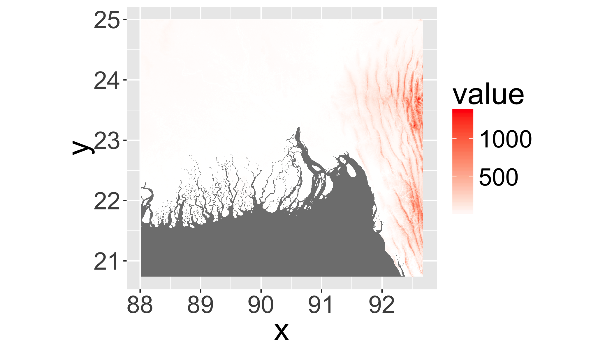
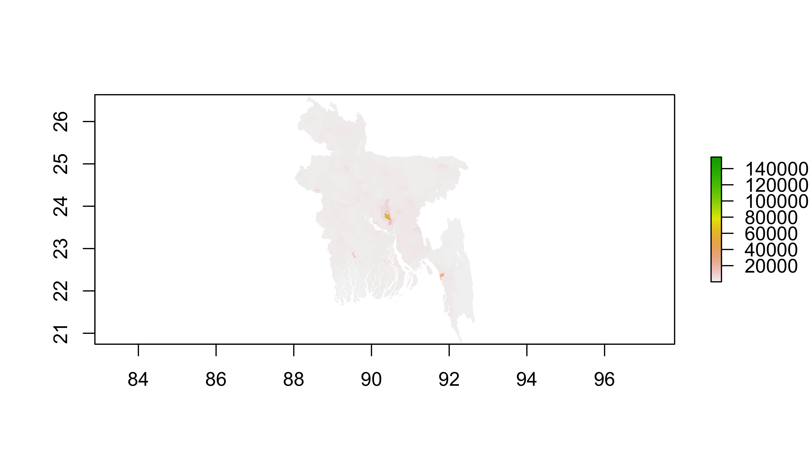
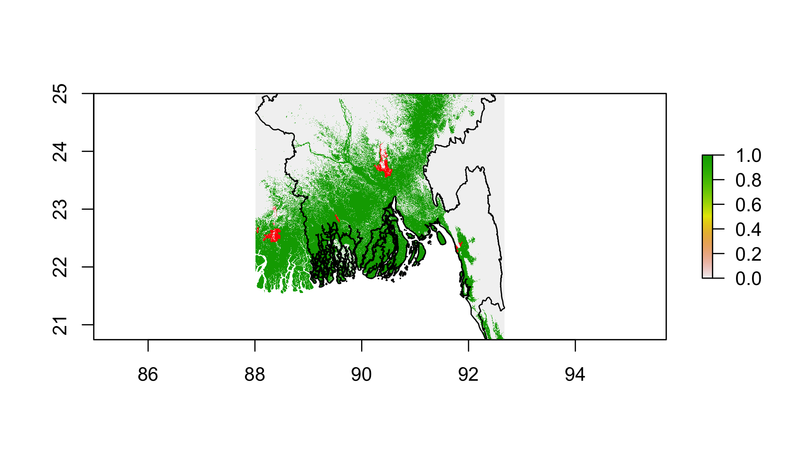
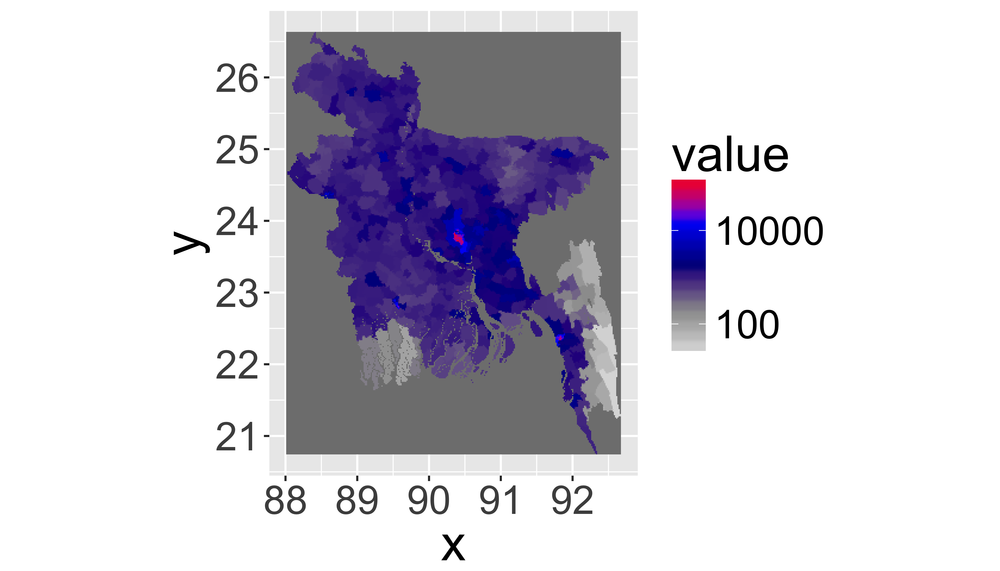

# More Raster


[<i class="fa fa-file-code-o fa-3x" aria-hidden="true"></i> The R Script associated with this page is available here](06_RasterTwo.R).  Download this file and open it (or copy-paste into a new script) with RStudio so you can follow along.  


## Libraries


```r
library(knitr)
library(dplyr)
library(tidyr)
library(ggplot2)
library(raster)
library(rasterVis)
library(scales)
library(rgeos)
```

## Today's question

### How will future (projected) sea level rise affect Bangladesh?

1. How much area is likely to be flooded by rising sea level?
2. How many people are likely to be displaced?
3. Will sea level rise affect any major population centers?

## Bangladesh


```r
getData("ISO3")%>%
  as.data.frame%>%
  filter(NAME=="Bangladesh")
```

```
##   ISO3       NAME
## 1  BGD Bangladesh
```


### Download Bangladesh Border

Often good idea to keep data in separate folder.  You will need to edit this for your machine!

```r
datadir="~/Downloads/data"
if(!file.exists(datadir)) dir.create(datadir, recursive=T)
```
Download country border.

```r
bgd=getData('GADM', country='BGD', level=0,path = datadir)
plot(bgd)
```

<!-- -->


## Topography

SRTM Elevation data with `getData()` as 5deg tiles.


```r
bgdc=gCentroid(bgd)%>%coordinates()

dem1=getData("SRTM",lat=bgdc[2],lon=bgdc[1],path=datadir)
```

```
## Warning in utils::download.file(url = aurl, destfile = fn, method =
## "auto", : unable to resolve 'hypersphere.telascience.org'
```

```r
plot(dem1)
plot(bgd,add=T)
```

<!-- -->


### Mosaicing/Merging rasters

Download the remaining necessary tiles


```r
dem2=getData("SRTM",lat=23.7,lon=85,path=datadir)
```

```
## Warning in utils::download.file(url = aurl, destfile = fn, method =
## "auto", : unable to resolve 'hypersphere.telascience.org'
```

Use `merge()` to join two aligned rasters (origin, resolution, and projection).  Or `mosaic()` combines with a function.


```r
dem=merge(dem1,dem2)
plot(dem)
plot(bgd,add=T)
```

<!-- -->


## Saving/exporting rasters

Beware of massive temporary files!


```r
inMemory(dem)
```

```
## [1] FALSE
```

```r
dem@file@name
```

```
## [1] "/private/var/folders/lg/gz_jcfk5617dlpzdtg23x3rh0000gn/T/Rtmpv6y1fG/raster/r_tmp_2016-10-16_211114_5026_12958.grd"
```

```r
file.size(sub("grd","gri",dem@file@name))*1e-6
```

```
## [1] 144.036
```

```r
showTmpFiles()
```

```
## r_tmp_2016-10-16_211114_5026_12958
```


```r
rasterOptions()
```

```
## format        : raster 
## datatype      : FLT8S 
## overwrite     : FALSE 
## progress      : none 
## timer         : FALSE 
## chunksize     : 1e+07 
## maxmemory     : 1e+08 
## tmpdir        : /var/folders/lg/gz_jcfk5617dlpzdtg23x3rh0000gn/T//Rtmpv6y1fG/raster// 
## tmptime       : 168 
## setfileext    : TRUE 
## tolerance     : 0.1 
## standardnames : TRUE 
## warn depracat.: TRUE 
## header        : none
```
Set with `rasterOptions(tmpdir = "/tmp")`


Saving raster to file: _two options_

Save while creating

```r
dem=merge(dem1,dem2,filename=file.path(datadir,"dem.tif"))
```

Or after

```r
writeRaster(dem, filename = file.path(datadir,"dem.tif"))
```


### WriteRaster formats

Filetype  Long name	                      Default extension	  Multiband support
---       ---                             ---                 ---                                                     
raster	  'Native' raster package format	.grd	              Yes
ascii	    ESRI Ascii	                    .asc                No
SAGA	    SAGA GIS	                      .sdat	              No
IDRISI	  IDRISI	                        .rst	              No
CDF	      netCDF (requires `ncdf`)	      .nc	                Yes
GTiff	    GeoTiff (requires rgdal)	      .tif	              Yes
ENVI	    ENVI .hdr Labelled	            .envi	              Yes
EHdr	    ESRI .hdr Labelled	            .bil	              Yes
HFA	      Erdas Imagine Images (.img)   	.img	              Yes

`rgdal` package does even more...

### Crop to Bangladesh


```r
dem=crop(dem,bgd,filename=file.path(datadir,"dem_bgd.tif"),overwrite=T)
plot(dem); plot(bgd,add=T)
```

<!-- -->


```r
gplot(dem,max=1e5)+geom_tile(aes(fill=value))+
  scale_fill_gradientn(
    colours=c("red","yellow","grey30","grey20","grey10"),
    trans="log1p",breaks= log_breaks(n = 5, base = 10)(c(1, 1e3)))+
  coord_equal(ylim=c(21,25))+
  geom_path(data=fortify(bgd),
            aes(x=long,y=lat,order=order,group=group),size=.5)
```

```
## Regions defined for each Polygons
```

<!-- -->


# Terrain analysis (an aside)

## Terrain analysis options

`terrain()` options:

* slope
* aspect
* TPI (Topographic Position Index)
* TRI (Terrain Ruggedness Index)
* roughness
* flowdir


Use a smaller region:

```r
reg1=crop(dem1,extent(93.8,94,21.05,21.15))
plot(reg1)
```

<!-- -->

The terrain indices are according to Wilson et al. (2007), as in [gdaldem](http://www.gdal.org/gdaldem.html).


### Calculate slope


```r
slope=terrain(reg1,opt="slope",unit="degrees")
plot(slope)
```

<!-- -->


### Calculate aspect


```r
aspect=terrain(reg1,opt="aspect",unit="degrees")
plot(aspect)
```

<!-- -->


### TPI (Topographic Position Index)

Difference between the value of a cell and the mean value of its 8 surrounding cells.


```r
tpi=terrain(reg1,opt="TPI")

gplot(tpi,max=1e6)+geom_tile(aes(fill=value))+
  scale_fill_gradient2(low="blue",high="red",midpoint=0)+
  coord_equal()
```

<!-- -->
Negative values indicate valleys, near zero flat or mid-slope, and positive ridge and hill tops


<div class="well">
## Your turn

* Identify all the pixels with a TPI less than -15 or greater than 15.
* Use `plot()` to:
    * plot elevation for this region
    * overlay the valley pixels in blue
    * overlay the ridge pixels in red

Hint: use `transparent` to plot a transparent pixel and `add=T` to add a layer to an existing plot. 

<button data-toggle="collapse" class="btn btn-primary btn-sm round" data-target="#demo1">Show Solution</button>
<div id="demo1" class="collapse">


```r
plot(reg1)
plot(tpi>15,col=c("transparent","red"),add=T,legend=F)
plot(tpi<(-15),col=c("transparent","blue"),add=T,legend=F)
```

<!-- -->

```r
#OR (ggplot solution, sort of)
rcl=matrix(c(-Inf,-15,1,
           -15,15,2,
           15,Inf,3),byrow=T,nrow=3)
regclass=reclassify(tpi,rcl)
gplot(regclass,max=1e6)+geom_tile(aes(fill=value))+
  scale_fill_gradient2(low="blue",high="red",midpoint=2)+
  coord_equal()
```

<!-- -->
</div>
</div>


### TRI (Terrain Ruggedness Index)

Mean of the absolute differences between the value of a cell and the value of its 8 surrounding cells.


```r
tri=terrain(reg1,opt="TRI")
plot(tri)
```

<!-- -->


### Roughness 

Difference between the maximum and the minimum value of a cell and its 8 surrounding cells.


```r
rough=terrain(reg1,opt="roughness")
plot(rough)
```

<!-- -->


### Hillshade (pretty...)

Compute from slope and aspect (in radians). Often used as a backdrop for another semi-transparent layer.


```r
hs=hillShade(slope*pi/180,aspect*pi/180)

plot(hs, col=grey(0:100/100), legend=FALSE)
plot(reg1, col=terrain.colors(25, alpha=0.5), add=TRUE)
```

<!-- -->


### Flow Direction

_Flow direction_ (of water), i.e. the direction of the greatest drop in elevation (or the smallest rise if all neighbors are higher). 

Encoded as powers of 2 (0 to 7). The cell to the right of the focal cell 'x' is 1, the one below that is 2, and so on:

32	64	    128
--- ---     ---     
16	**x**	  1
8   4       2


```r
flowdir=terrain(reg1,opt="flowdir")

plot(flowdir)
```

<!-- -->
Much more powerful hydrologic modeling in [GRASS GIS](https://grass.osgeo.org) 

## Reclassification

Another useful function for raster processing is `reclass()`.


```r
rcl=matrix(c(-Inf,2,1,
           2,5,2,
           5,10,3),byrow=T,nrow=3)
rcl
```

```
##      [,1] [,2] [,3]
## [1,] -Inf    2    1
## [2,]    2    5    2
## [3,]    5   10    3
```

```r
regclass=reclassify(dem,rcl)
gplot(regclass,max=1e6)+geom_tile(aes(fill=value))+
  scale_fill_gradient2(low="blue",high="red",midpoint=0)+
  coord_equal()
```

<!-- -->

# Sea Level Rise


## Global SLR Scenarios


```r
slr=data.frame(year=2100,
               scenario=c("RCP2.6","RCP4.5","RCP6.0","RCP8.5"),
               low=c(0.26,0.32,0.33,0.53),
               high=c(0.54,0.62,0.62,0.97))
kable(slr)
```


 year  scenario     low   high
-----  ---------  -----  -----
 2100  RCP2.6      0.26   0.54
 2100  RCP4.5      0.32   0.62
 2100  RCP6.0      0.33   0.62
 2100  RCP8.5      0.53   0.97

[IPCC AR5 WG1 Section 13-4](https://www.ipcc.ch/pdf/assessment-report/ar5/wg1/drafts/fgd/WGIAR5_WGI-12Doc2b_FinalDraft_Chapter13.pdf)

## Storm Surges

Range from 2.5-10m in Bangladesh since 1960 [Karim & Mimura, 2008](http://www.sciencedirect.com/science/article/pii/S0959378008000447).  


```r
ss=c(2.5,10)
```

## Raster area

1st Question: How much area is likely to be flooded by rising sea levels? 

WGS84 data is unprojected, must account for cell area (in km^2)...

```r
area=raster::area(dem)
plot(area)
```

<!-- -->


<div class="well">
## Your Turn

1. How much area is likely to be flooded by rising sea levels for two scenarios:
   * 0.26m SLR and 2.5m surge (2.76 total)
   * 0.97 SLR and 10m surge (10.97 total)
   
Steps:

* Identify which pixels are below thresholds
* Multiply by cell area
* Use `cellStats()` to calculate potentially flooded areas.

<button data-toggle="collapse" class="btn btn-primary btn-sm round" data-target="#demo2">Show Solution</button>
<div id="demo2" class="collapse">
## Identify pixels below thresholds


```r
flood1=dem<=2.76
flood2=dem<=10.97

plot(flood2,col=c("transparent","darkred"))
plot(flood1,col=c("transparent","red"),add=T)
```

<!-- -->


## Multiply by area and sum


```r
flood1a=flood1*area
flood2a=flood2*area

cellStats(flood1a,sum)
```

```
## [1] 6357.565
```

```r
cellStats(flood2a,sum)
```

```
## [1] 68057.65
```

</div>
</div>


## Socioeconomic Data

Socioeconomic Data and Applications Center (SEDAC)
[http://sedac.ciesin.columbia.edu](http://sedac.ciesin.columbia.edu)


* Population
* Pollution
* Energy
* Agriculture
* Roads


### Gridded Population of the World

Data _not_ available for direct download (e.g. `download.file()`)

* Log into SEDAC with an Earth Data Account
[http://sedac.ciesin.columbia.edu](http://sedac.ciesin.columbia.edu)
* Download Population Density Grid for 2015


### Load population data

Use `raster()` to load a raster from disk.


```r
pop=raster(file.path(datadir,"gpw-v4-population-density-2015/gpw-v4-population-density_2015.tif"))
plot(pop)
```

<!-- -->


A nicer plot...

```r
gplot(pop,max=1e6)+geom_tile(aes(fill=value))+
  scale_fill_gradientn(
    colours=c("grey90","grey60","darkblue","blue","red"),
    trans="log1p",breaks= log_breaks(n = 5, base = 10)(c(1, 1e5)))+
  coord_equal()
```

<!-- -->


### Crop to region with the `dem` object


```r
pop2=pop%>%
  crop(dem)

gplot(pop2,max=1e6)+geom_tile(aes(fill=value))+
  scale_fill_gradientn(colours=c("grey90","grey60","darkblue","blue","red"),
                       trans="log1p",breaks= log_breaks(n = 5, base = 10)(c(1, 1e5)))+
  coord_equal()
```

<!-- -->


### Resample to DEM

Assume equal density within each grid cell and resample

```r
pop3=pop2%>%
  resample(dem,method="bilinear")

gplot(pop3,max=1e6)+geom_tile(aes(fill=value))+
  scale_fill_gradientn(colours=c("grey90","grey60","darkblue","blue","red"),
                       trans="log1p",breaks= log_breaks(n = 5, base = 10)(c(1, 1e5)))+
  coord_equal()
```

<!-- -->


Or resample elevation to resolution of population:


```r
res(pop2)/res(dem)
demc=dem%>%
  aggregate(fact=50,fun=min,expand=T)%>%
  resample(pop2,method="bilinear")
```


<div class="well">
## Your turn

How many people are likely to be displaced?

Steps:

* Multiply flooded area (`flood2`) **x** population density **x** area
* Summarize with `cellStats()`
* Plot a map of the number of people potentially affected by `flood2`

<button data-toggle="collapse" class="btn btn-primary btn-sm round" data-target="#demo3">Show Solution</button>
<div id="demo3" class="collapse">


```r
floodpop2=flood2a*pop3
cellStats(floodpop2,sum)
```

```
## [1] 96692231
```

Number of potentially affected people across the region.


```r
gplot(floodpop2,max=1e6)+geom_tile(aes(fill=value))+
  scale_fill_gradientn(
    colours=c("grey90","grey60","darkblue","blue","red"),
    trans="log1p",breaks= log_breaks(n = 5, base = 10)(c(1, 1e4)))+
  coord_equal()
```

<!-- -->

</div>
</div>


## Raster Distances

`distance()` calculates distances for all cells that are NA to the nearest cell that is not NA.


```r
popcenter=pop2>5000
popcenter=mask(popcenter,popcenter,maskvalue=0)
plot(popcenter,col="red",legend=F)
```

<!-- -->


In meters if the RasterLayer is not projected (`+proj=longlat`) and in map units (typically also meters) when it is projected.


```r
popcenterdist=distance(popcenter)
plot(popcenterdist)
```

<!-- -->


<div class="well">
## Your Turn

Will sea level rise affect any major population centers?

Steps:

* Resample `popcenter` to resolution of `dem` using `method=ngb`
* Identify `popcenter` areas that flood according to `flood2`.


<button data-toggle="collapse" class="btn btn-primary btn-sm round" data-target="#demo4">Show Solution</button>
<div id="demo4" class="collapse">

Will sea level rise affect any major population centers?


```r
popcenter2=resample(popcenter,dem,method="ngb")

floodpop2= flood2==1 & popcenter2
floodpop2=mask(floodpop2,floodpop2,maskval=0)

plot(flood2);plot(floodpop2,add=T,col="red",legend=F);plot(bgd,add=T)
```

<!-- -->

</div>
</div>

## Vectorize raster


```r
vpop=rasterToPolygons(popcenter, dissolve=TRUE)

gplot(dem,max=1e5)+geom_tile(aes(fill=value))+
  scale_fill_gradientn(
    colours=c("red","yellow","grey30","grey20","grey10"),
    trans="log1p",breaks= log_breaks(n = 5, base = 10)(c(1, 1e3)))+
  coord_equal(ylim=c(21,25))+
  geom_path(data=fortify(bgd),aes(x=long,y=lat,order=order,group=group),size=.5)+
  geom_path(data=fortify(vpop),aes(x=long,y=lat,order=order,group=group),size=1,col="green")
```

<!-- -->
Warning: very slow on large rasters...

## 3D Visualization
Uses `rgl` library.  


```r
plot3D(dem)
decorate3d()
```


50 different styles illustrated [here](https://cran.r-project.org/web/packages/plot3D/vignettes/volcano.pdf).


Overlay population with `drape`


```r
plot3D(dem,drape=pop3, zfac=1)
decorate3d()
```

## Raster overview

* Perform many GIS operations
* Convenient processing and workflows
* Some functions (e.g. `distance()` can be slow!
