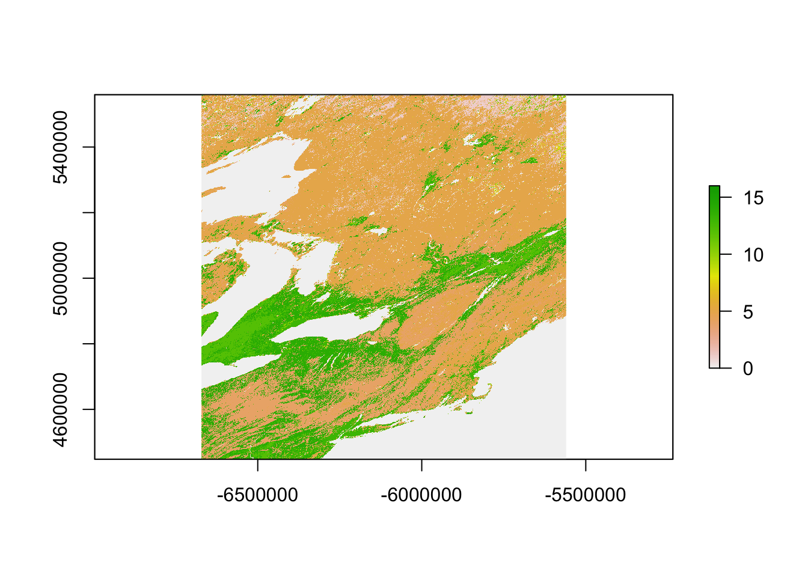
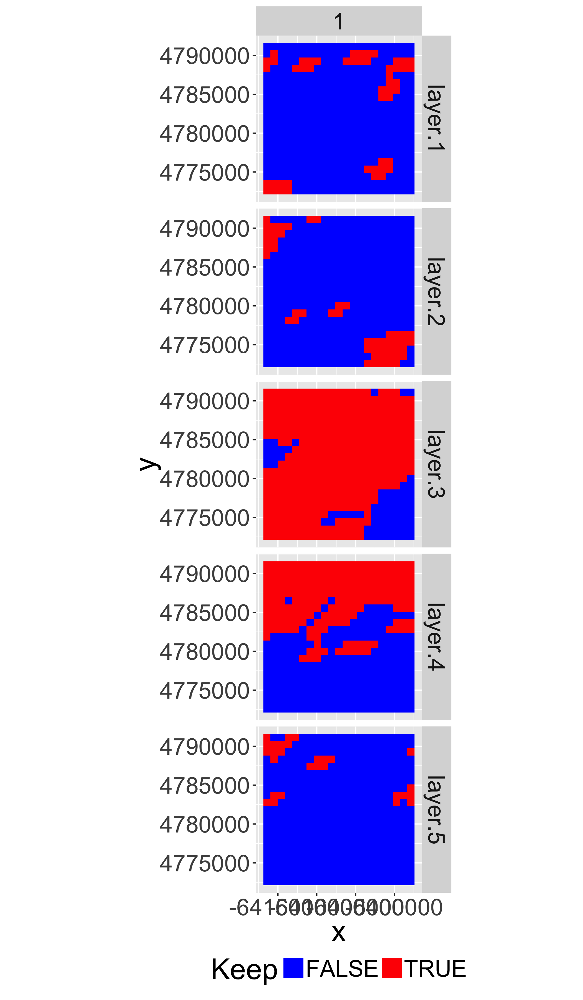
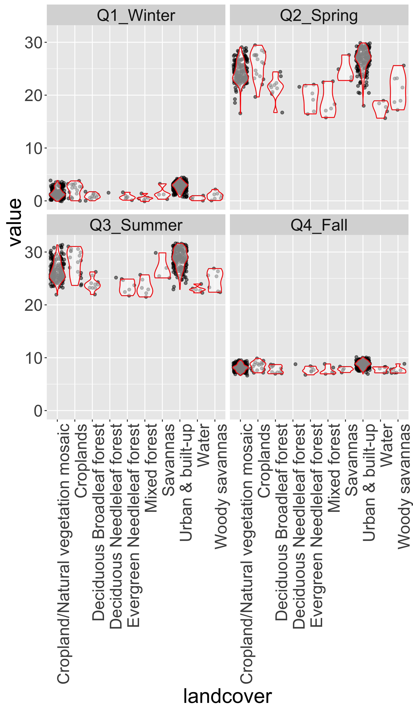

# Working With data from Satellite Remote Sensing


<div>
<iframe src="09_presentation/09_RemoteSensing.html" width="75%" height="400px"> </iframe>
</div>


[<i class="fa fa-file-code-o fa-3x" aria-hidden="true"></i> The R Script associated with this page is available here](09_RemoteSensing.R).  Download this file and open it (or copy-paste into a new script) with RStudio so you can follow along.  


### Libraries


```r
library(raster)
library(rasterVis)
library(rgdal)
library(sp)
library(ggplot2)
library(ggmap)
library(dplyr)
library(reshape2)
library(knitr)
library(tidyr)

# New Packages
library(MODISTools)
library(gdalUtils)
library(rts)
```


## Specify directory to store data (absolute or relative to current working directory). 

```r
download.file("http://adamwilson.us/RDataScience/09_data.zip",
              destfile=file.path("09_data.zip"))
datadir="09_data"
unzip("09_data.zip",exdir = datadir)
```


## Working with _raw_ HDF files 

Will only work if your `gdal` was compiled with HDF support

```r
gdalinfo(formats = T) %>% grep(pattern="HDF",value=T)
```

```
## [1] "  HDF4 -raster- (ros): Hierarchical Data Format Release 4"
## [2] "  HDF4Image -raster- (rw+): HDF4 Dataset"                 
## [3] "  HDF5 -raster- (ros): Hierarchical Data Format Release 5"
## [4] "  HDF5Image -raster- (ro): HDF5 Dataset"
```


```r
hdf=file.path(datadir,"MCD12Q1.A2012001.h12v04.051.2014288200441_subset.hdf")
gdalinfo(hdf)
```

```
##   [1] "Driver: HDF4/Hierarchical Data Format Release 4"                                                                                                                                                                                                                                                       
##   [2] "Files: 09_data/MCD12Q1.A2012001.h12v04.051.2014288200441_subset.hdf"                                                                                                                                                                                                                                   
##   [3] "Size is 512, 512"                                                                                                                                                                                                                                                                                      
##   [4] "Coordinate System is `'"                                                                                                                                                                                                                                                                               
##   [5] "Metadata:"                                                                                                                                                                                                                                                                                             
##   [6] "  HDFEOSVersion=HDFEOS_V2.14"                                                                                                                                                                                                                                                                          
##   [7] "  OldArchiveMetadata.0="                                                                                                                                                                                                                                                                               
##   [8] "GROUP                  = ARCHIVEDMETADATA"                                                                                                                                                                                                                                                             
##   [9] "  GROUPTYPE            = MASTERGROUP"                                                                                                                                                                                                                                                                  
##  [10] ""                                                                                                                                                                                                                                                                                                      
##  [11] "  OBJECT                 = PROCESSINGENVIRONMENT"                                                                                                                                                                                                                                                      
##  [12] "    NUM_VAL              = 1"                                                                                                                                                                                                                                                                          
##  [13] "    VALUE                = \"Linux minion5459 2.6.18-308.16.1.el5PAE #1 SMP Tue Oct 2 22:49:17 EDT 2012 i686 i686 i386 GNU/Linux\""                                                                                                                                                                    
##  [14] "  END_OBJECT             = PROCESSINGENVIRONMENT"                                                                                                                                                                                                                                                      
##  [15] ""                                                                                                                                                                                                                                                                                                      
##  [16] "  OBJECT                 = DESCRREVISION"                                                                                                                                                                                                                                                              
##  [17] "    NUM_VAL              = 1"                                                                                                                                                                                                                                                                          
##  [18] "    VALUE                = \"5.1\""                                                                                                                                                                                                                                                                    
##  [19] "  END_OBJECT             = DESCRREVISION"                                                                                                                                                                                                                                                              
##  [20] ""                                                                                                                                                                                                                                                                                                      
##  [21] "  OBJECT                 = LONGNAME"                                                                                                                                                                                                                                                                   
##  [22] "    NUM_VAL              = 1"                                                                                                                                                                                                                                                                          
##  [23] "    VALUE                = \"MODIS/Terra+Aqua Land Cover Type Yearly L3 Global 500m SIN Grid\""                                                                                                                                                                                                        
##  [24] "  END_OBJECT             = LONGNAME"                                                                                                                                                                                                                                                                   
##  [25] ""                                                                                                                                                                                                                                                                                                      
##  [26] "  OBJECT                 = ALGORITHMPACKAGEACCEPTANCEDATE"                                                                                                                                                                                                                                             
##  [27] "    NUM_VAL              = 1"                                                                                                                                                                                                                                                                          
##  [28] "    VALUE                = \"1998-01-01\""                                                                                                                                                                                                                                                             
##  [29] "  END_OBJECT             = ALGORITHMPACKAGEACCEPTANCEDATE"                                                                                                                                                                                                                                             
##  [30] ""                                                                                                                                                                                                                                                                                                      
##  [31] "  OBJECT                 = ALGORITHMPACKAGEMATURITYCODE"                                                                                                                                                                                                                                               
##  [32] "    NUM_VAL              = 1"                                                                                                                                                                                                                                                                          
##  [33] "    VALUE                = \"LAUNCH\""                                                                                                                                                                                                                                                                 
##  [34] "  END_OBJECT             = ALGORITHMPACKAGEMATURITYCODE"                                                                                                                                                                                                                                               
##  [35] ""                                                                                                                                                                                                                                                                                                      
##  [36] "  OBJECT                 = ALGORITHMPACKAGENAME"                                                                                                                                                                                                                                                       
##  [37] "    NUM_VAL              = 1"                                                                                                                                                                                                                                                                          
##  [38] "    VALUE                = \"MOD12Q1\""                                                                                                                                                                                                                                                                
##  [39] "  END_OBJECT             = ALGORITHMPACKAGENAME"                                                                                                                                                                                                                                                       
##  [40] ""                                                                                                                                                                                                                                                                                                      
##  [41] "  OBJECT                 = ALGORITHMPACKAGEVERSION"                                                                                                                                                                                                                                                    
##  [42] "    NUM_VAL              = 1"                                                                                                                                                                                                                                                                          
##  [43] "    VALUE                = \"V2.0\""                                                                                                                                                                                                                                                                   
##  [44] "  END_OBJECT             = ALGORITHMPACKAGEVERSION"                                                                                                                                                                                                                                                    
##  [45] ""                                                                                                                                                                                                                                                                                                      
##  [46] "  OBJECT                 = GEOANYABNORMAL"                                                                                                                                                                                                                                                             
##  [47] "    NUM_VAL              = 1"                                                                                                                                                                                                                                                                          
##  [48] "    VALUE                = \"False\""                                                                                                                                                                                                                                                                  
##  [49] "  END_OBJECT             = GEOANYABNORMAL"                                                                                                                                                                                                                                                             
##  [50] ""                                                                                                                                                                                                                                                                                                      
##  [51] "  OBJECT                 = GEOESTMAXRMSERROR"                                                                                                                                                                                                                                                          
##  [52] "    NUM_VAL              = 1"                                                                                                                                                                                                                                                                          
##  [53] "    VALUE                = 50.0"                                                                                                                                                                                                                                                                       
##  [54] "  END_OBJECT             = GEOESTMAXRMSERROR"                                                                                                                                                                                                                                                          
##  [55] ""                                                                                                                                                                                                                                                                                                      
##  [56] "  OBJECT                 = SPSOPARAMETERS"                                                                                                                                                                                                                                                             
##  [57] "    NUM_VAL              = 1"                                                                                                                                                                                                                                                                          
##  [58] "    VALUE                = \"2669\""                                                                                                                                                                                                                                                                   
##  [59] "  END_OBJECT             = SPSOPARAMETERS"                                                                                                                                                                                                                                                             
##  [60] ""                                                                                                                                                                                                                                                                                                      
##  [61] "  OBJECT                 = PROCESSINGCENTER"                                                                                                                                                                                                                                                           
##  [62] "    NUM_VAL              = 1"                                                                                                                                                                                                                                                                          
##  [63] "    VALUE                = \"MODAPS\""                                                                                                                                                                                                                                                                 
##  [64] "  END_OBJECT             = PROCESSINGCENTER"                                                                                                                                                                                                                                                           
##  [65] ""                                                                                                                                                                                                                                                                                                      
##  [66] "  OBJECT                 = CHARACTERISTICBINANGULARSIZE"                                                                                                                                                                                                                                               
##  [67] "    NUM_VAL              = 1"                                                                                                                                                                                                                                                                          
##  [68] "    VALUE                = 15.0"                                                                                                                                                                                                                                                                       
##  [69] "  END_OBJECT             = CHARACTERISTICBINANGULARSIZE"                                                                                                                                                                                                                                               
##  [70] ""                                                                                                                                                                                                                                                                                                      
##  [71] "  OBJECT                 = CHARACTERISTICBINSIZE"                                                                                                                                                                                                                                                      
##  [72] "    NUM_VAL              = 1"                                                                                                                                                                                                                                                                          
##  [73] "    VALUE                = 463.3127165"                                                                                                                                                                                                                                                                
##  [74] "  END_OBJECT             = CHARACTERISTICBINSIZE"                                                                                                                                                                                                                                                      
##  [75] ""                                                                                                                                                                                                                                                                                                      
##  [76] "  OBJECT                 = DATACOLUMNS"                                                                                                                                                                                                                                                                
##  [77] "    NUM_VAL              = 1"                                                                                                                                                                                                                                                                          
##  [78] "    VALUE                = 2400"                                                                                                                                                                                                                                                                       
##  [79] "  END_OBJECT             = DATACOLUMNS"                                                                                                                                                                                                                                                                
##  [80] ""                                                                                                                                                                                                                                                                                                      
##  [81] "  OBJECT                 = DATAROWS"                                                                                                                                                                                                                                                                   
##  [82] "    NUM_VAL              = 1"                                                                                                                                                                                                                                                                          
##  [83] "    VALUE                = 2400"                                                                                                                                                                                                                                                                       
##  [84] "  END_OBJECT             = DATAROWS"                                                                                                                                                                                                                                                                   
##  [85] ""                                                                                                                                                                                                                                                                                                      
##  [86] "  OBJECT                 = GLOBALGRIDCOLUMNS"                                                                                                                                                                                                                                                          
##  [87] "    NUM_VAL              = 1"                                                                                                                                                                                                                                                                          
##  [88] "    VALUE                = 86400"                                                                                                                                                                                                                                                                      
##  [89] "  END_OBJECT             = GLOBALGRIDCOLUMNS"                                                                                                                                                                                                                                                          
##  [90] ""                                                                                                                                                                                                                                                                                                      
##  [91] "  OBJECT                 = GLOBALGRIDROWS"                                                                                                                                                                                                                                                             
##  [92] "    NUM_VAL              = 1"                                                                                                                                                                                                                                                                          
##  [93] "    VALUE                = 43200"                                                                                                                                                                                                                                                                      
##  [94] "  END_OBJECT             = GLOBALGRIDROWS"                                                                                                                                                                                                                                                             
##  [95] ""                                                                                                                                                                                                                                                                                                      
##  [96] "  OBJECT                 = MAXIMUMOBSERVATIONS"                                                                                                                                                                                                                                                        
##  [97] "    NUM_VAL              = 1"                                                                                                                                                                                                                                                                          
##  [98] "    VALUE                = 2"                                                                                                                                                                                                                                                                          
##  [99] "  END_OBJECT             = MAXIMUMOBSERVATIONS"                                                                                                                                                                                                                                                        
## [100] ""                                                                                                                                                                                                                                                                                                      
## [101] "  OBJECT                 = NUMBEROFGRANULES"                                                                                                                                                                                                                                                           
## [102] "    NUM_VAL              = 1"                                                                                                                                                                                                                                                                          
## [103] "    VALUE                = 3"                                                                                                                                                                                                                                                                          
## [104] "  END_OBJECT             = NUMBEROFGRANULES"                                                                                                                                                                                                                                                           
## [105] ""                                                                                                                                                                                                                                                                                                      
## [106] "  OBJECT                 = COVERAGECALCULATIONMETHOD"                                                                                                                                                                                                                                                  
## [107] "    NUM_VAL              = 1"                                                                                                                                                                                                                                                                          
## [108] "    VALUE                = \"volume\""                                                                                                                                                                                                                                                                 
## [109] "  END_OBJECT             = COVERAGECALCULATIONMETHOD"                                                                                                                                                                                                                                                  
## [110] ""                                                                                                                                                                                                                                                                                                      
## [111] "  OBJECT                 = NADIRDATARESOLUTION"                                                                                                                                                                                                                                                        
## [112] "    NUM_VAL              = 1"                                                                                                                                                                                                                                                                          
## [113] "    VALUE                = \"500m\""                                                                                                                                                                                                                                                                   
## [114] "  END_OBJECT             = NADIRDATARESOLUTION"                                                                                                                                                                                                                                                        
## [115] ""                                                                                                                                                                                                                                                                                                      
## [116] "  GROUP                  = BOUNDINGRECTANGLE"                                                                                                                                                                                                                                                          
## [117] ""                                                                                                                                                                                                                                                                                                      
## [118] "    OBJECT                 = EASTBOUNDINGCOORDINATE"                                                                                                                                                                                                                                                   
## [119] "      NUM_VAL              = 1"                                                                                                                                                                                                                                                                        
## [120] "      VALUE                = -65.259486"                                                                                                                                                                                                                                                               
## [121] "    END_OBJECT             = EASTBOUNDINGCOORDINATE"                                                                                                                                                                                                                                                   
## [122] ""                                                                                                                                                                                                                                                                                                      
## [123] "    OBJECT                 = WESTBOUNDINGCOORDINATE"                                                                                                                                                                                                                                                   
## [124] "      NUM_VAL              = 1"                                                                                                                                                                                                                                                                        
## [125] "      VALUE                = -93.34343"                                                                                                                                                                                                                                                                
## [126] "    END_OBJECT             = WESTBOUNDINGCOORDINATE"                                                                                                                                                                                                                                                   
## [127] ""                                                                                                                                                                                                                                                                                                      
## [128] "    OBJECT                 = SOUTHBOUNDINGCOORDINATE"                                                                                                                                                                                                                                                  
## [129] "      NUM_VAL              = 1"                                                                                                                                                                                                                                                                        
## [130] "      VALUE                = 40.0"                                                                                                                                                                                                                                                                     
## [131] "    END_OBJECT             = SOUTHBOUNDINGCOORDINATE"                                                                                                                                                                                                                                                  
## [132] ""                                                                                                                                                                                                                                                                                                      
## [133] "    OBJECT                 = NORTHBOUNDINGCOORDINATE"                                                                                                                                                                                                                                                  
## [134] "      NUM_VAL              = 1"                                                                                                                                                                                                                                                                        
## [135] "      VALUE                = 50.0"                                                                                                                                                                                                                                                                     
## [136] "    END_OBJECT             = NORTHBOUNDINGCOORDINATE"                                                                                                                                                                                                                                                  
## [137] ""                                                                                                                                                                                                                                                                                                      
## [138] "  END_GROUP              = BOUNDINGRECTANGLE"                                                                                                                                                                                                                                                          
## [139] ""                                                                                                                                                                                                                                                                                                      
## [140] "END_GROUP              = ARCHIVEDMETADATA"                                                                                                                                                                                                                                                             
## [141] ""                                                                                                                                                                                                                                                                                                      
## [142] "END"                                                                                                                                                                                                                                                                                                   
## [143] ""                                                                                                                                                                                                                                                                                                      
## [144] "  OldCoreMetadata.0="                                                                                                                                                                                                                                                                                  
## [145] "GROUP                  = INVENTORYMETADATA"                                                                                                                                                                                                                                                            
## [146] "  GROUPTYPE            = MASTERGROUP"                                                                                                                                                                                                                                                                  
## [147] ""                                                                                                                                                                                                                                                                                                      
## [148] "  GROUP                  = ECSDATAGRANULE"                                                                                                                                                                                                                                                             
## [149] ""                                                                                                                                                                                                                                                                                                      
## [150] "    OBJECT                 = REPROCESSINGPLANNED"                                                                                                                                                                                                                                                      
## [151] "      NUM_VAL              = 1"                                                                                                                                                                                                                                                                        
## [152] "      VALUE                = \"further update is anticipated\""                                                                                                                                                                                                                                        
## [153] "    END_OBJECT             = REPROCESSINGPLANNED"                                                                                                                                                                                                                                                      
## [154] ""                                                                                                                                                                                                                                                                                                      
## [155] "    OBJECT                 = REPROCESSINGACTUAL"                                                                                                                                                                                                                                                       
## [156] "      NUM_VAL              = 1"                                                                                                                                                                                                                                                                        
## [157] "      VALUE                = \"reprocessed\""                                                                                                                                                                                                                                                          
## [158] "    END_OBJECT             = REPROCESSINGACTUAL"                                                                                                                                                                                                                                                       
## [159] ""                                                                                                                                                                                                                                                                                                      
## [160] "    OBJECT                 = LOCALGRANULEID"                                                                                                                                                                                                                                                           
## [161] "      NUM_VAL              = 1"                                                                                                                                                                                                                                                                        
## [162] "      VALUE                = \"MCD12Q1.A2012001.h12v04.051.2014288200441.hdf\""                                                                                                                                                                                                                        
## [163] "    END_OBJECT             = LOCALGRANULEID"                                                                                                                                                                                                                                                           
## [164] ""                                                                                                                                                                                                                                                                                                      
## [165] "    OBJECT                 = DAYNIGHTFLAG"                                                                                                                                                                                                                                                             
## [166] "      NUM_VAL              = 1"                                                                                                                                                                                                                                                                        
## [167] "      VALUE                = \"Day\""                                                                                                                                                                                                                                                                  
## [168] "    END_OBJECT             = DAYNIGHTFLAG"                                                                                                                                                                                                                                                             
## [169] ""                                                                                                                                                                                                                                                                                                      
## [170] "    OBJECT                 = PRODUCTIONDATETIME"                                                                                                                                                                                                                                                       
## [171] "      NUM_VAL              = 1"                                                                                                                                                                                                                                                                        
## [172] "      VALUE                = \"2014-10-15T20:04:41.000Z\""                                                                                                                                                                                                                                             
## [173] "    END_OBJECT             = PRODUCTIONDATETIME"                                                                                                                                                                                                                                                       
## [174] ""                                                                                                                                                                                                                                                                                                      
## [175] "    OBJECT                 = LOCALVERSIONID"                                                                                                                                                                                                                                                           
## [176] "      NUM_VAL              = 1"                                                                                                                                                                                                                                                                        
## [177] "      VALUE                = \"2.2.1\""                                                                                                                                                                                                                                                                
## [178] "    END_OBJECT             = LOCALVERSIONID"                                                                                                                                                                                                                                                           
## [179] ""                                                                                                                                                                                                                                                                                                      
## [180] "  END_GROUP              = ECSDATAGRANULE"                                                                                                                                                                                                                                                             
## [181] ""                                                                                                                                                                                                                                                                                                      
## [182] "  GROUP                  = MEASUREDPARAMETER"                                                                                                                                                                                                                                                          
## [183] ""                                                                                                                                                                                                                                                                                                      
## [184] "    OBJECT                 = MEASUREDPARAMETERCONTAINER"                                                                                                                                                                                                                                               
## [185] "      CLASS                = \"1\""                                                                                                                                                                                                                                                                    
## [186] ""                                                                                                                                                                                                                                                                                                      
## [187] "      OBJECT                 = PARAMETERNAME"                                                                                                                                                                                                                                                          
## [188] "        NUM_VAL              = 1"                                                                                                                                                                                                                                                                      
## [189] "        CLASS                = \"1\""                                                                                                                                                                                                                                                                  
## [190] "        VALUE                = \"Land_Cover_Type_1\""                                                                                                                                                                                                                                                  
## [191] "      END_OBJECT             = PARAMETERNAME"                                                                                                                                                                                                                                                          
## [192] ""                                                                                                                                                                                                                                                                                                      
## [193] "      GROUP                  = QAFLAGS"                                                                                                                                                                                                                                                                
## [194] "        CLASS                = \"1\""                                                                                                                                                                                                                                                                  
## [195] ""                                                                                                                                                                                                                                                                                                      
## [196] "        OBJECT                 = AUTOMATICQUALITYFLAG"                                                                                                                                                                                                                                                 
## [197] "          NUM_VAL              = 1"                                                                                                                                                                                                                                                                    
## [198] "          CLASS                = \"1\""                                                                                                                                                                                                                                                                
## [199] "          VALUE                = \"Passed\""                                                                                                                                                                                                                                                           
## [200] "        END_OBJECT             = AUTOMATICQUALITYFLAG"                                                                                                                                                                                                                                                 
## [201] ""                                                                                                                                                                                                                                                                                                      
## [202] "        OBJECT                 = AUTOMATICQUALITYFLAGEXPLANATION"                                                                                                                                                                                                                                      
## [203] "          NUM_VAL              = 1"                                                                                                                                                                                                                                                                    
## [204] "          CLASS                = \"1\""                                                                                                                                                                                                                                                                
## [205] "          VALUE                = \"To be set as 'Passed' or 'Failed' to indicate failure of PGE test.\""                                                                                                                                                                                               
## [206] "        END_OBJECT             = AUTOMATICQUALITYFLAGEXPLANATION"                                                                                                                                                                                                                                      
## [207] ""                                                                                                                                                                                                                                                                                                      
## [208] "        OBJECT                 = SCIENCEQUALITYFLAG"                                                                                                                                                                                                                                                   
## [209] "          NUM_VAL              = 1"                                                                                                                                                                                                                                                                    
## [210] "          VALUE                = \"Not Investigated\""                                                                                                                                                                                                                                                 
## [211] "          CLASS                = \"1\""                                                                                                                                                                                                                                                                
## [212] "        END_OBJECT             = SCIENCEQUALITYFLAG"                                                                                                                                                                                                                                                   
## [213] ""                                                                                                                                                                                                                                                                                                      
## [214] "        OBJECT                 = SCIENCEQUALITYFLAGEXPLANATION"                                                                                                                                                                                                                                        
## [215] "          NUM_VAL              = 1"                                                                                                                                                                                                                                                                    
## [216] "          CLASS                = \"1\""                                                                                                                                                                                                                                                                
## [217] "          VALUE                = \"See http://landweb.nascom/nasa.gov/cgi-bin/QA_WWW/qaFlagPage.cgi?sat=aqua the product Science Quality status.\""                                                                                                                                                    
## [218] "        END_OBJECT             = SCIENCEQUALITYFLAGEXPLANATION"                                                                                                                                                                                                                                        
## [219] ""                                                                                                                                                                                                                                                                                                      
## [220] "      END_GROUP              = QAFLAGS"                                                                                                                                                                                                                                                                
## [221] ""                                                                                                                                                                                                                                                                                                      
## [222] "      GROUP                  = QASTATS"                                                                                                                                                                                                                                                                
## [223] "        CLASS                = \"1\""                                                                                                                                                                                                                                                                  
## [224] ""                                                                                                                                                                                                                                                                                                      
## [225] "        OBJECT                 = QAPERCENTINTERPOLATEDDATA"                                                                                                                                                                                                                                            
## [226] "          NUM_VAL              = 1"                                                                                                                                                                                                                                                                    
## [227] "          CLASS                = \"1\""                                                                                                                                                                                                                                                                
## [228] "          VALUE                = 5"                                                                                                                                                                                                                                                                    
## [229] "        END_OBJECT             = QAPERCENTINTERPOLATEDDATA"                                                                                                                                                                                                                                            
## [230] ""                                                                                                                                                                                                                                                                                                      
## [231] "        OBJECT                 = QAPERCENTMISSINGDATA"                                                                                                                                                                                                                                                 
## [232] "          NUM_VAL              = 1"                                                                                                                                                                                                                                                                    
## [233] "          CLASS                = \"1\""                                                                                                                                                                                                                                                                
## [234] "          VALUE                = 0"                                                                                                                                                                                                                                                                    
## [235] "        END_OBJECT             = QAPERCENTMISSINGDATA"                                                                                                                                                                                                                                                 
## [236] ""                                                                                                                                                                                                                                                                                                      
## [237] "        OBJECT                 = QAPERCENTOUTOFBOUNDSDATA"                                                                                                                                                                                                                                             
## [238] "          NUM_VAL              = 1"                                                                                                                                                                                                                                                                    
## [239] "          CLASS                = \"1\""                                                                                                                                                                                                                                                                
## [240] "          VALUE                = 0"                                                                                                                                                                                                                                                                    
## [241] "        END_OBJECT             = QAPERCENTOUTOFBOUNDSDATA"                                                                                                                                                                                                                                             
## [242] ""                                                                                                                                                                                                                                                                                                      
## [243] "      END_GROUP              = QASTATS"                                                                                                                                                                                                                                                                
## [244] ""                                                                                                                                                                                                                                                                                                      
## [245] "    END_OBJECT             = MEASUREDPARAMETERCONTAINER"                                                                                                                                                                                                                                               
## [246] ""                                                                                                                                                                                                                                                                                                      
## [247] "  END_GROUP              = MEASUREDPARAMETER"                                                                                                                                                                                                                                                          
## [248] ""                                                                                                                                                                                                                                                                                                      
## [249] "  GROUP                  = COLLECTIONDESCRIPTIONCLASS"                                                                                                                                                                                                                                                 
## [250] ""                                                                                                                                                                                                                                                                                                      
## [251] "    OBJECT                 = SHORTNAME"                                                                                                                                                                                                                                                                
## [252] "      NUM_VAL              = 1"                                                                                                                                                                                                                                                                        
## [253] "      VALUE                = \"MCD12Q1\""                                                                                                                                                                                                                                                              
## [254] "    END_OBJECT             = SHORTNAME"                                                                                                                                                                                                                                                                
## [255] ""                                                                                                                                                                                                                                                                                                      
## [256] "    OBJECT                 = VERSIONID"                                                                                                                                                                                                                                                                
## [257] "      NUM_VAL              = 1"                                                                                                                                                                                                                                                                        
## [258] "      VALUE                = 51"                                                                                                                                                                                                                                                                       
## [259] "    END_OBJECT             = VERSIONID"                                                                                                                                                                                                                                                                
## [260] ""                                                                                                                                                                                                                                                                                                      
## [261] "  END_GROUP              = COLLECTIONDESCRIPTIONCLASS"                                                                                                                                                                                                                                                 
## [262] ""                                                                                                                                                                                                                                                                                                      
## [263] "  GROUP                  = INPUTGRANULE"                                                                                                                                                                                                                                                               
## [264] ""                                                                                                                                                                                                                                                                                                      
## [265] "    OBJECT                 = INPUTPOINTER"                                                                                                                                                                                                                                                             
## [266] "      NUM_VAL              = 100"                                                                                                                                                                                                                                                                      
## [267] "      VALUE                = (\"MOD12Q1.A2004001.h12v04.004.2006117173236.hdf\", \"LC_LW_TEMP.A2012001.h12v04.hdf\", \"LC1.A2012001.h12v04.hdf\", \"LC2.A2012001.h12v04.hdf\", \"LC3.A2012001.h12v04.hdf\", \"LC4.A2012001.h12v04.hdf\", \"LC5.A2012001.h12v04.hdf\", \"LC1A.A2012001.h12v04.hdf\", \""
## [268] "          LC2A.A2012001.h12v04.hdf\", \"LC3A.A2012001.h12v04.hdf\", \"LC4A.A2012001.h12v04.hdf\", \"LC5A.A2012001.h12v04.hdf\", \"LCS.A2012001.h12v04.hdf\", \"LCS_P.A2012001.h12v04.hdf\", \"LCP1.A2012001.h12v04.hdf\", \"LCP2.A2012001.h12v04.hdf\", \"LCP3.A2012001.h12v04.hdf\")"                 
## [269] "    END_OBJECT             = INPUTPOINTER"                                                                                                                                                                                                                                                             
## [270] ""                                                                                                                                                                                                                                                                                                      
## [271] "  END_GROUP              = INPUTGRANULE"                                                                                                                                                                                                                                                               
## [272] ""                                                                                                                                                                                                                                                                                                      
## [273] "  GROUP                  = SPATIALDOMAINCONTAINER"                                                                                                                                                                                                                                                     
## [274] ""                                                                                                                                                                                                                                                                                                      
## [275] "    GROUP                  = HORIZONTALSPATIALDOMAINCONTAINER"                                                                                                                                                                                                                                         
## [276] ""                                                                                                                                                                                                                                                                                                      
## [277] "      GROUP                  = GPOLYGON"                                                                                                                                                                                                                                                               
## [278] ""                                                                                                                                                                                                                                                                                                      
## [279] "        OBJECT                 = GPOLYGONCONTAINER"                                                                                                                                                                                                                                                    
## [280] "          CLASS                = \"1\""                                                                                                                                                                                                                                                                
## [281] ""                                                                                                                                                                                                                                                                                                      
## [282] "          GROUP                  = GRINGPOINT"                                                                                                                                                                                                                                                         
## [283] "            CLASS                = \"1\""                                                                                                                                                                                                                                                              
## [284] ""                                                                                                                                                                                                                                                                                                      
## [285] "            OBJECT                 = GRINGPOINTLONGITUDE"                                                                                                                                                                                                                                              
## [286] "              NUM_VAL              = 4"                                                                                                                                                                                                                                                                
## [287] "              CLASS                = \"1\""                                                                                                                                                                                                                                                            
## [288] "              VALUE                = (-78.208333, -93.382166, -77.750568, -65.078078)"                                                                                                                                                                                                                 
## [289] "            END_OBJECT             = GRINGPOINTLONGITUDE"                                                                                                                                                                                                                                              
## [290] ""                                                                                                                                                                                                                                                                                                      
## [291] "            OBJECT                 = GRINGPOINTLATITUDE"                                                                                                                                                                                                                                               
## [292] "              NUM_VAL              = 4"                                                                                                                                                                                                                                                                
## [293] "              CLASS                = \"1\""                                                                                                                                                                                                                                                            
## [294] "              VALUE                = (39.785788, 49.997192, 50.075418, 39.841128)"                                                                                                                                                                                                                     
## [295] "            END_OBJECT             = GRINGPOINTLATITUDE"                                                                                                                                                                                                                                               
## [296] ""                                                                                                                                                                                                                                                                                                      
## [297] "            OBJECT                 = GRINGPOINTSEQUENCENO"                                                                                                                                                                                                                                             
## [298] "              NUM_VAL              = 4"                                                                                                                                                                                                                                                                
## [299] "              CLASS                = \"1\""                                                                                                                                                                                                                                                            
## [300] "              VALUE                = (1, 2, 3, 4)"                                                                                                                                                                                                                                                     
## [301] "            END_OBJECT             = GRINGPOINTSEQUENCENO"                                                                                                                                                                                                                                             
## [302] ""                                                                                                                                                                                                                                                                                                      
## [303] "          END_GROUP              = GRINGPOINT"                                                                                                                                                                                                                                                         
## [304] ""                                                                                                                                                                                                                                                                                                      
## [305] "          GROUP                  = GRING"                                                                                                                                                                                                                                                              
## [306] "            CLASS                = \"1\""                                                                                                                                                                                                                                                              
## [307] ""                                                                                                                                                                                                                                                                                                      
## [308] "            OBJECT                 = EXCLUSIONGRINGFLAG"                                                                                                                                                                                                                                               
## [309] "              NUM_VAL              = 1"                                                                                                                                                                                                                                                                
## [310] "              CLASS                = \"1\""                                                                                                                                                                                                                                                            
## [311] "              VALUE                = \"N\""                                                                                                                                                                                                                                                            
## [312] "            END_OBJECT             = EXCLUSIONGRINGFLAG"                                                                                                                                                                                                                                               
## [313] ""                                                                                                                                                                                                                                                                                                      
## [314] "          END_GROUP              = GRING"                                                                                                                                                                                                                                                              
## [315] ""                                                                                                                                                                                                                                                                                                      
## [316] "        END_OBJECT             = GPOLYGONCONTAINER"                                                                                                                                                                                                                                                    
## [317] ""                                                                                                                                                                                                                                                                                                      
## [318] "      END_GROUP              = GPOLYGON"                                                                                                                                                                                                                                                               
## [319] ""                                                                                                                                                                                                                                                                                                      
## [320] "    END_GROUP              = HORIZONTALSPATIALDOMAINCONTAINER"                                                                                                                                                                                                                                         
## [321] ""                                                                                                                                                                                                                                                                                                      
## [322] "  END_GROUP              = SPATIALDOMAINCONTAINER"                                                                                                                                                                                                                                                     
## [323] ""                                                                                                                                                                                                                                                                                                      
## [324] "  GROUP                  = RANGEDATETIME"                                                                                                                                                                                                                                                              
## [325] ""                                                                                                                                                                                                                                                                                                      
## [326] "    OBJECT                 = RANGEBEGINNINGDATE"                                                                                                                                                                                                                                                       
## [327] "      NUM_VAL              = 1"                                                                                                                                                                                                                                                                        
## [328] "      VALUE                = \"2012-01-01\""                                                                                                                                                                                                                                                           
## [329] "    END_OBJECT             = RANGEBEGINNINGDATE"                                                                                                                                                                                                                                                       
## [330] ""                                                                                                                                                                                                                                                                                                      
## [331] "    OBJECT                 = RANGEBEGINNINGTIME"                                                                                                                                                                                                                                                       
## [332] "      NUM_VAL              = 1"                                                                                                                                                                                                                                                                        
## [333] "      VALUE                = \"14:40:00.000000\""                                                                                                                                                                                                                                                      
## [334] "    END_OBJECT             = RANGEBEGINNINGTIME"                                                                                                                                                                                                                                                       
## [335] ""                                                                                                                                                                                                                                                                                                      
## [336] "    OBJECT                 = RANGEENDINGDATE"                                                                                                                                                                                                                                                          
## [337] "      NUM_VAL              = 1"                                                                                                                                                                                                                                                                        
## [338] "      VALUE                = \"2012-12-31\""                                                                                                                                                                                                                                                           
## [339] "    END_OBJECT             = RANGEENDINGDATE"                                                                                                                                                                                                                                                          
## [340] ""                                                                                                                                                                                                                                                                                                      
## [341] "    OBJECT                 = RANGEENDINGTIME"                                                                                                                                                                                                                                                          
## [342] "      NUM_VAL              = 1"                                                                                                                                                                                                                                                                        
## [343] "      VALUE                = \"18:15:00.000000\""                                                                                                                                                                                                                                                      
## [344] "    END_OBJECT             = RANGEENDINGTIME"                                                                                                                                                                                                                                                          
## [345] ""                                                                                                                                                                                                                                                                                                      
## [346] "  END_GROUP              = RANGEDATETIME"                                                                                                                                                                                                                                                              
## [347] ""                                                                                                                                                                                                                                                                                                      
## [348] "  GROUP                  = PGEVERSIONCLASS"                                                                                                                                                                                                                                                            
## [349] ""                                                                                                                                                                                                                                                                                                      
## [350] "    OBJECT                 = PGEVERSION"                                                                                                                                                                                                                                                               
## [351] "      NUM_VAL              = 1"                                                                                                                                                                                                                                                                        
## [352] "      VALUE                = \"51.0.1\""                                                                                                                                                                                                                                                               
## [353] "    END_OBJECT             = PGEVERSION"                                                                                                                                                                                                                                                               
## [354] ""                                                                                                                                                                                                                                                                                                      
## [355] "  END_GROUP              = PGEVERSIONCLASS"                                                                                                                                                                                                                                                            
## [356] ""                                                                                                                                                                                                                                                                                                      
## [357] "  GROUP                  = ASSOCIATEDPLATFORMINSTRUMENTSENSOR"                                                                                                                                                                                                                                         
## [358] ""                                                                                                                                                                                                                                                                                                      
## [359] "    OBJECT                 = ASSOCIATEDPLATFORMINSTRUMENTSENSORCONTAINER"                                                                                                                                                                                                                              
## [360] "      CLASS                = \"1\""                                                                                                                                                                                                                                                                    
## [361] ""                                                                                                                                                                                                                                                                                                      
## [362] "      OBJECT                 = ASSOCIATEDSENSORSHORTNAME"                                                                                                                                                                                                                                              
## [363] "        CLASS                = \"1\""                                                                                                                                                                                                                                                                  
## [364] "        NUM_VAL              = 1"                                                                                                                                                                                                                                                                      
## [365] "        VALUE                = \"MODIS\""                                                                                                                                                                                                                                                              
## [366] "      END_OBJECT             = ASSOCIATEDSENSORSHORTNAME"                                                                                                                                                                                                                                              
## [367] ""                                                                                                                                                                                                                                                                                                      
## [368] "      OBJECT                 = ASSOCIATEDPLATFORMSHORTNAME"                                                                                                                                                                                                                                            
## [369] "        CLASS                = \"1\""                                                                                                                                                                                                                                                                  
## [370] "        NUM_VAL              = 1"                                                                                                                                                                                                                                                                      
## [371] "        VALUE                = \"Terra\""                                                                                                                                                                                                                                                              
## [372] "      END_OBJECT             = ASSOCIATEDPLATFORMSHORTNAME"                                                                                                                                                                                                                                            
## [373] ""                                                                                                                                                                                                                                                                                                      
## [374] "      OBJECT                 = ASSOCIATEDINSTRUMENTSHORTNAME"                                                                                                                                                                                                                                          
## [375] "        CLASS                = \"1\""                                                                                                                                                                                                                                                                  
## [376] "        NUM_VAL              = 1"                                                                                                                                                                                                                                                                      
## [377] "        VALUE                = \"MODIS\""                                                                                                                                                                                                                                                              
## [378] "      END_OBJECT             = ASSOCIATEDINSTRUMENTSHORTNAME"                                                                                                                                                                                                                                          
## [379] ""                                                                                                                                                                                                                                                                                                      
## [380] "    END_OBJECT             = ASSOCIATEDPLATFORMINSTRUMENTSENSORCONTAINER"                                                                                                                                                                                                                              
## [381] ""                                                                                                                                                                                                                                                                                                      
## [382] "    OBJECT                 = ASSOCIATEDPLATFORMINSTRUMENTSENSORCONTAINER"                                                                                                                                                                                                                              
## [383] "      CLASS                = \"2\""                                                                                                                                                                                                                                                                    
## [384] ""                                                                                                                                                                                                                                                                                                      
## [385] "      OBJECT                 = ASSOCIATEDSENSORSHORTNAME"                                                                                                                                                                                                                                              
## [386] "        CLASS                = \"2\""                                                                                                                                                                                                                                                                  
## [387] "        NUM_VAL              = 1"                                                                                                                                                                                                                                                                      
## [388] "        VALUE                = \"MODIS\""                                                                                                                                                                                                                                                              
## [389] "      END_OBJECT             = ASSOCIATEDSENSORSHORTNAME"                                                                                                                                                                                                                                              
## [390] ""                                                                                                                                                                                                                                                                                                      
## [391] "      OBJECT                 = ASSOCIATEDPLATFORMSHORTNAME"                                                                                                                                                                                                                                            
## [392] "        CLASS                = \"2\""                                                                                                                                                                                                                                                                  
## [393] "        NUM_VAL              = 1"                                                                                                                                                                                                                                                                      
## [394] "        VALUE                = \"Aqua\""                                                                                                                                                                                                                                                               
## [395] "      END_OBJECT             = ASSOCIATEDPLATFORMSHORTNAME"                                                                                                                                                                                                                                            
## [396] ""                                                                                                                                                                                                                                                                                                      
## [397] "      OBJECT                 = ASSOCIATEDINSTRUMENTSHORTNAME"                                                                                                                                                                                                                                          
## [398] "        CLASS                = \"2\""                                                                                                                                                                                                                                                                  
## [399] "        NUM_VAL              = 1"                                                                                                                                                                                                                                                                      
## [400] "        VALUE                = \"MODIS\""                                                                                                                                                                                                                                                              
## [401] "      END_OBJECT             = ASSOCIATEDINSTRUMENTSHORTNAME"                                                                                                                                                                                                                                          
## [402] ""                                                                                                                                                                                                                                                                                                      
## [403] "    END_OBJECT             = ASSOCIATEDPLATFORMINSTRUMENTSENSORCONTAINER"                                                                                                                                                                                                                              
## [404] ""                                                                                                                                                                                                                                                                                                      
## [405] "  END_GROUP              = ASSOCIATEDPLATFORMINSTRUMENTSENSOR"                                                                                                                                                                                                                                         
## [406] ""                                                                                                                                                                                                                                                                                                      
## [407] "  GROUP                  = ADDITIONALATTRIBUTES"                                                                                                                                                                                                                                                       
## [408] ""                                                                                                                                                                                                                                                                                                      
## [409] "    OBJECT                 = ADDITIONALATTRIBUTESCONTAINER"                                                                                                                                                                                                                                            
## [410] "      CLASS                = \"1\""                                                                                                                                                                                                                                                                    
## [411] ""                                                                                                                                                                                                                                                                                                      
## [412] "      OBJECT                 = ADDITIONALATTRIBUTENAME"                                                                                                                                                                                                                                                
## [413] "        CLASS                = \"1\""                                                                                                                                                                                                                                                                  
## [414] "        NUM_VAL              = 1"                                                                                                                                                                                                                                                                      
## [415] "        VALUE                = \"QAPERCENTGOODQUALITY\""                                                                                                                                                                                                                                               
## [416] "      END_OBJECT             = ADDITIONALATTRIBUTENAME"                                                                                                                                                                                                                                                
## [417] ""                                                                                                                                                                                                                                                                                                      
## [418] "      GROUP                  = INFORMATIONCONTENT"                                                                                                                                                                                                                                                     
## [419] "        CLASS                = \"1\""                                                                                                                                                                                                                                                                  
## [420] ""                                                                                                                                                                                                                                                                                                      
## [421] "        OBJECT                 = PARAMETERVALUE"                                                                                                                                                                                                                                                       
## [422] "          NUM_VAL              = 1"                                                                                                                                                                                                                                                                    
## [423] "          CLASS                = \"1\""                                                                                                                                                                                                                                                                
## [424] "          VALUE                = \"67\""                                                                                                                                                                                                                                                               
## [425] "        END_OBJECT             = PARAMETERVALUE"                                                                                                                                                                                                                                                       
## [426] ""                                                                                                                                                                                                                                                                                                      
## [427] "      END_GROUP              = INFORMATIONCONTENT"                                                                                                                                                                                                                                                     
## [428] ""                                                                                                                                                                                                                                                                                                      
## [429] "    END_OBJECT             = ADDITIONALATTRIBUTESCONTAINER"                                                                                                                                                                                                                                            
## [430] ""                                                                                                                                                                                                                                                                                                      
## [431] "    OBJECT                 = ADDITIONALATTRIBUTESCONTAINER"                                                                                                                                                                                                                                            
## [432] "      CLASS                = \"2\""                                                                                                                                                                                                                                                                    
## [433] ""                                                                                                                                                                                                                                                                                                      
## [434] "      OBJECT                 = ADDITIONALATTRIBUTENAME"                                                                                                                                                                                                                                                
## [435] "        CLASS                = \"2\""                                                                                                                                                                                                                                                                  
## [436] "        NUM_VAL              = 1"                                                                                                                                                                                                                                                                      
## [437] "        VALUE                = \"QAPERCENTOTHERQUALITY\""                                                                                                                                                                                                                                              
## [438] "      END_OBJECT             = ADDITIONALATTRIBUTENAME"                                                                                                                                                                                                                                                
## [439] ""                                                                                                                                                                                                                                                                                                      
## [440] "      GROUP                  = INFORMATIONCONTENT"                                                                                                                                                                                                                                                     
## [441] "        CLASS                = \"2\""                                                                                                                                                                                                                                                                  
## [442] ""                                                                                                                                                                                                                                                                                                      
## [443] "        OBJECT                 = PARAMETERVALUE"                                                                                                                                                                                                                                                       
## [444] "          NUM_VAL              = 1"                                                                                                                                                                                                                                                                    
## [445] "          CLASS                = \"2\""                                                                                                                                                                                                                                                                
## [446] "          VALUE                = \"32\""                                                                                                                                                                                                                                                               
## [447] "        END_OBJECT             = PARAMETERVALUE"                                                                                                                                                                                                                                                       
## [448] ""                                                                                                                                                                                                                                                                                                      
## [449] "      END_GROUP              = INFORMATIONCONTENT"                                                                                                                                                                                                                                                     
## [450] ""                                                                                                                                                                                                                                                                                                      
## [451] "    END_OBJECT             = ADDITIONALATTRIBUTESCONTAINER"                                                                                                                                                                                                                                            
## [452] ""                                                                                                                                                                                                                                                                                                      
## [453] "    OBJECT                 = ADDITIONALATTRIBUTESCONTAINER"                                                                                                                                                                                                                                            
## [454] "      CLASS                = \"3\""                                                                                                                                                                                                                                                                    
## [455] ""                                                                                                                                                                                                                                                                                                      
## [456] "      OBJECT                 = ADDITIONALATTRIBUTENAME"                                                                                                                                                                                                                                                
## [457] "        CLASS                = \"3\""                                                                                                                                                                                                                                                                  
## [458] "        NUM_VAL              = 1"                                                                                                                                                                                                                                                                      
## [459] "        VALUE                = \"QAPERCENTNOTPRODUCEDCLOUD\""                                                                                                                                                                                                                                          
## [460] "      END_OBJECT             = ADDITIONALATTRIBUTENAME"                                                                                                                                                                                                                                                
## [461] ""                                                                                                                                                                                                                                                                                                      
## [462] "      GROUP                  = INFORMATIONCONTENT"                                                                                                                                                                                                                                                     
## [463] "        CLASS                = \"3\""                                                                                                                                                                                                                                                                  
## [464] ""                                                                                                                                                                                                                                                                                                      
## [465] "        OBJECT                 = PARAMETERVALUE"                                                                                                                                                                                                                                                       
## [466] "          NUM_VAL              = 1"                                                                                                                                                                                                                                                                    
## [467] "          CLASS                = \"3\""                                                                                                                                                                                                                                                                
## [468] "          VALUE                = \"0\""                                                                                                                                                                                                                                                                
## [469] "        END_OBJECT             = PARAMETERVALUE"                                                                                                                                                                                                                                                       
## [470] ""                                                                                                                                                                                                                                                                                                      
## [471] "      END_GROUP              = INFORMATIONCONTENT"                                                                                                                                                                                                                                                     
## [472] ""                                                                                                                                                                                                                                                                                                      
## [473] "    END_OBJECT             = ADDITIONALATTRIBUTESCONTAINER"                                                                                                                                                                                                                                            
## [474] ""                                                                                                                                                                                                                                                                                                      
## [475] "    OBJECT                 = ADDITIONALATTRIBUTESCONTAINER"                                                                                                                                                                                                                                            
## [476] "      CLASS                = \"4\""                                                                                                                                                                                                                                                                    
## [477] ""                                                                                                                                                                                                                                                                                                      
## [478] "      OBJECT                 = ADDITIONALATTRIBUTENAME"                                                                                                                                                                                                                                                
## [479] "        CLASS                = \"4\""                                                                                                                                                                                                                                                                  
## [480] "        NUM_VAL              = 1"                                                                                                                                                                                                                                                                      
## [481] "        VALUE                = \"QAPERCENTNOTPRODUCEDOTHER\""                                                                                                                                                                                                                                          
## [482] "      END_OBJECT             = ADDITIONALATTRIBUTENAME"                                                                                                                                                                                                                                                
## [483] ""                                                                                                                                                                                                                                                                                                      
## [484] "      GROUP                  = INFORMATIONCONTENT"                                                                                                                                                                                                                                                     
## [485] "        CLASS                = \"4\""                                                                                                                                                                                                                                                                  
## [486] ""                                                                                                                                                                                                                                                                                                      
## [487] "        OBJECT                 = PARAMETERVALUE"                                                                                                                                                                                                                                                       
## [488] "          NUM_VAL              = 1"                                                                                                                                                                                                                                                                    
## [489] "          CLASS                = \"4\""                                                                                                                                                                                                                                                                
## [490] "          VALUE                = \"1\""                                                                                                                                                                                                                                                                
## [491] "        END_OBJECT             = PARAMETERVALUE"                                                                                                                                                                                                                                                       
## [492] ""                                                                                                                                                                                                                                                                                                      
## [493] "      END_GROUP              = INFORMATIONCONTENT"                                                                                                                                                                                                                                                     
## [494] ""                                                                                                                                                                                                                                                                                                      
## [495] "    END_OBJECT             = ADDITIONALATTRIBUTESCONTAINER"                                                                                                                                                                                                                                            
## [496] ""                                                                                                                                                                                                                                                                                                      
## [497] "    OBJECT                 = ADDITIONALATTRIBUTESCONTAINER"                                                                                                                                                                                                                                            
## [498] "      CLASS                = \"5\""                                                                                                                                                                                                                                                                    
## [499] ""                                                                                                                                                                                                                                                                                                      
## [500] "      OBJECT                 = ADDITIONALATTRIBUTENAME"                                                                                                                                                                                                                                                
## [501] "        CLASS                = \"5\""                                                                                                                                                                                                                                                                  
## [502] "        NUM_VAL              = 1"                                                                                                                                                                                                                                                                      
## [503] "        VALUE                = \"HORIZONTALTILENUMBER\""                                                                                                                                                                                                                                               
## [504] "      END_OBJECT             = ADDITIONALATTRIBUTENAME"                                                                                                                                                                                                                                                
## [505] ""                                                                                                                                                                                                                                                                                                      
## [506] "      GROUP                  = INFORMATIONCONTENT"                                                                                                                                                                                                                                                     
## [507] "        CLASS                = \"5\""                                                                                                                                                                                                                                                                  
## [508] ""                                                                                                                                                                                                                                                                                                      
## [509] "        OBJECT                 = PARAMETERVALUE"                                                                                                                                                                                                                                                       
## [510] "          NUM_VAL              = 1"                                                                                                                                                                                                                                                                    
## [511] "          CLASS                = \"5\""                                                                                                                                                                                                                                                                
## [512] "          VALUE                = \"12\""                                                                                                                                                                                                                                                               
## [513] "        END_OBJECT             = PARAMETERVALUE"                                                                                                                                                                                                                                                       
## [514] ""                                                                                                                                                                                                                                                                                                      
## [515] "      END_GROUP              = INFORMATIONCONTENT"                                                                                                                                                                                                                                                     
## [516] ""                                                                                                                                                                                                                                                                                                      
## [517] "    END_OBJECT             = ADDITIONALATTRIBUTESCONTAINER"                                                                                                                                                                                                                                            
## [518] ""                                                                                                                                                                                                                                                                                                      
## [519] "    OBJECT                 = ADDITIONALATTRIBUTESCONTAINER"                                                                                                                                                                                                                                            
## [520] "      CLASS                = \"6\""                                                                                                                                                                                                                                                                    
## [521] ""                                                                                                                                                                                                                                                                                                      
## [522] "      OBJECT                 = ADDITIONALATTRIBUTENAME"                                                                                                                                                                                                                                                
## [523] "        CLASS                = \"6\""                                                                                                                                                                                                                                                                  
## [524] "        NUM_VAL              = 1"                                                                                                                                                                                                                                                                      
## [525] "        VALUE                = \"VERTICALTILENUMBER\""                                                                                                                                                                                                                                                 
## [526] "      END_OBJECT             = ADDITIONALATTRIBUTENAME"                                                                                                                                                                                                                                                
## [527] ""                                                                                                                                                                                                                                                                                                      
## [528] "      GROUP                  = INFORMATIONCONTENT"                                                                                                                                                                                                                                                     
## [529] "        CLASS                = \"6\""                                                                                                                                                                                                                                                                  
## [530] ""                                                                                                                                                                                                                                                                                                      
## [531] "        OBJECT                 = PARAMETERVALUE"                                                                                                                                                                                                                                                       
## [532] "          NUM_VAL              = 1"                                                                                                                                                                                                                                                                    
## [533] "          CLASS                = \"6\""                                                                                                                                                                                                                                                                
## [534] "          VALUE                = \"04\""                                                                                                                                                                                                                                                               
## [535] "        END_OBJECT             = PARAMETERVALUE"                                                                                                                                                                                                                                                       
## [536] ""                                                                                                                                                                                                                                                                                                      
## [537] "      END_GROUP              = INFORMATIONCONTENT"                                                                                                                                                                                                                                                     
## [538] ""                                                                                                                                                                                                                                                                                                      
## [539] "    END_OBJECT             = ADDITIONALATTRIBUTESCONTAINER"                                                                                                                                                                                                                                            
## [540] ""                                                                                                                                                                                                                                                                                                      
## [541] "    OBJECT                 = ADDITIONALATTRIBUTESCONTAINER"                                                                                                                                                                                                                                            
## [542] "      CLASS                = \"7\""                                                                                                                                                                                                                                                                    
## [543] ""                                                                                                                                                                                                                                                                                                      
## [544] "      OBJECT                 = ADDITIONALATTRIBUTENAME"                                                                                                                                                                                                                                                
## [545] "        CLASS                = \"7\""                                                                                                                                                                                                                                                                  
## [546] "        NUM_VAL              = 1"                                                                                                                                                                                                                                                                      
## [547] "        VALUE                = \"TileID\""                                                                                                                                                                                                                                                             
## [548] "      END_OBJECT             = ADDITIONALATTRIBUTENAME"                                                                                                                                                                                                                                                
## [549] ""                                                                                                                                                                                                                                                                                                      
## [550] "      GROUP                  = INFORMATIONCONTENT"                                                                                                                                                                                                                                                     
## [551] "        CLASS                = \"7\""                                                                                                                                                                                                                                                                  
## [552] ""                                                                                                                                                                                                                                                                                                      
## [553] "        OBJECT                 = PARAMETERVALUE"                                                                                                                                                                                                                                                       
## [554] "          NUM_VAL              = 1"                                                                                                                                                                                                                                                                    
## [555] "          CLASS                = \"7\""                                                                                                                                                                                                                                                                
## [556] "          VALUE                = \"51012004\""                                                                                                                                                                                                                                                         
## [557] "        END_OBJECT             = PARAMETERVALUE"                                                                                                                                                                                                                                                       
## [558] ""                                                                                                                                                                                                                                                                                                      
## [559] "      END_GROUP              = INFORMATIONCONTENT"                                                                                                                                                                                                                                                     
## [560] ""                                                                                                                                                                                                                                                                                                      
## [561] "    END_OBJECT             = ADDITIONALATTRIBUTESCONTAINER"                                                                                                                                                                                                                                            
## [562] ""                                                                                                                                                                                                                                                                                                      
## [563] "  END_GROUP              = ADDITIONALATTRIBUTES"                                                                                                                                                                                                                                                       
## [564] ""                                                                                                                                                                                                                                                                                                      
## [565] "END_GROUP              = INVENTORYMETADATA"                                                                                                                                                                                                                                                            
## [566] ""                                                                                                                                                                                                                                                                                                      
## [567] "END"                                                                                                                                                                                                                                                                                                   
## [568] ""                                                                                                                                                                                                                                                                                                      
## [569] "  OldStructMetadata.0=GROUP=SwathStructure"                                                                                                                                                                                                                                                            
## [570] "END_GROUP=SwathStructure"                                                                                                                                                                                                                                                                              
## [571] "GROUP=GridStructure"                                                                                                                                                                                                                                                                                   
## [572] "\tGROUP=GRID_1"                                                                                                                                                                                                                                                                                        
## [573] "\t\tGridName=\"MOD12Q1\""                                                                                                                                                                                                                                                                              
## [574] "\t\tXDim=2400"                                                                                                                                                                                                                                                                                         
## [575] "\t\tYDim=2400"                                                                                                                                                                                                                                                                                         
## [576] "\t\tUpperLeftPointMtrs=(-6671703.118000,5559752.598333)"                                                                                                                                                                                                                                               
## [577] "\t\tLowerRightMtrs=(-5559752.598333,4447802.078667)"                                                                                                                                                                                                                                                   
## [578] "\t\tProjection=GCTP_SNSOID"                                                                                                                                                                                                                                                                            
## [579] "\t\tProjParams=(6371007.181000,0,0,0,0,0,0,0,0,0,0,0,0)"                                                                                                                                                                                                                                               
## [580] "\t\tSphereCode=-1"                                                                                                                                                                                                                                                                                     
## [581] "\t\tGridOrigin=HDFE_GD_UL"                                                                                                                                                                                                                                                                             
## [582] "\t\tGROUP=Dimension"                                                                                                                                                                                                                                                                                   
## [583] "\t\t\tOBJECT=Dimension_1"                                                                                                                                                                                                                                                                              
## [584] "\t\t\t\tDimensionName=\"Num_QC_Words\""                                                                                                                                                                                                                                                                
## [585] "\t\t\t\tSize=1"                                                                                                                                                                                                                                                                                        
## [586] "\t\t\tEND_OBJECT=Dimension_1"                                                                                                                                                                                                                                                                          
## [587] "\t\tEND_GROUP=Dimension"                                                                                                                                                                                                                                                                               
## [588] "\t\tGROUP=DataField"                                                                                                                                                                                                                                                                                   
## [589] "\t\t\tOBJECT=DataField_1"                                                                                                                                                                                                                                                                              
## [590] "\t\t\t\tDataFieldName=\"Land_Cover_Type_1\""                                                                                                                                                                                                                                                           
## [591] "\t\t\t\tDataType=DFNT_UINT8"                                                                                                                                                                                                                                                                           
## [592] "\t\t\t\tDimList=(\"YDim\",\"XDim\")"                                                                                                                                                                                                                                                                   
## [593] "\t\t\tEND_OBJECT=DataField_1"                                                                                                                                                                                                                                                                          
## [594] "\t\t\tOBJECT=DataField_2"                                                                                                                                                                                                                                                                              
## [595] "\t\t\t\tDataFieldName=\"Land_Cover_Type_2\""                                                                                                                                                                                                                                                           
## [596] "\t\t\t\tDataType=DFNT_UINT8"                                                                                                                                                                                                                                                                           
## [597] "\t\t\t\tDimList=(\"YDim\",\"XDim\")"                                                                                                                                                                                                                                                                   
## [598] "\t\t\tEND_OBJECT=DataField_2"                                                                                                                                                                                                                                                                          
## [599] "\t\t\tOBJECT=DataField_3"                                                                                                                                                                                                                                                                              
## [600] "\t\t\t\tDataFieldName=\"Land_Cover_Type_3\""                                                                                                                                                                                                                                                           
## [601] "\t\t\t\tDataType=DFNT_UINT8"                                                                                                                                                                                                                                                                           
## [602] "\t\t\t\tDimList=(\"YDim\",\"XDim\")"                                                                                                                                                                                                                                                                   
## [603] "\t\t\tEND_OBJECT=DataField_3"                                                                                                                                                                                                                                                                          
## [604] "\t\t\tOBJECT=DataField_4"                                                                                                                                                                                                                                                                              
## [605] "\t\t\t\tDataFieldName=\"Land_Cover_Type_4\""                                                                                                                                                                                                                                                           
## [606] "\t\t\t\tDataType=DFNT_UINT8"                                                                                                                                                                                                                                                                           
## [607] "\t\t\t\tDimList=(\"YDim\",\"XDim\")"                                                                                                                                                                                                                                                                   
## [608] "\t\t\tEND_OBJECT=DataField_4"                                                                                                                                                                                                                                                                          
## [609] "\t\t\tOBJECT=DataField_5"                                                                                                                                                                                                                                                                              
## [610] "\t\t\t\tDataFieldName=\"Land_Cover_Type_5\""                                                                                                                                                                                                                                                           
## [611] "\t\t\t\tDataType=DFNT_UINT8"                                                                                                                                                                                                                                                                           
## [612] "\t\t\t\tDimList=(\"YDim\",\"XDim\")"                                                                                                                                                                                                                                                                   
## [613] "\t\t\tEND_OBJECT=DataField_5"                                                                                                                                                                                                                                                                          
## [614] "\t\t\tOBJECT=DataField_6"                                                                                                                                                                                                                                                                              
## [615] "\t\t\t\tDataFieldName=\"Land_Cover_Type_1_Assessment\""                                                                                                                                                                                                                                                
## [616] "\t\t\t\tDataType=DFNT_UINT8"                                                                                                                                                                                                                                                                           
## [617] "\t\t\t\tDimList=(\"YDim\",\"XDim\")"                                                                                                                                                                                                                                                                   
## [618] "\t\t\tEND_OBJECT=DataField_6"                                                                                                                                                                                                                                                                          
## [619] "\t\t\tOBJECT=DataField_7"                                                                                                                                                                                                                                                                              
## [620] "\t\t\t\tDataFieldName=\"Land_Cover_Type_2_Assessment\""                                                                                                                                                                                                                                                
## [621] "\t\t\t\tDataType=DFNT_UINT8"                                                                                                                                                                                                                                                                           
## [622] "\t\t\t\tDimList=(\"YDim\",\"XDim\")"                                                                                                                                                                                                                                                                   
## [623] "\t\t\tEND_OBJECT=DataField_7"                                                                                                                                                                                                                                                                          
## [624] "\t\t\tOBJECT=DataField_8"                                                                                                                                                                                                                                                                              
## [625] "\t\t\t\tDataFieldName=\"Land_Cover_Type_3_Assessment\""                                                                                                                                                                                                                                                
## [626] "\t\t\t\tDataType=DFNT_UINT8"                                                                                                                                                                                                                                                                           
## [627] "\t\t\t\tDimList=(\"YDim\",\"XDim\")"                                                                                                                                                                                                                                                                   
## [628] "\t\t\tEND_OBJECT=DataField_8"                                                                                                                                                                                                                                                                          
## [629] "\t\t\tOBJECT=DataField_9"                                                                                                                                                                                                                                                                              
## [630] "\t\t\t\tDataFieldName=\"Land_Cover_Type_4_Assessment\""                                                                                                                                                                                                                                                
## [631] "\t\t\t\tDataType=DFNT_UINT8"                                                                                                                                                                                                                                                                           
## [632] "\t\t\t\tDimList=(\"YDim\",\"XDim\")"                                                                                                                                                                                                                                                                   
## [633] "\t\t\tEND_OBJECT=DataField_9"                                                                                                                                                                                                                                                                          
## [634] "\t\t\tOBJECT=DataField_10"                                                                                                                                                                                                                                                                             
## [635] "\t\t\t\tDataFieldName=\"Land_Cover_Type_5_Assessment\""                                                                                                                                                                                                                                                
## [636] "\t\t\t\tDataType=DFNT_UINT8"                                                                                                                                                                                                                                                                           
## [637] "\t\t\t\tDimList=(\"YDim\",\"XDim\")"                                                                                                                                                                                                                                                                   
## [638] "\t\t\tEND_OBJECT=DataField_10"                                                                                                                                                                                                                                                                         
## [639] "\t\t\tOBJECT=DataField_11"                                                                                                                                                                                                                                                                             
## [640] "\t\t\t\tDataFieldName=\"Land_Cover_Type_QC\""                                                                                                                                                                                                                                                          
## [641] "\t\t\t\tDataType=DFNT_UINT8"                                                                                                                                                                                                                                                                           
## [642] "\t\t\t\tDimList=(\"Num_QC_Words\",\"YDim\",\"XDim\")"                                                                                                                                                                                                                                                  
## [643] "\t\t\tEND_OBJECT=DataField_11"                                                                                                                                                                                                                                                                         
## [644] "\t\t\tOBJECT=DataField_12"                                                                                                                                                                                                                                                                             
## [645] "\t\t\t\tDataFieldName=\"Land_Cover_Type_1_Secondary\""                                                                                                                                                                                                                                                 
## [646] "\t\t\t\tDataType=DFNT_UINT8"                                                                                                                                                                                                                                                                           
## [647] "\t\t\t\tDimList=(\"YDim\",\"XDim\")"                                                                                                                                                                                                                                                                   
## [648] "\t\t\tEND_OBJECT=DataField_12"                                                                                                                                                                                                                                                                         
## [649] "\t\t\tOBJECT=DataField_13"                                                                                                                                                                                                                                                                             
## [650] "\t\t\t\tDataFieldName=\"Land_Cover_Type_1_Secondary_Percent\""                                                                                                                                                                                                                                         
## [651] "\t\t\t\tDataType=DFNT_UINT8"                                                                                                                                                                                                                                                                           
## [652] "\t\t\t\tDimList=(\"YDim\",\"XDim\")"                                                                                                                                                                                                                                                                   
## [653] "\t\t\tEND_OBJECT=DataField_13"                                                                                                                                                                                                                                                                         
## [654] "\t\t\tOBJECT=DataField_14"                                                                                                                                                                                                                                                                             
## [655] "\t\t\t\tDataFieldName=\"LC_Property_1\""                                                                                                                                                                                                                                                               
## [656] "\t\t\t\tDataType=DFNT_UINT8"                                                                                                                                                                                                                                                                           
## [657] "\t\t\t\tDimList=(\"YDim\",\"XDim\")"                                                                                                                                                                                                                                                                   
## [658] "\t\t\tEND_OBJECT=DataField_14"                                                                                                                                                                                                                                                                         
## [659] "\t\t\tOBJECT=DataField_15"                                                                                                                                                                                                                                                                             
## [660] "\t\t\t\tDataFieldName=\"LC_Property_2\""                                                                                                                                                                                                                                                               
## [661] "\t\t\t\tDataType=DFNT_UINT8"                                                                                                                                                                                                                                                                           
## [662] "\t\t\t\tDimList=(\"YDim\",\"XDim\")"                                                                                                                                                                                                                                                                   
## [663] "\t\t\tEND_OBJECT=DataField_15"                                                                                                                                                                                                                                                                         
## [664] "\t\t\tOBJECT=DataField_16"                                                                                                                                                                                                                                                                             
## [665] "\t\t\t\tDataFieldName=\"LC_Property_3\""                                                                                                                                                                                                                                                               
## [666] "\t\t\t\tDataType=DFNT_UINT8"                                                                                                                                                                                                                                                                           
## [667] "\t\t\t\tDimList=(\"YDim\",\"XDim\")"                                                                                                                                                                                                                                                                   
## [668] "\t\t\tEND_OBJECT=DataField_16"                                                                                                                                                                                                                                                                         
## [669] "\t\tEND_GROUP=DataField"                                                                                                                                                                                                                                                                               
## [670] "\t\tGROUP=MergedFields"                                                                                                                                                                                                                                                                                
## [671] "\t\tEND_GROUP=MergedFields"                                                                                                                                                                                                                                                                            
## [672] "\tEND_GROUP=GRID_1"                                                                                                                                                                                                                                                                                    
## [673] "END_GROUP=GridStructure"                                                                                                                                                                                                                                                                               
## [674] "GROUP=PointStructure"                                                                                                                                                                                                                                                                                  
## [675] "END_GROUP=PointStructure"                                                                                                                                                                                                                                                                              
## [676] "END"                                                                                                                                                                                                                                                                                                   
## [677] ""                                                                                                                                                                                                                                                                                                      
## [678] "Subdatasets:"                                                                                                                                                                                                                                                                                          
## [679] "  SUBDATASET_1_NAME=HDF4_EOS:EOS_GRID:\"09_data/MCD12Q1.A2012001.h12v04.051.2014288200441_subset.hdf\":MOD12Q1:Land_Cover_Type_1"                                                                                                                                                                      
## [680] "  SUBDATASET_1_DESC=[2400x2400] Land_Cover_Type_1 MOD12Q1 (8-bit unsigned integer)"                                                                                                                                                                                                                    
## [681] "  SUBDATASET_2_NAME=HDF4_EOS:EOS_GRID:\"09_data/MCD12Q1.A2012001.h12v04.051.2014288200441_subset.hdf\":MOD12Q1:Land_Cover_Type_1_Assessment"                                                                                                                                                           
## [682] "  SUBDATASET_2_DESC=[2400x2400] Land_Cover_Type_1_Assessment MOD12Q1 (8-bit unsigned integer)"                                                                                                                                                                                                         
## [683] "  SUBDATASET_3_NAME=HDF4_EOS:EOS_GRID:\"09_data/MCD12Q1.A2012001.h12v04.051.2014288200441_subset.hdf\":MOD12Q1:Land_Cover_Type_QC.Num_QC_Words_01"                                                                                                                                                     
## [684] "  SUBDATASET_3_DESC=[2400x2400] Land_Cover_Type_QC.Num_QC_Words_01 MOD12Q1 (8-bit unsigned integer)"                                                                                                                                                                                                   
## [685] "Corner Coordinates:"                                                                                                                                                                                                                                                                                   
## [686] "Upper Left  (    0.0,    0.0)"                                                                                                                                                                                                                                                                         
## [687] "Lower Left  (    0.0,  512.0)"                                                                                                                                                                                                                                                                         
## [688] "Upper Right (  512.0,    0.0)"                                                                                                                                                                                                                                                                         
## [689] "Lower Right (  512.0,  512.0)"                                                                                                                                                                                                                                                                         
## [690] "Center      (  256.0,  256.0)"
```
More information available with `nomd=F`.

### Subdatasets

* SUBDATASET_1_NAME=HDF4_EOS:EOS_GRID:\"09_data/MCD12Q1.A2012001.h12v04.051.2014288200441_subset.hdf\":MOD12Q1:Land_Cover_Type_1
* SUBDATASET_1_DESC=[2400x2400] Land_Cover_Type_1 MOD12Q1 (8-bit unsigned integer)                         SUBDATASET_2_NAME=HDF4_EOS:EOS_GRID:\"09_data/MCD12Q1.A2012001.h12v04.051.2014288200441_subset.hdf\":MOD12Q1:Land_Cover_Type_1_Assessment
* SUBDATASET_2_DESC=[2400x2400] Land_Cover_Type_1_Assessment MOD12Q1 (8-bit unsigned integer)
* SUBDATASET_3_NAME=HDF4_EOS:EOS_GRID:\"09_data/MCD12Q1.A2012001.h12v04.051.2014288200441_subset.hdf\":MOD12Q1:Land_Cover_Type_QC.Num_QC_Words_01
* SUBDATASET_3_DESC=[2400x2400] Land_Cover_Type_QC.Num_QC_Words_01 MOD12Q1 (8-bit unsigned integer)

#### Translate to GEOtif

```r
gdal_translate("HDF4_EOS:EOS_GRID:\"09_data/MCD12Q1.A2012001.h12v04.051.2014288200441_subset.hdf\":MOD12Q1:Land_Cover_Type_1",
               "test.tif")
gdalinfo("test.tif",nomd=T)
```

#### Plot it


```r
d=raster("test.tif")
plot(d)
```

<!-- -->

See also the `ModisDownload()` function in `library(rts)`:

* Downloads series of MODIS images in a specific timeframe for specified tile(s)
* MODIS Reproject Tool (MRT) software to mosaic, reproject, reformat

# Use MODISTools package to access the MODISweb

##  List MODIS products

```r
GetProducts()
```

```
##  [1] "MCD12Q1"    "MCD12Q2"    "MCD43A1"    "MCD43A2"    "MCD43A4"   
##  [6] "MOD09A1"    "MOD11A2"    "MOD13Q1"    "MOD15A2"    "MOD15A2GFS"
## [11] "MOD16A2"    "MOD17A2_51" "MOD17A3"    "MYD09A1"    "MYD11A2"   
## [16] "MYD13Q1"    "MYD15A2"
```


```r
GetBands(Product = "MCD12Q1")
```

```
##  [1] "LC_Property_1"                      
##  [2] "LC_Property_2"                      
##  [3] "LC_Property_3"                      
##  [4] "Land_Cover_Type_1"                  
##  [5] "Land_Cover_Type_2"                  
##  [6] "Land_Cover_Type_3"                  
##  [7] "Land_Cover_Type_4"                  
##  [8] "Land_Cover_Type_5"                  
##  [9] "Land_Cover_Type_1_Assessment"       
## [10] "Land_Cover_Type_2_Assessment"       
## [11] "Land_Cover_Type_3_Assessment"       
## [12] "Land_Cover_Type_4_Assessment"       
## [13] "Land_Cover_Type_5_Assessment"       
## [14] "Land_Cover_Type_1_Secondary"        
## [15] "Land_Cover_Type_1_Secondary_Percent"
```

## Selection locations


```r
loc=rbind.data.frame(
  list("UB Spine",43.000753, -78.788195))
colnames(loc)=c("loc","lat","long")
coordinates(loc)=cbind(loc$long,loc$lat)
```

## Available dates

```r
mdates=GetDates(Product = "MOD11A2", Lat = loc$lat[1], Long = loc$long[1])
```

### MODIS date codes:

`.A2006001` - Julian Date of Acquisition (A-YYYYDDD)

Convert to a _proper_ date:

* Drop the "`A`"
* Specify date format with julian day `[1,365]`


```r
td=mdates[1:5]
td
```

```
## [1] "A2000065" "A2000073" "A2000081" "A2000089" "A2000097"
```

`sub()` to _substitute_ a character in a `vector()`

```r
sub("A","",td)
```

```
## [1] "2000065" "2000073" "2000081" "2000089" "2000097"
```

Check `?strptime` for date formats.

* `%Y` 4-digit year
* `%j` 3-digit Julian day


```r
sub("A","",td)%>%
  as.Date("%Y%j")
```

```
## [1] "2000-03-05" "2000-03-13" "2000-03-21" "2000-03-29" "2000-04-06"
```

## Add start and end dates to `loc` object


```r
dates=mdates%>%sub(pattern="A",replacement="")%>%as.Date("%Y%j")

loc$start.date <- min(as.numeric(format(dates,"%Y")))
loc$end.date <- max(as.numeric(format(dates,"%Y")))
```

## Identify (and create) download folders

Today we'll work with:

* Land Surface Temperature (`lst`): MOD11A2
* Land Cover (`lc`): MCD12Q1


```r
lstdir=file.path(datadir,"lst")
if(!file.exists(lstdir)) dir.create(lstdir)

lcdir=file.path(datadir,"lc")
if(!file.exists(lcdir)) dir.create(lcdir)
```
##  Download subset

`Size`  whole km (integers) for each direction. 

`Size=c(1,1)` for 250m resolution data will return a 9x9 pixel tile for each location, centred on the input coordinate. 

`Size=c(0,0)` only the central pixel. 

**Maximum** size tile `Size=c(100,100)`

This can take a few minutes to run, so you can use the file provided in the data folder.  

### Get Land Surface Temperature Data

```r
MODISSubsets(LoadDat = loc,
             Products = c("MOD11A2"),
             Bands = c( "LST_Day_1km", "QC_Day"),
             Size = c(10,10),
             SaveDir=lstdir,
             StartDate=T)
```

### Get LULC

```r
MODISSubsets(LoadDat = loc,
             Products = c("MCD12Q1"),
             Bands = c( "Land_Cover_Type_1"),
             Size = c(10,10),
             SaveDir=lcdir,
             StartDate=T)
```

List available files:

```r
lst_files=list.files(lstdir,pattern="Lat.*asc",full=T)
head(lst_files)
```

```
## character(0)
```

Output:

* 1 file per location in `loc`
* Rows: time-steps
* Columns: data bands


```r
#lst_subset <- read.csv(lst_files[1],header = FALSE, as.is = TRUE)
#dim(lst_subset)
#lst_subset[1:5,1:15]
```

## Convert to ASCII Grid raster files

Use `MODISGrid()` to convert to separate [ASCII Grid format](http://resources.esri.com/help/9.3/arcgisdesktop/com/gp_toolref/spatial_analyst_tools/esri_ascii_raster_format.htm) files:

```
NCOLS xxx
NROWS xxx
XLLCENTER xxx | XLLCORNER xxx
YLLCENTER xxx | YLLCORNER xxx
CELLSIZE xxx
NODATA_VALUE xxx
row 1
row 2
...
row n
```

## Convert LST Data

```r
MODISGrid(Dir = lstdir, 
          DirName = "modgrid",
          SubDir = TRUE, 
          NoDataValues=
              list("MOD11A2" = c("LST_Day_1km" = 0,
                                 "QC_Day" = -1)))
```

## Convert LandCover Data

```r
MODISGrid(Dir = lcdir, 
          DirName = "modgrid",
          SubDir = TRUE, 
          NoDataValues=
              list("MCD12Q1" = c("Land_Cover_Type_1" = 255)))
```

## Get lists of `.asc` files


```r
lst_files=list.files(file.path(lstdir,"modgrid"),recursive=T,
                     pattern="LST_Day.*asc",full=T)
head(lst_files)
```

```
## [1] "09_data/lst/modgrid/Lat43.00075Lon-78.78820Start2001-01-01End2013-12-31___MOD11A2/GRID_Lat43.00075Lon-78.78820Start2001-01-01End2013-12-31___MOD11A2_LST_Day_1km_A2001001.asc"
## [2] "09_data/lst/modgrid/Lat43.00075Lon-78.78820Start2001-01-01End2013-12-31___MOD11A2/GRID_Lat43.00075Lon-78.78820Start2001-01-01End2013-12-31___MOD11A2_LST_Day_1km_A2001009.asc"
## [3] "09_data/lst/modgrid/Lat43.00075Lon-78.78820Start2001-01-01End2013-12-31___MOD11A2/GRID_Lat43.00075Lon-78.78820Start2001-01-01End2013-12-31___MOD11A2_LST_Day_1km_A2001017.asc"
## [4] "09_data/lst/modgrid/Lat43.00075Lon-78.78820Start2001-01-01End2013-12-31___MOD11A2/GRID_Lat43.00075Lon-78.78820Start2001-01-01End2013-12-31___MOD11A2_LST_Day_1km_A2001025.asc"
## [5] "09_data/lst/modgrid/Lat43.00075Lon-78.78820Start2001-01-01End2013-12-31___MOD11A2/GRID_Lat43.00075Lon-78.78820Start2001-01-01End2013-12-31___MOD11A2_LST_Day_1km_A2001033.asc"
## [6] "09_data/lst/modgrid/Lat43.00075Lon-78.78820Start2001-01-01End2013-12-31___MOD11A2/GRID_Lat43.00075Lon-78.78820Start2001-01-01End2013-12-31___MOD11A2_LST_Day_1km_A2001041.asc"
```

```r
lstqc_files=list.files(file.path(lstdir,"modgrid"),recursive=T,
                     pattern="QC_Day.*asc",full=T)
```

## Create raster stacks of evi and evi qc data

```r
lst=stack(lst_files)
plot(lst[[1:2]])
```

<!-- -->

### Check gain and offset in [metadata](https://lpdaac.usgs.gov/dataset_discovery/modis/modis_products_table/mod11a2).


```r
gain(lst)=0.02
offs(lst)=-273.15
plot(lst[[1:2]])
```

<!-- -->

# MODLAND Quality control

See a detailed explaination [here](https://lpdaac.usgs.gov/sites/default/files/public/modis/docs/MODIS_LP_QA_Tutorial-1b.pdf).  Some code below from [Steven Mosher's blog](https://stevemosher.wordpress.com/2012/12/05/modis-qc-bits/).

## MOD11A2 (Land Surface Temperature) Quality Control
[MOD11A2 QC Layer table](https://lpdaac.usgs.gov/dataset_discovery/modis/modis_products_table/mod11a2)


```r
lstqc=stack(lstqc_files)
plot(lstqc[[1:2]])
```

<!-- -->

### LST QC data

QC data are encoded in 8-bit 'words' to compress information.


```r
values(lstqc[[1:2]])%>%table()
```

```
## .
##   0  17  65  81 
## 625   1 255   1
```


```r
intToBits(65)
```

```
##  [1] 01 00 00 00 00 00 01 00 00 00 00 00 00 00 00 00 00 00 00 00 00 00 00
## [24] 00 00 00 00 00 00 00 00 00
```

```r
intToBits(65)[1:8]
```

```
## [1] 01 00 00 00 00 00 01 00
```

```r
as.integer(intToBits(65)[1:8])
```

```
## [1] 1 0 0 0 0 0 1 0
```
#### MODIS QC data are _Big Endian_

Format          Digits              value     sum
----            ----                ----      ----
Little Endian   1 0 0 0 0 0 1 0     65        2^0 + 2^6
Big Endian      0 1 0 0 0 0 0 1     65        2^6 + 2^0


Reverse the digits with `rev()` and compare with QC table above.


```r
rev(as.integer(intToBits(65)[1:8]))
```

```
## [1] 0 1 0 0 0 0 0 1
```
QC for value `65`:

* LST produced, other quality, recommend exampination of more detailed QA
* good data quality of L1B in 7 TIR bands
* average emissivity error <= 0.01
* Average LST error <= 2K


<div class="well">
## Your turn
What does a QC value of 81 represent?

<button data-toggle="collapse" class="btn btn-primary btn-sm round" data-target="#demo1">Show Solution</button>
<div id="demo1" class="collapse">

```r
rev(as.integer(intToBits(81)[1:8]))
```

```
## [1] 0 1 0 1 0 0 0 1
```

```r
# LST produced, other quality, recommend exampination of more detailed QA
# Other quality data
# Average emissivity error <= 0.01
# Average LST error <= 2K
```
</div>
</div>

### Filter the the lst data using the QC data


```r
## set up data frame to hold all combinations
QC_Data <- data.frame(Integer_Value = 0:255,
Bit7 = NA, Bit6 = NA, Bit5 = NA, Bit4 = NA,
Bit3 = NA, Bit2 = NA, Bit1 = NA, Bit0 = NA,
QA_word1 = NA, QA_word2 = NA, QA_word3 = NA,
QA_word4 = NA)

## 
for(i in QC_Data$Integer_Value){
AsInt <- as.integer(intToBits(i)[1:8])
QC_Data[i+1,2:9]<- AsInt[8:1]
}

QC_Data$QA_word1[QC_Data$Bit1 == 0 & QC_Data$Bit0==0] <- "LST GOOD"
QC_Data$QA_word1[QC_Data$Bit1 == 0 & QC_Data$Bit0==1] <- "LST Produced,Other Quality"
QC_Data$QA_word1[QC_Data$Bit1 == 1 & QC_Data$Bit0==0] <- "No Pixel,clouds"
QC_Data$QA_word1[QC_Data$Bit1 == 1 & QC_Data$Bit0==1] <- "No Pixel, Other QA"

QC_Data$QA_word2[QC_Data$Bit3 == 0 & QC_Data$Bit2==0] <- "Good Data"
QC_Data$QA_word2[QC_Data$Bit3 == 0 & QC_Data$Bit2==1] <- "Other Quality"
QC_Data$QA_word2[QC_Data$Bit3 == 1 & QC_Data$Bit2==0] <- "TBD"
QC_Data$QA_word2[QC_Data$Bit3 == 1 & QC_Data$Bit2==1] <- "TBD"

QC_Data$QA_word3[QC_Data$Bit5 == 0 & QC_Data$Bit4==0] <- "Emiss Error <= .01"
QC_Data$QA_word3[QC_Data$Bit5 == 0 & QC_Data$Bit4==1] <- "Emiss Err >.01 <=.02"
QC_Data$QA_word3[QC_Data$Bit5 == 1 & QC_Data$Bit4==0] <- "Emiss Err >.02 <=.04"
QC_Data$QA_word3[QC_Data$Bit5 == 1 & QC_Data$Bit4==1] <- "Emiss Err > .04"

QC_Data$QA_word4[QC_Data$Bit7 == 0 & QC_Data$Bit6==0] <- "LST Err <= 1"
QC_Data$QA_word4[QC_Data$Bit7 == 0 & QC_Data$Bit6==1] <- "LST Err > 2 LST Err <= 3"
QC_Data$QA_word4[QC_Data$Bit7 == 1 & QC_Data$Bit6==0] <- "LST Err > 1 LST Err <= 2"
QC_Data$QA_word4[QC_Data$Bit7 == 1 & QC_Data$Bit6==1] <- "LST Err > 4"
kable(head(QC_Data))
```


 Integer_Value   Bit7   Bit6   Bit5   Bit4   Bit3   Bit2   Bit1   Bit0  QA_word1                     QA_word2        QA_word3             QA_word4     
--------------  -----  -----  -----  -----  -----  -----  -----  -----  ---------------------------  --------------  -------------------  -------------
             0      0      0      0      0      0      0      0      0  LST GOOD                     Good Data       Emiss Error <= .01   LST Err <= 1 
             1      0      0      0      0      0      0      0      1  LST Produced,Other Quality   Good Data       Emiss Error <= .01   LST Err <= 1 
             2      0      0      0      0      0      0      1      0  No Pixel,clouds              Good Data       Emiss Error <= .01   LST Err <= 1 
             3      0      0      0      0      0      0      1      1  No Pixel, Other QA           Good Data       Emiss Error <= .01   LST Err <= 1 
             4      0      0      0      0      0      1      0      0  LST GOOD                     Other Quality   Emiss Error <= .01   LST Err <= 1 
             5      0      0      0      0      0      1      0      1  LST Produced,Other Quality   Other Quality   Emiss Error <= .01   LST Err <= 1 

### Select which QC Levels to keep

```r
keep=QC_Data[QC_Data$Bit1 == 0,]
keepvals=unique(keep$Integer_Value)
keepvals
```

```
##   [1]   0   1   4   5   8   9  12  13  16  17  20  21  24  25  28  29  32
##  [18]  33  36  37  40  41  44  45  48  49  52  53  56  57  60  61  64  65
##  [35]  68  69  72  73  76  77  80  81  84  85  88  89  92  93  96  97 100
##  [52] 101 104 105 108 109 112 113 116 117 120 121 124 125 128 129 132 133
##  [69] 136 137 140 141 144 145 148 149 152 153 156 157 160 161 164 165 168
##  [86] 169 172 173 176 177 180 181 184 185 188 189 192 193 196 197 200 201
## [103] 204 205 208 209 212 213 216 217 220 221 224 225 228 229 232 233 236
## [120] 237 240 241 244 245 248 249 252 253
```

### How many observations will be dropped?


```r
qcvals=table(values(lstqc))  # this takes a minute or two


QC_Data%>%
  dplyr::select(everything(),-contains("Bit"))%>%
  mutate(Var1=as.character(Integer_Value),
         keep=Integer_Value%in%keepvals)%>%
  inner_join(data.frame(qcvals)) 
```

```
## Joining, by = "Var1"
```

```
##   Integer_Value                   QA_word1  QA_word2             QA_word3
## 1             0                   LST GOOD Good Data   Emiss Error <= .01
## 2             2            No Pixel,clouds Good Data   Emiss Error <= .01
## 3            17 LST Produced,Other Quality Good Data Emiss Err >.01 <=.02
## 4            65 LST Produced,Other Quality Good Data   Emiss Error <= .01
## 5            81 LST Produced,Other Quality Good Data Emiss Err >.01 <=.02
## 6           129 LST Produced,Other Quality Good Data   Emiss Error <= .01
## 7           145 LST Produced,Other Quality Good Data Emiss Err >.01 <=.02
##                   QA_word4 Var1  keep  Freq
## 1             LST Err <= 1    0  TRUE 62819
## 2             LST Err <= 1    2 FALSE 30750
## 3             LST Err <= 1   17  TRUE 11244
## 4 LST Err > 2 LST Err <= 3   65  TRUE 47211
## 5 LST Err > 2 LST Err <= 3   81  TRUE 99852
## 6 LST Err > 1 LST Err <= 2  129  TRUE     8
## 7 LST Err > 1 LST Err <= 2  145  TRUE  8306
```

Do you want to update the values you are keeping?

### Filter the LST Data keeping only `keepvals`

These steps take a couple minutes.  

Make logical flag to use for mask

```r
lstkeep=calc(lstqc,function(x) x%in%keepvals)
```

Plot the mask

```r
gplot(lstkeep[[4:8]])+
  geom_raster(aes(fill=as.factor(value)))+
  facet_grid(variable~1)+
  scale_fill_manual(values=c("blue","red"),name="Keep")+
  coord_equal()+
  theme(legend.position = "bottom")
```

<!-- -->


Mask the lst data using the QC data

```r
lst2=mask(lst,mask=lstkeep,maskval=0)
```


## Add Dates to Z dimension


```r
tdates=names(lst)%>%
  sub(pattern=".*_A",replacement="")%>%
  as.Date("%Y%j")

names(lst2)=1:nlayers(lst2)
lst2=setZ(lst2,tdates)
```

## Summarize to Seasonal climatologies

Use `stackApply()` with a seasonal index.


```r
tseas=as.numeric(sub("Q","",quarters(getZ(lst2))))
tseas[1:20]
```

```
##  [1] 1 1 1 1 1 1 1 1 1 1 1 1 2 2 2 2 2 2 2 2
```

```r
lst_seas=stackApply(lst2,
                    indices = tseas,
                    mean,na.rm=T)
names(lst_seas)=c("Q1_Winter",
                  "Q2_Spring",
                  "Q3_Summer",
                  "Q4_Fall")
```


```r
gplot(lst_seas)+geom_raster(aes(fill=value))+
  facet_wrap(~variable)+
  scale_fill_gradientn(colours=c("blue",mid="grey","red"))+
  coord_equal()+
  theme(axis.text.x=element_text(angle=60, hjust=1))
```

<!-- -->


<div class="well">
## Your turn
Use `stackApply()` to generate and plot monthly median lst values.

<button data-toggle="collapse" class="btn btn-primary btn-sm round" data-target="#demo2">Show Solution</button>
<div id="demo2" class="collapse">


```r
tmonth=as.numeric(format(getZ(lst2),"%m"))

lst_month=stackApply(lst2,indices = tmonth,mean,na.rm=T)
names(lst_month)=sprintf("%02d",1:12)

gplot(lst_month)+geom_raster(aes(fill=value))+
  facet_wrap(~variable)+
  scale_fill_gradientn(colours=c("blue",mid="grey","red"))+
  coord_equal()
```

<!-- -->

</div>
</div>

## Extract timeseries for a point


```r
lw=SpatialPoints(
  data.frame(
    x= -78.791547,
    y=43.007211))

projection(lw)="+proj=longlat"

lw=spTransform(lw,projection(lst2))

lwt=data.frame(date=getZ(lst2),
                 lst=t(raster::extract(
                   lst2,lw,
                   buffer=1000,
                   fun=mean,na.rm=T)))

ggplot(lwt,aes(x=date,y=lst))+
  geom_path()
```

<!-- -->

See the `library(rts)` for more timeseries related functions.

### Process landcover data

```r
lc_files=list.files(
  file.path(lcdir,"modgrid"),
  recursive=T,
  pattern="Land_Cover_Type_1.*asc",
  full=T)

lc=raster(lc_files[1])
```

Get cover clases from [MODIS website](https://lpdaac.usgs.gov/dataset_discovery/modis/modis_products_table/mcd12q1)


```r
  Land_Cover_Type_1 = c(
    Water = 0, 
    `Evergreen Needleleaf forest` = 1, 
    `Evergreen Broadleaf forest` = 2,
    `Deciduous Needleleaf forest` = 3, 
    `Deciduous Broadleaf forest` = 4,
    `Mixed forest` = 5, 
    `Closed shrublands` = 6,
    `Open shrublands` = 7,
    `Woody savannas` = 8, 
    Savannas = 9,
    Grasslands = 10,
    `Permanent wetlands` = 11, 
    Croplands = 12,
    `Urban & built-up` = 13,
    `Cropland/Natural vegetation mosaic` = 14, 
    `Snow & ice` = 15,
    `Barren/Sparsely vegetated` = 16, 
    Unclassified = 254,
    NoDataFill = 255)
```

Convert to `factor` raster

```r
lc=as.factor(lc)
lcd=data.frame(
  ID=Land_Cover_Type_1,
  landcover=names(Land_Cover_Type_1))
levels(lc)=lcd
```

```
## Warning in .checkLevels(levels(x)[[1]], value): the number of rows in the
## raster attributes (factors) data.frame is unexpected
```

```
## Warning in sort(newv[, 1]) == sort(old[, 1]): longer object length is not a
## multiple of shorter object length
```

```
## Warning in .checkLevels(levels(x)[[1]], value): the values in the "ID"
## column in the raster attributes (factors) data.frame have changed
```
Warnings about `.checkLevels()` OK here because some factors not present in this subset...

### Resample `lc` to `lst` grid


```r
lc2=resample(lc,
             lst,
             method="ngb")

par(mfrow=c(1,2)) 
plot(lc)
plot(lc2)
```

<!-- -->

```r
par(mfrow=c(1,1))
```

### Summarize mean monthly temperatures by Landcover


```r
table(values(lc))
```

```
## 
##   0   1   3   4   5   6   8   9  10  11  12  13  14 
##  17  21   2  53  14   2  43   6   1   8  72 787 655
```

Extract values from `lst` and `lc` rasters.  


```r
lcds1=cbind.data.frame(
  values(lst_seas),
  ID=values(lc2))
head(lcds1)
```

```
##   Q1_Winter Q2_Spring Q3_Summer  Q4_Fall ID
## 1  1.862969  26.51290  28.61344 8.280000 13
## 2  2.285000  26.81950  28.91517 8.512222 13
## 3  3.223058  26.97719  29.24360 8.779913 13
## 4  3.279153  26.89791  29.13267 8.881607 13
## 5  3.187759  26.97777  29.10033 8.986842 13
## 6  2.644872  26.87336  28.72423 8.636271 13
```

Melt table and add LandCover Name

```r
lcds2=lcds1%>%
  melt(id.vars="ID",
       variable.name = "season",
       value.var="value")%>%
  mutate(ID=as.numeric(ID))%>%
  left_join(lcd)
```

```
## Joining, by = "ID"
```

```r
head(lcds2)
```

```
##   ID    season    value        landcover
## 1 13 Q1_Winter 1.862969 Urban & built-up
## 2 13 Q1_Winter 2.285000 Urban & built-up
## 3 13 Q1_Winter 3.223058 Urban & built-up
## 4 13 Q1_Winter 3.279153 Urban & built-up
## 5 13 Q1_Winter 3.187759 Urban & built-up
## 6 13 Q1_Winter 2.644872 Urban & built-up
```

#### Explore LST distributions by landcover


```r
ggplot(lcds2,aes(y=value,x=landcover,group=landcover))+
  facet_wrap(~season)+
  geom_point(alpha=.5,position="jitter")+
  geom_violin(alpha=.5,col="red",scale = "width")+
  theme(axis.text.x=element_text(angle=90, hjust=1))
```

<!-- -->


### Use Zonal Statistics to calculate summaries

```r
lct.mean=zonal(lst_seas,
               lc2,
               'mean',na.rm=T)%>%
  data.frame()

lct.sd=zonal(lst_seas,
             lc2,
             'sd',na.rm=T)%>%
  data.frame()

lct.count=zonal(lst_seas,
                lc2,
                'count',na.rm=T)%>%
  data.frame()

lct.summary=rbind(data.frame(lct.mean,var="mean"),
                  data.frame(lct.sd,var="sd"),
                  data.frame(lct.count,var="count"))
```

#### Summarize seasonal values

```r
lctl=melt(lct.summary,
          id.var=c("zone","var"),
          value="lst")
lctl$season=factor(lctl$variable,
                   labels=c("Winter","Spring","Summer","Fall"),
                   ordered=T)
lctl$lc=levels(lc)[[1]][lctl$zone+1,"landcover"]
lctl=dcast(lctl,zone+season+lc~var,value="value")
head(lctl)%>%kable()
```


 zone  season   lc                                   mean          sd   count
-----  -------  ----------------------------  -----------  ----------  ------
    0  Winter   Water                           0.5153696   0.3662726       5
    0  Spring   Water                          17.5434186   1.2999543       5
    0  Summer   Water                          22.9897867   0.6123666       5
    0  Fall     Water                           7.7698341   0.5391288       5
    1  Winter   Evergreen Needleleaf forest     0.7437689   0.5203108       6
    1  Spring   Evergreen Needleleaf forest    19.4351263   2.3721006       6

## Build summary table

```r
filter(lctl,count>=100)%>%
  mutate(txt=paste0(round(mean,2),
                    " (±",round(sd,2),")"))%>%
  dcast(lc+count~season,
        value.var="txt")%>%
  kable()
```


lc                                    count  Winter         Spring         Summer          Fall         
-----------------------------------  ------  -------------  -------------  --------------  -------------
Cropland/Natural vegetation mosaic      185  1.55 (±0.88)   24.39 (±2)     26.48 (±1.82)   8.1 (±0.62)  
Urban & built-up                        200  2.71 (±0.83)   26.69 (±2.1)   28.74 (±1.82)   8.77 (±0.62) 

<div class="well">
## Your turn
Calculate the  maximum observed seasonal average lst in each land cover type.  

<button data-toggle="collapse" class="btn btn-primary btn-sm round" data-target="#demo3">Show Solution</button>
<div id="demo3" class="collapse">

```r
zonal(max(lst_seas),lc2,'max',na.rm=T)%>%
  data.frame()%>%
  left_join(levels(lc)[[1]],
            by=c("zone"="ID"))%>%
  arrange(desc(max))%>%
  kable()
```


 zone        max  landcover                          
-----  ---------  -----------------------------------
   13   31.63883  Urban & built-up                   
   14   31.36159  Cropland/Natural vegetation mosaic 
   12   31.04633  Croplands                          
    9   29.84034  Savannas                           
    8   26.87503  Woody savannas                     
    4   26.23543  Deciduous Broadleaf forest         
    5   25.68387  Mixed forest                       
    3   25.15752  Deciduous Needleleaf forest        
    1   24.88800  Evergreen Needleleaf forest        
    0   23.94775  Water                              

</div>
</div>


Things to think about:

* What tests would you use to identify differences?
* Do you need to worry about unequal sample sizes?

