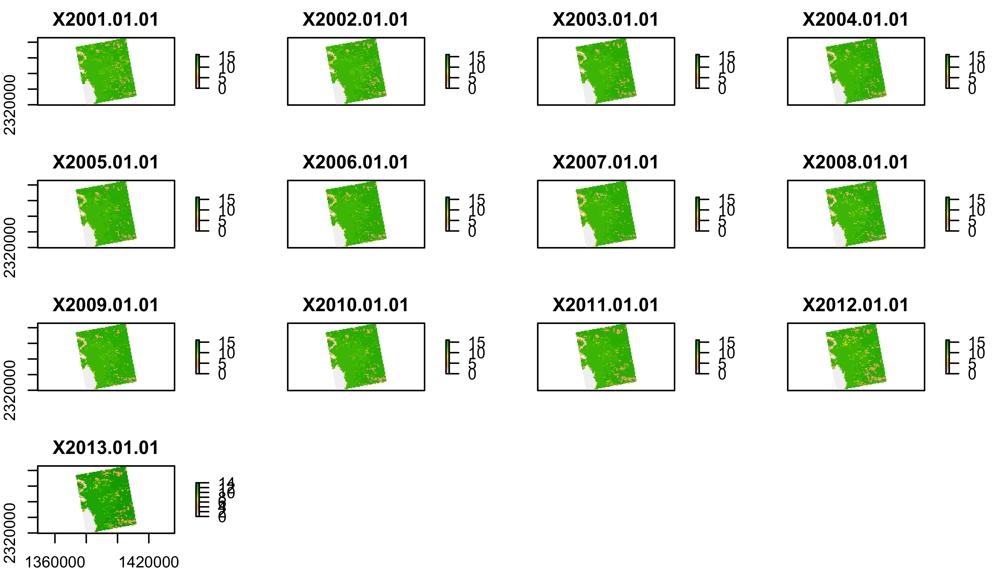
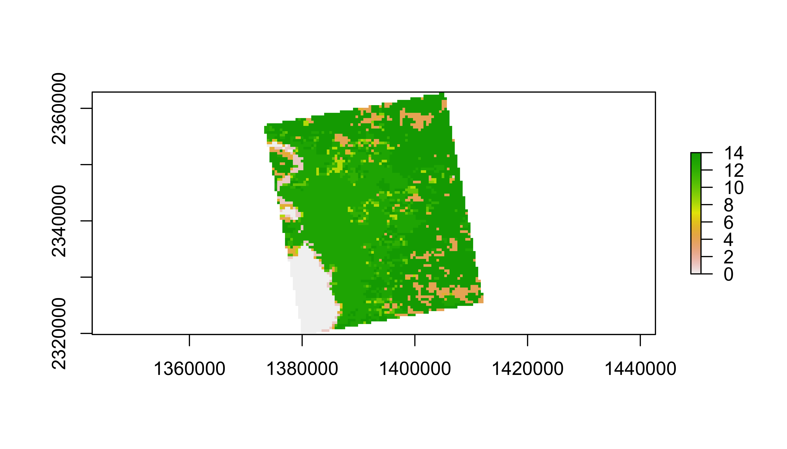
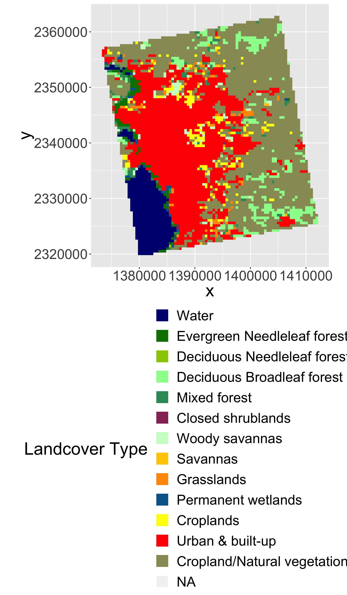
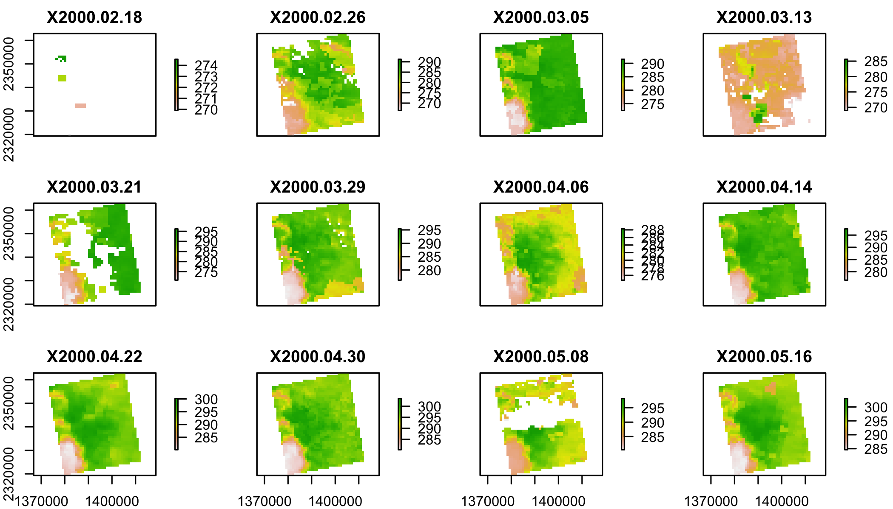
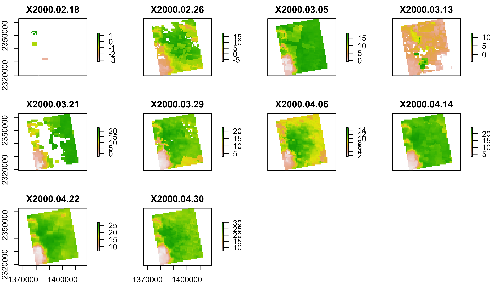
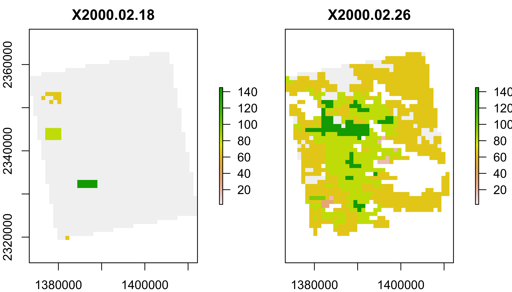
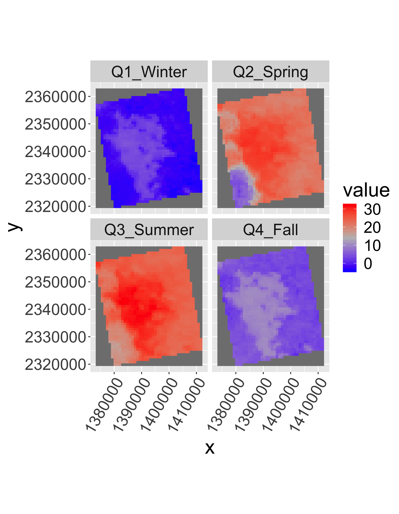
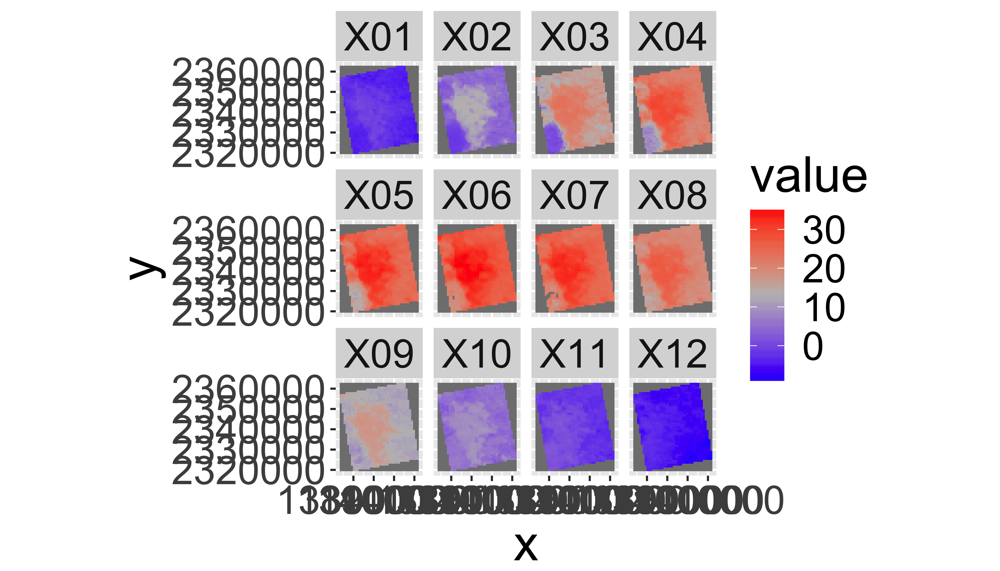
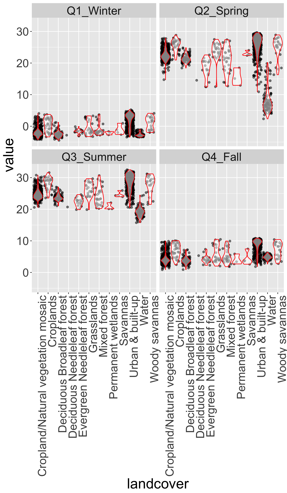

<div>
<iframe src="09_presentation/09_RemoteSensing.html" width="75%" height="400px"> </iframe>
</div>


[<i class="fa fa-file-code-o fa-3x" aria-hidden="true"></i> The R Script associated with this page is available here](scripts/09_RemoteSensing_appeears.R).  Download this file and open it (or copy-paste into a new script) with RStudio so you can follow along.  


### Libraries


```r
library(raster)
library(rasterVis)
library(rgdal)
library(ggplot2)
library(ggmap)
library(dplyr)
library(knitr)
library(tidyr)

library(DataScienceData)

# New Packages
library(gdalUtils)
library(rts)
```


## Identify (and create) download folders

Today we'll work with:

* Land Surface Temperature (`lst`): MOD11A2
* Land Cover (`lc`): MCD12Q1

## Land Use Land Cover

You will need to update the DataScienceData package before the command below will work.  Run `devtools::install_github("adammwilson/DataScienceData"); library(DataScienceData)`.  If that doesn't work, you can download the needed files directly from [here](https://github.com/adammwilson/DataScienceData/tree/master/inst/extdata/appeears).


```r
lulcf=system.file("extdata", 
                "appeears/MCD12Q1.051_aid0001.nc", 
                package = "DataScienceData")
lulcf
```

```
## [1] "/Library/Frameworks/R.framework/Versions/3.4/Resources/library/DataScienceData/extdata/appeears/MCD12Q1.051_aid0001.nc"
```

```r
#IF that doesn't work
```


```r
lulc=stack(lulcf,varname="Land_Cover_Type_1")
plot(lulc)
```

<!-- -->

We'll just pick one year to work with to keep this simple:

```r
lulc=lulc[[13]]
plot(lulc)
```

<!-- -->

### Process landcover data

Get cover clases from [MODIS website](https://lpdaac.usgs.gov/dataset_discovery/modis/modis_products_table/mcd12q1)


```r
  Land_Cover_Type_1 = c(
    Water = 0, 
    `Evergreen Needleleaf forest` = 1, 
    `Evergreen Broadleaf forest` = 2,
    `Deciduous Needleleaf forest` = 3, 
    `Deciduous Broadleaf forest` = 4,
    `Mixed forest` = 5, 
    `Closed shrublands` = 6,
    `Open shrublands` = 7,
    `Woody savannas` = 8, 
    Savannas = 9,
    Grasslands = 10,
    `Permanent wetlands` = 11, 
    Croplands = 12,
    `Urban & built-up` = 13,
    `Cropland/Natural vegetation mosaic` = 14, 
    `Snow & ice` = 15,
    `Barren/Sparsely vegetated` = 16, 
    Unclassified = 254,
    NoDataFill = 255)

lcd=data.frame(
  ID=Land_Cover_Type_1,
  landcover=names(Land_Cover_Type_1),
  col=c("#000080","#008000","#00FF00", "#99CC00","#99FF99", "#339966", "#993366", "#FFCC99", "#CCFFCC", "#FFCC00", "#FF9900", "#006699", "#FFFF00", "#FF0000", "#999966", "#FFFFFF", "#808080", "#000000", "#000000"),
  stringsAsFactors = F)
# colors from https://lpdaac.usgs.gov/about/news_archive/modisterra_land_cover_types_yearly_l3_global_005deg_cmg_mod12c1
kable(head(lcd))
```

                               ID  landcover                     col     
----------------------------  ---  ----------------------------  --------
Water                           0  Water                         #000080 
Evergreen Needleleaf forest     1  Evergreen Needleleaf forest   #008000 
Evergreen Broadleaf forest      2  Evergreen Broadleaf forest    #00FF00 
Deciduous Needleleaf forest     3  Deciduous Needleleaf forest   #99CC00 
Deciduous Broadleaf forest      4  Deciduous Broadleaf forest    #99FF99 
Mixed forest                    5  Mixed forest                  #339966 

Convert LULC raster into a 'factor' (categorical) raster.  This requires building the Raster Attribute Table (RAT).  Unfortunately, this is a bit of manual process as follows.

```r
# convert to raster (easy)
lulc=as.factor(lulc)

# update the RAT with a left join
levels(lulc)=left_join(levels(lulc)[[1]],lcd)
```

```
## Joining, by = "ID"
```


```r
# plot it
gplot(lulc)+
  geom_raster(aes(fill=as.factor(value)))+
  scale_fill_manual(values=levels(lulc)[[1]]$col,
                    labels=levels(lulc)[[1]]$landcover,
                    name="Landcover Type")+
  coord_equal()+
  theme(legend.position = "bottom")+
  guides(fill=guide_legend(ncol=1,byrow=TRUE))
```

<!-- -->

## Land Surface Temperature

```r
lstf=system.file("extdata", 
                "appeears/MOD11A2.006_aid0001.nc", 
                package = "DataScienceData")
lstf
lst=stack(lstf,varname="LST_Day_1km")
plot(lst[[1:12]])
```

<!-- -->

You may get a warning about some attributes being 8-byte converted to double precisions. You can ignore these warnings. 

## Convert LST to Degrees C 
You can convert LST from Degrees Kelvin (K) to Celcius (C) with `offs()`.


```r
offs(lst)=-273.15
plot(lst[[1:10]])
```

<!-- -->

# MODLAND Quality control

See a detailed explaination [here](https://lpdaac.usgs.gov/sites/default/files/public/modis/docs/MODIS_LP_QA_Tutorial-1b.pdf).  Some code below from [Steven Mosher's blog](https://stevemosher.wordpress.com/2012/12/05/modis-qc-bits/).

## MOD11A2 (Land Surface Temperature) Quality Control
[MOD11A2 QC Layer table](https://lpdaac.usgs.gov/dataset_discovery/modis/modis_products_table/mod11a2)


```r
lstqc=stack(lstf,varname="QC_Day")
plot(lstqc[[1:2]])
```

<!-- -->

### LST QC data

QC data are encoded in 8-bit 'words' to compress information.


```r
values(lstqc[[1:2]])%>%table()
```

```
## .
##    2   17   33   65   81   97  145 
## 1569    8    5  675  335    4   90
```


```r
intToBits(65)
```

```
##  [1] 01 00 00 00 00 00 01 00 00 00 00 00 00 00 00 00 00 00 00 00 00 00 00
## [24] 00 00 00 00 00 00 00 00 00
```

```r
intToBits(65)[1:8]
```

```
## [1] 01 00 00 00 00 00 01 00
```

```r
as.integer(intToBits(65)[1:8])
```

```
## [1] 1 0 0 0 0 0 1 0
```
#### MODIS QC data are _Big Endian_

Format          Digits              value     sum
----            ----                ----      ----
Little Endian   1 0 0 0 0 0 1 0     65        2^0 + 2^6
Big Endian      0 1 0 0 0 0 0 1     65        2^6 + 2^0


Reverse the digits with `rev()` and compare with QC table above.


```r
rev(as.integer(intToBits(65)[1:8]))
```

```
## [1] 0 1 0 0 0 0 0 1
```
QC for value `65`:

* LST produced, other quality, recommend examination of more detailed QA
* good data quality of L1B in 7 TIR bands
* average emissivity error <= 0.01
* Average LST error <= 2K


<div class="well">
## Your turn
What does a QC value of 81 represent?

<button data-toggle="collapse" class="btn btn-primary btn-sm round" data-target="#demo1">Show Solution</button>
<div id="demo1" class="collapse">

```r
rev(as.integer(intToBits(81)[1:8]))
```

```
## [1] 0 1 0 1 0 0 0 1
```

```r
# LST produced, other quality, recommend exampination of more detailed QA
# Other quality data
# Average emissivity error <= 0.01
# Average LST error <= 2K
```
</div>
</div>

### Filter the the lst data using the QC data


```r
## set up data frame to hold all combinations
QC_Data <- data.frame(Integer_Value = 0:255,
Bit7 = NA, Bit6 = NA, Bit5 = NA, Bit4 = NA,
Bit3 = NA, Bit2 = NA, Bit1 = NA, Bit0 = NA,
QA_word1 = NA, QA_word2 = NA, QA_word3 = NA,
QA_word4 = NA)

## 
for(i in QC_Data$Integer_Value){
AsInt <- as.integer(intToBits(i)[1:8])
QC_Data[i+1,2:9]<- AsInt[8:1]
}

QC_Data$QA_word1[QC_Data$Bit1 == 0 & QC_Data$Bit0==0] <- "LST GOOD"
QC_Data$QA_word1[QC_Data$Bit1 == 0 & QC_Data$Bit0==1] <- "LST Produced,Other Quality"
QC_Data$QA_word1[QC_Data$Bit1 == 1 & QC_Data$Bit0==0] <- "No Pixel,clouds"
QC_Data$QA_word1[QC_Data$Bit1 == 1 & QC_Data$Bit0==1] <- "No Pixel, Other QA"

QC_Data$QA_word2[QC_Data$Bit3 == 0 & QC_Data$Bit2==0] <- "Good Data"
QC_Data$QA_word2[QC_Data$Bit3 == 0 & QC_Data$Bit2==1] <- "Other Quality"
QC_Data$QA_word2[QC_Data$Bit3 == 1 & QC_Data$Bit2==0] <- "TBD"
QC_Data$QA_word2[QC_Data$Bit3 == 1 & QC_Data$Bit2==1] <- "TBD"

QC_Data$QA_word3[QC_Data$Bit5 == 0 & QC_Data$Bit4==0] <- "Emiss Error <= .01"
QC_Data$QA_word3[QC_Data$Bit5 == 0 & QC_Data$Bit4==1] <- "Emiss Err >.01 <=.02"
QC_Data$QA_word3[QC_Data$Bit5 == 1 & QC_Data$Bit4==0] <- "Emiss Err >.02 <=.04"
QC_Data$QA_word3[QC_Data$Bit5 == 1 & QC_Data$Bit4==1] <- "Emiss Err > .04"

QC_Data$QA_word4[QC_Data$Bit7 == 0 & QC_Data$Bit6==0] <- "LST Err <= 1"
QC_Data$QA_word4[QC_Data$Bit7 == 0 & QC_Data$Bit6==1] <- "LST Err > 2 LST Err <= 3"
QC_Data$QA_word4[QC_Data$Bit7 == 1 & QC_Data$Bit6==0] <- "LST Err > 1 LST Err <= 2"
QC_Data$QA_word4[QC_Data$Bit7 == 1 & QC_Data$Bit6==1] <- "LST Err > 4"
kable(head(QC_Data))
```


 Integer_Value   Bit7   Bit6   Bit5   Bit4   Bit3   Bit2   Bit1   Bit0  QA_word1                     QA_word2        QA_word3             QA_word4     
--------------  -----  -----  -----  -----  -----  -----  -----  -----  ---------------------------  --------------  -------------------  -------------
             0      0      0      0      0      0      0      0      0  LST GOOD                     Good Data       Emiss Error <= .01   LST Err <= 1 
             1      0      0      0      0      0      0      0      1  LST Produced,Other Quality   Good Data       Emiss Error <= .01   LST Err <= 1 
             2      0      0      0      0      0      0      1      0  No Pixel,clouds              Good Data       Emiss Error <= .01   LST Err <= 1 
             3      0      0      0      0      0      0      1      1  No Pixel, Other QA           Good Data       Emiss Error <= .01   LST Err <= 1 
             4      0      0      0      0      0      1      0      0  LST GOOD                     Other Quality   Emiss Error <= .01   LST Err <= 1 
             5      0      0      0      0      0      1      0      1  LST Produced,Other Quality   Other Quality   Emiss Error <= .01   LST Err <= 1 

### Select which QC Levels to keep

```r
keep=QC_Data[QC_Data$Bit1 == 0,]
keepvals=unique(keep$Integer_Value)
keepvals
```

```
##   [1]   0   1   4   5   8   9  12  13  16  17  20  21  24  25  28  29  32
##  [18]  33  36  37  40  41  44  45  48  49  52  53  56  57  60  61  64  65
##  [35]  68  69  72  73  76  77  80  81  84  85  88  89  92  93  96  97 100
##  [52] 101 104 105 108 109 112 113 116 117 120 121 124 125 128 129 132 133
##  [69] 136 137 140 141 144 145 148 149 152 153 156 157 160 161 164 165 168
##  [86] 169 172 173 176 177 180 181 184 185 188 189 192 193 196 197 200 201
## [103] 204 205 208 209 212 213 216 217 220 221 224 225 228 229 232 233 236
## [120] 237 240 241 244 245 248 249 252 253
```

### How many observations will be dropped?


```r
qcvals=table(values(lstqc))  # this takes a minute or two


QC_Data%>%
  dplyr::select(everything(),-contains("Bit"))%>%
  mutate(Var1=as.character(Integer_Value),
         keep=Integer_Value%in%keepvals)%>%
  inner_join(data.frame(qcvals))%>%
  kable()
```

```
## Joining, by = "Var1"
```


 Integer_Value  QA_word1                     QA_word2    QA_word3               QA_word4                   Var1   keep       Freq
--------------  ---------------------------  ----------  ---------------------  -------------------------  -----  ------  -------
             2  No Pixel,clouds              Good Data   Emiss Error <= .01     LST Err <= 1               2      FALSE    150019
            17  LST Produced,Other Quality   Good Data   Emiss Err >.01 <=.02   LST Err <= 1               17     TRUE      44552
            33  LST Produced,Other Quality   Good Data   Emiss Err >.02 <=.04   LST Err <= 1               33     TRUE      20225
            49  LST Produced,Other Quality   Good Data   Emiss Err > .04        LST Err <= 1               49     TRUE          3
            65  LST Produced,Other Quality   Good Data   Emiss Error <= .01     LST Err > 2 LST Err <= 3   65     TRUE     243391
            81  LST Produced,Other Quality   Good Data   Emiss Err >.01 <=.02   LST Err > 2 LST Err <= 3   81     TRUE     203501
            97  LST Produced,Other Quality   Good Data   Emiss Err >.02 <=.04   LST Err > 2 LST Err <= 3   97     TRUE      25897
           113  LST Produced,Other Quality   Good Data   Emiss Err > .04        LST Err > 2 LST Err <= 3   113    TRUE         32
           129  LST Produced,Other Quality   Good Data   Emiss Error <= .01     LST Err > 1 LST Err <= 2   129    TRUE         57
           145  LST Produced,Other Quality   Good Data   Emiss Err >.01 <=.02   LST Err > 1 LST Err <= 2   145    TRUE      29607
           161  LST Produced,Other Quality   Good Data   Emiss Err >.02 <=.04   LST Err > 1 LST Err <= 2   161    TRUE          3
           177  LST Produced,Other Quality   Good Data   Emiss Err > .04        LST Err > 1 LST Err <= 2   177    TRUE          5

Do you want to update the values you are keeping?

### Filter the LST Data keeping only `keepvals`

These steps take a couple minutes.  

Make logical flag to use for mask

```r
lstkeep=calc(lstqc,function(x) x%in%keepvals)
```

Plot the mask

```r
gplot(lstkeep[[4:8]])+
  geom_raster(aes(fill=as.factor(value)))+
  facet_grid(variable~.)+
  scale_fill_manual(values=c("blue","red"),name="Keep")+
  coord_equal()+
  theme(legend.position = "bottom")
```

<!-- -->


Mask the lst data using the QC data

```r
lst2=mask(lst,mask=lstkeep,maskval=0)
```


## Add Dates to Z dimension


```r
tdates=names(lst)%>%
  sub(pattern="X",replacement="")%>%
  as.Date("%Y.%m.%d")

names(lst2)=1:nlayers(lst2)
lst2=setZ(lst2,tdates)
```

## Summarize to Seasonal climatologies

Use `stackApply()` with a seasonal index.


```r
tseas=as.numeric(sub("Q","",quarters(getZ(lst2))))
tseas[1:20]
```

```
##  [1] 1 1 1 1 1 1 2 2 2 2 2 2 2 2 2 2 2 3 3 3
```

```r
lst_seas=stackApply(lst2,
                    indices = tseas,
                    mean,na.rm=T)
names(lst_seas)=c("Q1_Winter",
                  "Q2_Spring",
                  "Q3_Summer",
                  "Q4_Fall")
```


```r
gplot(lst_seas)+geom_raster(aes(fill=value))+
  facet_wrap(~variable)+
  scale_fill_gradientn(colours=c("blue",mid="grey","red"))+
  coord_equal()+
  theme(axis.text.x=element_text(angle=60, hjust=1))
```

<!-- -->


<div class="well">
## Your turn
Use `stackApply()` to generate and plot monthly median lst values.

Hints:

1. First make a tmonth variable by converting the dates to months using `format(getZ(lst2),"%m")`
2. Use `stackApply()` to summarize the mean value per month
3. Rename the layers by the number of the months with `sprintf("%02d",1:12)`
4. Plot it like above.

<button data-toggle="collapse" class="btn btn-primary btn-sm round" data-target="#demo2">Show Solution</button>
<div id="demo2" class="collapse">


```r
tmonth=as.numeric(format(getZ(lst2),"%m"))

lst_month=stackApply(lst2,indices = tmonth,mean,na.rm=T)
names(lst_month)=sprintf("%02d",1:12)

gplot(lst_month)+geom_raster(aes(fill=value))+
  facet_wrap(~variable)+
  scale_fill_gradientn(colours=c("blue",mid="grey","red"))+
  coord_equal()
```

<!-- -->

</div>
</div>

## Extract timeseries for a point


```r
lw=SpatialPoints(
  data.frame(
    x= -78.791547,
    y=43.007211))

projection(lw)="+proj=longlat"

lw=spTransform(lw,projection(lst2))

lwt=data.frame(date=getZ(lst2),
                 lst=t(raster::extract(
                   lst2,lw,
                   buffer=1000,
                   fun=mean,na.rm=T)))

ggplot(lwt,aes(x=date,y=lst))+
  geom_path()
```

<!-- -->

See the `library(rts)` for more timeseries related functions.

## Combine Land Cover and LST data

### Resample `lc` to `lst` grid


```r
lulc2=resample(lulc,
             lst,
             method="ngb")

par(mfrow=c(1,2)) 
plot(lulc)
plot(lulc2)
```

<!-- -->

```r
par(mfrow=c(1,1))
```

### Summarize mean monthly temperatures by Landcover


```r
table(values(lulc))
```

```
## 
##    0    1    3    4    5    6    8    9   10   11   12   13   14 
##  442  100    1  366  110    3   93   16   92   27  188 1937 2405
```

Extract values from `lst` and `lc` rasters.  


```r
lcds1=cbind.data.frame(
  values(lst_seas),
  ID=values(lulc2[[1]]))%>%
  na.omit()
head(lcds1)
```

```
##    Q1_Winter Q2_Spring Q3_Summer  Q4_Fall ID
## 32 -2.034468  21.13800  23.62361 3.407931 14
## 33 -2.988242  21.74920  24.38600 2.921228 14
## 34 -2.988242  21.74920  24.38600 2.921228 14
## 35 -2.920889  21.19727  24.72065 3.739836 14
## 69 -1.810625  21.19667  23.47727 4.118955 14
## 70 -1.810625  21.19667  23.47727 4.118955 14
```

Melt table and add LandCover Name

```r
lcds2=lcds1%>%
  gather(key="season", value = "value", -ID)%>%
  mutate(ID=as.numeric(ID))%>%
  left_join(lcd)
```

```
## Joining, by = "ID"
```

```r
head(lcds2)
```

```
##   ID    season     value                          landcover     col
## 1 14 Q1_Winter -2.034468 Cropland/Natural vegetation mosaic #999966
## 2 14 Q1_Winter -2.988242 Cropland/Natural vegetation mosaic #999966
## 3 14 Q1_Winter -2.988242 Cropland/Natural vegetation mosaic #999966
## 4 14 Q1_Winter -2.920889 Cropland/Natural vegetation mosaic #999966
## 5 14 Q1_Winter -1.810625 Cropland/Natural vegetation mosaic #999966
## 6 14 Q1_Winter -1.810625 Cropland/Natural vegetation mosaic #999966
```

#### Explore LST distributions by landcover


```r
ggplot(lcds2,aes(y=value,x=landcover,group=landcover))+
  facet_wrap(~season)+
  geom_point(alpha=.5,position="jitter")+
  geom_violin(alpha=.5,col="red",scale = "width")+
  theme(axis.text.x=element_text(angle=90, hjust=1))
```

<!-- -->


### Use Zonal Statistics to calculate summaries

```r
lct.mean=raster::zonal(lst_seas,
               lulc2,
               'mean',na.rm=T)%>%
  data.frame()

lct.sd=zonal(lst_seas,
             lulc2,
             'sd',na.rm=T)%>%
  data.frame()

lct.count=zonal(lst_seas,
                lulc2,
                'count',na.rm=T)%>%
  data.frame()

lct.summary=rbind(data.frame(lct.mean,var="mean"),
                  data.frame(lct.sd,var="sd"),
                  data.frame(lct.count,var="count"))
```

#### Summarize seasonal values

```r
lctl=gather(lct.summary, key="season", value="value", -var, -zone)

lctl$season=factor(lctl$season,
                   labels=c("Winter","Spring","Summer","Fall"),
                   ordered=T)
lctl$zone=names(Land_Cover_Type_1)[lctl$zone+1]
lctl=spread(lctl,var,value="value")
head(lctl)%>%kable()
```


zone                                 season          mean         sd   count
-----------------------------------  -------  -----------  ---------  ------
Cropland/Natural vegetation mosaic   Winter    -2.0048730   1.327939     604
Cropland/Natural vegetation mosaic   Spring    22.3728885   1.666208     604
Cropland/Natural vegetation mosaic   Summer    24.6869429   1.508810     604
Cropland/Natural vegetation mosaic   Fall       4.1466454   1.464234     604
Croplands                            Winter     0.5054175   2.069207      37
Croplands                            Spring    25.5365570   1.922899      37

## Build summary table

```r
filter(lctl,count>=100)%>%
  mutate(txt=paste0(round(mean,2),
                    " (±",round(sd,2),")"))%>%
  dplyr::select(zone,count,txt,season)%>%
  spread(season, txt)%>%
  kable()
```


zone                                  count  Winter          Spring          Summer          Fall         
-----------------------------------  ------  --------------  --------------  --------------  -------------
Cropland/Natural vegetation mosaic      604  -2 (±1.33)      22.37 (±1.67)   24.69 (±1.51)   4.15 (±1.46) 
Deciduous Broadleaf forest              105  -2.5 (±1.01)    21.45 (±1.21)   23.73 (±1.04)   3.81 (±1.11) 
Urban & built-up                        476  2.09 (±2.07)    25.55 (±3.22)   28.54 (±2.65)   8.48 (±2.08) 
Water                                   118  -2.65 (±0.62)   8.35 (±4.07)    19.09 (±1.45)   4.83 (±0.69) 

<div class="well">
## Your turn
Calculate the  maximum observed seasonal average lst in each land cover type.  
Hints:

1. First use `zonal()` of `lst_seas` and `lulc2` to calculate the `max()` with `na.rm=T`
2. convert the output to a `data.frame()`
3. use `arrange()` to sort by `desc(max)`
4. use `kable()` if desired to make it print nicely.

<button data-toggle="collapse" class="btn btn-primary btn-sm round" data-target="#demo3">Show Solution</button>
<div id="demo3" class="collapse">

```r
zonal(max(lst_seas),lulc2,'max',na.rm=T)%>%
  data.frame()%>%
  arrange(desc(max))%>%
  kable()
```


 zone        max
-----  ---------
   13   32.48299
   12   31.59969
    8   31.18989
   14   30.78560
    5   30.67597
   10   29.66600
    4   27.02374
    9   25.93245
    1   24.63437
    0   24.45286
   11   22.06022
    3   20.70795

</div>
</div>


Things to think about:

* What tests would you use to identify differences?
* Do you need to worry about unequal sample sizes?

