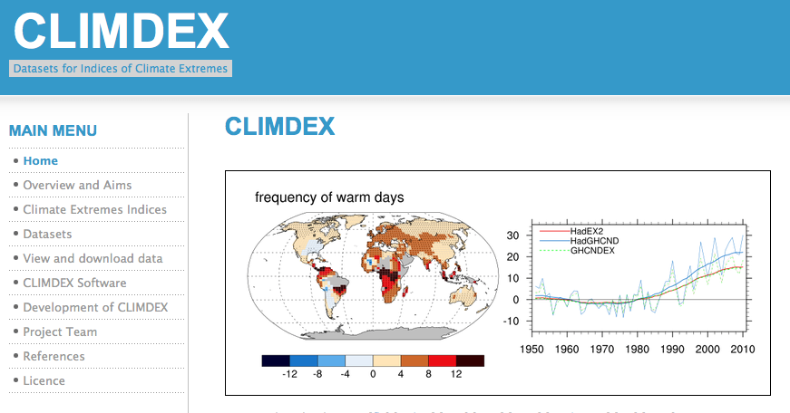

```{r, echo=FALSE, message=FALSE, results='hide', purl=FALSE}
## This chunk automatically generates a text .R version of this script when running within knitr.  You do not need to run this...
input  = knitr::current_input()  # filename of input document
output = paste(tools::file_path_sans_ext(input), 'R', sep = '.')
knitr::purl(input,output,documentation=2,quiet=T)
source("knitr_header.R")
knitr::opts_chunk$set(eval=T)
```

[<i class="fa fa-file-code-o fa-3x" aria-hidden="true"></i> The R Script associated with this page is available here](`r output`).  Download this file and open it (or copy-paste into a new script) with RStudio so you can follow along.  

# Summary

* Access and work with station weather data from Global Historical Climate Network (GHCN)  
* Explore options for plotting timeseries
* Trend analysis
* Compute Climate Extremes

# Climate Metrics

## Climate Metrics: ClimdEX
Indices representing extreme aspects of climate derived from daily data:



Climate Change Research Centre (CCRC) at University of New South Wales (UNSW) ([climdex.org](http://www.climdex.org)).  

### 27 Core indices

For example:

* **FD** Number of frost days: Annual count of days when TN (daily minimum temperature) < 0C.
* **SU** Number of summer days: Annual count of days when TX (daily maximum temperature) > 25C.
* **ID** Number of icing days: Annual count of days when TX (daily maximum temperature) < 0C.
* **TR** Number of tropical nights: Annual count of days when TN (daily minimum temperature) > 20C.
* **GSL** Growing season length: Annual (1st Jan to 31st Dec in Northern Hemisphere (NH), 1st July to 30th June in Southern Hemisphere (SH)) count between first span of at least 6 days with daily mean temperature TG>5C and first span after July 1st (Jan 1st in SH) of 6 days with TG<5C.
* **TXx** Monthly maximum value of daily maximum temperature
* **TN10p** Percentage of days when TN < 10th percentile
* **Rx5day** Monthly maximum consecutive 5-day precipitation
* **SDII** Simple pricipitation intensity index


# Weather Data

### Climate Data Online


### GHCN 


## Options for downloading data

### `FedData` package

* National Elevation Dataset digital elevation models (1 and 1/3 arc-second; USGS)
* National Hydrography Dataset (USGS)
* Soil Survey Geographic (SSURGO) database 
* International Tree Ring Data Bank.
* *Global Historical Climatology Network* (GHCN)

### NOAA API


[National Climatic Data Center application programming interface (API)]( http://www.ncdc.noaa.gov/cdo-web/webservices/v2). 

### `rNOAA` package

Handles downloading data directly from NOAA APIv2.

* `buoy_*`  NOAA Buoy data from the National Buoy Data Center
* `ghcnd_*`  GHCND daily data from NOAA
* `isd_*` ISD/ISH data from NOAA
* `homr_*` Historical Observing Metadata Repository
* `ncdc_*` NOAA National Climatic Data Center (NCDC)
* `seaice` Sea ice
* `storm_` Storms (IBTrACS)
* `swdi` Severe Weather Data Inventory (SWDI)
* `tornadoes` From the NOAA Storm Prediction Center

---

### Libraries

```{r,results='hide',message=FALSE}
library(raster)
library(sp)
library(rgdal)
library(ggplot2)
library(ggmap)
library(dplyr)
library(tidyr)
library(maps)
# New Packages
library(rnoaa)
library(climdex.pcic)
library(zoo)
library(reshape2)
```

### Station locations 

Download the GHCN station inventory with `ghcnd_stations()`.  

```{r}
datadir="data"

st = ghcnd_stations()

## Optionally, save it to disk
# write.csv(st,file.path(datadir,"st.csv"))
## If internet fails, load the file from disk using:
# st=read.csv(file.path(datadir,"st.csv"))
```

### GHCND Variables

5 core values:

* **PRCP** Precipitation (tenths of mm)
* **SNOW** Snowfall (mm)
* **SNWD** Snow depth (mm)
* **TMAX** Maximum temperature
* **TMIN** Minimum temperature

And ~50 others!  For example:

* **ACMC** Average cloudiness midnight to midnight from 30-second ceilometer 
* **AWND** Average daily wind speed
* **FMTM** Time of fastest mile or fastest 1-minute wind
* **MDSF** Multiday snowfall total


### `filter()` to temperature and precipitation
```{r}
st=dplyr::filter(st,element%in%c("TMAX","TMIN","PRCP"))
```

### Map GHCND stations

First, get a global country polygon
```{r, warning=F}
worldmap=map("world",fill=T,plot=F)
```

Plot all stations:
```{r}
ggplot() +
  facet_wrap(~element)+
  geom_point(aes(y=latitude,x=longitude),data=st,size=.75,col="red")+
  geom_path(aes(x=long,y=lat,group=group,order=order),data=fortify(worldmap),size=.5)+
  coord_equal()
```

It's hard to see all the points, let's bin them...

```{r}
ggplot(st,aes(y=latitude,x=longitude)) +
  facet_wrap(~element)+
  stat_bin2d(bins=75)+
  scale_fill_gradient(low="yellow",high="red",trans="log",
                       breaks = c(1,10,100,1000))+
  geom_path(aes(x=long,y=lat,group=group,order=order),data=fortify(worldmap),size=.5)+
  coord_equal()
```

## Your turn

Produce a binned map (like above) with the following modifications:

* include only stations with data between 1950 and 2000
* include only `tmax`

```{r, purl=F}
ggplot(filter(st,
              first_year<=1950 & 
              last_year>=2000 & 
              element=="TMAX"),
       aes(y=latitude,x=longitude)) +
  stat_bin2d(bins=75)+
  scale_fill_gradient(
    low="yellow",high="red",
    trans="log",
    breaks = c(1,10,50))+
  geom_path(aes(x=long,
        y=lat,group=group,
        order=order),
        data=fortify(worldmap),
        size=.5)+
  coord_equal()
```

## Download daily data from GHCN

`ghcnd()` will download a `.dly` file for a particular station.  But how to choose?

```{r}
coords=as.matrix(geocode("Buffalo, NY"))
coords
```

```{r}
dplyr::filter(st,
              grepl("BUFFALO",name)&
              between(latitude,coords[2]-1,coords[2]+1) &
              between(longitude,coords[1]-1,coords[1]+1)&
         element=="TMAX")

d=meteo_tidy_ghcnd("USW00014733",keep_flags=T,var = c("TMAX","TMIN","PRCP"))
head(d)
```
Could also filter using `over()` in sp package...

See [CDO Description](http://www1.ncdc.noaa.gov/pub/data/cdo/documentation/GHCND_documentation.pdf) and raw [GHCND metadata](http://www1.ncdc.noaa.gov/pub/data/ghcn/daily/readme.txt) for more details.

### Quality Control: MFLAG

Measurement Flag/Attribute

* **Blank** no measurement information applicable
* **B** precipitation total formed from two twelve-hour totals
* **H** represents highest or lowest hourly temperature (TMAX or TMIN) or average of hourly values (TAVG)
* **K** converted from knots
* ...

See [CDO Description](http://www1.ncdc.noaa.gov/pub/data/cdo/documentation/GHCND_documentation.pdf) 

### Quality Control: QFLAG

* **Blank** did not fail any quality assurance check 
* **D** failed duplicate check
* **G** failed gap check
* **K** failed streak/frequent-value check
* **N** failed naught check
* **O** failed climatological outlier check
* **S** failed spatial consistency check
* **T** failed temporal consistency check
* **W** temperature too warm for snow
* ...

See [CDO Description](http://www1.ncdc.noaa.gov/pub/data/cdo/documentation/GHCND_documentation.pdf) 

### Quality Control: SFLAG

Indicates the source of the data...

#### Filter with QC data and change units
```{r}
d3=d2%>%
  filter( 
    qflag==" " &
    var%in%c("tmax","tmin","prcp"))%>%                            # drop bad QC values
  mutate(val=ifelse(val==-9999,NA,val))%>%
  mutate(val=ifelse(var%in%c("tmax","tmin"), val/10,val))%>%  # convert to degrees C
  arrange(var,date)
```

## Summarize QC flags

Summarize the QC flags.  How many of which type are there?  Should we be more conservative?

```{r}
table(d3$mflag,d3$var)  
```
* **T** failed temporal consistency check


### Reshape by variable for easy plotting
use `reshape2::dcast()` for flexible reshaping of data sets.  

```{r}
d3b=dcast(d3,id+date~var,value.var="val")%>%
  arrange(date)%>%
  na.omit() 
head(d3b)
```
Use `melt()` to _undo_ a `cast()`


Plot temperatures
```{r}
ggplot(d3b,
       aes(ymax=tmax,ymin=tmin,x=date))+
  geom_ribbon(col="grey")+
  geom_line(aes(y=(tmax+tmin)/2),col="red")
```

Limit to a few years.
```{r}
ggplot(filter(d3b,date>as.Date("2014-01-01")),
       aes(ymax=tmax,ymin=tmin,x=date))+
  geom_ribbon(col="grey")+
  geom_line(aes(y=(tmax+tmin)/2),col="red")
```

### Zoo package for rolling functions

Infrastructure for Regular and Irregular Time Series (Z's Ordered Observations)

* `rollmean()`:  Rolling mean
* `rollsum()`:   Rolling sum
* `rollapply()`:  Custom functions

Use rollmean to calculate a rolling 60-day average. 

* `align` whether the index of the result should be left- or right-aligned or centered

```{r}
d4 = d3b %>% 
  arrange(date) %>%
  mutate(tmax.60 = rollmean(x = tmax, 60, align = "center", fill = NA),
         tmax.b60 = rollmean(x = tmax, 60, align = "right", fill = NA))
```

```{r}
ggplot(filter(d4,date>as.Date("2014-01-01")),
       aes(ymax=tmax,ymin=tmin,x=date))+
  geom_ribbon(fill="grey")+
  geom_line(aes(y=(tmin+tmax)/2),col=grey(0.4),size=.5)+
  geom_line(aes(y=tmax.60),col="red")+
  geom_line(aes(y=tmax.b60),col="darkred")
```

## Your Turn

Plot a 30-day rolling "right" aligned sum of precipitation.

```{r, purl=F}
tp=d3b %>%
  arrange(date)  %>% 
  mutate(prcp.30 = rollsum(x = prcp, 30, align = "right", fill = NA))

ggplot(tp,aes(y=prcp,x=date))+
  geom_line(aes(y=prcp.30),col="black")+ 
  geom_line(col="red") 

```


# Time Series analysis

Most timeseries functions use the time series class (`ts`)

```{r}
tmin.ts=ts(d3b$tmin,deltat=1/365)
```

## Temporal autocorrelation

Values are highly correlated!

```{r}
ggplot(d3b,aes(y=tmax,x=lag(tmax)))+
  geom_point()+
  geom_abline(intercept=0, slope=1)
```

### Autocorrelation functions

* autocorrelation  $x$ vs. $x_{t-1}$  (lag=1)
* partial autocorrelation.  $x$  vs. $x_{n}$ _after_ controlling for correlations $\in t-1:n$


#### Autocorrelation
```{r}
acf(tmin.ts,lag.max = 365*3)
```

#### Partial Autocorrelation
```{r}
pacf(tmin.ts,lag.max = 365*3)
```


### Seasonal decomposition
Decompose data into seasonal, trend, and remaining components.

```{r}
seasd = stl(tmin.ts,"periodic",t.window=365*10)
plot(seasd)
```

## Your Turn
Compute the seasonal decomposition for precipitation

```{r, purl=F}
prcp.ts=ts(d3b$prcp,deltat=1/365) 
pseasd = stl(prcp.ts,"periodic",t.window=365*10)
plot(pseasd) 
```

# Checking for significant trends

## Compute temporal aggregation indices

### Group by month, season, year, and decade.

How to convert years into 'decades'?
```{r}
1938
round(1938,-1)
floor(1938/10)*10
```


```{r}
d5=d4%>%
  mutate(month=as.numeric(format(date,"%m")),
        year=as.numeric(format(date,"%Y")),
        season=ifelse(month%in%c(12,1,2),"Winter",
            ifelse(month%in%c(3,4,5),"Spring",
              ifelse(month%in%c(6,7,8),"Summer",
                ifelse(month%in%c(9,10,11),"Fall",NA)))),
        dec=(floor(as.numeric(format(date,"%Y"))/10)*10))
head(d5)
```

## Timeseries models


How to assess change? Simple differences?

```{r}
d5%>%
  mutate(period=ifelse(year<=1976-01-01,"early","late"))%>%
  group_by(period)%>%
  summarize(n=n(),tmin=mean(tmin),tmax=mean(tmax),prcp=mean(prcp))
```

#### Maximum Temperature
```{r}
library(EnvStats)

seasonal=d5%>%
  group_by(year,season)%>%
  summarize(n=n(),tmin=mean(tmin),tmax=mean(tmax),prcp=mean(prcp))%>%
  filter(n>75)

ggplot(seasonal,aes(y=tmin,x=year))+
  facet_wrap(~season,scales = "free_y")+
  stat_smooth(method="lm", se=T)+
  geom_line()
```

### Kendal Seasonal Trend Test

Nonparametric seasonal trend analysis. 

e.g. [Hirsch-Slack test](http://onlinelibrary.wiley.com/doi/10.1029/WR020i006p00727)

```{r}
t1=kendallSeasonalTrendTest(tmax~season+year,data=seasonal)
t1
```

#### Minimum Temperature
```{r}
t2=kendallSeasonalTrendTest(tmin~season+year,data=seasonal)
t2
```

### Autoregressive models
See [Time Series Analysis Task View](https://cran.r-project.org/web/views/TimeSeries.html) for summary of available packages/models. 

* Moving average (MA) models
* autoregressive (AR) models
* autoregressive moving average (ARMA) models
* frequency analysis
* Many, many more...

-------

# Climate Metrics

### Climdex indices
[ClimDex](http://www.climdex.org/indices.html)

###  Format data for `climdex`

```{r}
library(PCICt)
    ## Parse the dates into PCICt.
    pc.dates <- as.PCICt(as.POSIXct(d5$date),cal="gregorian")
```


### Generate the climdex object
```{r}
  library(climdex.pcic)
    ci <- climdexInput.raw(
      tmax=d5$tmax,tmin=d5$tmin,prec=d5$prcp,
      pc.dates,pc.dates,pc.dates, 
      base.range=c(1971, 2000))
```

### Cumulative dry days

```{r}
cdd= climdex.cdd(ci, spells.can.span.years = TRUE)
plot(cdd~as.numeric(names(cdd)),type="l")
```

### Diurnal Temperature Range

```{r}
dtr=climdex.dtr(ci, freq = c("annual"))
plot(dtr,type="l")
```

### Frost Days

```{r}
fd=climdex.fd(ci)
plot(fd,type="l")
```

## Your Turn

See all available indices with:
```{r}
climdex.get.available.indices(ci)
```

Select 3 indices and use the `kendallSeasonalTrendTest()` to assess trends over the available data period.  


```{r}
dtr=climdex.dtr(ci,freq = "annual")
plot(dtr,type="l")

dtr=climdex.dtr(ci,freq = "monthly")
plot(dtr,type="l")


dtrf=as.data.frame(dtr)
dtrf$date=as.Date(paste0(
  rownames(dtrf),"-15"),"%Y-%m-%d")
dtrf$month=as.numeric(format(dtrf$date,"%m"))
dtrf$year=as.numeric(format(dtrf$date,"%Y"))

kendallSeasonalTrendTest(
  dtr~month+year,data=dtrf)
```