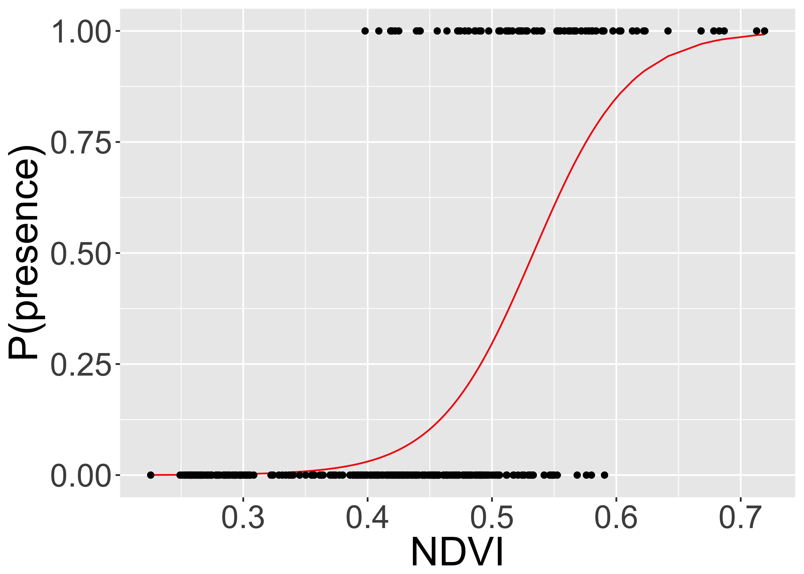
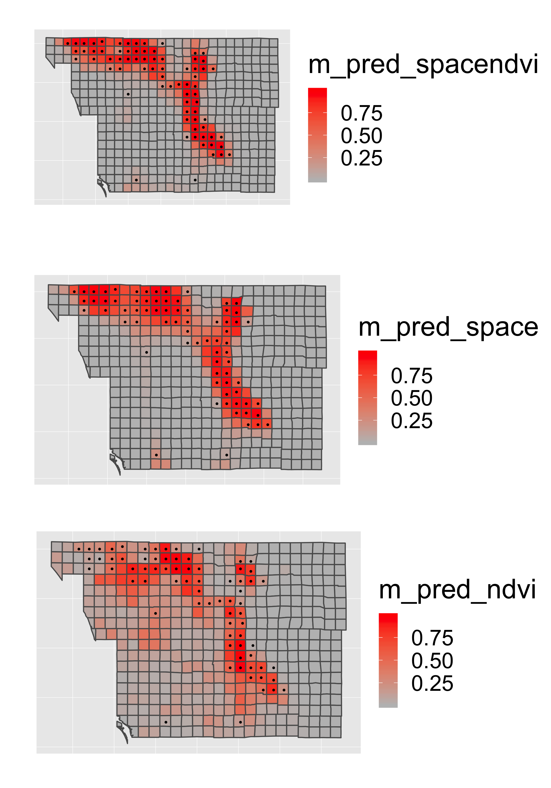
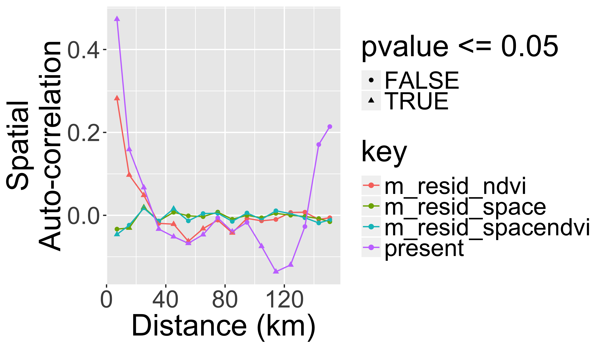

[<i class="fa fa-file-code-o fa-3x" aria-hidden="true"></i> The R Script associated with this page is available here](scripts/13_SDM_Exercise.R).  Download this file and open it (or copy-paste into a new script) with RStudio so you can follow along.  

 

```r
library(knitr)
library(raster)
library(rasterVis)
library(dplyr)
library(ggplot2)
# devtools::install_github("dkahle/ggmap")
library(ggmap)
library(rgdal)
library(rgeos)
library(tidyr)
library(sf)
library(leaflet)
library(DT)
library(widgetframe)

## New Packages
library(mgcv) # package for Generalized Additive Models
library(ncf) # has an easy function for correlograms
library(grid)
library(gridExtra)
library(xtable)
library(maptools)
```

## Goal of this class

* To demonstrate a simple presence/absence modelling in spatial context. 
* To model spatial dependence (autocorrelation) in the response. 
  
Overview of [R's spatial toolset is here](http://cran.r-project.org/web/views/Spatial.html).

Note: this is _not_ meant to be an exhaustive introduction to species distribution modelling.
  
## Modeling spatial autocorrelation
  
Today we will model space by **smooth splines** in `mgcv` package. 
  
Examples of Alternative approaches:

  - Simple polynomials
  - Eigenvector Mapping: ```vegan```, ```spdep```
  - Predictive process: ```spbayes```
  
Methods that tweak variance-covariance matrix of **Multivariate Normal Distribution**:

  - Generalized Least Squares: ```MASS```, ```nlme```
  - Autoregressive Models: ```spdep```
  - GeoBUGS module in OpenBUGS
  
See [Dormann et al. 2007 Ecography, 30: 609-628](http://onlinelibrary.wiley.com/doi/10.1111/j.2007.0906-7590.05171.x/full) for a review.

## Species Distribution Modeling

We'll attempt to explain the spatial distribution of the Purple finch (_Carpodacus purpureus_) in San Diego county, California:


(photo/Wikimedia)

## Preparing the data

Load a vector dataset (shapefile) representing the [San Diego bird atlas data](http://sdplantatlas.org/BirdAtlas/BirdPages.htm) for the Purple finch:


```r
finch <- read_sf(system.file("extdata", "finch", 
                package = "DataScienceData"),
                layer="finch")

st_crs(finch)="+proj=utm +zone=11 +ellps=GRS80 +datum=NAD83 +units=m +no_defs "
```


### Plot the shapefile
Plot the finch dataset in leaflet.


```r
st_transform(finch,"+proj=longlat +datum=WGS84")%>%
  leaflet() %>% addTiles() %>%
  addPolygons()%>%
  frameWidget(height=400)
```

<!--html_preserve--><div id="htmlwidget-258c00cfc3e0ae254df0" style="width:100%;height:400px;" class="widgetframe html-widget"></div>
<script type="application/json" data-for="htmlwidget-258c00cfc3e0ae254df0">{"x":{"url":"13_SDM_Exercise_files/figure-html//widgets/widget_unnamed-chunk-4.html","options":{"xdomain":"*","allowfullscreen":false,"lazyload":false}},"evals":[],"jsHooks":[]}</script><!--/html_preserve-->


But we can do better than that.  Let's add a couple layers and an overview map.


```r
st_transform(finch,"+proj=longlat +datum=WGS84")%>%
  leaflet() %>% addTiles() %>%
  addPolygons(label=paste(finch$BLOCKNAME," (NDVI=",finch$ndvi,")"),
              group = "NDVI",
              color = "#444444", 
              weight = 0.1, 
              smoothFactor = 0.5,
              opacity = 1.0, 
              fillOpacity = 0.5,
              fillColor = ~colorQuantile("YlOrRd", ndvi)(ndvi),
              highlightOptions = highlightOptions(color = "white", weight = 2,
                bringToFront = TRUE)) %>%
    addPolygons(label=paste(finch$BLOCKNAME," (NDVI=",finch$ndvi,")"),
              group = "Presence/Absence",
              color = "#444444", 
              weight = 0.1, 
              smoothFactor = 0.5,
              opacity = 1.0, 
              fillOpacity = 0.5,
              fillColor = ifelse(finch$present,"red","transparent"),
              highlightOptions = highlightOptions(color = "white", weight = 2,
                bringToFront = TRUE)) %>%
  addLayersControl(
    baseGroups = c("NDVI", "Presence/Absence"),
    options = layersControlOptions(collapsed = FALSE)
  )%>%
addMiniMap()%>%
  frameWidget(height = 600)
```

<!--html_preserve--><div id="htmlwidget-3e134d312ef9ad1c42f5" style="width:100%;height:600px;" class="widgetframe html-widget"></div>
<script type="application/json" data-for="htmlwidget-3e134d312ef9ad1c42f5">{"x":{"url":"13_SDM_Exercise_files/figure-html//widgets/widget_unnamed-chunk-5.html","options":{"xdomain":"*","allowfullscreen":false,"lazyload":false}},"evals":[],"jsHooks":[]}</script><!--/html_preserve-->

<div class="well">
## Your turn

Explore the other variables in the `finch` dataset with `summary(finch)`.  Build on the map above to add the mean elevation (`meanelev`) in each polygon as an additional layer.

<button data-toggle="collapse" class="btn btn-primary btn-sm round" data-target="#demo1">Show Solution</button>
<div id="demo1" class="collapse">


```r
st_transform(finch,"+proj=longlat +datum=WGS84")%>%
  leaflet() %>% addTiles() %>%
  addPolygons(label=paste(finch$BLOCKNAME," (NDVI=",finch$ndvi,")"),
              group = "NDVI",
              color = "#444444", 
              weight = 0.1, 
              smoothFactor = 0.5,
              opacity = 1.0, 
              fillOpacity = 0.5,
              fillColor = ~colorQuantile("YlOrRd", ndvi)(ndvi),
              highlightOptions = highlightOptions(color = "white", weight = 2,
                bringToFront = TRUE)) %>%
  addPolygons(label=paste(finch$BLOCKNAME," (Elevation=",finch$meanelev,")"),
              group = "Elevation",
              color = "#444444", 
              weight = 0.1, 
              smoothFactor = 0.5,
              opacity = 1.0, 
              fillOpacity = 0.5,
              fillColor = ~colorQuantile("YlOrRd", meanelev)(meanelev),
              highlightOptions = highlightOptions(color = "white", weight = 2,
                bringToFront = TRUE)) %>%
    addPolygons(label=paste(finch$BLOCKNAME," (NDVI=",finch$ndvi,")"),
              group = "Presence/Absence",
              color = "#444444", 
              weight = 0.1, 
              smoothFactor = 0.5,
              opacity = 1.0, 
              fillOpacity = 0.5,
              fillColor = ifelse(finch$present,"red","transparent"),
              highlightOptions = highlightOptions(color = "white", weight = 2,
                bringToFront = TRUE)) %>%
  addLayersControl(
    baseGroups = c("NDVI", "Elevation","Presence/Absence"),
    options = layersControlOptions(collapsed = FALSE)
  )%>%
addMiniMap()%>%
  frameWidget(height=600)
```

<!--html_preserve--><div id="htmlwidget-2c32d5e7ce076ebaeb1f" style="width:100%;height:600px;" class="widgetframe html-widget"></div>
<script type="application/json" data-for="htmlwidget-2c32d5e7ce076ebaeb1f">{"x":{"url":"13_SDM_Exercise_files/figure-html//widgets/widget_unnamed-chunk-6.html","options":{"xdomain":"*","allowfullscreen":false,"lazyload":false}},"evals":[],"jsHooks":[]}</script><!--/html_preserve-->
</div>
</div>


You could also visualize these data with multiple ggplot panels:

```r
p1=ggplot(finch) +
    scale_fill_gradient2(low="blue",mid="grey",high="red")+
    coord_equal()+
    ylab("")+xlab("")+
     theme(legend.position = "right")+
    theme(axis.ticks = element_blank(), axis.text = element_blank())

p1a=p1+geom_sf(aes(fill = ndvi))
```

```
## Coordinate system already present. Adding new coordinate system, which will replace the existing one.
```

```r
p1b=p1+geom_sf(aes(fill = meanelev))
```

```
## Coordinate system already present. Adding new coordinate system, which will replace the existing one.
```

```r
p1c=p1+geom_sf(aes(fill = urban))
```

```
## Coordinate system already present. Adding new coordinate system, which will replace the existing one.
```

```r
p1d=p1+geom_sf(aes(fill = maxtmp))
```

```
## Coordinate system already present. Adding new coordinate system, which will replace the existing one.
```

```r
grid.arrange(p1a,p1b,p1c,p1d,ncol=1)  
```

<!-- -->


## Explore the data
Now look at the associated data frame (analogous to the *.dbf file that accompanies a shapefile):

```r
datatable(finch, options = list(pageLength = 5))%>%
  frameWidget(height=400)
```

<!--html_preserve--><div id="htmlwidget-ad2b290eee7ba4ca4b9b" style="width:100%;height:400px;" class="widgetframe html-widget"></div>
<script type="application/json" data-for="htmlwidget-ad2b290eee7ba4ca4b9b">{"x":{"url":"13_SDM_Exercise_files/figure-html//widgets/widget_unnamed-chunk-8.html","options":{"xdomain":"*","allowfullscreen":false,"lazyload":false}},"evals":[],"jsHooks":[]}</script><!--/html_preserve-->

> Note: in your final projects, don't simply print out large tables or outputs...  Filter/select only data relevent to tell your 'story'...

## Scaling and centering the environmental variables
Statistical models generally perform better when covariates have a mean of zero and variance of 1.  We can quickly calculate this using the `scale()` function:

First let's select only the columns we will use for modeling.

```r
finch=mutate(finch,ndvi_scaled=as.numeric(scale(ndvi)))
```

## Fitting the models

Compare three models:

1. Only NDVI
2. Only Space
3. Space and NDVI


### Model 1 - only NDVI

Now we will do the actual modelling. The first simple model links the probability of a presences or absences to NDVI.

$$ \log(p_i/1-p_i)=\beta_0+\beta_1 NDVI_i $$
$$ o_i \sim Bernoulli(p_i) $$

> Note: this assumes residuals are _iid_ (independent and identically distributed).  

It can be fitted by simple glm() in R:

```r
  ndvi.only <- glm(present~ndvi_scaled, 
                   data=finch, family="binomial")
```

Extract predictions and residuals:


```r
  finch$m_pred_ndvi <- predict(ndvi.only, type="response")
  finch$m_resid_ndvi <- residuals(ndvi.only)
```


Plot the estimated logistic curve:

```r
ggplot(finch,aes(x=ndvi/256,y=m_pred_ndvi))+
  geom_line(col="red")+ 
  geom_point(mapping=aes(y=present))+
  xlab("NDVI")+
  ylab("P(presence)")
```

<!-- -->

Print a summary table:

```r
xtable(ndvi.only,
       caption="Model summary for 'NDVI-only'")%>%
    print(type="html")
```

<!-- html table generated in R 3.4.4 by xtable 1.8-2 package -->
<!-- Wed Sep 12 17:12:54 2018 -->
<table border=1>
<caption align="bottom"> Model summary for 'NDVI-only' </caption>
<tr> <th>  </th> <th> Estimate </th> <th> Std. Error </th> <th> z value </th> <th> Pr(&gt;|z|) </th>  </tr>
  <tr> <td align="right"> (Intercept) </td> <td align="right"> -2.9388 </td> <td align="right"> 0.2960 </td> <td align="right"> -9.93 </td> <td align="right"> 0.0000 </td> </tr>
  <tr> <td align="right"> ndvi_scaled </td> <td align="right"> 2.6521 </td> <td align="right"> 0.3223 </td> <td align="right"> 8.23 </td> <td align="right"> 0.0000 </td> </tr>
   </table>

### Model 2 - only space

The second model fits only the spatial trend in the data (using GAM and splines):

```r
  space.only <- gam(present~s(X_CEN, Y_CEN),
                   data=finch, family="binomial")
```

Extract the predictions and residuals

```r
  finch$m_pred_space <- as.numeric(predict(space.only, type="response"))
  finch$m_resid_space <- residuals(space.only)
```

Plot the ***spatial term*** of the model:


```r
  finch$m_space=as.numeric(predict(space.only,type="terms"))

st_transform(finch,"+proj=longlat +datum=WGS84")%>%
  leaflet() %>% addTiles() %>%
  addPolygons(color = "#444444", 
              weight = 0.1, 
              smoothFactor = 0.5,
              opacity = 1.0, 
              fillOpacity = 0.5,
              fillColor = ~colorQuantile("YlOrRd", m_space)(m_space),
              highlightOptions = highlightOptions(color = "white", weight = 2,
                bringToFront = TRUE))%>%
  frameWidget(height=200)
```

<!--html_preserve--><div id="htmlwidget-d42cdceb2a0492c066ef" style="width:100%;height:200px;" class="widgetframe html-widget"></div>
<script type="application/json" data-for="htmlwidget-d42cdceb2a0492c066ef">{"x":{"url":"13_SDM_Exercise_files/figure-html//widgets/widget_unnamed-chunk-16.html","options":{"xdomain":"*","allowfullscreen":false,"lazyload":false}},"evals":[],"jsHooks":[]}</script><!--/html_preserve-->


Print a summary table

```r
xtable(summary(space.only)$s.table, 
       caption="Model summary for 'Space-only'")%>%
    print(type="html")
```

<!-- html table generated in R 3.4.4 by xtable 1.8-2 package -->
<!-- Wed Sep 12 17:12:57 2018 -->
<table border=1>
<caption align="bottom"> Model summary for 'Space-only' </caption>
<tr> <th>  </th> <th> edf </th> <th> Ref.df </th> <th> Chi.sq </th> <th> p-value </th>  </tr>
  <tr> <td align="right"> s(X_CEN,Y_CEN) </td> <td align="right"> 28.83 </td> <td align="right"> 28.98 </td> <td align="right"> 51.06 </td> <td align="right"> 0.01 </td> </tr>
   </table>

### Model 3 - space and NDVI

The third model uses both the NDVI and spatial trends to explain the finch's occurrences:

```r
  space.and.ndvi <- gam(present~ndvi + s(X_CEN, Y_CEN),
                   data=finch, family="binomial")
  ## extracting predictions and residuals:
  finch$m_pred_spacendvi <- as.numeric(predict(space.and.ndvi, type="response"))
  finch$m_resid_spacendvi <- residuals(space.and.ndvi)
```
 
Print a summary table

```r
xtable(summary(space.and.ndvi)$s.table,
       caption="Model summary for 'Space and NDVI'")%>%
    print(type="html")
```

<!-- html table generated in R 3.4.4 by xtable 1.8-2 package -->
<!-- Wed Sep 12 17:26:23 2018 -->
<table border=1>
<caption align="bottom"> Model summary for 'Space and NDVI' </caption>
<tr> <th>  </th> <th> edf </th> <th> Ref.df </th> <th> Chi.sq </th> <th> p-value </th>  </tr>
  <tr> <td align="right"> s(X_CEN,Y_CEN) </td> <td align="right"> 23.35 </td> <td align="right"> 25.84 </td> <td align="right"> 47.74 </td> <td align="right"> 0.01 </td> </tr>
   </table>

Plot the ***spatial term*** of the model:

```r
  finch$m_ndvispace=as.numeric(predict(space.and.ndvi,type="terms")[,2])

  st_transform(finch,"+proj=longlat +datum=WGS84")%>%
    ggplot(aes(x=X_CEN,y=Y_CEN)) +
    geom_sf(aes(fill = m_ndvispace))+
    geom_point(aes(col=as.logical(present)))+
  scale_fill_gradient2(low="blue",mid="grey",high="red",name="Spatial Effects")+
  scale_color_manual(values=c("transparent","black"),name="Present")
```

<!-- -->


## Examine the fitted models

Now let's put all of the predictions together into a single _long_ table:

```r
p1=st_transform(finch,"+proj=longlat +datum=WGS84")%>%
  ggplot()+
  scale_fill_gradient2(low="blue",mid="grey",high="red")+
  scale_color_manual(values=c("transparent","black"),name="Present",guide="none")+
  coord_equal()+
  ylab("")+xlab("")+
  theme(legend.position = "right")+
  theme(axis.ticks = element_blank(), axis.text = element_blank())

pts=geom_point(data=finch,aes(x=X_CEN,y=Y_CEN,col=as.logical(present)),size=.5)
    

p1a=p1+geom_sf(aes(fill = m_pred_spacendvi))+pts
```

```
## Coordinate system already present. Adding new coordinate system, which will replace the existing one.
```

```r
p1b=p1+geom_sf(aes(fill = m_pred_space))+pts
```

```
## Coordinate system already present. Adding new coordinate system, which will replace the existing one.
```

```r
p1c=p1+geom_sf(aes(fill = m_pred_ndvi))+pts
```

```
## Coordinate system already present. Adding new coordinate system, which will replace the existing one.
```

```r
grid.arrange(p1a,p1b,p1c,ncol=1)  
```

<!-- -->

## Model comparison

We can compare model performance of the models with Akaike's Information Criterion (AIC).  This uses the formula  $AIC=-2*log-likelihood + k*npar$, where

* $npar$ number of parameters in the fitted model
* $k = 2$ penalty per parameter 

Lower is better...


```r
datatable(AIC(ndvi.only, 
              space.only, 
              space.and.ndvi))
```

<!--html_preserve--><div id="htmlwidget-316060cd3acf0643ae01" style="width:100%;height:auto;" class="datatables html-widget"></div>
<script type="application/json" data-for="htmlwidget-316060cd3acf0643ae01">{"x":{"filter":"none","data":[["ndvi.only","space.only","space.and.ndvi"],[2,29.8323138321685,25.3517420259682],[232.605812199647,183.750431036677,165.783735501497]],"container":"<table class=\"display\">\n  <thead>\n    <tr>\n      <th> <\/th>\n      <th>df<\/th>\n      <th>AIC<\/th>\n    <\/tr>\n  <\/thead>\n<\/table>","options":{"columnDefs":[{"className":"dt-right","targets":[1,2]},{"orderable":false,"targets":0}],"order":[],"autoWidth":false,"orderClasses":false},"selection":{"mode":"multiple","selected":null,"target":"row"}},"evals":[],"jsHooks":[]}</script><!--/html_preserve-->

## Spatial Autocorrelation of  Residuals

Should always check the spatial correlation in model residuals to evaluate assumptions.   We will use the function ```correlog``` from the ```ncf``` package. 


```r
inc=10000  #spatial increment of correlogram in m

# add coordinates of each polygon's centroid to the sf dataset 
finch[,c("x","y")]=st_centroid(finch)%>%st_coordinates()
```

```
## Warning in st_centroid.sf(finch): st_centroid assumes attributes are
## constant over geometries of x
```

```r
#use by() in dplyr package to compute a correlogram for each parameter
cor=finch%>%
  dplyr::select(y,x,contains("resid"),present)%>%
  gather(key = "key", value = "value",contains("resid"),present,-y,-x)%>%
  group_by(key)%>%
  do(var=.$key,cor=correlog(.$x,.$y,.$value,increment=inc, resamp=100,quiet=T))%>%
  do(data.frame(
      key=.$key[[1]],
      Distance = .$cor$mean.of.class/1000,
      Correlation=.$cor$correlation,
      pvalue=.$cor$p, stringsAsFactors=F))
```

And we can plot the correlograms:

```r
ggplot(cor,aes(x=Distance,y=Correlation,col=key,group=key))+
  geom_point(aes(shape=pvalue<=0.05))+
  geom_line()+
  xlab("Distance (km)")+ylab("Spatial\nAuto-correlation")
```

<!-- -->

## What did we gain by making the model "spatially explicit"?

- We know that the effect of NDVI is not artificially amplified by pseudoreplication.
- We have more realistic predictions.
- We have a fitted surface that can be interpreted -- perhaps to guide us towards some additional spatially-structured predictors that can be important.

<div class="well">
## Your turn

Try adding additional co-variates into the spatial model (e.g. elevation or climate).

<button data-toggle="collapse" class="btn btn-primary btn-sm round" data-target="#demo2">Show Solution</button>
<div id="demo2" class="collapse">


```r
m1 <- gam(present~ndvi+meanelev+
            wintert+meanppt+urban + 
            s(X_CEN, Y_CEN),
            data=finch, family="binomial")
m2 <- gam(present~ndvi+meanppt + 
            s(X_CEN, Y_CEN),
            data=finch, family="binomial")
```

Print a summary table

```r
xtable(summary(m1)$p.table)%>%
    print(type="html")
```

<!-- html table generated in R 3.4.4 by xtable 1.8-2 package -->
<!-- Wed Sep 12 17:47:03 2018 -->
<table border=1>
<tr> <th>  </th> <th> Estimate </th> <th> Std. Error </th> <th> z value </th> <th> Pr(&gt;|z|) </th>  </tr>
  <tr> <td align="right"> (Intercept) </td> <td align="right"> -8.93 </td> <td align="right"> 19.66 </td> <td align="right"> -0.45 </td> <td align="right"> 0.65 </td> </tr>
  <tr> <td align="right"> ndvi </td> <td align="right"> 0.08 </td> <td align="right"> 0.03 </td> <td align="right"> 2.67 </td> <td align="right"> 0.01 </td> </tr>
  <tr> <td align="right"> meanelev </td> <td align="right"> -0.01 </td> <td align="right"> 0.01 </td> <td align="right"> -1.02 </td> <td align="right"> 0.31 </td> </tr>
  <tr> <td align="right"> wintert </td> <td align="right"> -0.88 </td> <td align="right"> 1.57 </td> <td align="right"> -0.56 </td> <td align="right"> 0.58 </td> </tr>
  <tr> <td align="right"> meanppt </td> <td align="right"> 0.03 </td> <td align="right"> 0.02 </td> <td align="right"> 1.33 </td> <td align="right"> 0.18 </td> </tr>
  <tr> <td align="right"> urban </td> <td align="right"> 0.00 </td> <td align="right"> 0.03 </td> <td align="right"> 0.17 </td> <td align="right"> 0.87 </td> </tr>
   </table>

Compare all models

```r
datatable(AIC(ndvi.only, 
          space.only, 
          space.and.ndvi,
          m1,m2))
```

<!--html_preserve--><div id="htmlwidget-2e29a71adb06d7ef5dc8" style="width:100%;height:auto;" class="datatables html-widget"></div>
<script type="application/json" data-for="htmlwidget-2e29a71adb06d7ef5dc8">{"x":{"filter":"none","data":[["ndvi.only","space.only","space.and.ndvi","m1","m2"],[2,29.8323138321685,25.3517420259682,28.9184248617403,26.1585597408225],[232.605812199647,183.750431036677,165.783735501497,170.010159019245,165.733188000478]],"container":"<table class=\"display\">\n  <thead>\n    <tr>\n      <th> <\/th>\n      <th>df<\/th>\n      <th>AIC<\/th>\n    <\/tr>\n  <\/thead>\n<\/table>","options":{"columnDefs":[{"className":"dt-right","targets":[1,2]},{"orderable":false,"targets":0}],"order":[],"autoWidth":false,"orderClasses":false},"selection":{"mode":"multiple","selected":null,"target":"row"}},"evals":[],"jsHooks":[]}</script><!--/html_preserve-->
</div>
</div>
