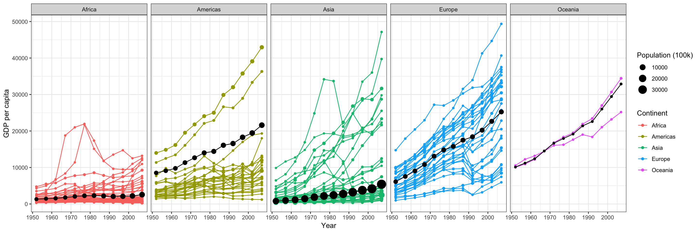

# Reading

- The [ggplot2 vignette](https://ggplot2.tidyverse.org/){target='blank'}
- R4DS [Chapter 3 - Data visualization](http://r4ds.had.co.nz/data-visualisation.html){target='blank'}
- The [Hans Rosling The River of Myths](https://youtu.be/OwII-dwh-bk){target='blank'}
- Watch the [Hons Rosling video](https://www.ted.com/talks/hans_rosling_shows_the_best_stats_you_ve_ever_seen){target="blank"}

# Tasks

- Recreate layered graphics with ggplot including raw and transformed data
- Save graphical output as a .png file
- Save your script as a .R or .Rmd in your course repository

# Background

[Hans Rosling](http://www.gapminder.org/news/sad-to-announce-hans-rosling-passed-away-this-morning/){target="blank"} is one of the most popular data scientists on the web. [His original TED talk](https://www.ted.com/talks/hans_rosling_shows_the_best_stats_you_ve_ever_seen){target="blank"} was very popular when it came out.  We are going to create some graphics using his formatted data as our weekly case study. Note that we need to remove Kuwait from the data ([discussion on this](https://github.com/jennybc/gapminder/issues/9){target="blank"})

# Instructions

In this exercise you will recreate the two graphics shown below using `gapminder` dataset from `library(gapminder)` (get them to match as closely as you can). Specific instructions/steps are listed in the 'Detailed Steps' section.

## Wealth and life expectancy through time

<!-- --><!-- -->

## Detailed Steps

1. Use `library(ggplot2); library(gapminder); library(dplyr)` to load the necessary packages.
      * Use `filter()` to remove "Kuwait" from the `gapminder` dataset for reasons noted in the background
2. Plot #1 (the first row of plots) 
      * Use `ggplot()` and the `theme_bw()` to duplicate the first plot using the filtered dataset (without Kuwait)
      * Specify the appropriate aesthetic mapping (`aes()`) to color by contintent and adjust the size of the point with `size=pop/100000`.  Remeber that if you adjust the data like this you will also need to update the legend later.
      * Use  `scale_y_continuous(trans = "sqrt")` to get the correct scale on the y-axis.
      * Use `facet_wrap(~year,nrow=1)` to divide the plot into separate panels.
      * Use `labs()` to specify more informative x, y, size, and color keys.  
      * the result will look something like this (with the details filled in):
   `ggplot(...) + geom_point() + facet_wrap(...) + scale_y_continuous(...) + ` `theme_bw() + labs(...)`
3. Prepare the data for the second plot
      * Use `group_by()` to group by `continent` and `year`
      * Use `summarize()` with the below commands to calculate the data for the black continent average line on the second plot:
         * `gdpPercapweighted = mean(x = gdpPercap, w = pop)`
         * `pop = sum(as.numeric(pop))` 
4. Plot #2 (the second row of plots) 
      * Use `ggplot()` and the `theme_bw()` to duplicate the second plot. In this plot you will add elements from both the raw gapminder dataset and your dataset summarized by continent. You will need to use the new data you summarized to add the black lines and dots showing the continent average. So it will look something like this:
     ` ggplot(gapminder,...) + geom_line() + geom_point() + geom_line(data=newdata,...) + ` `geom_point(data=newdata,...) + facet_wrap() + theme_bw() + labs(...)`
5. Use `ggsave()` or `png()` and save each plot as a `.png` with a width of 15 inches
6. Click `Source` to confirm that your script runs from start to finish without errors and saves the graphics.
7. Save your script as an .R or .Rmd in your course repository.

## Next steps

It's possible to do some data aggregation like this 'within' a ggplot call using the `stat_summary()` and friends.  See [here](https://ggplot2.tidyverse.org/reference/stat_summary.html) for more details.

<i> <small> Adapted from [BYU M335 Data Science Course](https://byuistats.github.io/M335) </small> </i>
