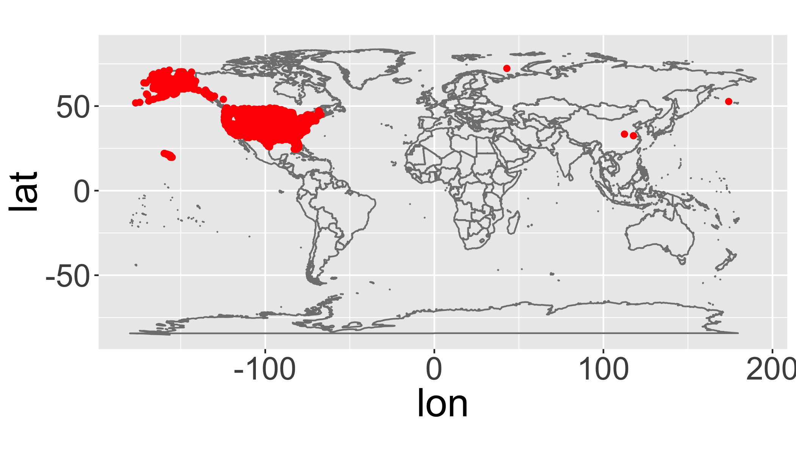

# Reading

- R4DS [Chapter 13 - Relational Data](http://r4ds.had.co.nz/relational-data.html){target='blank'}

# Background
In this exercise you will use various data wrangling tools to answer questions from the data held in separate tables.  We'll use the data in the `nycflights13` package which has relationships between the tables as follows.


# Objective
> What is the full name (not the three letter code) of the destination airport farthest from any of the NYC airports in the `flights` table?

# Tasks

- Join two datasets using a common column
- Answer a question that requires understanding how multiple tables are related
- Save your script as a .R or .Rmd in your course repository

You will need to load the necessary packages

```r
library(tidyverse)
library(nycflights13)
```
[<i class="fa fa-file-code-o fa-1x" aria-hidden="true"></i> Download starter R script (if desired)](scripts/CS_04_nocomments.R){target="_blank"}

There are several ways to do this using at least two different joins. I found two solutions that use 5 or 6 functions separated by pipes (`%>%`).  Can you do it in fewer?

<div class="well">
<button data-toggle="collapse" class="btn btn-primary btn-sm round" data-target="#demo1">Show Hints</button>
<div id="demo1" class="collapse">
The details below describe one possible approach.

1. Open the help file for the `nycflights13` package by searching in the "Help" panel in RStudio.
2. Look at the contents of the various tables to find the ones you need (`name`, `distance`, and `dest`).  You can use `head()`, `glimpse()`, `View()`, `str()`.  
2. In the table with distances, find the airport code that is farthest from the New York Airports (perhaps using `arrange()` and `slice()`)
3. Join this table with the one that has the full airport names.  You will either need to rename the columns so they match the other table or use the `by` parameter in the join.  e.g. check out `?left_join()`
4. `select()` only the `destName` column
</div>
</div>


<div class="extraswell">
<button data-toggle="collapse" class="btn btn-link" data-target="#extras">
Extra time? Try these extra activities...
</button>
<div id="extras" class="collapse">

Soon we will introduce working with spatial data and doing similar kinds of operations.  If you have time to play, see if you can figure out what this does:


```r
airports %>%
  distinct(lon,lat) %>%
  ggplot(aes(lon, lat)) +
    borders("world") +
    geom_point(col="red") +
    coord_quickmap()
```

<!-- -->

Can you figure out how to map mean delays by destination airport as shown below?

<!-- -->

</div>
</div>

<i> <small> Adapted from [R for Data Science](http://r4ds.had.co.nz/relational-data.html#filtering-joins) </small> </i>
