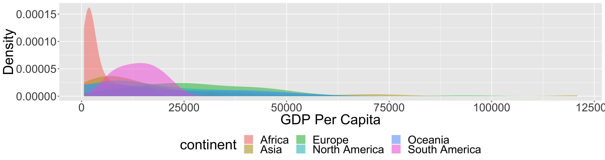
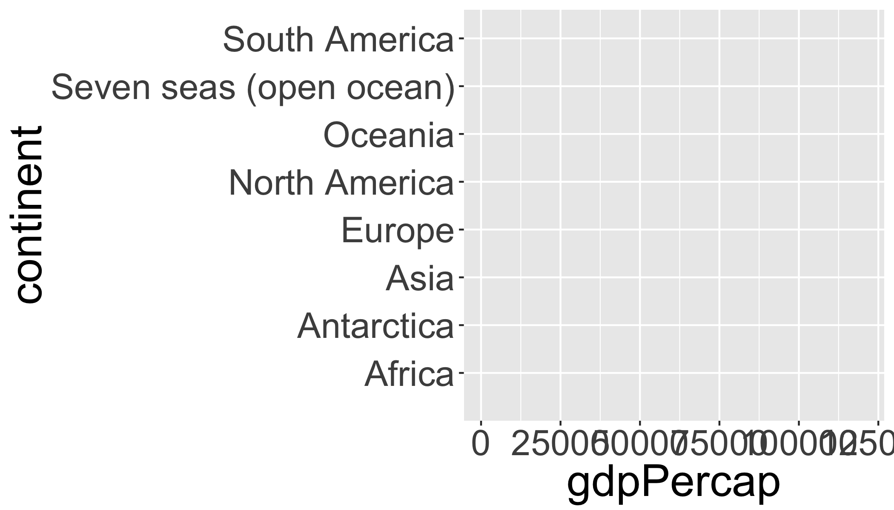

<div class='extraswell'>
  <button data-toggle='collapse' class='btn btn-link' data-target='#pres'>View Presentation </button>      [Open presentation in a new tab](presentations/day_12_help.html){target='_blank'}
<div id='pres' class='collapse'>
<div class='embed-responsive embed-responsive-16by9'>
  <iframe class='embed-responsive-item' src='presentations/day_12_help.html' allowfullscreen></iframe>
  _Click on presentation and then use the space bar to advance to the next slide
   or escape key to show an overview._
</div>
</div>
</div>


# Reading

- How to [write a reproducible example](http://adv-r.had.co.nz/Reproducibility.html)

# Tasks

- Learn how to read R help files effectively
- Learn how to search for help
- Learn how to create a Minimum Working Example (MWE)
- Debug existing code
- Save your reprex to your course repository as an html file using Export -> "Save As Webpage" in the RStudio "Viewer" Tab.

## Libraries


```r
library(tidyverse)
library(reprex)
library(sf)

library(spData)
data(world)
```

## Your problem

You want to make a figure illustrating the distribution of GDP per capita for all countries within each continent using the `world` data in the `spData` package.  

### Your goal
Your desired figure looks something like the following:
<!-- -->

### Current Version of your code
You have started working on the figure but can't seem to make it work like you want.  Here is your current version of the code (and the resulting figure):


```r
ggplot(world,aes(x=gdpPercap, y=continent, color=continent))+
   geom_density(alpha=0.5,color=F)
```

<!-- -->

The second figure is quite different from the one you want.  You want to ask for help and so you know that you need to make a reproducible example.  Starting with the code above, make the required edits so you can use `reprex()` to generate a nicely formatted example that you could email or post to a forum to ask for help.  See the [reading](https://reprex.tidyverse.org/) for more help. Note: you do _not_ need to recreate the first figure above, only to use `reprex()` to illustrate your question and problematic code.

<div class="well">
<button data-toggle="collapse" class="btn btn-primary btn-sm round" data-target="#demo1">Show Hints</button>
<div id="demo1" class="collapse">

## Steps
1. Download the [<i class="fa fa-file-code-o fa-1x" aria-hidden="true"></i> starter R script (if desired)](scripts/CS_07_nocomments.R){target="_blank"}.  Save this directly to your course folder (repository) so you don't lose track of it!
2. Add code needed to produce the second plot (loading required libraries above and loading the `world` data)
2. Copy the code to your clipboard
3. run `reprex()` to generate the reproducible example in the "Viewer Pane"
4. Export the preview as an html file and save it in your course repository.  It should look something like this (note the image is intentionally blurred):


</div>
</div>


<div class="extraswell">
<button data-toggle="collapse" class="btn btn-link" data-target="#extras">
Extra time? Try this...
</button>
<div id="extras" class="collapse">
Fix the code above to recreate the first figure.
</div>
</div>
