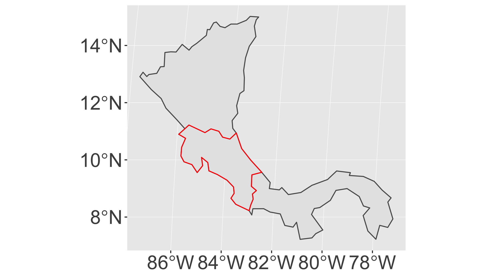

# Reading

- Parallel [Computing with the R Language in a Supercomputing Environment](https://link.springer.com/chapter/10.1007/978-3-642-13872-0_64)
- CRAN Task View [High Performance and Parallel Computing with R](http://cran.r-project.org/web/views/HighPerformanceComputing.html)


# Tasks

- Write parallel for loops to process spatial data

## Background


```r
library(tidyverse)
library(spData)
library(sf)

## New Packages
library(foreach)
library(doParallel)
registerDoParallel()
getDoParWorkers() # check registered cores
```

```
## [1] 2
```


Write an Rmd script that:

* Loads the `world` dataset in the `spData` package
* Runs a parallel `foreach()` to loop over countries (`name_long`) and:
   * `filter` the world object to include only on country at a time.
   * use `st_is_within_distance` to find the distance from that country to all other countries in the `world` object within 100000m Set `sparse=F` to return a simple array of `TRUE/FALSE` for countries within the distance.
   * set `.combine=rbind` to return a simple matrix.
* Confirm that you get the same answer without using foreach:
   * imply use `st_is_within_distance` with the transformed `world` object as both `x` and `y` object.
   * compare the results with `identical()`
   * you can also check the time difference with `system.time()`.
   


This approach could be used to identify which countries were 'close' to others.  For example, these countries are within 10^{5}m of Costa Rica:

```r
i=which(world2$name_long=="Costa Rica")
# neighbor countries
world2[x_par[i,],]$name_long
```

```
## [1] "Panama"     "Costa Rica" "Nicaragua"
```

<!-- -->

Note that in this example the sequential version typically runs faster than the 
