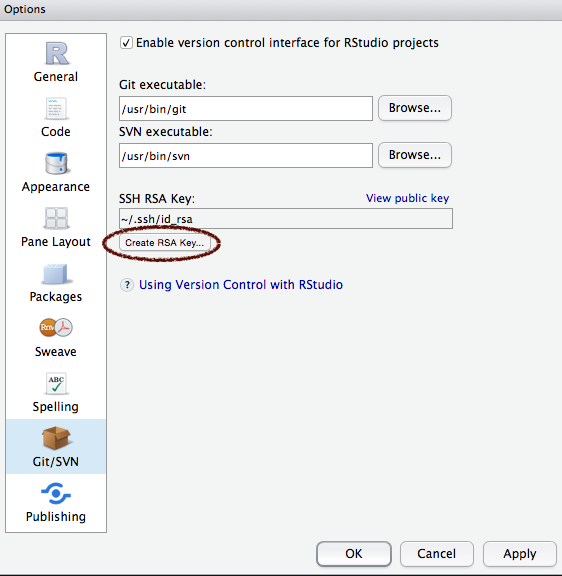
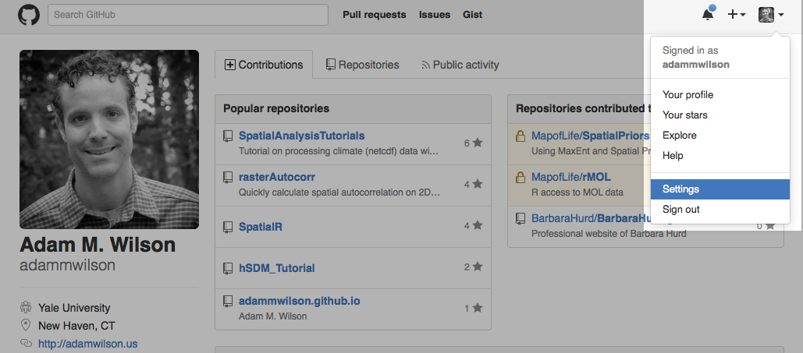

# Version control

For a more detailed description of using version control in RStudio, see [this link](https://support.rstudio.com/hc/en-us/articles/200532077-Version-Control-with-Git-and-SVN).  The important parts are summarized below.

## Installing Git

Before you can use Git with RStudio,  you must install Git on your system:

* Windows & OS X: [http://git-scm.com/downloads](http://git-scm.com/downloads)
    *  Note: Xcode on OS X may already contain a copy of Git.  Check by running `which git` in your OS X terminal. If it returns a path (e.g. `/usr/bin/git`), it is already installed.
* Debian/Ubuntu: `sudo apt-get install git-core`
* Fedora/RedHat: `sudo yum install git-core`

## Creating a new project based on a remote Git repository

If you have an existing remote Git repository (e.g. if you already made one on GitHub) that you want to use as the basis for an RStudio project you should:

* In RStudio, Run File -> New Project
* Choose to create a new project from Version Control
* Choose Git
* Provide the repository URL (and other appropriate options) and then click Create Project

The remote repository will be cloned into the specified directory and RStudio's version control features will then be available for that directory.

## Setting up the ability to `push` changes back to GitHub with SSH

Version control repositories can typically be accessed using a variety of protocols (including http and https). Many repositories can also be accessed using SSH (this is the mode of connection for many hosting services including GitHub and R-Forge).

While `HTTPS` is easier to set up when you want to clone a public respository (it essentially just works like a web link), it's annoying to use it regularly and have to enter your username and password each time you want to `push` a commit back up.  
In many cases the authentication for an SSH connection is done using public/private RSA key pairs. This type of authentication requires two steps, generating a public/private key pair
and then providing the public key to the hosting provider (e.g. GitHub)

Follow these instructions to set up a SSH connection with GitHub so you can easily `push` and `pull` a project.

### Generating a SSH key in Rstudio

First open RStudio -> preferences -> Git/SVN

If you do not already have a SSH RSA Key listed, click "Create RSA Key..."

You can add a passphrase if you want (like a password, it makes the key more secure).  If you add one here, you will have to type it each time to push to GitHub.  After you have created the RSA Key, you can click "View public key" on the preferences page.

.

Copy that text into your clipboard (with cmd-C or ctrl-C) and then go to [GitHub.com](GitHub.com).  Click the little account icon in the upper right corner and select "settings".  

And then select the SSH keys tab on the left and then click "Add SSH Key" on the right.

.

In the title box type some description of your current computer (for your own reference) such as "Adam's Laptop."  In the Key box, paste your public key that you copied from RStudio:

.

Once you have added your SSH key to RStudio and Git, you should be able to `push` and `pull` to your repositories without a password (unless you created one with your SSH key).  

While Linux and Mac OSX both include SSH as part of the base system, Windows does not. As a result the standard Windows distribution of Git (Msysgit, referenced above) also includes an SSH client.

## For more information

There is a complete book on Git available on the [Git website](http://git-scm.com/book/en/v2). It includes much more detail than is needed for this class, but it is a good reference.

 
