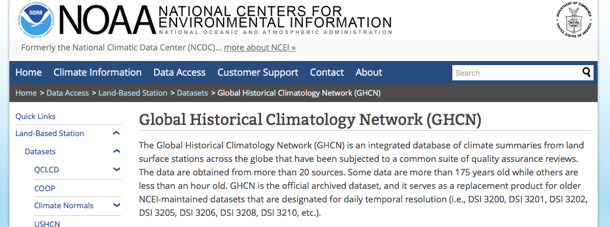
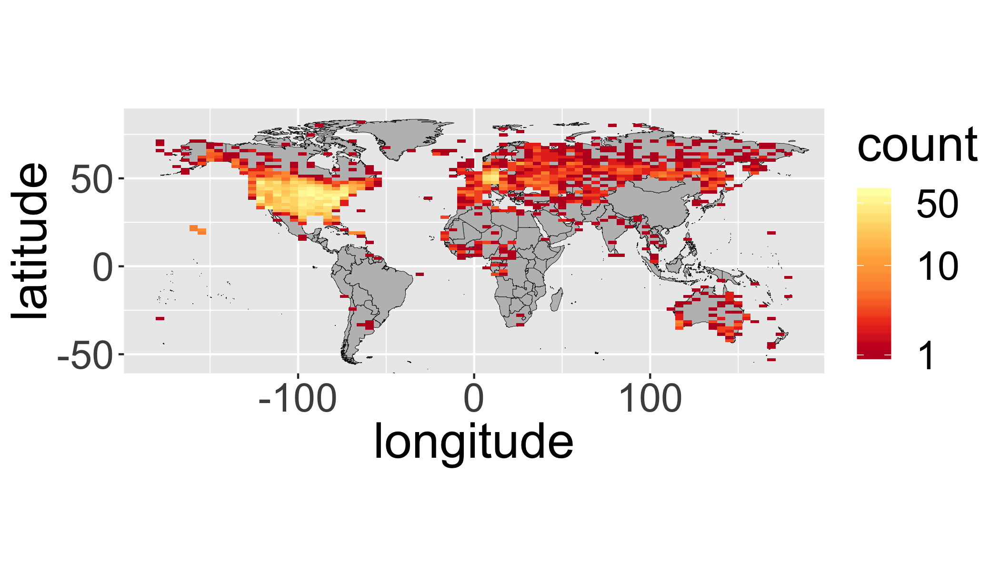
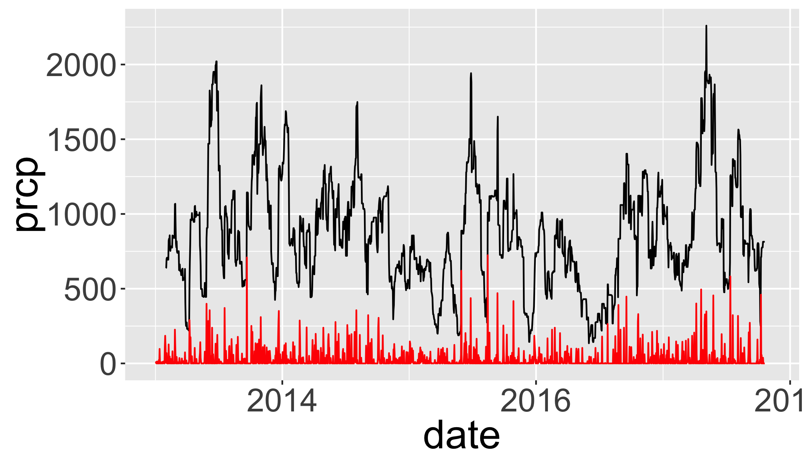
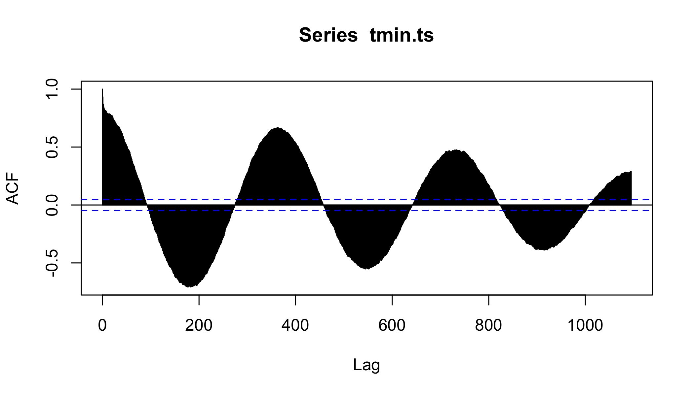
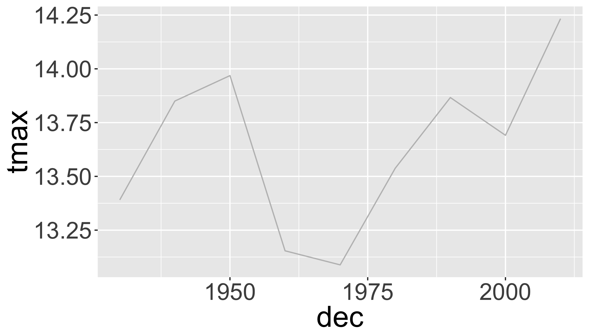
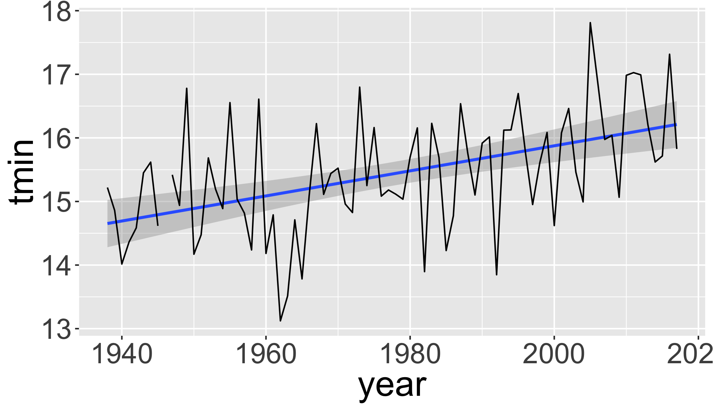
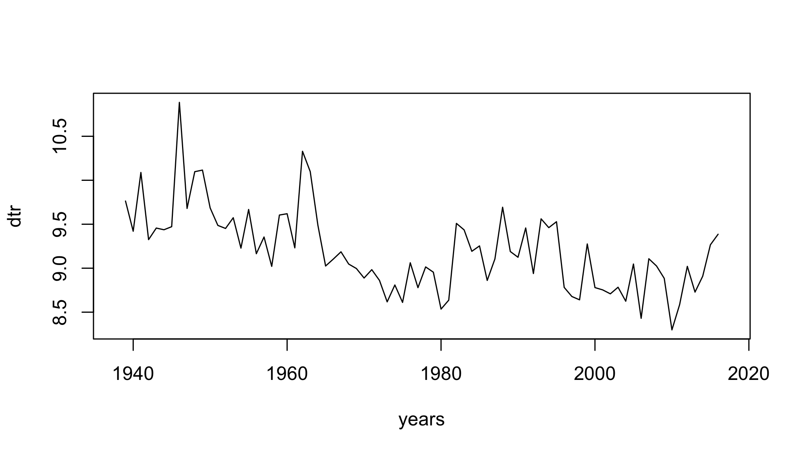
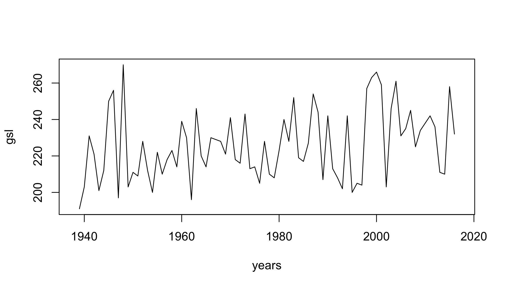

<div class='extraswell'>
  <button data-toggle='collapse' class='btn btn-link' data-target='#pres'>View Presentation </button>      [Open presentation in a new tab](presentations/PS_09_weather.html){target='_blank'}
<div id='pres' class='collapse'>
<div class='embed-responsive embed-responsive-16by9'>
  <iframe class='embed-responsive-item' src='presentations/PS_09_weather.html' allowfullscreen></iframe>
  _Click on presentation and then use the space bar to advance to the next slide
   or escape key to show an overview._
</div>
</div>
</div>


# Reading

- NULL

## Download

| [<i class='fas fa-code fa-2x' aria-hidden='true'></i><br>  R Script]( scripts/TK_09_nocomments.R ) | [<i class='fa fa-file-code-o fa-2x'></i> <br> Commented R Script]( scripts/TK_09.R ) | [<i class='far fa-file-alt fa-2x'></i> <br>  Rmd Script]( scripts/TK_09.Rmd )|
|:--:|:-:|:-:|

# Climate Metrics

## Climate Metrics: ClimdEX
Indices representing extreme aspects of climate derived from daily data:


Climate Change Research Centre (CCRC) at University of New South Wales (UNSW) ([climdex.org](http://www.climdex.org)).  

### 27 Core indices

For example:

* **FD** Number of frost days: Annual count of days when TN (daily minimum temperature) < 0C.
* **SU** Number of summer days: Annual count of days when TX (daily maximum temperature) > 25C.
* **ID** Number of icing days: Annual count of days when TX (daily maximum temperature) < 0C.
* **TR** Number of tropical nights: Annual count of days when TN (daily minimum temperature) > 20C.
* **GSL** Growing season length: Annual (1st Jan to 31st Dec in Northern Hemisphere (NH), 1st July to 30th June in Southern Hemisphere (SH)) count between first span of at least 6 days with daily mean temperature TG>5C and first span after July 1st (Jan 1st in SH) of 6 days with TG<5C.
* **TXx** Monthly maximum value of daily maximum temperature
* **TN10p** Percentage of days when TN < 10th percentile
* **Rx5day** Monthly maximum consecutive 5-day precipitation
* **SDII** Simple pricipitation intensity index


# Weather Data

### Climate Data Online


### GHCN 



## Options for downloading data

### `FedData` package

* National Elevation Dataset digital elevation models (1 and 1/3 arc-second; USGS)
* National Hydrography Dataset (USGS)
* Soil Survey Geographic (SSURGO) database 
* International Tree Ring Data Bank.
* *Global Historical Climatology Network* (GHCN)

### NOAA API


[National Climatic Data Center application programming interface (API)]( http://www.ncdc.noaa.gov/cdo-web/webservices/v2). 

### `rNOAA` package

Handles downloading data directly from NOAA APIv2.

* `buoy_*`  NOAA Buoy data from the National Buoy Data Center
* `ghcnd_*`  GHCND daily data from NOAA
* `isd_*` ISD/ISH data from NOAA
* `homr_*` Historical Observing Metadata Repository
* `ncdc_*` NOAA National Climatic Data Center (NCDC)
* `seaice` Sea ice
* `storm_` Storms (IBTrACS)
* `swdi` Severe Weather Data Inventory (SWDI)
* `tornadoes` From the NOAA Storm Prediction Center

---

### Libraries


```r
library(raster)
library(sp)
library(rgdal)
library(ggplot2)
library(ggmap)
library(dplyr)
library(tidyr)
library(maps)
library(scales)
# New Packages
library(rnoaa)
library(climdex.pcic)
library(zoo)
library(reshape2)
library(broom)
```

### Station locations 

Download the GHCN station inventory with `ghcnd_stations()`.  


```r
datadir="data"

st = ghcnd_stations()

## Optionally, save it to disk
# write.csv(st,file.path(datadir,"st.csv"))
## If internet fails, load the file from disk using:
# st=read.csv(file.path(datadir,"st.csv"))
```

### GHCND Variables

5 core values:

* **PRCP** Precipitation (tenths of mm)
* **SNOW** Snowfall (mm)
* **SNWD** Snow depth (mm)
* **TMAX** Maximum temperature
* **TMIN** Minimum temperature

And ~50 others!  For example:

* **ACMC** Average cloudiness midnight to midnight from 30-second ceilometer 
* **AWND** Average daily wind speed
* **FMTM** Time of fastest mile or fastest 1-minute wind
* **MDSF** Multiday snowfall total


### `filter()` to temperature and precipitation

```r
st=dplyr::filter(st,element%in%c("TMAX","TMIN","PRCP"))
```

### Map GHCND stations

First, get a global country polygon

```r
worldmap=map_data("world")
```

Plot all stations:

```r
ggplot(data=st,aes(y=latitude,x=longitude)) +
  facet_grid(element~.)+
  annotation_map(map=worldmap,size=.1,fill="grey",colour="black")+
  geom_point(size=.1,col="red")+
  coord_equal()
```

<!-- -->

It's hard to see all the points, let's bin them...


```r
ggplot(st,aes(y=latitude,x=longitude)) +
  annotation_map(map=worldmap,size=.1,fill="grey",colour="black")+
  facet_grid(element~.)+
  stat_bin2d(bins=100)+
  scale_fill_distiller(palette="YlOrRd",trans="log",direction=-1,
                       breaks = c(1,10,100,1000))+
  coord_equal()
```

<!-- -->
<div class="well">
## Your turn

Produce a binned map (like above) with the following modifications:

* include only stations with a data record that starts before 1950 and ends after 2000 (keeping only complete records during that time).
* include only `tmax`

<button data-toggle="collapse" class="btn btn-primary btn-sm round" data-target="#demo1">Show Solution</button>
<div id="demo1" class="collapse">


```r
ggplot(filter(st,
              first_year<=1950 & 
              last_year>=2000 & 
              element=="TMAX"),
       aes(y=latitude,x=longitude)) +
  annotation_map(map=worldmap,size=.1,fill="grey",colour="black")+
  stat_bin2d(bins=75)+
  scale_fill_distiller(palette="YlOrRd",trans="log",direction=-1,
    breaks = c(1,10,50))+
  coord_equal()
```

<!-- -->
</div>
</div>

## Download daily data from GHCN

`ghcnd()` will download a `.dly` file for a particular station.  But how to choose?

### `geocode` in ggmap package useful for geocoding place names 
Geocodes a location (find latitude and longitude) using either (1) the Data Science Toolkit (http://www.datasciencetoolkit.org/about) or (2) Google Maps. 


```r
geocode("University at Buffalo, NY")
```

```
## Information from URL : http://maps.googleapis.com/maps/api/geocode/json?address=University%20at%20Buffalo,%20NY&sensor=false
```

```
## Warning: geocode failed with status OVER_QUERY_LIMIT, location =
## "University at Buffalo, NY"
```

```
##   lon lat
## 1  NA  NA
```

However, you have to be careful:

```r
geocode("My Grandma's house")
```

```
## Information from URL : http://maps.googleapis.com/maps/api/geocode/json?address=My%20Grandma's%20house&sensor=false
```

```
## Warning: geocode failed with status OVER_QUERY_LIMIT, location = "My
## Grandma's house"
```

```
##   lon lat
## 1  NA  NA
```

But this is pretty safe for well known places.

```r
coords=as.matrix(geocode("Buffalo, NY"))
```

```
## Information from URL : http://maps.googleapis.com/maps/api/geocode/json?address=Buffalo,%20NY&sensor=false
```

```
## Warning: geocode failed with status OVER_QUERY_LIMIT, location = "Buffalo,
## NY"
```

```r
coords
```

```
##      lon lat
## [1,]  NA  NA
```

Now use that location to spatially filter stations with a rectangular box.

```r
dplyr::filter(st,
              grepl("BUFFALO",name)&
              between(latitude,coords[2]-1,coords[2]+1) &
              between(longitude,coords[1]-1,coords[1]+1)&
         element=="TMAX")
```

```
## # A tibble: 0 x 11
## # ... with 11 variables: id <chr>, latitude <dbl>, longitude <dbl>,
## #   elevation <dbl>, state <chr>, name <chr>, gsn_flag <chr>,
## #   wmo_id <chr>, element <chr>, first_year <int>, last_year <int>
```
You could also spatially filter using `over()` in sp package...


With the station ID, we can now download daily data from NOAA.

```r
d=meteo_tidy_ghcnd("USW00014733",
                   var = c("TMAX","TMIN","PRCP"),
                   keep_flags=T)
head(d)
```

```
## # A tibble: 6 x 14
##   id    date       mflag_prcp mflag_tmax mflag_tmin  prcp qflag_prcp
##   <chr> <date>     <chr>      <chr>      <chr>      <dbl> <chr>     
## 1 USW0… 1938-05-01 T          " "        " "            0 " "       
## 2 USW0… 1938-05-02 T          " "        " "            0 " "       
## 3 USW0… 1938-05-03 " "        " "        " "           25 " "       
## 4 USW0… 1938-05-04 " "        " "        " "          112 " "       
## 5 USW0… 1938-05-05 T          " "        " "            0 " "       
## 6 USW0… 1938-05-06 " "        " "        " "           64 " "       
## # ... with 7 more variables: qflag_tmax <chr>, qflag_tmin <chr>,
## #   sflag_prcp <chr>, sflag_tmax <chr>, sflag_tmin <chr>, tmax <dbl>,
## #   tmin <dbl>
```

See [CDO Daily Description](http://www1.ncdc.noaa.gov/pub/data/cdo/documentation/GHCND_documentation.pdf) and raw [GHCND metadata](http://www1.ncdc.noaa.gov/pub/data/ghcn/daily/readme.txt) for more details.  If you want to download multiple stations at once, check out `meteo_pull_monitors()`

### Quality Control: MFLAG

Measurement Flag/Attribute

* **Blank** no measurement information applicable
* **B** precipitation total formed from two twelve-hour totals
* **H** represents highest or lowest hourly temperature (TMAX or TMIN) or average of hourly values (TAVG)
* **K** converted from knots
* ...

See [CDO Description](http://www1.ncdc.noaa.gov/pub/data/cdo/documentation/GHCND_documentation.pdf) 

### Quality Control: QFLAG

* **Blank** did not fail any quality assurance check 
* **D** failed duplicate check
* **G** failed gap check
* **K** failed streak/frequent-value check
* **N** failed naught check
* **O** failed climatological outlier check
* **S** failed spatial consistency check
* **T** failed temporal consistency check
* **W** temperature too warm for snow
* ...

See [CDO Description](http://www1.ncdc.noaa.gov/pub/data/cdo/documentation/GHCND_documentation.pdf) 

### Quality Control: SFLAG

Indicates the source of the data...

## Summarize QC flags

Summarize the QC flags.  How many of which type are there?  Should we be more conservative?


```r
table(d$qflag_tmax)  
```

```
## 
##           G     I 
## 29027     2    10
```

```r
table(d$qflag_tmin)  
```

```
## 
##           G     I     S 
## 29026     2     7     4
```

```r
table(d$qflag_prcp)  
```

```
## 
##           G 
## 29038     1
```
* **T** failed temporal consistency check

#### Filter with QC data and change units

```r
d_filtered=d%>%
  mutate(tmax=ifelse(qflag_tmax!=" "|tmax==-9999,NA,tmax/10))%>%  # convert to degrees C
  mutate(tmin=ifelse(qflag_tmin!=" "|tmin==-9999,NA,tmin/10))%>%  # convert to degrees C
  mutate(prcp=ifelse(qflag_tmin!=" "|prcp==-9999,NA,prcp))%>%  # convert to degrees C
  arrange(date)
```

Plot temperatures

```r
ggplot(d_filtered,
       aes(y=tmax,x=date))+
  geom_line(col="red")
```

```
## Warning: Removed 11 rows containing missing values (geom_path).
```

<!-- -->

Limit to a few years and plot the daily range and average temperatures.

```r
d_filtered_recent=filter(d_filtered,date>as.Date("2013-01-01"))

  ggplot(d_filtered_recent,
         aes(ymax=tmax,ymin=tmin,x=date))+
    geom_ribbon(col="grey",fill="grey")+
    geom_line(aes(y=(tmax+tmin)/2),col="red")
```

```
## Warning: Removed 11 rows containing missing values (geom_path).
```

<!-- -->

### Zoo package for rolling functions

Infrastructure for Regular and Irregular Time Series (Z's Ordered Observations)

* `rollmean()`:  Rolling mean
* `rollsum()`:   Rolling sum
* `rollapply()`:  Custom functions

Use rollmean to calculate a rolling 60-day average. 

* `align` whether the index of the result should be left- or right-aligned or centered


```r
d_rollmean = d_filtered_recent %>% 
  arrange(date) %>%
  mutate(tmax.60 = rollmean(x = tmax, 60, align = "center", fill = NA),
         tmax.b60 = rollmean(x = tmax, 60, align = "right", fill = NA))
```


```r
d_rollmean%>%
  ggplot(aes(ymax=tmax,ymin=tmin,x=date))+
    geom_ribbon(fill="grey")+
    geom_line(aes(y=(tmin+tmax)/2),col=grey(0.4),size=.5)+
    geom_line(aes(y=tmax.60),col="red")+
    geom_line(aes(y=tmax.b60),col="darkred")
```

```
## Warning: Removed 11 rows containing missing values (geom_path).
```

```
## Warning: Removed 70 rows containing missing values (geom_path).

## Warning: Removed 70 rows containing missing values (geom_path).
```

<!-- -->

<div class="well">
## Your Turn

Plot a 30-day rolling "right" aligned sum of precipitation.

<button data-toggle="collapse" class="btn btn-primary btn-sm round" data-target="#demo2">Show Solution</button>
<div id="demo2" class="collapse">

```r
tp=d_filtered_recent %>%
  arrange(date)  %>% 
  mutate(prcp.30 = rollsum(x = prcp, 30, align = "right", fill = NA))

ggplot(tp,aes(y=prcp,x=date))+
  geom_line(aes(y=prcp.30),col="black")+ 
  geom_line(col="red") 
```

```
## Warning: Removed 40 rows containing missing values (geom_path).
```

```
## Warning: Removed 11 rows containing missing values (geom_path).
```

<!-- -->
</div>
</div>


# Time Series analysis

Most timeseries functions use the time series class (`ts`)


```r
tmin.ts=ts(d_filtered_recent$tmin,frequency = 365)
```

## Temporal autocorrelation

Values are highly correlated!


```r
ggplot(d_filtered_recent,aes(y=tmin,x=lag(tmin)))+
  geom_point()+
  geom_abline(intercept=0, slope=1)
```

```
## Warning: Removed 12 rows containing missing values (geom_point).
```

<!-- -->

### Autocorrelation functions

* autocorrelation  $x$ vs. $x_{t-1}$  (lag=1)
* partial autocorrelation.  $x$  vs. $x_{n}$ _after_ controlling for correlations $\in t-1:n$

#### Autocorrelation

```r
acf(tmin.ts,lag.max = 365*3,na.action = na.exclude )
```

<!-- -->

#### Partial Autocorrelation

```r
pacf(tmin.ts,lag.max = 365*3,na.action = na.exclude )
```

<!-- -->


# Checking for significant trends

## Compute temporal aggregation indices

### Group by month, season, year, and decade.

How to convert years into 'decades'?

```r
1938
```

```
## [1] 1938
```

```r
round(1938,-1)
```

```
## [1] 1940
```

```r
floor(1938/10)*10
```

```
## [1] 1930
```

Calculate seasonal and decadal mean temperatures.

```r
d_filtered2=d_filtered%>%
  mutate(month=as.numeric(format(date,"%m")),
        year=as.numeric(format(date,"%Y")),
        season=ifelse(month%in%c(12,1,2),"Winter",
            ifelse(month%in%c(3,4,5),"Spring",
              ifelse(month%in%c(6,7,8),"Summer",
                ifelse(month%in%c(9,10,11),"Fall",NA)))),
        dec=(floor(as.numeric(format(date,"%Y"))/10)*10))
knitr::kable(head(d_filtered2))
```


id            date         mflag_prcp   mflag_tmax   mflag_tmin    prcp  qflag_prcp   qflag_tmax   qflag_tmin   sflag_prcp   sflag_tmax   sflag_tmin    tmax   tmin   month   year  season     dec
------------  -----------  -----------  -----------  -----------  -----  -----------  -----------  -----------  -----------  -----------  -----------  -----  -----  ------  -----  -------  -----
USW00014733   1938-05-01   T                                          0                                         0            0            0             14.4    3.9       5   1938  Spring    1930
USW00014733   1938-05-02   T                                          0                                         0            0            0             21.1    8.3       5   1938  Spring    1930
USW00014733   1938-05-03                                             25                                         0            0            0             16.7    7.2       5   1938  Spring    1930
USW00014733   1938-05-04                                            112                                         0            0            0             20.6    9.4       5   1938  Spring    1930
USW00014733   1938-05-05   T                                          0                                         0            0            0             31.1   10.6       5   1938  Spring    1930
USW00014733   1938-05-06                                             64                                         0            0            0             19.4    7.8       5   1938  Spring    1930

## Timeseries models


How to assess change? Simple differences?


```r
d_filtered2%>%
  mutate(period=ifelse(year<=1976-01-01,"early","late"))%>% #create two time periods before and after 1976
  group_by(period)%>%  # divide the data into the two groups
  summarize(n=n(),    # calculate the means between the two periods
            tmin=mean(tmin,na.rm=T),
            tmax=mean(tmax,na.rm=T),
            prcp=mean(prcp,na.rm=T))
```

```
## # A tibble: 2 x 5
##   period     n  tmin  tmax  prcp
##   <chr>  <int> <dbl> <dbl> <dbl>
## 1 early  13394  4.20  13.7  25.1
## 2 late   15645  4.76  13.8  28.4
```

But be careful, there were lots of missing data in the beginning of the record

```r
d_filtered2%>%
  group_by(year)%>%
  summarize(n=n())%>%
  ggplot(aes(x=year,y=n))+
  geom_line(col="grey")
```

<!-- -->

```r
# which years don't have complete data?
d_filtered2%>%
  group_by(year)%>%
  summarize(n=n())%>%
  filter(n<360)
```

```
## # A tibble: 2 x 2
##    year     n
##   <dbl> <int>
## 1  1938   245
## 2  2017   304
```


Plot 10-year means (excluding years without complete data):

```r
d_filtered2%>%
  filter(year>1938, year<2017)%>%
  group_by(dec)%>%
  summarize(
            n=n(),
            tmin=mean(tmin,na.rm=T),
            tmax=mean(tmax,na.rm=T),
            prcp=mean(prcp,na.rm=T)
            )%>%
  ggplot(aes(x=dec,y=tmax))+
  geom_line(col="grey")
```

<!-- -->


### Look for specific events: was 2017 unusually hot in Buffalo, NY?
Let's compare 2017 with all the previous years in the dataset.  First add 'day of year' to the data to facilitate showing all years on the same plot.

```r
df=d_filtered2%>%
  mutate(doy=as.numeric(format(date,"%j")),
         doydate=as.Date(paste("2017-",doy),format="%Y-%j"))
```

Then plot all years (in grey) and add 2017 in red.

```r
ggplot(df,aes(x=doydate,y=tmax,group=year))+
  geom_line(col="grey",alpha=.5)+ # plot each year in grey
  stat_smooth(aes(group=1),col="black")+   # Add a smooth GAM to estimate the long-term mean
  geom_line(data=filter(df,year>2016),col="red")+  # add 2017 in red
  scale_x_date(labels = date_format("%b"),date_breaks = "2 months")
```

```
## `geom_smooth()` using method = 'gam' and formula 'y ~ s(x, bs = "cs")'
```

<!-- -->

Then 'zoom' into just the past few months and add 2017 in red.

```r
ggplot(df,aes(x=doydate,y=tmax,group=year))+
  geom_line(col="grey",alpha=.5)+
  stat_smooth(aes(group=1),col="black")+
  geom_line(data=filter(df,year>2016),col="red")+
  scale_x_date(labels = date_format("%b"),date_breaks = "2 months",
               lim=c(as.Date("2017-08-01"),as.Date("2017-10-31")))
```

```
## `geom_smooth()` using method = 'gam' and formula 'y ~ s(x, bs = "cs")'
```

<!-- -->

So there was an unusually warm spell in late September.

#### Summarize by season

```r
seasonal=d_filtered2%>%
  group_by(year,season)%>%
  summarize(n=n(),
            tmin=mean(tmin),
            tmax=mean(tmax),
            prcp=mean(prcp))%>%
  filter(n>75)

ggplot(seasonal,aes(y=tmin,x=year))+
  facet_grid(season~.,scales = "free_y")+
  stat_smooth(method="lm", se=T)+
  geom_line()
```

<!-- -->


#### Linear regression of maximum temperature in fall

```r
s1=seasonal%>%
  filter(season=="Summer")

ggplot(s1,aes(y=tmin,x=year))+
  stat_smooth(method="lm", se=T)+
  geom_line()
```

<!-- -->


```r
lm1=lm(tmin~year, data=s1)
str(lm1)
```

```
## List of 13
##  $ coefficients : Named num [1:2] -23.551 0.0197
##   ..- attr(*, "names")= chr [1:2] "(Intercept)" "year"
##  $ residuals    : Named num [1:79] 0.566 0.187 -0.676 -0.349 -0.147 ...
##   ..- attr(*, "names")= chr [1:79] "1" "2" "3" "4" ...
##  $ effects      : Named num [1:79] -137.232 4.023 -0.752 -0.424 -0.222 ...
##   ..- attr(*, "names")= chr [1:79] "(Intercept)" "year" "" "" ...
##  $ rank         : int 2
##  $ fitted.values: Named num [1:79] 14.7 14.7 14.7 14.7 14.7 ...
##   ..- attr(*, "names")= chr [1:79] "1" "2" "3" "4" ...
##  $ assign       : int [1:2] 0 1
##  $ qr           :List of 5
##   ..$ qr   : num [1:79, 1:2] -8.888 0.113 0.113 0.113 0.113 ...
##   .. ..- attr(*, "dimnames")=List of 2
##   .. .. ..$ : chr [1:79] "1" "2" "3" "4" ...
##   .. .. ..$ : chr [1:2] "(Intercept)" "year"
##   .. ..- attr(*, "assign")= int [1:2] 0 1
##   ..$ qraux: num [1:2] 1.11 1.17
##   ..$ pivot: int [1:2] 1 2
##   ..$ tol  : num 1e-07
##   ..$ rank : int 2
##   ..- attr(*, "class")= chr "qr"
##  $ df.residual  : int 77
##  $ na.action    : 'omit' Named int 9
##   ..- attr(*, "names")= chr "9"
##  $ xlevels      : Named list()
##  $ call         : language lm(formula = tmin ~ year, data = s1)
##  $ terms        :Classes 'terms', 'formula'  language tmin ~ year
##   .. ..- attr(*, "variables")= language list(tmin, year)
##   .. ..- attr(*, "factors")= int [1:2, 1] 0 1
##   .. .. ..- attr(*, "dimnames")=List of 2
##   .. .. .. ..$ : chr [1:2] "tmin" "year"
##   .. .. .. ..$ : chr "year"
##   .. ..- attr(*, "term.labels")= chr "year"
##   .. ..- attr(*, "order")= int 1
##   .. ..- attr(*, "intercept")= int 1
##   .. ..- attr(*, "response")= int 1
##   .. ..- attr(*, ".Environment")=<environment: R_GlobalEnv> 
##   .. ..- attr(*, "predvars")= language list(tmin, year)
##   .. ..- attr(*, "dataClasses")= Named chr [1:2] "numeric" "numeric"
##   .. .. ..- attr(*, "names")= chr [1:2] "tmin" "year"
##  $ model        :'data.frame':	79 obs. of  2 variables:
##   ..$ tmin: num [1:79] 15.2 14.9 14 14.4 14.6 ...
##   ..$ year: num [1:79] 1938 1939 1940 1941 1942 ...
##   ..- attr(*, "terms")=Classes 'terms', 'formula'  language tmin ~ year
##   .. .. ..- attr(*, "variables")= language list(tmin, year)
##   .. .. ..- attr(*, "factors")= int [1:2, 1] 0 1
##   .. .. .. ..- attr(*, "dimnames")=List of 2
##   .. .. .. .. ..$ : chr [1:2] "tmin" "year"
##   .. .. .. .. ..$ : chr "year"
##   .. .. ..- attr(*, "term.labels")= chr "year"
##   .. .. ..- attr(*, "order")= int 1
##   .. .. ..- attr(*, "intercept")= int 1
##   .. .. ..- attr(*, "response")= int 1
##   .. .. ..- attr(*, ".Environment")=<environment: R_GlobalEnv> 
##   .. .. ..- attr(*, "predvars")= language list(tmin, year)
##   .. .. ..- attr(*, "dataClasses")= Named chr [1:2] "numeric" "numeric"
##   .. .. .. ..- attr(*, "names")= chr [1:2] "tmin" "year"
##   ..- attr(*, "na.action")= 'omit' Named int 9
##   .. ..- attr(*, "names")= chr "9"
##  - attr(*, "class")= chr "lm"
```

```r
summary(lm1)
```

```
## 
## Call:
## lm(formula = tmin ~ year, data = s1)
## 
## Residuals:
##      Min       1Q   Median       3Q      Max 
## -2.00360 -0.45550 -0.02385  0.57754  1.90919 
## 
## Coefficients:
##               Estimate Std. Error t value Pr(>|t|)    
## (Intercept) -23.551009   8.042522  -2.928  0.00448 ** 
## year          0.019713   0.004066   4.848 6.33e-06 ***
## ---
## Signif. codes:  0 '***' 0.001 '**' 0.01 '*' 0.05 '.' 0.1 ' ' 1
## 
## Residual standard error: 0.8298 on 77 degrees of freedom
##   (1 observation deleted due to missingness)
## Multiple R-squared:  0.2339,	Adjusted R-squared:  0.2239 
## F-statistic: 23.51 on 1 and 77 DF,  p-value: 6.333e-06
```

You can extract values of interest by looking at the structure of the object.


```r
str(summary(lm1))
```

```
## List of 12
##  $ call         : language lm(formula = tmin ~ year, data = s1)
##  $ terms        :Classes 'terms', 'formula'  language tmin ~ year
##   .. ..- attr(*, "variables")= language list(tmin, year)
##   .. ..- attr(*, "factors")= int [1:2, 1] 0 1
##   .. .. ..- attr(*, "dimnames")=List of 2
##   .. .. .. ..$ : chr [1:2] "tmin" "year"
##   .. .. .. ..$ : chr "year"
##   .. ..- attr(*, "term.labels")= chr "year"
##   .. ..- attr(*, "order")= int 1
##   .. ..- attr(*, "intercept")= int 1
##   .. ..- attr(*, "response")= int 1
##   .. ..- attr(*, ".Environment")=<environment: R_GlobalEnv> 
##   .. ..- attr(*, "predvars")= language list(tmin, year)
##   .. ..- attr(*, "dataClasses")= Named chr [1:2] "numeric" "numeric"
##   .. .. ..- attr(*, "names")= chr [1:2] "tmin" "year"
##  $ residuals    : Named num [1:79] 0.566 0.187 -0.676 -0.349 -0.147 ...
##   ..- attr(*, "names")= chr [1:79] "1" "2" "3" "4" ...
##  $ coefficients : num [1:2, 1:4] -23.55101 0.01971 8.04252 0.00407 -2.92831 ...
##   ..- attr(*, "dimnames")=List of 2
##   .. ..$ : chr [1:2] "(Intercept)" "year"
##   .. ..$ : chr [1:4] "Estimate" "Std. Error" "t value" "Pr(>|t|)"
##  $ aliased      : Named logi [1:2] FALSE FALSE
##   ..- attr(*, "names")= chr [1:2] "(Intercept)" "year"
##  $ sigma        : num 0.83
##  $ df           : int [1:3] 2 77 2
##  $ r.squared    : num 0.234
##  $ adj.r.squared: num 0.224
##  $ fstatistic   : Named num [1:3] 23.5 1 77
##   ..- attr(*, "names")= chr [1:3] "value" "numdf" "dendf"
##  $ cov.unscaled : num [1:2, 1:2] 93.928528 -0.047483 -0.047483 0.000024
##   ..- attr(*, "dimnames")=List of 2
##   .. ..$ : chr [1:2] "(Intercept)" "year"
##   .. ..$ : chr [1:2] "(Intercept)" "year"
##  $ na.action    : 'omit' Named int 9
##   ..- attr(*, "names")= chr "9"
##  - attr(*, "class")= chr "summary.lm"
```

```r
summary(lm1)$r.squared
```

```
## [1] 0.2338852
```

Print a summary table:

```r
tidy(lm1)
```

```
## # A tibble: 2 x 5
##   term        estimate std.error statistic    p.value
##   <chr>          <dbl>     <dbl>     <dbl>      <dbl>
## 1 (Intercept) -23.6      8.04        -2.93 0.00448   
## 2 year          0.0197   0.00407      4.85 0.00000633
```

### Autoregressive models
See [Time Series Analysis Task View](https://cran.r-project.org/web/views/TimeSeries.html) for summary of available packages/models. 

* Moving average (MA) models
* autoregressive (AR) models
* autoregressive moving average (ARMA) models
* frequency analysis
* Many, many more...

-------

# Climate Metrics

### Climdex indices
[ClimDex](http://www.climdex.org/indices.html)

###  Format data for `climdex`


```r
library(PCICt)
## Parse the dates into PCICt.
pc.dates <- as.PCICt(as.POSIXct(d_filtered$date),cal="gregorian")
```


### Generate the climdex object

```r
  library(climdex.pcic)
    ci <- climdexInput.raw(
      tmax=d_filtered$tmax,
      tmin=d_filtered$tmin,
      prec=d_filtered$prcp,
      pc.dates,pc.dates,pc.dates, 
      base.range=c(1971, 2000))
years=as.numeric(as.character(unique(ci@date.factors$annual)))
```

### Cumulative dry days


```r
cdd= climdex.cdd(ci, spells.can.span.years = TRUE)
plot(cdd~years,type="l")
```

<!-- -->

### Diurnal Temperature Range


```r
dtr=climdex.dtr(ci, freq = c("annual"))
plot(dtr~years,type="l")
```

<!-- -->

### Frost Days


```r
fd=climdex.fd(ci)
plot(fd~years,type="l")
```

<!-- -->

<div class="well">
## Your Turn

See all available indices with:

```r
climdex.get.available.indices(ci)
```

```
##  [1] "climdex.su"      "climdex.id"      "climdex.txx"    
##  [4] "climdex.txn"     "climdex.tx10p"   "climdex.tx90p"  
##  [7] "climdex.wsdi"    "climdex.fd"      "climdex.tr"     
## [10] "climdex.tnx"     "climdex.tnn"     "climdex.tn10p"  
## [13] "climdex.tn90p"   "climdex.csdi"    "climdex.rx1day" 
## [16] "climdex.rx5day"  "climdex.sdii"    "climdex.r10mm"  
## [19] "climdex.r20mm"   "climdex.rnnmm"   "climdex.cdd"    
## [22] "climdex.cwd"     "climdex.r95ptot" "climdex.r99ptot"
## [25] "climdex.prcptot" "climdex.gsl"     "climdex.dtr"
```

Select 3 indices, calculate them, and plot the timeseries.

<button data-toggle="collapse" class="btn btn-primary btn-sm round" data-target="#demo4">Show Solution</button>
<div id="demo4" class="collapse">


```r
r10mm=climdex.r10mm(ci)
plot(r10mm~years,type="l")
```

<!-- -->

```r
prcptot=climdex.prcptot(ci)
plot(prcptot~years,type="l")
```

<!-- -->

```r
gsl=climdex.gsl(ci)
plot(gsl~years,type="l")
```

<!-- -->

</div>
</div>


