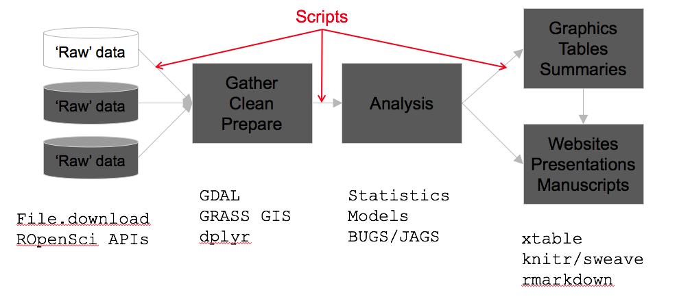
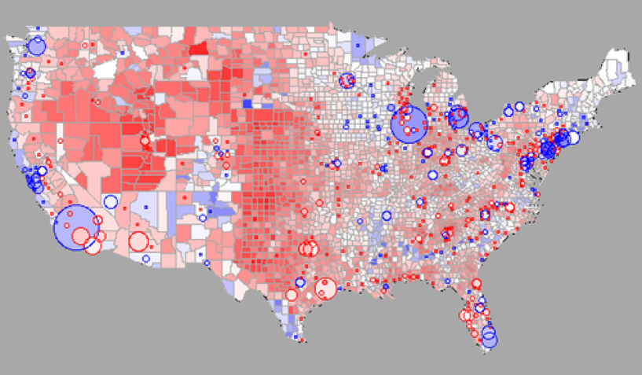
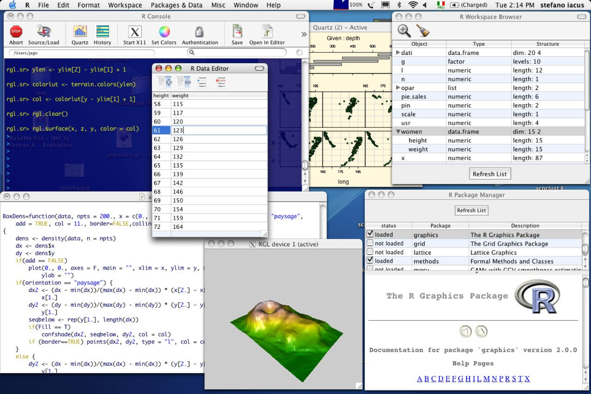
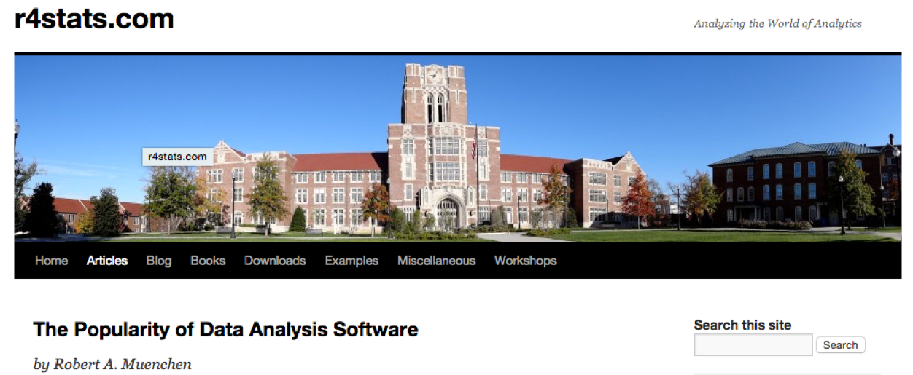
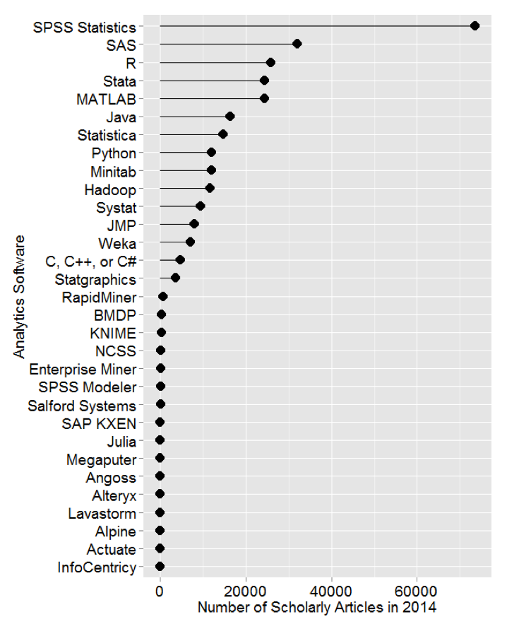
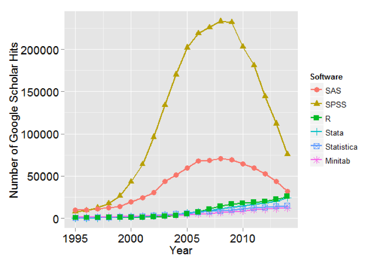

## Today's plan

1. Course website (UBLearns) and syllabus
2. What is R?
3. Who uses it?
4. Reproducible Research
5. Guided interactive coding


## Adam M. Wilson
<div class="columns-2">
Assistant Professor of Global Environmental Change<br>
Geography Department

I Use R:

* GIS (with a little GRASS)
* Statistics
* Graphs
* HTML/Websites (including this one!)

</div>

## Course Structure

Mondays 9:10-11:50 (2 hours 40 min)

* Review/Questions
* ~30 Minute Presentation
* Semi-guided interactive exercises on your laptops

## 3 Learning Objectives

1. Become familiar with R programming language
2. Learn to code geospatial analyses in R
3. Learn to develop reproducible research workflows

## This course is NOT
A statistics course (see GEO 505, etc.). 
We will focus on workflow and methods (‘how’ not ‘why’)

---

</img>
--Grolemund & Wickham, R for Data Science, O'Reilly 2016


## Why write code when you can click?

</img>

Graphical User Interfaces are useful, especially when you are learning...

## Reproducible Research

* The ability to reproduce results from an experiment or analysis conducted by another*
* Developed from literate programming:
* Logic of the analysis is represented in output 
* Combines computer code with narrative

## Typical GUI Workflow
</img>

## Organized and repeatable workflow
</img>


---

Learning a programming language can help you learn how to think logically.

<blockquote>
A man who does not know foreign language is ignorant of his own.
<br> -- Johann Wolfgang von Goethe (1749 - 1832)
</blockquote>


## From Graphical User Interface (GUI) to Scripting

</img>

---

Programming gives you access to more computer power.

<blockquote>
The computer is incredibly fast, accurate, and stupid. Man is unbelievably slow, inaccurate, and brilliant. The marriage of the two is a force beyond calculation. <br> -- Leo Cherne
</blockquote>


## Typical UB Geo Experience

### Software

* ArcGIS			  94%	
* Python			  29%	
* R				      29%	
* SPSS			    29%	
* Erdas Imagine		24%	

### Scripting

* Yes			71%	
* No			29%	

### Used R?

* No 			52%


## R Project for Statistical Computing

* Free and Open source
* Data manipulation
* Data analysis tools
* Great graphics
* Programming language
* 6,000+ free, community-contributed packages
* A supportive and increasing user community

R is a dialect of the S language  developed at Bell Laboratories (formerly AT&T) by John Chambers et. al. (same group developed C and UNIX©)

## What is the R environment?

* effective data handling and storage facility
* suite of operators for (vectorized) calculations
* large, coherent, integrated collection of tools for data analysis
* graphical capabilities (screen or hardcopy)
* well-developed, simple, and effective programming language which includes:
     * conditionals
     * loops
     * user defined functions
    * input and output facilities

## Reproducible, Portable, & Transparent

</img>

. . . all the code and data used to recreate the Mann’s original analysis has been made available to the public [...] Since the analysis is in R, anyone can replicate the results and examine the methods. 
(Matthew Pocernich, _R news_ 10/31/06). [link](http://www.cgd.ucar.edu/ccr/ammann/millennium/refs/WahlAmmann_ClimChange2006.html)

## R Graphics

### Custom graphics
</img>
[source](http://rpubs.com/bradleyboehmke/weather_graphic)  

---

### Spatial Data
</img>
[source](http://blog.revolutionanalytics.com/2009/01/r-graph-gallery.html)  


## Spatial data in R
Packages: sp, maptools, rgeos, raster, ggmap 
Examples:
 species range overlays

</img>
[source](http://www.nceas.ucsb.edu/)  


## Basemaps with ggmap
</img>
[source](http://journal.r-project.org/archive/2013-1/kahle-wickham.pdf)

## Parallel Processing
For BIG jobs:
multi-core processors / high performance computing with foreach.
</img>

## Strengths & Limitations

* Just-in-time compilation
     * Slower than compiled languages <i class="fa fa-thumbs-o-down" aria-hidden="true"></i>
     * Faster to compose <i class="fa fa-thumbs-o-up" aria-hidden="true"></i> 
* Many available packages <i class="fa fa-thumbs-o-up" aria-hidden="true"></i>
* Most operations conducted in RAM
     * RAM can be limiting and/or expensive <i class="fa fa-thumbs-o-down" aria-hidden="true"></i>
     * `Error: cannot allocate vector of size X Mb`
     * Various packages and clever programming can overcome this… <i class="fa fa-thumbs-o-up" aria-hidden="true"></i>
* Free like beer **AND** speech! <i class="fa fa-thumbs-o-up" aria-hidden="true"></i>

## R Interface

</img>

But there are other options...

## R in Mac
</img>

## R in Windows
</img>

## R Anywhere with </img>

</img>

Mac, Windows, Linux, and over the web…

## Who uses R?
</img>

(Feb 2014 [source](http://r4stats.com/articles/popularity/))
---

### “Analytics” Jobs on indeed.com 

</img>

(Feb 2014 [source](http://r4stats.com/articles/popularity/))

---

### Scholarly articles by software package
<div class="columns-2">

</img>

Number of scholarly articles found in the most recent complete year (2014) for each software package used as a topic or tool of analysis.  For methods see [here](http://r4stats.com/articles/how-to-search-for-analytics-articles/). (Feb 2014 [source](http://r4stats.com/articles/popularity/))
</div>

---

### Change in scholarly articles

</img>

The number of scholarly articles found in each year by Google Scholar. Only the top six “classic” statistics packages are shown. (Feb 2014 [source](http://r4stats.com/articles/popularity/))

---

</img>

The number of scholarly articles found in each year by Google Scholar (excluding SAS and SPSS). (Feb 2014 [source](http://r4stats.com/articles/popularity/))

---

### Forum/discussion activity

</img>

Sum of monthly email traffic on each software’s main listserv discussion list.
(Feb 2014 [source](http://r4stats.com/articles/popularity/))

---

</img>

Number of R- or SAS-related posts to Stack Overflow (programming and statistical topics) by week.
(Feb 2014 [source](http://r4stats.com/articles/popularity/))

---

### Rexer Analytics Data Miner Survey (2013)

</img>

~1.2k respondents 
(Feb 2014 [source](http://r4stats.com/articles/popularity/))
---

## 240 Books on R since 2000

</img>

---

## R Development

</img>

Number of R packages available on its main distribution site for the last version released in each year.

In 2014:

* SAS v9.3 added 1.2k commands (in Base, Stat, ETS, HP Forecasting, Graph, IML, Macro, OR, QC.) 
* R added 1.3k packages and ~27k functions. 

Over 6k packages! (Feb 2014 [source](http://r4stats.com/articles/popularity/))

### Task Views organize packages by topic
http://cran.r-project.org/web/views/ 

## Following Along
RStudio

## Following Along

# Course Logistics

## Assessment

* **Course Participation (10%)** Active participation
* **Package Presentation (10%)** Overview of a R package of your choice
* **Homeworks (30%)** 
* **Final Project (50%)** a poster/infographic of an analysis related to each student’s interest.  Report will be uploaded to UBlearns as a PDF file with RMarkdown source code.  This project can be related to the student’s own research or a separate topic.

## Homework
Working collaboratively is encouraged but you are responsible for developing your own code to answer the questions. 

* **Acceptable:** “which functions did you use to answer #4?” 
* **Unacceptable:**  “please email me your code for #4.”

## Homework format

```
#' ## Question 1
#' Load the iris dataset by running
## ------------------------------------------------------------------------
data(iris)
#' And read about the dataset in the documentation:
## ------------------------------------------------------------------------
?iris
#' > How many observations (rows) are there for the versicolor species?
#' _______________________
#' ## Question 2
#' Create a vector with the following values:  23, 45, 12, 89, 1, 13, 28, 18. 
"' Then multiply each element of the vector by 15.  
#' > What is the standard deviation of the new vector? 
```

## Questions?
