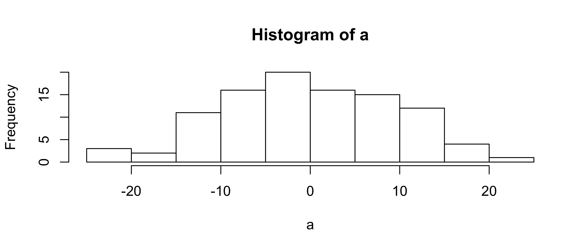

# Introduction to R


<div>
<object data="01_assets/01_Rintro.pdf" type="application/pdf" width="100%" height="600px"> 
  <p>It appears you don't have a PDF plugin for this browser.
   No biggie... you can <a href="01_assets/01_Rintro.pdf">click here to
  download the PDF file.</a></p>  
 </object>
 </div>
 <p><a href="01_assets/01_Rintro.pdf">Download the PDF of the presentation</a></p>  


# First Steps

[<i class="fa fa-file-code-o fa-3x" aria-hidden="true"></i> The R Script associated with this page is available here](01_Rintro.R).  Download this file and open it (or copy-paste into a new script) with RStudio so you can follow along.  

## Variables

```r
x=1
x
```

```
## [1] 1
```

We can also assign a vector to a variable:


```r
x=c(5,8,14,91,3,36,14,30)
x
```

```
## [1]  5  8 14 91  3 36 14 30
```

And do simple arithmetic:

```r
x+2
```

```
## [1]  7 10 16 93  5 38 16 32
```

<div class="well">
Create a new variable called `y` and set it to `15`

<button data-toggle="collapse" class="btn btn-primary btn-sm round" data-target="#demo1">Show Solution</button>
<div id="demo1" class="collapse">


```r
y=15
```
</div>
</div>


Note that `R` is case sensitive, if you ask for `X` instead of `x`, you will get an error

```r
X
Error: object 'X' not found
```


### Variable naming conventions

Naming your variables is your business, but there are [5 conventions](http://www.r-bloggers.com/consistent-naming-conventions-in-r/) to be aware of:

* **alllowercase**: _e.g._ `adjustcolor`
* **period.separated**: _e.g._ `plot.new`
* **underscore_separated**: _e.g._ `numeric_version`
* **lowerCamelCase**: _e.g._ `addTaskCallback`
* **UpperCamelCase**: _e.g._ `SignatureMethod`


# Subsetting

```r
x
```

```
## [1]  5  8 14 91  3 36 14 30
```

Subset the vector using `x[ ]` notation

```r
x[5]
```

```
## [1] 3
```
You can use a `:` to quickly generate a sequence:

```r
1:5
```

```
## [1] 1 2 3 4 5
```
and use that to subset as well:

```r
x[1:5]
```

```
## [1]  5  8 14 91  3
```

# Using Functions

To calculate the mean, you could do it _manually_ like this


```r
(5+8+14+91+3+36+14+30)/8
```

```
## [1] 25.125
```

Or use a function:

```r
mean(x)
```

```
## [1] 25.125
```

Type `?functionname` to get the documentation (`?mean`) or `??"search parameters` (??"standard deviation") to search the documentation.  In RStudio, you can also search in the help panel.  `mean` has other arguments too: 

`mean(x, trim = 0, na.rm = FALSE, ...)`

In RStudio, if you press `TAB` after a function name (such as `mean( `), it will show function arguments.

![Autocomplete screenshot][pic1]

[pic1]: img/autocomplete.png "Autocomplete Screenshot"


<div class="well">
Calculate the standard deviation of `c(3,6,12,89)`.    

<button data-toggle="collapse" class="btn btn-primary btn-sm round" data-target="#demo2">Show Solution</button>
<div id="demo2" class="collapse">


```r
y=c(3,6,12,89)
sqrt((sum((y-mean(y))^2))/(length(y)-1))
```

```
## [1] 41.17038
```

```r
#or
sd(y)
```

```
## [1] 41.17038
```

```r
#or
sd(c(3,6,12,89))
```

```
## [1] 41.17038
```
</div>
</div>


Writing functions in R is pretty easy.  Let's create one to calculate the mean of a vector by getting the sum and length.  First think about how to break it down into parts:

```r
x1= sum(x)
x2=length(x)
x1/x2
```

```
## [1] 25.125
```

Then put it all back together and create a new function called `mymean`:

```r
mymean=function(f){
  sum(f)/length(f)
}

mymean(f=x)
```

```
## [1] 25.125
```

Confirm it works:

```r
mean(x)
```

```
## [1] 25.125
```

<div class="well"> Any potential problems with the `mymean` function? </div>

# Missing data:  dealing with `NA` values

```r
x3=c(5,8,NA,91,3,NA,14,30,100)
```

<div class="well">" What do you think `mymean(x3)` will return? </div>

Calculate the mean using the new function

```r
mymean(x3)
```

```
## [1] NA
```
Use the built-in function (with and without na.rm=T)

```r
mean(x3)
```

```
## [1] NA
```

```r
mean(x3,na.rm=T)
```

```
## [1] 35.85714
```
Writing simple functions is easy, writing robust, reliable functions can be hard...


## Logical values

R also has standard conditional tests to generate `TRUE` or `FALSE` values (which also behave as `0`s and `1`s.  These are often useful for filtering data (e.g. identify all values greater than 5).  The logical operators are `<`, `<=`, `>`, `>=`, `==` for exact equality and `!=` for inequality.


```r
  x
```

```
## [1]  5  8 14 91  3 36 14 30
```

```r
  x3 > 75
```

```
## [1] FALSE FALSE    NA  TRUE FALSE    NA FALSE FALSE  TRUE
```

```r
  x3 == 40
```

```
## [1] FALSE FALSE    NA FALSE FALSE    NA FALSE FALSE FALSE
```

```r
  x3 >   15
```

```
## [1] FALSE FALSE    NA  TRUE FALSE    NA FALSE  TRUE  TRUE
```


And you can perform operations on those results:

```r
sum(x3>15,na.rm=T)
```

```
## [1] 3
```

or save the results as variables:

```r
result =  x3 >  3
result
```

```
## [1]  TRUE  TRUE    NA  TRUE FALSE    NA  TRUE  TRUE  TRUE
```

<div class="well">
Define a function that counts how many values in a vector are less than or equal (`<=`) to 12.  

<button data-toggle="collapse" class="btn btn-primary btn-sm round" data-target="#demo3">Show Solution</button>
<div id="demo3" class="collapse">


```r
mycount=function(x){
  sum(x<=12)
}
```
Try it:

```r
x3
```

```
## [1]   5   8  NA  91   3  NA  14  30 100
```

```r
mycount(x3)
```

```
## [1] NA
```
oops!


```r
mycount=function(x){
  sum(x<=12,na.rm=T)
}
```
Try it:

```r
x3
```

```
## [1]   5   8  NA  91   3  NA  14  30 100
```

```r
mycount(x3)
```

```
## [1] 3
```

Nice!
</div>
</div>


# Generating Data

There are many ways to generate data in R such as sequences:

```r
seq(from=0, to=1, by=0.25)
```

```
## [1] 0.00 0.25 0.50 0.75 1.00
```
and random numbers that follow a statistical distribution (such as the normal):


```r
a=rnorm(100,mean=0,sd=10)
```


Let's visualize those values in a histogram:

```r
hist(a)
```

<!-- -->

We'll cover much more sophisticated graphics later...

# Data Types

## Matrices
You can also use matrices (2-dimensional arrays of numbers):

```r
y=matrix(1:9,ncol=3)
y
```

```
##      [,1] [,2] [,3]
## [1,]    1    4    7
## [2,]    2    5    8
## [3,]    3    6    9
```


Matrices behave much like vectors:

```r
y+2
```

```
##      [,1] [,2] [,3]
## [1,]    3    6    9
## [2,]    4    7   10
## [3,]    5    8   11
```


and have 2-dimensional indexing:

```r
y[2,3]
```

```
## [1] 8
```

<div class="well">
Create a 3x3 matrix full of random numbers.  Hint: `rnorm(5)` will generate 5 random numbers

<button data-toggle="collapse" class="btn btn-primary btn-sm round" data-target="#demo4">Show Solution</button>
<div id="demo4" class="collapse">


```r
matrix(rnorm(9),nrow=3)
```

```
##            [,1]       [,2]       [,3]
## [1,]  0.2167471 1.70177257  0.9103663
## [2,]  0.8249060 0.00395252 -1.7969127
## [3,] -1.4223906 0.74245759  1.2705074
```
</div>
</div>

## Data Frames
Data frames are similar to matrices, but more flexible.  Matrices must be all the same type (e.g. all numbers), while a data frame can include multiple data types (e.g. text, factors, numbers). Dataframes are commonly used when doing statistical modeling in R.  


```r
data = data.frame( x = c(11,12,14),
                   y = c("a","b","b"),
                   z = c(T,F,T))
data
```

```
##    x y     z
## 1 11 a  TRUE
## 2 12 b FALSE
## 3 14 b  TRUE
```


You can subset in several ways

```r
mean(data$x)
```

```
## [1] 12.33333
```

```r
mean(data[["x"]])
```

```
## [1] 12.33333
```

```r
mean(data[,1])
```

```
## [1] 12.33333
```

# Loading Packages

For installed packages:  `library(packagename)`.

New packages: `install.packages()` or use the package manager. 


```r
library(raster)
```

> R may ask you to choose a CRAN mirror. CRAN is the distributed network of servers that provides access to R's software.  It doesn't really matter which you chose, but closer ones are likely to be faster.  From RStudio, you can select the mirror under Tools→Options or just wait until it asks you.


If you don't have the packages above, install them in the package manager or by running `install.packages("raster")`.

