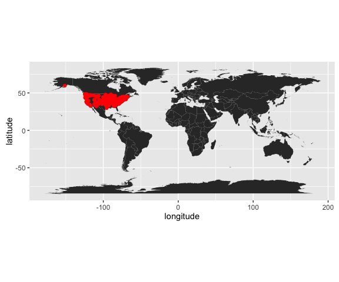

# Demo
Adam M. Wilson  
October 31, 2016  

# Introduction

The American Robin is a pretty bird (Figure 1).  

Figure 1: Licensed under CC BY-SA 3.0 via [Wikimedia Commons](https://commons.wikimedia.org/wiki/File:Turdus-migratorius-002.jpg#/media/File:Turdus-migratorius-002.jpg)

# Methods

I aquired all available occurrence records for the American robin (_Turdus migratorius_) from the [Global Biodiversity Information Facility](gbif.org) and mapped them.

## Results

<!-- -->

<!-- -->

The regression slope was -0.6019797.

## Conclusion

The spatial distribution of Turdus migratorius is mostly limited to the United states.  Or, more likely, these data are limited to the United States...

