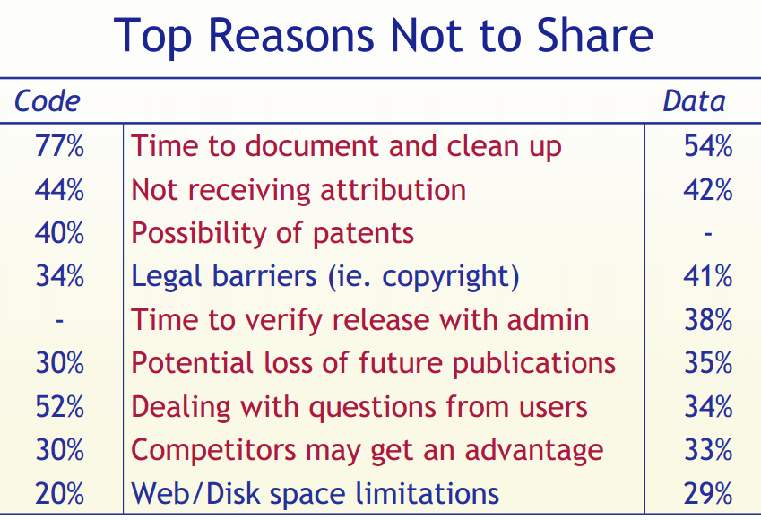
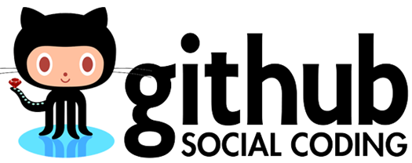

## The goal of reproducible research
> "The goal of reproducible research is to tie specific instructions to data analysis and experimental data so that scholarship can be recreated, better understood and verified."  <small> Max Kuhn, CRAN Task View: Reproducible Research </small>


## History of reproducible research

- Mathematics (400 BC?)
- Write scientific paper, Galileo, Pasteur, etc.  (1660s?)
- Publish a pidgin algorithm and describe simulation datasets (1950s?)
- Sell magtape of code and data (1970s?)
- Place idiosyncratic dataset & software at website (1990s?)
- Publish datasets and scripts at website, eg. biology, political science, genetics, statistics (2000s?)
- Hosted integrated code and data (2020s?)

<small>Gavish & Gonoho AAAS 2011, Oxberry 2013</small>


## Motivations: Claerbout's principle

> "An article about computational result is advertising, not scholarship. The actual scholarship is the full software environment, code and data, that produced the result." 
<br><small> Claerbout and Karrenbach, Proceedings of the 62nd Annual International Meeting of the Society of Exploration Geophysics. 1992</small>


## Benefits are straightforward

- **Verification & Reliability**: Find and fix bugs. Today's results == tomorrow's.
- **Transparency**: increased citation count, broader impact, improved institutional memory
- **Efficiency**: Reduces duplication of effort. Payoff in the (not so) long run
- **Flexibility**: When you don’t 'point-and-click' you gain many new analytic options.

## But limitations are substantial


**Technical**

- Classified/sensitive/big data
- Nondisclosure agreements & intellectual property 
- Competition
- Neither necessary nor sufficient for correctness (but useful in disputes)


**Cultural & personal**

- Few follow even minimal reproducibility standards.
- Few expect reproducibility 
- No uniform standards
- Inertia & embarassment


## Our work exists on a spectrum of reproducibility


<small>Peng 2011, Science 334(6060) pp. 1226-1227</small>


## Goal: expose more of the research workflow


<small><small>http://www.stodden.net/AMP2011/slides/pengslides.pdf</small></small>


## Common practices of many scientists  {.columns-2}
1. Enter data in Excel
2. Use Excel for data cleaning & descriptive statistics
2. Use ArcGIS and use point-and-click options for processing and visualization
3. Import data into SPSS/SAS/Stata for further analysis
4. Use point-and-click options to run statistical analyses
5. Copy & paste output to Word document, repeatedly

---

<small></small>

## Common practices of many scientists {.columns-2}

- Version control is ad hoc
- Excel handles missing data inconsistently and sometimes incorrectly 
- Excel uses poor algorithms for many functions
- Scripting is possible but rare 

---


## Click trails are ephemeral & dangerous {.columns-2}

- Lots of human effort for tedious & time-wasting tasks
- Error-prone due to manual & ad hoc data handling
- Difficult to record -  hard to reconstruct a 'click history'
- Tiny changes in data or method require extensive reworking


## Case study: Reinhart and Rogoff controversy 

- 2010: Claimed high debt-to-GDP ratios led to low GDP growth
- Threshold to growth at a debt-to-GDP ratio of >90%
- Substantial popular impact on autsterity politics 

---


---


Excel coding error sliced several countries out of the data set....
[The Economist](http://www.economist.com/news/finance-and-economics/21576362-seminal-analysis-relationship-between-debt-and-growth-comes-under)


## Case study: Seizure Medicine

#### 2013 Seizure study retracted after authors realize data got "terribly mixed"

> "The article has been retracted at the request of the authors. After carefully re-examining the data presented in the article, they identified that data of two different hospitals got terribly mixed. The published results cannot be reproduced in accordance with scientific and clinical correctness."" <small> Authors of Low Dose Lidocaine for Refractory Seizures in Preterm Neonates </small>

[Source](http://retractionwatch.com/2013/02/01/seizure-study-retracted-after-authors-realize-data-got-terribly-mixed/)


## Bad spreadsheet merge kills depression paper, quick fix resurrects it
Authors informed the journal that the merge of lab results and other survey data used in the paper resulted in an error regarding the identification codes. Results of the analyses were based on the data set in which this error occurred. 

> "**Lower** levels of CSF IL-6 were associated with current depression and with future depression […]" <small>Original conclusion</small>

> "**Higher** levels of CSF IL-6 and IL-8 were associated with current depression […]" <small> Revised conclusion </small>

[Source](http://retractionwatch.com/2014/07/01/bad-spreadsheet-merge-kills-depression-paper-quick-fix-resurrects-it/)


## Scripted analyses are superior  {.columns-2}

  


  - Plain text files readable for a _long_ time
  - Improved transparency, automation, maintanability, accessibility, standardisation, modularity, portability, efficiency, communicability of process (what more could we want?)
  - Steeper learning curve  


## Literate statistical programming 

> "Instead of imagining that our main task is to instruct a computer what to do, let us concentrate rather on explaining to humans what we want the computer to do." <small>Donald E. Knuth, Literate Programming, 1984</small>


For example...
If I say that 2 + 2 = 4, why would you believe me?


```r
2+2
```

```
## [1] 4
```
The text and R code are interwoven in the output.  The products are ephemeral - focus is on the methods!

## Literate statistical programming 

Of course `2+2` is trivial, but what if I said:


## Literate programming: pros and cons   {.columns-2}

**Pros**

- Text & code in one place, in logical order
- Tables and figures automatically updated
- Automatic test when building document


**Cons**

- Text and code in one place; can be hard to read
- Can slow down the processing of documents (use caching!)

## Depositing code and data

**Payoffs**
- Free space for hosting (and paid options)
- Assignment of persistent DOIs
- Tracking citation metrics 

**Costs**
- Sometimes license restrictions (CC-BY & CC0)
- Limited or no private storage space


## A hierarchy of reproducibility 

- **Good**: Use code with an integrated development environment (IDE). Minimize pointing and clicking (RStudio)
- **Better**: Use version control. Help yourself keep track of changes, fix bugs and improve project management (RStudio & Git & GitHub or BitBucket)
- **Best**: Use embedded narrative and code to explicitly link code, text and data, save yourself time, save reviewers time, improve your code. (RStudio & Git & GitHub or BitBucket & rmarkdown & knitr & data repository)

##


<small>Stodden (IASSIST 2010) sampled American academics registered at the Machine Learning conference NIPS (134 responses from 593 requests (23%). Red = communitarian norms, Blue = private incentives</small>

##



<small>Stodden (IASSIST 2010) sampled American academics registered at the Machine Learning conference NIPS (134 responses from 593 requests (23%). Red = communitarian norms, Blue = private incentives</small>


## Standards to normalise reproducible research

Reproducible Research Standard (Stodden 2009)

- The full compendium on the internet
- Media such as text, figures, tables with Creative Commons Attribution license (CC-BY) 
 - Code with one of Apache 2.0, MIT, LGPL, BSD, etc.
 - Original "selection and arrangement" of data with CC0 or CC-BY

## Biggest challenge: culture change

Promote culture change through positive attribution 

Implement mechanisms to indicate & encourage **degrees of compliance** (ie. clear definitions for different levels of reproducibility), cf. Stodden's:

 - **'Reproducible'**: compendium of text-code-data online
 - **'Reproduced'**: compendium available and independently reproduced 
 - **'Semi-Reproducible'**: when the full compendium is not released
 - **'Semi-Reproduced'**: independent reproduction with other data
 - **'Perpetually Reproducible'**: streaming data


# Reproducible Research in R

## Need a programming language  {.columns-2}

The machine-readable part: R

* R: Free, open source, cross-platform, highly interactive, huge user community in academica and private sector
* R packages an ideal 'Compendium'?
* Scriptability → R
* Literate programming → R Markdown
* Version control → Git / GitHub

## Need a document formatting language  {.columns-2}


Markdown: lightweight document formatting syntax. Easy to write, read and publish as-is.

The human-readable part:

- minor extensions to allow R code display and execution
- embed images in html files (convenient for sharing)
- equations
-  `*` for bullet,  `_` for underline

## Dynamic documents in R  {.columns-2}

`knitr` - descendant of Sweave  

Engine for dynamic report generation in R


- Narrative and code in the same file or explicitly linked
- When data or narrative are updated, the document is automatically updated
- Data treated as 'read only'
- Output treated as disposable

## Pandoc: document converter  {.columns-2}


<small><small><small>http://kieranhealy.org/blog/archives/2014/01/23/plain-text/ </small></small></small>

---

A universal document converter, open source, cross-platform

* Write code and narrative in rmarkdown   
* knitr->markdown (with computation)   
* use pandoc to get HTML/PDF/DOCX

# Version Control

## Tracking changes with version control 

**Payoffs**

- Eases collaboration
- Can track changes in any file type (ideally plain text)
- Can revert file to any point in its tracked history

**Costs**
- Learning curve





## Environment for reproducible research   {.columns-2}


* integrated R console
* deep support for markdown and git
* package development tools, etc. etc.

> RStudio 'projects' make version control & document preparation simple


##  Final

> Abandoning the habit of secrecy in favor of process transparency and peer review was the crucial step by which alchemy became chemistry.  <br> <small>Raymond, E. S., 2004, The art of UNIX programming: Addison-Wesley.</small>

## Colophon

* [Slides based on Ben Marwick's presentation to the UW Center for Statistics and Social Sciences (12 March 2014)](https://github.com/benmarwick/CSSS-Primer-Reproducible-Research) ([OrcID](http://orcid.org/0000-0001-7879-4531))

**References:** See Rmd file for full references and sources


