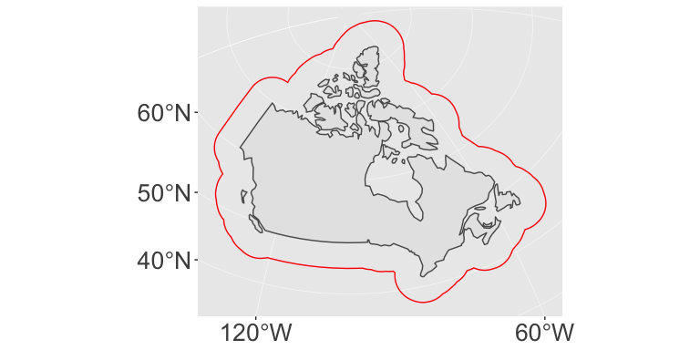
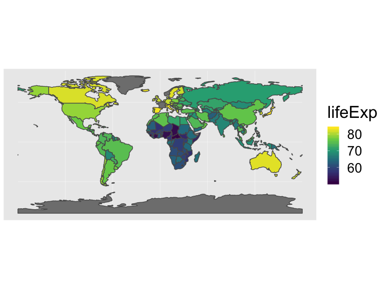

---

# Course Logistics Reminder

## Project Proposal

Start thinking about:

* Question you want to answer
* Problem you want to solve

## Link to this script

[<i class="fa fa-desktop"></i> If interested, you can download the R script associated with this presentation here](PS_08_sf.Rmd).


## {data-background-iframe="https://cran.r-project.org/web/views/"}

## Code Reading Challenge

Write out in a sentence what this code is doing. Make sure to catch the key points in your sentence


```r
library(downloader)
library(sf)
library(fs)
dams_path <- "https://research.idwr.idaho.gov/gis/Spatial/DamSafety/dam.zip"
df <- tempfile(); uf <- tempfile()
download(dams_path, df, mode = "wb")
unzip(df, exdir = uf)
dams <- read_sf(uf)
file_delete(df); dir_delete(uf)
```

# Working with Spatial Data in R

## Available Packages

* `sp`  First major spatial data package/format
* `rgdal` reading and writing spatial data
* `rgeos` Interface to open-source geometry engine (GEOS)
* `sf` Spatial Features in the 'tidyverse'
* `raster` gridded data (like satellite imagery)
* and a few others...

---

## What is a Spatial Feature (sf)?

Typically an object in the real world, such as a building or a tree. 

Features could include:

* a forest (polygon)
* a tree in the forest (point or polygon)
* a branch on the tree (line?)
* a complete image (multipoint, polygon, raster)
* a satellite image pixel of that forest (point or polgyon or raster)

## Spatial Features

What information do we need to store in order to define points, lines, polygons in geographic space?

 - lat/lon coordinates
 - projection
 - what type (point/line/poly)
 - if polygon, is it a hole or not
 - attribute data
 - ... ?

---

## Geometry

Features have a _geometry_ describing _where_ on Earth the
feature is located, and they have attributes, which describe other
properties. 

A Tree: 

* delineation of its crown
* its stem
* point indicating its centre

Attributes:

* species 
* height
* diameter
* date of observation
* ...

## Spatial Feature Standard

"_A simple feature is defined by the OpenGIS Abstract specification to have both spatial and non-spatial attributes. Spatial attributes are geometry valued, and simple features are based on 2D geometry with linear interpolation between vertices._"  

## Dimensions

All geometries composed of points: coordinates in 2-, 3- or 4-dimensional space.  

* **X** coordinate in X direction (typically longitude or similar)
* **Y** coordinate in Y direction (typically latitude or similar)
* **Z** coordinate denoting altitude
* **M** coordinate (rarely used), denoting some _measure_ that is associated with the point, rather than with the feature as a whole (in which case it would be a feature attribute); examples could be time of measurement, or measurement error.

## Dimensions

The four possible cases then are:

1. 2D (XY): x and y, easting and northing, or longitude and latitude
2. 3D (XYZ): three-dimensional points
3. 3D (XYM): three-dimensional points where 3rd is some attribute space
4. 4D (XYZM): four-dimensional points as XYZM (the third axis is Z, fourth M)

## Common Simple Feature (SF) types


## Seven common Simple Feature (SF) geometry types

| type | description |
| ---- | ----------- |
| `POINT` | a single point |
| `LINESTRING` | sequence of points connected by lines |
| `POLYGON` | sequence of points form a closed ring |
| `MULTIPOINT` | set of points |
| `MULTILINESTRING` | set of linestrings |
| `MULTIPOLYGON` | set of polygons |
| `GEOMETRYCOLLECTION` | set of geometries |

Some formats only include these (e.g. [GeoJSON](https://tools.ietf.org/html/rfc7946))


## Uncommon Geometry Types 
10 more geometries 10 are rare:

* `CIRCULARSTRING`
* `COMPOUNDCURVE` 
* `CURVEPOLYGON` 
* `MULTICURVE` 
* `MULTISURFACE` 
* `CURVE` 
* `SURFACE` 
* `POLYHEDRALSURFACE` 
* `TIN` 
* `TRIANGLE`

---
## Coordinate reference system

SFs can only be placed on the Earth's surface when their coordinate
reference system (CRS) is known; this may be an elipsoidal CRS such as WGS84, a projected, two-dimensional (Cartesian) CRS such as a UTM zone or Web Mercator, or a CRS
in three-dimensions or [including time](http://www.faculty.jacobs-university.de/pbaumann/iu-bremen.de_pbaumann/Papers/acmgis-2012_crs-nts.pdf). Similarly, M-coordinates need an attribute reference
system, e.g. a [measurement unit](https://CRAN.R-project.org/package=units).


---

There are currently two main approaches in R to handle geographic vector data. 

---

## `sp` package

First package for spatial data: [`sp`](https://cran.r-project.org/package=sp). Provides classes and methods to create _points_, _lines_, _polygons_, and _grids_ and to operate on them. 

~350 of the spatial analysis packages use `sp` data types, so it is important to know how to convert **sp** to and from **sf** objects.


## `sf` package

[`sf`](https://cran.r-project.org/package=sf) implements a formal standard called ["Simple Features"](https://en.wikipedia.org/wiki/Simple_Features) that specifies a storage and access model of spatial geometries (point, line, polygon). 

A feature geometry is called simple when it consists of points connected by straight line pieces, and does not intersect itself. 

This standard has been adopted widely, not only by spatial databases such as PostGIS, but also more recent standards such as GeoJSON. 

## How simple features in R are organized

All spatial functions and methods in `sf` prefixed by `st_` (refering to _spatial and temporal_)

Simple features are implemented as R native data, using simple data structures (S3 classes, lists,
matrix, vector).  

---

Stored as `data.frame` objects (or very similar `tbl_df`) with _feature geometries in
a `data.frame` column_. 

Since geometries are not single-valued,
they are put in a list-column, a list of length equal to the number
of records in the `data.frame`, with each list element holding the simple
feature geometry of that feature.  

## Components

* `sf`, the table (`data.frame`) with feature attributes and feature geometries, which contains
* `sfc`, the list-column with the geometries for each feature (record), which is composed of
* `sfg`, the feature geometry of an individual simple feature.

---

If you work with PostGis or GeoJSON you may have come across the [WKT (well-known text)](https://en.wikipedia.org/wiki/Well-known_text) format, for example like these: 

    POINT (30 10)
    LINESTRING (30 10, 10 30, 40 40)
    POLYGON ((30 10, 40 40, 20 40, 10 20, 30 10))

`sf` implements this standard natively in R. Data are structured and conceptualized very differently from the `sp` approach.

---

## I. Create geometric objects (topology)  

Geometric objects (simple features) can be created from a numeric vector, matrix or a list with the coordinates. They are called `sfg` objects for Simple Feature Geometry.

Create a LINESTRING `sfg` object:

```r
xy=matrix(runif(6), ncol=2)
xy
```

```
##           [,1]      [,2]
## [1,] 0.3046195 0.5242276
## [2,] 0.2268402 0.9591672
## [3,] 0.6675886 0.9305813
```

```r
lnstr_sfg <- st_linestring(xy) 
class(lnstr_sfg)
```

```
## [1] "XY"         "LINESTRING" "sfg"
```

```r
lnstr_sfg
```

```
## LINESTRING (0.3046195 0.5242276, 0.2268402 0.9591672, 0.6675886 0.9305813)
```

---

## II. Combine all individual single feature objects for the special column. 

Create a `sfc` (Simple Feature Collection) object of individual features:

```r
lnstr_sfc <- st_sfc(lnstr_sfg) # just one feature here
class(lnstr_sfc)
```

```
## [1] "sfc_LINESTRING" "sfc"
```

```r
lnstr_sfc
```

```
## Geometry set for 1 feature 
## geometry type:  LINESTRING
## dimension:      XY
## bbox:           xmin: 0.2268402 ymin: 0.5242276 xmax: 0.6675886 ymax: 0.9591672
## epsg (SRID):    NA
## proj4string:    NA
```

```
## LINESTRING (0.3046195 0.5242276, 0.2268402 0.95...
```
The `sfc` object also holds the bounding box and the projection information.


## III. Add attributes. 

Add attributes (in a `data.frame`) to the `sfc` object to make a `sf` (Simple Features) object:


```r
dfr=data.frame(type="random")
lnstr_sf <- st_sf(dfr , lnstr_sfc)
class(lnstr_sf)
```

```
## [1] "sf"         "data.frame"
```

```r
lnstr_sf
```

```
## Simple feature collection with 1 feature and 1 field
## geometry type:  LINESTRING
## dimension:      XY
## bbox:           xmin: 0.2268402 ymin: 0.5242276 xmax: 0.6675886 ymax: 0.9591672
## epsg (SRID):    NA
## proj4string:    NA
##     type                      lnstr_sfc
## 1 random LINESTRING (0.3046195 0.524...
```

---
<table>
 <thead>
  <tr>
   <th style="text-align:left;"> type </th>
   <th style="text-align:left;"> lnstr_sfc </th>
  </tr>
 </thead>
<tbody>
  <tr>
   <td style="text-align:left;"> random </td>
   <td style="text-align:left;"> c(0.304619457572699, 0.226840248797089, 0.667588643264025, 0.524227628484368, 0.959167186170816, 0.930581306573004) </td>
  </tr>
</tbody>
</table>

---

## sf Highlights

* provides **fast** I/O, particularly relevant for large files 
* directly reads from and writes to spatial **databases** such as PostGIS
* compatibile with the *tidyverse*
* recent `ggplot` release can read and plot the `sf` format without conversion

---

`sp` and `sf` are _not_ only formats for spatial objects. Other spatial packages may use their own class definitions for spatial data (for example `spatstat`). Usually you can find functions that convert `sp` and increasingly `sf` objects to and from these formats.

## Converting formats 


```r
data(world) #load 'world' data from spData package
world_sp = as(world, "Spatial") # convert from sf to sp
world_sf = st_as_sf(world_sp) #convert from sp to sf
str(world_sp)
```

```
## Formal class 'SpatialPolygonsDataFrame' [package "sp"] with 5 slots
##   ..@ data       :'data.frame':	177 obs. of  10 variables:
##   .. ..$ iso_a2   : chr [1:177] "FJ" "TZ" "EH" "CA" ...
##   .. ..$ name_long: chr [1:177] "Fiji" "Tanzania" "Western Sahara" "Canada" ...
##   .. ..$ continent: chr [1:177] "Oceania" "Africa" "Africa" "North America" ...
##   .. ..$ region_un: chr [1:177] "Oceania" "Africa" "Africa" "Americas" ...
##   .. ..$ subregion: chr [1:177] "Melanesia" "Eastern Africa" "Northern Africa" "Northern America" ...
##   .. ..$ type     : chr [1:177] "Sovereign country" "Sovereign country" "Indeterminate" "Sovereign country" ...
##   .. ..$ area_km2 : num [1:177] 19290 932746 96271 10036043 9510744 ...
##   .. ..$ pop      : num [1:177] 8.86e+05 5.22e+07 NA 3.55e+07 3.19e+08 ...
##   .. ..$ lifeExp  : num [1:177] 70 64.2 NA 82 78.8 ...
##   .. ..$ gdpPercap: num [1:177] 8222 2402 NA 43079 51922 ...
##   ..@ polygons   :List of 177
##   .. ..$ :Formal class 'Polygons' [package "sp"] with 5 slots
##   .. .. .. ..@ Polygons :List of 3
##   .. .. .. .. ..$ :Formal class 'Polygon' [package "sp"] with 5 slots
##   .. .. .. .. .. .. ..@ labpt  : num [1:2] 179.3 -16.6
##   .. .. .. .. .. .. ..@ area   : num 0.589
##   .. .. .. .. .. .. ..@ hole   : logi FALSE
##   .. .. .. .. .. .. ..@ ringDir: int 1
##   .. .. .. .. .. .. ..@ coords : num [1:8, 1:2] 180 180 179 179 179 ...
##   .. .. .. .. ..$ :Formal class 'Polygon' [package "sp"] with 5 slots
##   .. .. .. .. .. .. ..@ labpt  : num [1:2] 178 -17.8
##   .. .. .. .. .. .. ..@ area   : num 0.984
##   .. .. .. .. .. .. ..@ hole   : logi FALSE
##   .. .. .. .. .. .. ..@ ringDir: int 1
##   .. .. .. .. .. .. ..@ coords : num [1:9, 1:2] 178 178 179 179 178 ...
##   .. .. .. .. ..$ :Formal class 'Polygon' [package "sp"] with 5 slots
##   .. .. .. .. .. .. ..@ labpt  : num [1:2] -179.9 -16.3
##   .. .. .. .. .. .. ..@ area   : num 0.067
##   .. .. .. .. .. .. ..@ hole   : logi FALSE
##   .. .. .. .. .. .. ..@ ringDir: int 1
##   .. .. .. .. .. .. ..@ coords : num [1:5, 1:2] -180 -180 -180 -180 -180 ...
##   .. .. .. ..@ plotOrder: int [1:3] 2 1 3
##   .. .. .. ..@ labpt    : num [1:2] 178 -17.8
##   .. .. .. ..@ ID       : chr "1"
##   .. .. .. ..@ area     : num 1.64
##   .. ..$ :Formal class 'Polygons' [package "sp"] with 5 slots
##   .. .. .. ..@ Polygons :List of 1
##   .. .. .. .. ..$ :Formal class 'Polygon' [package "sp"] with 5 slots
##   .. .. .. .. .. .. ..@ labpt  : num [1:2] 34.75 -6.26
##   .. .. .. .. .. .. ..@ area   : num 76.3
##   .. .. .. .. .. .. ..@ hole   : logi FALSE
##   .. .. .. .. .. .. ..@ ringDir: int 1
##   .. .. .. .. .. .. ..@ coords : num [1:52, 1:2] 33.9 34.1 37.7 37.8 39.2 ...
##   .. .. .. ..@ plotOrder: int 1
##   .. .. .. ..@ labpt    : num [1:2] 34.75 -6.26
##   .. .. .. ..@ ID       : chr "2"
##   .. .. .. ..@ area     : num 76.3
##   .. ..$ :Formal class 'Polygons' [package "sp"] with 5 slots
##   .. .. .. ..@ Polygons :List of 1
##   .. .. .. .. ..$ :Formal class 'Polygon' [package "sp"] with 5 slots
##   .. .. .. .. .. .. ..@ labpt  : num [1:2] -12.1 24.3
##   .. .. .. .. .. .. ..@ area   : num 8.6
##   .. .. .. .. .. .. ..@ hole   : logi FALSE
##   .. .. .. .. .. .. ..@ ringDir: int 1
##   .. .. .. .. .. .. ..@ coords : num [1:28, 1:2] -8.67 -8.67 -8.68 -8.69 -11.97 ...
##   .. .. .. ..@ plotOrder: int 1
##   .. .. .. ..@ labpt    : num [1:2] -12.1 24.3
##   .. .. .. ..@ ID       : chr "3"
##   .. .. .. ..@ area     : num 8.6
##   .. ..$ :Formal class 'Polygons' [package "sp"] with 5 slots
##   .. .. .. ..@ Polygons :List of 30
##   .. .. .. .. ..$ :Formal class 'Polygon' [package "sp"] with 5 slots
##   .. .. .. .. .. .. ..@ labpt  : num [1:2] -101.6 57.7
##   .. .. .. .. .. .. ..@ area   : num 1281
##   .. .. .. .. .. .. ..@ hole   : logi FALSE
##   .. .. .. .. .. .. ..@ ringDir: int 1
##   .. .. .. .. .. .. ..@ coords : num [1:274, 1:2] -123 -123 -125 -126 -127 ...
##   .. .. .. .. ..$ :Formal class 'Polygon' [package "sp"] with 5 slots
##   .. .. .. .. .. .. ..@ labpt  : num [1:2] -83 62.6
##   .. .. .. .. .. .. ..@ area   : num 1.04
##   .. .. .. .. .. .. ..@ hole   : logi FALSE
##   .. .. .. .. .. .. ..@ ringDir: int 1
##   .. .. .. .. .. .. ..@ coords : num [1:7, 1:2] -84 -83.3 -81.9 -81.9 -83.1 ...
##   .. .. .. .. ..$ :Formal class 'Polygon' [package "sp"] with 5 slots
##   .. .. .. .. .. .. ..@ labpt  : num [1:2] -78.8 73.2
##   .. .. .. .. .. .. ..@ area   : num 3.15
##   .. .. .. .. .. .. ..@ hole   : logi FALSE
##   .. .. .. .. .. .. ..@ ringDir: int 1
##   .. .. .. .. .. .. ..@ coords : num [1:11, 1:2] -79.8 -80.9 -80.8 -80.4 -78.1 ...
##   .. .. .. .. ..$ :Formal class 'Polygon' [package "sp"] with 5 slots
##   .. .. .. .. .. .. ..@ labpt  : num [1:2] -79.8 62
##   .. .. .. .. .. .. ..@ area   : num 0.532
##   .. .. .. .. .. .. ..@ hole   : logi FALSE
##   .. .. .. .. .. .. ..@ ringDir: int 1
##   .. .. .. .. .. .. ..@ coords : num [1:8, 1:2] -80.3 -79.9 -79.5 -79.3 -79.7 ...
##   .. .. .. .. ..$ :Formal class 'Polygon' [package "sp"] with 5 slots
##   .. .. .. .. .. .. ..@ labpt  : num [1:2] -95.1 75.1
##   .. .. .. .. .. .. ..@ area   : num 2.18
##   .. .. .. .. .. .. ..@ hole   : logi FALSE
##   .. .. .. .. .. .. ..@ ringDir: int 1
##   .. .. .. .. .. .. ..@ coords : num [1:8, 1:2] -93.6 -94.2 -95.6 -96.8 -96.3 ...
##   .. .. .. .. ..$ :Formal class 'Polygon' [package "sp"] with 5 slots
##   .. .. .. .. .. .. ..@ labpt  : num [1:2] -95.1 77.7
##   .. .. .. .. .. .. ..@ area   : num 0.711
##   .. .. .. .. .. .. ..@ hole   : logi FALSE
##   .. .. .. .. .. .. ..@ ringDir: int 1
##   .. .. .. .. .. .. ..@ coords : num [1:7, 1:2] -93.8 -94.3 -96.2 -96.4 -94.4 ...
##   .. .. .. .. ..$ :Formal class 'Polygon' [package "sp"] with 5 slots
##   .. .. .. .. .. .. ..@ labpt  : num [1:2] -97.2 78.4
##   .. .. .. .. .. .. ..@ area   : num 2.14
##   .. .. .. .. .. .. ..@ hole   : logi FALSE
##   .. .. .. .. .. .. ..@ ringDir: int 1
##   .. .. .. .. .. .. ..@ coords : num [1:9, 1:2] -96.8 -95.6 -95.8 -97.3 -98.1 ...
##   .. .. .. .. ..$ :Formal class 'Polygon' [package "sp"] with 5 slots
##   .. .. .. .. .. .. ..@ labpt  : num [1:2] -88.1 75.4
##   .. .. .. .. .. .. ..@ area   : num 19.2
##   .. .. .. .. .. .. ..@ hole   : logi FALSE
##   .. .. .. .. .. .. ..@ ringDir: int 1
##   .. .. .. .. .. .. ..@ coords : num [1:28, 1:2] -88.2 -89.8 -92.4 -92.8 -92.9 ...
##   .. .. .. .. ..$ :Formal class 'Polygon' [package "sp"] with 5 slots
##   .. .. .. .. .. .. ..@ labpt  : num [1:2] -111.7 77.8
##   .. .. .. .. .. .. ..@ area   : num 1.69
##   .. .. .. .. .. .. ..@ hole   : logi FALSE
##   .. .. .. .. .. .. ..@ ringDir: int 1
##   .. .. .. .. .. .. ..@ coords : num [1:7, 1:2] -111 -110 -110 -112 -114 ...
##   .. .. .. .. ..$ :Formal class 'Polygon' [package "sp"] with 5 slots
##   .. .. .. .. .. .. ..@ labpt  : num [1:2] -111.3 78.6
##   .. .. .. .. .. .. ..@ area   : num 0.793
##   .. .. .. .. .. .. ..@ hole   : logi FALSE
##   .. .. .. .. .. .. ..@ ringDir: int 1
##   .. .. .. .. .. .. ..@ coords : num [1:7, 1:2] -111 -110 -111 -113 -113 ...
##   .. .. .. .. ..$ :Formal class 'Polygon' [package "sp"] with 5 slots
##   .. .. .. .. .. .. ..@ labpt  : num [1:2] -56 48.7
##   .. .. .. .. .. .. ..@ area   : num 15.2
##   .. .. .. .. .. .. ..@ hole   : logi FALSE
##   .. .. .. .. .. .. ..@ ringDir: int 1
##   .. .. .. .. .. .. ..@ coords : num [1:33, 1:2] -55.6 -56.1 -56.8 -56.1 -55.5 ...
##   .. .. .. .. ..$ :Formal class 'Polygon' [package "sp"] with 5 slots
##   .. .. .. .. .. .. ..@ labpt  : num [1:2] -84.1 64.3
##   .. .. .. .. .. .. ..@ area   : num 7.97
##   .. .. .. .. .. .. ..@ hole   : logi FALSE
##   .. .. .. .. .. .. ..@ ringDir: int 1
##   .. .. .. .. .. .. ..@ coords : num [1:20, 1:2] -83.9 -82.8 -81.6 -81.6 -80.8 ...
##   .. .. .. .. ..$ :Formal class 'Polygon' [package "sp"] with 5 slots
##   .. .. .. .. .. .. ..@ labpt  : num [1:2] -74.9 68.6
##   .. .. .. .. .. .. ..@ area   : num 118
##   .. .. .. .. .. .. ..@ hole   : logi FALSE
##   .. .. .. .. .. .. ..@ ringDir: int 1
##   .. .. .. .. .. .. ..@ coords : num [1:73, 1:2] -78.8 -77.8 -75.6 -74.2 -74.1 ...
##   .. .. .. .. ..$ :Formal class 'Polygon' [package "sp"] with 5 slots
##   .. .. .. .. .. .. ..@ labpt  : num [1:2] -93.8 73.3
##   .. .. .. .. .. .. ..@ area   : num 7.12
##   .. .. .. .. .. .. ..@ hole   : logi FALSE
##   .. .. .. .. .. .. ..@ ringDir: int 1
##   .. .. .. .. .. .. ..@ coords : num [1:11, 1:2] -94.5 -92.4 -90.5 -92 -93.2 ...
##   .. .. .. .. ..$ :Formal class 'Polygon' [package "sp"] with 5 slots
##   .. .. .. .. .. .. ..@ labpt  : num [1:2] -119.2 76.8
##   .. .. .. .. .. .. ..@ area   : num 6.08
##   .. .. .. .. .. .. ..@ hole   : logi FALSE
##   .. .. .. .. .. .. ..@ ringDir: int 1
##   .. .. .. .. .. .. ..@ coords : num [1:12, 1:2] -123 -123 -121 -119 -118 ...
##   .. .. .. .. ..$ :Formal class 'Polygon' [package "sp"] with 5 slots
##   .. .. .. .. .. .. ..@ labpt  : num [1:2] -132.3 53.4
##   .. .. .. .. .. .. ..@ area   : num 1.57
##   .. .. .. .. .. .. ..@ hole   : logi FALSE
##   .. .. .. .. .. .. ..@ ringDir: int 1
##   .. .. .. .. .. .. ..@ coords : num [1:11, 1:2] -133 -132 -132 -131 -132 ...
##   .. .. .. .. ..$ :Formal class 'Polygon' [package "sp"] with 5 slots
##   .. .. .. .. .. .. ..@ labpt  : num [1:2] -102.6 78.6
##   .. .. .. .. .. .. ..@ area   : num 3.98
##   .. .. .. .. .. .. ..@ hole   : logi FALSE
##   .. .. .. .. .. .. ..@ ringDir: int 1
##   .. .. .. .. .. .. ..@ coords : num [1:11, 1:2] -105.5 -103.5 -100.8 -100.1 -99.7 ...
##   .. .. .. .. ..$ :Formal class 'Polygon' [package "sp"] with 5 slots
##   .. .. .. .. .. .. ..@ labpt  : num [1:2] -126 49.6
##   .. .. .. .. .. .. ..@ area   : num 4.06
##   .. .. .. .. .. .. ..@ hole   : logi FALSE
##   .. .. .. .. .. .. ..@ ringDir: int 1
##   .. .. .. .. .. .. ..@ coords : num [1:16, 1:2] -124 -124 -126 -126 -127 ...
##   .. .. .. .. ..$ :Formal class 'Polygon' [package "sp"] with 5 slots
##   .. .. .. .. .. .. ..@ labpt  : num [1:2] -121.5 72.9
##   .. .. .. .. .. .. ..@ area   : num 20.1
##   .. .. .. .. .. .. ..@ hole   : logi FALSE
##   .. .. .. .. .. .. ..@ ringDir: int 1
##   .. .. .. .. .. .. ..@ coords : num [1:17, 1:2] -122 -120 -118 -117 -116 ...
##   .. .. .. .. ..$ :Formal class 'Polygon' [package "sp"] with 5 slots
##   .. .. .. .. .. .. ..@ labpt  : num [1:2] -111.6 75.5
##   .. .. .. .. .. .. ..@ area   : num 14.3
##   .. .. .. .. .. .. ..@ hole   : logi FALSE
##   .. .. .. .. .. .. ..@ ringDir: int 1
##   .. .. .. .. .. .. ..@ coords : num [1:22, 1:2] -108 -107 -106 -106 -106 ...
##   .. .. .. .. ..$ :Formal class 'Polygon' [package "sp"] with 5 slots
##   .. .. .. .. .. .. ..@ labpt  : num [1:2] -110.5 70.8
##   .. .. .. .. .. .. ..@ area   : num 54.4
##   .. .. .. .. .. .. ..@ hole   : logi FALSE
##   .. .. .. .. .. .. ..@ ringDir: int 1
##   .. .. .. .. .. .. ..@ coords : num [1:45, 1:2] -107 -105 -105 -104 -103 ...
##   .. .. .. .. ..$ :Formal class 'Polygon' [package "sp"] with 5 slots
##   .. .. .. .. .. .. ..@ labpt  : num [1:2] -99.2 72.6
##   .. .. .. .. .. .. ..@ area   : num 9.4
##   .. .. .. .. .. .. ..@ hole   : logi FALSE
##   .. .. .. .. .. .. ..@ ringDir: int 1
##   .. .. .. .. .. .. ..@ coords : num [1:15, 1:2] -100.4 -101.5 -100.4 -99.2 -97.4 ...
##   .. .. .. .. ..$ :Formal class 'Polygon' [package "sp"] with 5 slots
##   .. .. .. .. .. .. ..@ labpt  : num [1:2] -105.6 73.3
##   .. .. .. .. .. .. ..@ area   : num 1.16
##   .. .. .. .. .. .. ..@ hole   : logi FALSE
##   .. .. .. .. .. .. ..@ ringDir: int 1
##   .. .. .. .. .. .. ..@ coords : num [1:6, 1:2] -107 -105 -104 -105 -107 ...
##   .. .. .. .. ..$ :Formal class 'Polygon' [package "sp"] with 5 slots
##   .. .. .. .. .. .. ..@ labpt  : num [1:2] -99.8 75.8
##   .. .. .. .. .. .. ..@ area   : num 6.11
##   .. .. .. .. .. .. ..@ hole   : logi FALSE
##   .. .. .. .. .. .. ..@ ringDir: int 1
##   .. .. .. .. .. .. ..@ coords : num [1:13, 1:2] -98.5 -97.7 -97.7 -98.2 -99.8 ...
##   .. .. .. .. ..$ :Formal class 'Polygon' [package "sp"] with 5 slots
##   .. .. .. .. .. .. ..@ labpt  : num [1:2] -91.6 79.7
##   .. .. .. .. .. .. ..@ area   : num 19.4
##   .. .. .. .. .. .. ..@ hole   : logi FALSE
##   .. .. .. .. .. .. ..@ ringDir: int 1
##   .. .. .. .. .. .. ..@ coords : num [1:21, 1:2] -96 -95.3 -94.3 -94.7 -92.4 ...
##   .. .. .. .. ..$ :Formal class 'Polygon' [package "sp"] with 5 slots
##   .. .. .. .. .. .. ..@ labpt  : num [1:2] -78.6 80.4
##   .. .. .. .. .. .. ..@ area   : num 105
##   .. .. .. .. .. .. ..@ hole   : logi FALSE
##   .. .. .. .. .. .. ..@ ringDir: int 1
##   .. .. .. .. .. .. ..@ coords : num [1:65, 1:2] -91.6 -90.1 -88.9 -87 -85.5 ...
##   .. .. .. .. ..$ :Formal class 'Polygon' [package "sp"] with 5 slots
##   .. .. .. .. .. .. ..@ labpt  : num [1:2] -76.2 67.7
##   .. .. .. .. .. .. ..@ area   : num 1.92
##   .. .. .. .. .. .. ..@ hole   : logi FALSE
##   .. .. .. .. .. .. ..@ ringDir: int 1
##   .. .. .. .. .. .. ..@ coords : num [1:9, 1:2] -75.2 -75.9 -77 -77.2 -76.8 ...
##   .. .. .. .. ..$ :Formal class 'Polygon' [package "sp"] with 5 slots
##   .. .. .. .. .. .. ..@ labpt  : num [1:2] -97.6 69.4
##   .. .. .. .. .. .. ..@ area   : num 2.94
##   .. .. .. .. .. .. ..@ hole   : logi FALSE
##   .. .. .. .. .. .. ..@ ringDir: int 1
##   .. .. .. .. .. .. ..@ coords : num [1:11, 1:2] -96.3 -95.6 -96.3 -97.6 -98.4 ...
##   .. .. .. .. ..$ :Formal class 'Polygon' [package "sp"] with 5 slots
##   .. .. .. .. .. .. ..@ labpt  : num [1:2] -63.1 49.5
##   .. .. .. .. .. .. ..@ area   : num 0.97
##   .. .. .. .. .. .. ..@ hole   : logi FALSE
##   .. .. .. .. .. .. ..@ ringDir: int 1
##   .. .. .. .. .. .. ..@ coords : num [1:8, 1:2] -64.5 -64.2 -62.9 -61.8 -61.8 ...
##   .. .. .. .. ..$ :Formal class 'Polygon' [package "sp"] with 5 slots
##   .. .. .. .. .. .. ..@ labpt  : num [1:2] -63.3 46.4
##   .. .. .. .. .. .. ..@ area   : num 0.873
##   .. .. .. .. .. .. ..@ hole   : logi FALSE
##   .. .. .. .. .. .. ..@ ringDir: int 1
##   .. .. .. .. .. .. ..@ coords : num [1:9, 1:2] -64 -63.7 -62.9 -62 -62.5 ...
##   .. .. .. ..@ plotOrder: int [1:30] 1 13 26 21 19 25 8 11 20 22 ...
##   .. .. .. ..@ labpt    : num [1:2] -101.6 57.7
##   .. .. .. ..@ ID       : chr "4"
##   .. .. .. ..@ area     : num 1713
##   .. ..$ :Formal class 'Polygons' [package "sp"] with 5 slots
##   .. .. .. ..@ Polygons :List of 10
##   .. .. .. .. ..$ :Formal class 'Polygon' [package "sp"] with 5 slots
##   .. .. .. .. .. .. ..@ labpt  : num [1:2] -99.1 39.5
##   .. .. .. .. .. .. ..@ area   : num 840
##   .. .. .. .. .. .. ..@ hole   : logi FALSE
##   .. .. .. .. .. .. ..@ ringDir: int 1
##   .. .. .. .. .. .. ..@ coords : num [1:233, 1:2] -123 -120 -117 -116 -113 ...
##   .. .. .. .. ..$ :Formal class 'Polygon' [package "sp"] with 5 slots
##   .. .. .. .. .. .. ..@ labpt  : num [1:2] -155.5 19.6
##   .. .. .. .. .. .. ..@ area   : num 0.964
##   .. .. .. .. .. .. ..@ hole   : logi FALSE
##   .. .. .. .. .. .. ..@ ringDir: int 1
##   .. .. .. .. .. .. ..@ coords : num [1:17, 1:2] -155 -155 -155 -155 -155 ...
##   .. .. .. .. ..$ :Formal class 'Polygon' [package "sp"] with 5 slots
##   .. .. .. .. .. .. ..@ labpt  : num [1:2] -156.4 20.8
##   .. .. .. .. .. .. ..@ area   : num 0.176
##   .. .. .. .. .. .. ..@ hole   : logi FALSE
##   .. .. .. .. .. .. ..@ ringDir: int 1
##   .. .. .. .. .. .. ..@ coords : num [1:9, 1:2] -156 -156 -156 -157 -157 ...
##   .. .. .. .. ..$ :Formal class 'Polygon' [package "sp"] with 5 slots
##   .. .. .. .. .. .. ..@ labpt  : num [1:2] -157 21.1
##   .. .. .. .. .. .. ..@ area   : num 0.061
##   .. .. .. .. .. .. ..@ hole   : logi FALSE
##   .. .. .. .. .. .. ..@ ringDir: int 1
##   .. .. .. .. .. .. ..@ coords : num [1:5, 1:2] -157 -157 -157 -157 -157 ...
##   .. .. .. .. ..$ :Formal class 'Polygon' [package "sp"] with 5 slots
##   .. .. .. .. .. .. ..@ labpt  : num [1:2] -158 21.5
##   .. .. .. .. .. .. ..@ area   : num 0.158
##   .. .. .. .. .. .. ..@ hole   : logi FALSE
##   .. .. .. .. .. .. ..@ ringDir: int 1
##   .. .. .. .. .. .. ..@ coords : num [1:9, 1:2] -158 -158 -158 -158 -158 ...
##   .. .. .. .. ..$ :Formal class 'Polygon' [package "sp"] with 5 slots
##   .. .. .. .. .. .. ..@ labpt  : num [1:2] -159.5 22.1
##   .. .. .. .. .. .. ..@ area   : num 0.105
##   .. .. .. .. .. .. ..@ hole   : logi FALSE
##   .. .. .. .. .. .. ..@ ringDir: int 1
##   .. .. .. .. .. .. ..@ coords : num [1:7, 1:2] -159 -159 -159 -160 -160 ...
##   .. .. .. .. ..$ :Formal class 'Polygon' [package "sp"] with 5 slots
##   .. .. .. .. .. .. ..@ labpt  : num [1:2] -166.4 60.1
##   .. .. .. .. .. .. ..@ area   : num 0.729
##   .. .. .. .. .. .. ..@ hole   : logi FALSE
##   .. .. .. .. .. .. ..@ ringDir: int 1
##   .. .. .. .. .. .. ..@ coords : num [1:7, 1:2] -166 -166 -166 -166 -167 ...
##   .. .. .. .. ..$ :Formal class 'Polygon' [package "sp"] with 5 slots
##   .. .. .. .. .. .. ..@ labpt  : num [1:2] -153.5 57.4
##   .. .. .. .. .. .. ..@ area   : num 1.8
##   .. .. .. .. .. .. ..@ hole   : logi FALSE
##   .. .. .. .. .. .. ..@ ringDir: int 1
##   .. .. .. .. .. .. ..@ coords : num [1:9, 1:2] -153 -153 -152 -153 -154 ...
##   .. .. .. .. ..$ :Formal class 'Polygon' [package "sp"] with 5 slots
##   .. .. .. .. .. .. ..@ labpt  : num [1:2] -152.7 64.4
##   .. .. .. .. .. .. ..@ area   : num 277
##   .. .. .. .. .. .. ..@ hole   : logi FALSE
##   .. .. .. .. .. .. ..@ ringDir: int 1
##   .. .. .. .. .. .. ..@ coords : num [1:139, 1:2] -141 -141 -141 -141 -140 ...
##   .. .. .. .. ..$ :Formal class 'Polygon' [package "sp"] with 5 slots
##   .. .. .. .. .. .. ..@ labpt  : num [1:2] -170.3 63.4
##   .. .. .. .. .. .. ..@ area   : num 1.03
##   .. .. .. .. .. .. ..@ hole   : logi FALSE
##   .. .. .. .. .. .. ..@ ringDir: int 1
##   .. .. .. .. .. .. ..@ coords : num [1:12, 1:2] -172 -171 -170 -170 -169 ...
##   .. .. .. ..@ plotOrder: int [1:10] 1 9 8 10 2 7 3 5 6 4
##   .. .. .. ..@ labpt    : num [1:2] -99.1 39.5
##   .. .. .. ..@ ID       : chr "5"
##   .. .. .. ..@ area     : num 1122
##   .. ..$ :Formal class 'Polygons' [package "sp"] with 5 slots
##   .. .. .. ..@ Polygons :List of 1
##   .. .. .. .. ..$ :Formal class 'Polygon' [package "sp"] with 5 slots
##   .. .. .. .. .. .. ..@ labpt  : num [1:2] 67.3 48.2
##   .. .. .. .. .. .. ..@ area   : num 331
##   .. .. .. .. .. .. ..@ hole   : logi FALSE
##   .. .. .. .. .. .. ..@ ringDir: int 1
##   .. .. .. .. .. .. ..@ coords : num [1:112, 1:2] 87.4 86.6 85.8 85.7 85.2 ...
##   .. .. .. ..@ plotOrder: int 1
##   .. .. .. ..@ labpt    : num [1:2] 67.3 48.2
##   .. .. .. ..@ ID       : chr "6"
##   .. .. .. ..@ area     : num 331
##   .. ..$ :Formal class 'Polygons' [package "sp"] with 5 slots
##   .. .. .. ..@ Polygons :List of 1
##   .. .. .. .. ..$ :Formal class 'Polygon' [package "sp"] with 5 slots
##   .. .. .. .. .. .. ..@ labpt  : num [1:2] 63.2 41.7
##   .. .. .. .. .. .. ..@ area   : num 50
##   .. .. .. .. .. .. ..@ hole   : logi FALSE
##   .. .. .. .. .. .. ..@ ringDir: int 1
##   .. .. .. .. .. .. ..@ coords : num [1:54, 1:2] 56 55.9 58.5 58.7 60.2 ...
##   .. .. .. ..@ plotOrder: int 1
##   .. .. .. ..@ labpt    : num [1:2] 63.2 41.7
##   .. .. .. ..@ ID       : chr "7"
##   .. .. .. ..@ area     : num 50
##   .. ..$ :Formal class 'Polygons' [package "sp"] with 5 slots
##   .. .. .. ..@ Polygons :List of 4
##   .. .. .. .. ..$ :Formal class 'Polygon' [package "sp"] with 5 slots
##   .. .. .. .. .. .. ..@ labpt  : num [1:2] 144.33 -6.65
##   .. .. .. .. .. .. ..@ area   : num 32.9
##   .. .. .. .. .. .. ..@ hole   : logi FALSE
##   .. .. .. .. .. .. ..@ ringDir: int 1
##   .. .. .. .. .. .. ..@ coords : num [1:34, 1:2] 141 143 145 145 146 ...
##   .. .. .. .. ..$ :Formal class 'Polygon' [package "sp"] with 5 slots
##   .. .. .. .. .. .. ..@ labpt  : num [1:2] 152.12 -3.52
##   .. .. .. .. .. .. ..@ area   : num 1.01
##   .. .. .. .. .. .. ..@ hole   : logi FALSE
##   .. .. .. .. .. .. ..@ ringDir: int 1
##   .. .. .. .. .. .. ..@ coords : num [1:14, 1:2] 153 153 153 153 153 ...
##   .. .. .. .. ..$ :Formal class 'Polygon' [package "sp"] with 5 slots
##   .. .. .. .. .. .. ..@ labpt  : num [1:2] 150.61 -5.46
##   .. .. .. .. .. .. ..@ area   : num 3.14
##   .. .. .. .. .. .. ..@ hole   : logi FALSE
##   .. .. .. .. .. .. ..@ ringDir: int 1
##   .. .. .. .. .. .. ..@ coords : num [1:22, 1:2] 151 151 150 150 149 ...
##   .. .. .. .. ..$ :Formal class 'Polygon' [package "sp"] with 5 slots
##   .. .. .. .. .. .. ..@ labpt  : num [1:2] 155.23 -6.13
##   .. .. .. .. .. .. ..@ area   : num 0.906
##   .. .. .. .. .. .. ..@ hole   : logi FALSE
##   .. .. .. .. .. .. ..@ ringDir: int 1
##   .. .. .. .. .. .. ..@ coords : num [1:11, 1:2] 155 155 156 156 156 ...
##   .. .. .. ..@ plotOrder: int [1:4] 1 3 2 4
##   .. .. .. ..@ labpt    : num [1:2] 144.33 -6.65
##   .. .. .. ..@ ID       : chr "8"
##   .. .. .. ..@ area     : num 38
##   .. ..$ :Formal class 'Polygons' [package "sp"] with 5 slots
##   .. .. .. ..@ Polygons :List of 13
##   .. .. .. .. ..$ :Formal class 'Polygon' [package "sp"] with 5 slots
##   .. .. .. .. .. .. ..@ labpt  : num [1:2] 137.41 -4.13
##   .. .. .. .. .. .. ..@ area   : num 33.4
##   .. .. .. .. .. .. ..@ hole   : logi FALSE
##   .. .. .. .. .. .. ..@ ringDir: int 1
##   .. .. .. .. .. .. ..@ coords : num [1:38, 1:2] 141 141 141 140 139 ...
##   .. .. .. .. ..$ :Formal class 'Polygon' [package "sp"] with 5 slots
##   .. .. .. .. .. .. ..@ labpt  : num [1:2] 124.3 -9.65
##   .. .. .. .. .. .. ..@ area   : num 1.28
##   .. .. .. .. .. .. ..@ hole   : logi FALSE
##   .. .. .. .. .. .. ..@ ringDir: int 1
##   .. .. .. .. .. .. ..@ coords : num [1:9, 1:2] 125 125 125 124 124 ...
##   .. .. .. .. ..$ :Formal class 'Polygon' [package "sp"] with 5 slots
##   .. .. .. .. .. .. ..@ labpt  : num [1:2] 134.42 -6.13
##   .. .. .. .. .. .. ..@ area   : num 0.516
##   .. .. .. .. .. .. ..@ hole   : logi FALSE
##   .. .. .. .. .. .. ..@ ringDir: int 1
##   .. .. .. .. .. .. ..@ coords : num [1:7, 1:2] 134 134 134 134 135 ...
##   .. .. .. .. ..$ :Formal class 'Polygon' [package "sp"] with 5 slots
##   .. .. .. .. .. .. ..@ labpt  : num [1:2] 114.023 -0.254
##   .. .. .. .. .. .. ..@ area   : num 43.1
##   .. .. .. .. .. .. ..@ hole   : logi FALSE
##   .. .. .. .. .. .. ..@ ringDir: int 1
##   .. .. .. .. .. .. ..@ coords : num [1:39, 1:2] 118 117 118 118 119 ...
##   .. .. .. .. ..$ :Formal class 'Polygon' [package "sp"] with 5 slots
##   .. .. .. .. .. .. ..@ labpt  : num [1:2] 129.32 -3.19
##   .. .. .. .. .. .. ..@ area   : num 1.47
##   .. .. .. .. .. .. ..@ hole   : logi FALSE
##   .. .. .. .. .. .. ..@ ringDir: int 1
##   .. .. .. .. .. .. ..@ coords : num [1:9, 1:2] 129 130 131 130 129 ...
##   .. .. .. .. ..$ :Formal class 'Polygon' [package "sp"] with 5 slots
##   .. .. .. .. .. .. ..@ labpt  : num [1:2] 126.64 -3.42
##   .. .. .. .. .. .. ..@ area   : num 0.565
##   .. .. .. .. .. .. ..@ hole   : logi FALSE
##   .. .. .. .. .. .. ..@ ringDir: int 1
##   .. .. .. .. .. .. ..@ coords : num [1:6, 1:2] 127 126 126 127 127 ...
##   .. .. .. .. ..$ :Formal class 'Polygon' [package "sp"] with 5 slots
##   .. .. .. .. .. .. ..@ labpt  : num [1:2] 128.016 0.779
##   .. .. .. .. .. .. ..@ area   : num 2.09
##   .. .. .. .. .. .. ..@ hole   : logi FALSE
##   .. .. .. .. .. .. ..@ ringDir: int 1
##   .. .. .. .. .. .. ..@ coords : num [1:13, 1:2] 128 128 129 129 129 ...
##   .. .. .. .. ..$ :Formal class 'Polygon' [package "sp"] with 5 slots
##   .. .. .. .. .. .. ..@ labpt  : num [1:2] 121.2 -2.11
##   .. .. .. .. .. .. ..@ area   : num 15.3
##   .. .. .. .. .. .. ..@ hole   : logi FALSE
##   .. .. .. .. .. .. ..@ ringDir: int 1
##   .. .. .. .. .. .. ..@ coords : num [1:45, 1:2] 123 124 125 125 124 ...
##   .. .. .. .. ..$ :Formal class 'Polygon' [package "sp"] with 5 slots
##   .. .. .. .. .. .. ..@ labpt  : num [1:2] 120 -9.8
##   .. .. .. .. .. .. ..@ area   : num 0.813
##   .. .. .. .. .. .. ..@ hole   : logi FALSE
##   .. .. .. .. .. .. ..@ ringDir: int 1
##   .. .. .. .. .. .. ..@ coords : num [1:7, 1:2] 120 119 120 120 121 ...
##   .. .. .. .. ..$ :Formal class 'Polygon' [package "sp"] with 5 slots
##   .. .. .. .. .. .. ..@ labpt  : num [1:2] 121.31 -8.59
##   .. .. .. .. .. .. ..@ area   : num 1.31
##   .. .. .. .. .. .. ..@ hole   : logi FALSE
##   .. .. .. .. .. .. ..@ ringDir: int 1
##   .. .. .. .. .. .. ..@ coords : num [1:9, 1:2] 121 122 123 123 121 ...
##   .. .. .. .. ..$ :Formal class 'Polygon' [package "sp"] with 5 slots
##   .. .. .. .. .. .. ..@ labpt  : num [1:2] 117.91 -8.64
##   .. .. .. .. .. .. ..@ area   : num 1.18
##   .. .. .. .. .. .. ..@ hole   : logi FALSE
##   .. .. .. .. .. .. ..@ ringDir: int 1
##   .. .. .. .. .. .. ..@ coords : num [1:10, 1:2] 118 119 119 118 117 ...
##   .. .. .. .. ..$ :Formal class 'Polygon' [package "sp"] with 5 slots
##   .. .. .. .. .. .. ..@ labpt  : num [1:2] 110.18 -7.34
##   .. .. .. .. .. .. ..@ area   : num 11.3
##   .. .. .. .. .. .. ..@ hole   : logi FALSE
##   .. .. .. .. .. .. ..@ ringDir: int 1
##   .. .. .. .. .. .. ..@ coords : num [1:23, 1:2] 108 109 111 111 113 ...
##   .. .. .. .. ..$ :Formal class 'Polygon' [package "sp"] with 5 slots
##   .. .. .. .. .. .. ..@ labpt  : num [1:2] 101.554 -0.413
##   .. .. .. .. .. .. ..@ area   : num 35.8
##   .. .. .. .. .. .. ..@ hole   : logi FALSE
##   .. .. .. .. .. .. ..@ ringDir: int 1
##   .. .. .. .. .. .. ..@ coords : num [1:35, 1:2] 104 105 105 106 106 ...
##   .. .. .. ..@ plotOrder: int [1:13] 4 13 1 8 12 7 5 10 2 11 ...
##   .. .. .. ..@ labpt    : num [1:2] 114.023 -0.254
##   .. .. .. ..@ ID       : chr "9"
##   .. .. .. ..@ area     : num 148
##   .. ..$ :Formal class 'Polygons' [package "sp"] with 5 slots
##   .. .. .. ..@ Polygons :List of 2
##   .. .. .. .. ..$ :Formal class 'Polygon' [package "sp"] with 5 slots
##   .. .. .. .. .. .. ..@ labpt  : num [1:2] -67.3 -54.4
##   .. .. .. .. .. .. ..@ area   : num 3.3
##   .. .. .. .. .. .. ..@ hole   : logi FALSE
##   .. .. .. .. .. .. ..@ ringDir: int 1
##   .. .. .. .. .. .. ..@ coords : num [1:11, 1:2] -68.6 -68.2 -67.8 -66.5 -65 ...
##   .. .. .. .. ..$ :Formal class 'Polygon' [package "sp"] with 5 slots
##   .. .. .. .. .. .. ..@ labpt  : num [1:2] -65.1 -35.2
##   .. .. .. .. .. .. ..@ area   : num 276
##   .. .. .. .. .. .. ..@ hole   : logi FALSE
##   .. .. .. .. .. .. ..@ ringDir: int 1
##   .. .. .. .. .. .. ..@ coords : num [1:110, 1:2] -57.6 -57.9 -58.1 -58.1 -58.3 ...
##   .. .. .. ..@ plotOrder: int [1:2] 2 1
##   .. .. .. ..@ labpt    : num [1:2] -65.1 -35.2
##   .. .. .. ..@ ID       : chr "10"
##   .. .. .. ..@ area     : num 279
##   .. ..$ :Formal class 'Polygons' [package "sp"] with 5 slots
##   .. .. .. ..@ Polygons :List of 2
##   .. .. .. .. ..$ :Formal class 'Polygon' [package "sp"] with 5 slots
##   .. .. .. .. .. .. ..@ labpt  : num [1:2] -70.2 -54.2
##   .. .. .. .. .. .. ..@ area   : num 8.76
##   .. .. .. .. .. .. ..@ hole   : logi FALSE
##   .. .. .. .. .. .. ..@ ringDir: int 1
##   .. .. .. .. .. .. ..@ coords : num [1:20, 1:2] -68.6 -68.6 -67.6 -67 -67.3 ...
##   .. .. .. .. ..$ :Formal class 'Polygon' [package "sp"] with 5 slots
##   .. .. .. .. .. .. ..@ labpt  : num [1:2] -71.7 -37.3
##   .. .. .. .. .. .. ..@ area   : num 77.7
##   .. .. .. .. .. .. ..@ hole   : logi FALSE
##   .. .. .. .. .. .. ..@ ringDir: int 1
##   .. .. .. .. .. .. ..@ coords : num [1:94, 1:2] -69.6 -69.1 -69 -68.4 -68.8 ...
##   .. .. .. ..@ plotOrder: int [1:2] 2 1
##   .. .. .. ..@ labpt    : num [1:2] -71.7 -37.3
##   .. .. .. ..@ ID       : chr "11"
##   .. .. .. ..@ area     : num 86.5
##   .. ..$ :Formal class 'Polygons' [package "sp"] with 5 slots
##   .. .. .. ..@ Polygons :List of 1
##   .. .. .. .. ..$ :Formal class 'Polygon' [package "sp"] with 5 slots
##   .. .. .. .. .. .. ..@ labpt  : num [1:2] 23.58 -2.85
##   .. .. .. .. .. .. ..@ area   : num 190
##   .. .. .. .. .. .. ..@ hole   : logi FALSE
##   .. .. .. .. .. .. ..@ ringDir: int 1
##   .. .. .. .. .. .. ..@ coords : num [1:124, 1:2] 29.3 29.5 29.4 29.6 30.2 ...
##   .. .. .. ..@ plotOrder: int 1
##   .. .. .. ..@ labpt    : num [1:2] 23.58 -2.85
##   .. .. .. ..@ ID       : chr "12"
##   .. .. .. ..@ area     : num 190
##   .. ..$ :Formal class 'Polygons' [package "sp"] with 5 slots
##   .. .. .. ..@ Polygons :List of 1
##   .. .. .. .. ..$ :Formal class 'Polygon' [package "sp"] with 5 slots
##   .. .. .. .. .. .. ..@ labpt  : num [1:2] 45.73 4.75
##   .. .. .. .. .. .. ..@ area   : num 39.5
##   .. .. .. .. .. .. ..@ hole   : logi FALSE
##   .. .. .. .. .. .. ..@ ringDir: int 1
##   .. .. .. .. .. .. ..@ coords : num [1:37, 1:2] 41.6 41 41 41.9 42.1 ...
##   .. .. .. ..@ plotOrder: int 1
##   .. .. .. ..@ labpt    : num [1:2] 45.73 4.75
##   .. .. .. ..@ ID       : chr "13"
##   .. .. .. ..@ area     : num 39.5
##   .. ..$ :Formal class 'Polygons' [package "sp"] with 5 slots
##   .. .. .. ..@ Polygons :List of 1
##   .. .. .. .. ..$ :Formal class 'Polygon' [package "sp"] with 5 slots
##   .. .. .. .. .. .. ..@ labpt  : num [1:2] 37.792 0.596
##   .. .. .. .. .. .. ..@ area   : num 48
##   .. .. .. .. .. .. ..@ hole   : logi FALSE
##   .. .. .. .. .. .. ..@ ringDir: int 1
##   .. .. .. .. .. .. ..@ coords : num [1:37, 1:2] 39.2 37.8 37.7 34.1 33.9 ...
##   .. .. .. ..@ plotOrder: int 1
##   .. .. .. ..@ labpt    : num [1:2] 37.792 0.596
##   .. .. .. ..@ ID       : chr "14"
##   .. .. .. ..@ area     : num 48
##   .. ..$ :Formal class 'Polygons' [package "sp"] with 5 slots
##   .. .. .. ..@ Polygons :List of 1
##   .. .. .. .. ..$ :Formal class 'Polygon' [package "sp"] with 5 slots
##   .. .. .. .. .. .. ..@ labpt  : num [1:2] 29.9 16
##   .. .. .. .. .. .. ..@ area   : num 156
##   .. .. .. .. .. .. ..@ hole   : logi FALSE
##   .. .. .. .. .. .. ..@ ringDir: int 1
##   .. .. .. .. .. .. ..@ coords : num [1:81, 1:2] 24.6 23.8 23.5 23.4 23.6 ...
##   .. .. .. ..@ plotOrder: int 1
##   .. .. .. ..@ labpt    : num [1:2] 29.9 16
##   .. .. .. ..@ ID       : chr "15"
##   .. .. .. ..@ area     : num 156
##   .. ..$ :Formal class 'Polygons' [package "sp"] with 5 slots
##   .. .. .. ..@ Polygons :List of 1
##   .. .. .. .. ..$ :Formal class 'Polygon' [package "sp"] with 5 slots
##   .. .. .. .. .. .. ..@ labpt  : num [1:2] 18.6 15.3
##   .. .. .. .. .. .. ..@ area   : num 107
##   .. .. .. .. .. .. ..@ hole   : logi FALSE
##   .. .. .. .. .. .. ..@ ringDir: int 1
##   .. .. .. .. .. .. ..@ coords : num [1:58, 1:2] 23.8 23.9 23 22.6 22.3 ...
##   .. .. .. ..@ plotOrder: int 1
##   .. .. .. ..@ labpt    : num [1:2] 18.6 15.3
##   .. .. .. ..@ ID       : chr "16"
##   .. .. .. ..@ area     : num 107
##   .. ..$ :Formal class 'Polygons' [package "sp"] with 5 slots
##   .. .. .. ..@ Polygons :List of 1
##   .. .. .. .. ..$ :Formal class 'Polygon' [package "sp"] with 5 slots
##   .. .. .. .. .. .. ..@ labpt  : num [1:2] -72.7 18.9
##   .. .. .. .. .. .. ..@ area   : num 2.45
##   .. .. .. .. .. .. ..@ hole   : logi FALSE
##   .. .. .. .. .. .. ..@ ringDir: int 1
##   .. .. .. .. .. .. ..@ coords : num [1:21, 1:2] -71.7 -71.6 -71.7 -71.9 -71.7 ...
##   .. .. .. ..@ plotOrder: int 1
##   .. .. .. ..@ labpt    : num [1:2] -72.7 18.9
##   .. .. .. ..@ ID       : chr "17"
##   .. .. .. ..@ area     : num 2.45
##   .. ..$ :Formal class 'Polygons' [package "sp"] with 5 slots
##   .. .. .. ..@ Polygons :List of 1
##   .. .. .. .. ..$ :Formal class 'Polygon' [package "sp"] with 5 slots
##   .. .. .. .. .. .. ..@ labpt  : num [1:2] -70.5 18.9
##   .. .. .. .. .. .. ..@ area   : num 4.13
##   .. .. .. .. .. .. ..@ hole   : logi FALSE
##   .. .. .. .. .. .. ..@ ringDir: int 1
##   .. .. .. .. .. .. ..@ coords : num [1:26, 1:2] -71.7 -71.7 -71.9 -71.7 -71.6 ...
##   .. .. .. ..@ plotOrder: int 1
##   .. .. .. ..@ labpt    : num [1:2] -70.5 18.9
##   .. .. .. ..@ ID       : chr "18"
##   .. .. .. ..@ area     : num 4.13
##   .. ..$ :Formal class 'Polygons' [package "sp"] with 5 slots
##   .. .. .. ..@ Polygons :List of 14
##   .. .. .. .. ..$ :Formal class 'Polygon' [package "sp"] with 5 slots
##   .. .. .. .. .. .. ..@ labpt  : num [1:2] 179.5 71.1
##   .. .. .. .. .. .. ..@ area   : num 0.614
##   .. .. .. .. .. .. ..@ hole   : logi FALSE
##   .. .. .. .. .. .. ..@ ringDir: int 1
##   .. .. .. .. .. .. ..@ coords : num [1:5, 1:2] 179 180 180 179 179 ...
##   .. .. .. .. ..$ :Formal class 'Polygon' [package "sp"] with 5 slots
##   .. .. .. .. .. .. ..@ labpt  : num [1:2] 99.2 61.7
##   .. .. .. .. .. .. ..@ area   : num 2836
##   .. .. .. .. .. .. ..@ hole   : logi FALSE
##   .. .. .. .. .. .. ..@ ringDir: int 1
##   .. .. .. .. .. .. ..@ coords : num [1:456, 1:2] 49.1 48.6 47.7 46.7 47.6 ...
##   .. .. .. .. ..$ :Formal class 'Polygon' [package "sp"] with 5 slots
##   .. .. .. .. .. .. ..@ labpt  : num [1:2] 96.2 80
##   .. .. .. .. .. .. ..@ area   : num 13.7
##   .. .. .. .. .. .. ..@ hole   : logi FALSE
##   .. .. .. .. .. .. ..@ ringDir: int 1
##   .. .. .. .. .. .. ..@ coords : num [1:11, 1:2] 93.8 95.9 97.9 100.2 99.9 ...
##   .. .. .. .. ..$ :Formal class 'Polygon' [package "sp"] with 5 slots
##   .. .. .. .. .. .. ..@ labpt  : num [1:2] 102.4 78.6
##   .. .. .. .. .. .. ..@ area   : num 4.84
##   .. .. .. .. .. .. ..@ hole   : logi FALSE
##   .. .. .. .. .. .. ..@ ringDir: int 1
##   .. .. .. .. .. .. ..@ coords : num [1:7, 1:2] 102.8 105.4 105.1 99.4 101.3 ...
##   .. .. .. .. ..$ :Formal class 'Polygon' [package "sp"] with 5 slots
##   .. .. .. .. .. .. ..@ labpt  : num [1:2] 140.8 75.4
##   .. .. .. .. .. .. ..@ area   : num 8.67
##   .. .. .. .. .. .. ..@ hole   : logi FALSE
##   .. .. .. .. .. .. ..@ ringDir: int 1
##   .. .. .. .. .. .. ..@ coords : num [1:9, 1:2] 139 141 145 144 141 ...
##   .. .. .. .. ..$ :Formal class 'Polygon' [package "sp"] with 5 slots
##   .. .. .. .. .. .. ..@ labpt  : num [1:2] 148.3 75.1
##   .. .. .. .. .. .. ..@ area   : num 2.01
##   .. .. .. .. .. .. ..@ hole   : logi FALSE
##   .. .. .. .. .. .. ..@ ringDir: int 1
##   .. .. .. .. .. .. ..@ coords : num [1:7, 1:2] 148 151 150 148 146 ...
##   .. .. .. .. ..$ :Formal class 'Polygon' [package "sp"] with 5 slots
##   .. .. .. .. .. .. ..@ labpt  : num [1:2] 141.8 73.5
##   .. .. .. .. .. .. ..@ area   : num 1.63
##   .. .. .. .. .. .. ..@ hole   : logi FALSE
##   .. .. .. .. .. .. ..@ ringDir: int 1
##   .. .. .. .. .. .. ..@ coords : num [1:8, 1:2] 140 141 142 143 144 ...
##   .. .. .. .. ..$ :Formal class 'Polygon' [package "sp"] with 5 slots
##   .. .. .. .. .. .. ..@ labpt  : num [1:2] 48.5 80.5
##   .. .. .. .. .. .. ..@ area   : num 2.44
##   .. .. .. .. .. .. ..@ hole   : logi FALSE
##   .. .. .. .. .. .. ..@ ringDir: int 1
##   .. .. .. .. .. .. ..@ coords : num [1:15, 1:2] 44.8 46.8 48.3 48.5 49.1 ...
##   .. .. .. .. ..$ :Formal class 'Polygon' [package "sp"] with 5 slots
##   .. .. .. .. .. .. ..@ labpt  : num [1:2] 21.3 54.7
##   .. .. .. .. .. .. ..@ area   : num 2.05
##   .. .. .. .. .. .. ..@ hole   : logi FALSE
##   .. .. .. .. .. .. ..@ ringDir: int 1
##   .. .. .. .. .. .. ..@ coords : num [1:9, 1:2] 22.7 20.9 19.7 19.9 21.3 ...
##   .. .. .. .. ..$ :Formal class 'Polygon' [package "sp"] with 5 slots
##   .. .. .. .. .. .. ..@ labpt  : num [1:2] 58.1 74
##   .. .. .. .. .. .. ..@ area   : num 25.4
##   .. .. .. .. .. .. ..@ hole   : logi FALSE
##   .. .. .. .. .. .. ..@ ringDir: int 1
##   .. .. .. .. .. .. ..@ coords : num [1:26, 1:2] 53.5 55.9 55.6 57.9 61.2 ...
##   .. .. .. .. ..$ :Formal class 'Polygon' [package "sp"] with 5 slots
##   .. .. .. .. .. .. ..@ labpt  : num [1:2] 142.7 50.3
##   .. .. .. .. .. .. ..@ area   : num 10.6
##   .. .. .. .. .. .. ..@ hole   : logi FALSE
##   .. .. .. .. .. .. ..@ ringDir: int 1
##   .. .. .. .. .. .. ..@ coords : num [1:22, 1:2] 143 143 143 144 145 ...
##   .. .. .. .. ..$ :Formal class 'Polygon' [package "sp"] with 5 slots
##   .. .. .. .. .. .. ..@ labpt  : num [1:2] -175.9 66.4
##   .. .. .. .. .. .. ..@ area   : num 22.5
##   .. .. .. .. .. .. ..@ hole   : logi FALSE
##   .. .. .. .. .. .. ..@ ringDir: int 1
##   .. .. .. .. .. .. ..@ coords : num [1:24, 1:2] -175 -175 -174 -175 -172 ...
##   .. .. .. .. ..$ :Formal class 'Polygon' [package "sp"] with 5 slots
##   .. .. .. .. .. .. ..@ labpt  : num [1:2] -179 71.2
##   .. .. .. .. .. .. ..@ area   : num 1.29
##   .. .. .. .. .. .. ..@ hole   : logi FALSE
##   .. .. .. .. .. .. ..@ ringDir: int 1
##   .. .. .. .. .. .. ..@ coords : num [1:8, 1:2] -179 -180 -180 -180 -179 ...
##   .. .. .. .. ..$ :Formal class 'Polygon' [package "sp"] with 5 slots
##   .. .. .. .. .. .. ..@ labpt  : num [1:2] 34.3 45.3
##   .. .. .. .. .. .. ..@ area   : num 3.37
##   .. .. .. .. .. .. ..@ hole   : logi FALSE
##   .. .. .. .. .. .. ..@ ringDir: int 1
##   .. .. .. .. .. .. ..@ coords : num [1:18, 1:2] 33.4 33.7 34.4 34.7 34.9 ...
##   .. .. .. ..@ plotOrder: int [1:14] 2 10 12 3 11 5 4 14 8 9 ...
##   .. .. .. ..@ labpt    : num [1:2] 99.2 61.7
##   .. .. .. ..@ ID       : chr "19"
##   .. .. .. ..@ area     : num 2935
##   .. ..$ :Formal class 'Polygons' [package "sp"] with 5 slots
##   .. .. .. ..@ Polygons :List of 3
##   .. .. .. .. ..$ :Formal class 'Polygon' [package "sp"] with 5 slots
##   .. .. .. .. .. .. ..@ labpt  : num [1:2] -78.4 26.7
##   .. .. .. .. .. .. ..@ area   : num 0.388
##   .. .. .. .. .. .. ..@ hole   : logi FALSE
##   .. .. .. .. .. .. ..@ ringDir: int 1
##   .. .. .. .. .. .. ..@ coords : num [1:6, 1:2] -79 -78.5 -77.9 -77.8 -78.9 ...
##   .. .. .. .. ..$ :Formal class 'Polygon' [package "sp"] with 5 slots
##   .. .. .. .. .. .. ..@ labpt  : num [1:2] -77.3 26.5
##   .. .. .. .. .. .. ..@ area   : num 0.29
##   .. .. .. .. .. .. ..@ hole   : logi FALSE
##   .. .. .. .. .. .. ..@ ringDir: int 1
##   .. .. .. .. .. .. ..@ coords : num [1:7, 1:2] -77.8 -77 -77.2 -77.4 -77.3 ...
##   .. .. .. .. ..$ :Formal class 'Polygon' [package "sp"] with 5 slots
##   .. .. .. .. .. .. ..@ labpt  : num [1:2] -77.9 24.5
##   .. .. .. .. .. .. ..@ area   : num 0.721
##   .. .. .. .. .. .. ..@ hole   : logi FALSE
##   .. .. .. .. .. .. ..@ ringDir: int 1
##   .. .. .. .. .. .. ..@ coords : num [1:8, 1:2] -78.2 -77.9 -77.5 -77.5 -77.8 ...
##   .. .. .. ..@ plotOrder: int [1:3] 3 1 2
##   .. .. .. ..@ labpt    : num [1:2] -77.9 24.5
##   .. .. .. ..@ ID       : chr "20"
##   .. .. .. ..@ area     : num 1.4
##   .. ..$ :Formal class 'Polygons' [package "sp"] with 5 slots
##   .. .. .. ..@ Polygons :List of 1
##   .. .. .. .. ..$ :Formal class 'Polygon' [package "sp"] with 5 slots
##   .. .. .. .. .. .. ..@ labpt  : num [1:2] -59.4 -51.7
##   .. .. .. .. .. .. ..@ area   : num 2.13
##   .. .. .. .. .. .. ..@ hole   : logi FALSE
##   .. .. .. .. .. .. ..@ ringDir: int 1
##   .. .. .. .. .. .. ..@ coords : num [1:10, 1:2] -61.2 -60 -59.1 -58.6 -57.8 ...
##   .. .. .. ..@ plotOrder: int 1
##   .. .. .. ..@ labpt    : num [1:2] -59.4 -51.7
##   .. .. .. ..@ ID       : chr "21"
##   .. .. .. ..@ area     : num 2.13
##   .. ..$ :Formal class 'Polygons' [package "sp"] with 5 slots
##   .. .. .. ..@ Polygons :List of 4
##   .. .. .. .. ..$ :Formal class 'Polygon' [package "sp"] with 5 slots
##   .. .. .. .. .. .. ..@ labpt  : num [1:2] 15.7 78.7
##   .. .. .. .. .. .. ..@ area   : num 18.8
##   .. .. .. .. .. .. ..@ hole   : logi FALSE
##   .. .. .. .. .. .. ..@ ringDir: int 1
##   .. .. .. .. .. .. ..@ coords : num [1:18, 1:2] 15.1 15.5 17 18.3 21.5 ...
##   .. .. .. .. ..$ :Formal class 'Polygon' [package "sp"] with 5 slots
##   .. .. .. .. .. .. ..@ labpt  : num [1:2] 14.2 64.5
##   .. .. .. .. .. .. ..@ area   : num 61.6
##   .. .. .. .. .. .. ..@ hole   : logi FALSE
##   .. .. .. .. .. .. ..@ ringDir: int 1
##   .. .. .. .. .. .. ..@ coords : num [1:50, 1:2] 31.1 29.4 28.6 29 27.7 ...
##   .. .. .. .. ..$ :Formal class 'Polygon' [package "sp"] with 5 slots
##   .. .. .. .. .. .. ..@ labpt  : num [1:2] 22.6 80
##   .. .. .. .. .. .. ..@ area   : num 8
##   .. .. .. .. .. .. ..@ hole   : logi FALSE
##   .. .. .. .. .. .. ..@ ringDir: int 1
##   .. .. .. .. .. .. ..@ coords : num [1:12, 1:2] 27.4 25.9 23 20.1 19.9 ...
##   .. .. .. .. ..$ :Formal class 'Polygon' [package "sp"] with 5 slots
##   .. .. .. .. .. .. ..@ labpt  : num [1:2] 22.5 77.9
##   .. .. .. .. .. .. ..@ area   : num 2.16
##   .. .. .. .. .. .. ..@ hole   : logi FALSE
##   .. .. .. .. .. .. ..@ ringDir: int 1
##   .. .. .. .. .. .. ..@ coords : num [1:8, 1:2] 24.7 22.5 20.7 21.4 20.8 ...
##   .. .. .. ..@ plotOrder: int [1:4] 2 1 3 4
##   .. .. .. ..@ labpt    : num [1:2] 14.2 64.5
##   .. .. .. ..@ ID       : chr "22"
##   .. .. .. ..@ area     : num 90.5
##   .. ..$ :Formal class 'Polygons' [package "sp"] with 5 slots
##   .. .. .. ..@ Polygons :List of 1
##   .. .. .. .. ..$ :Formal class 'Polygon' [package "sp"] with 5 slots
##   .. .. .. .. .. .. ..@ labpt  : num [1:2] -41.5 74.8
##   .. .. .. .. .. .. ..@ area   : num 678
##   .. .. .. .. .. .. ..@ hole   : logi FALSE
##   .. .. .. .. .. .. ..@ ringDir: int 1
##   .. .. .. .. .. .. ..@ coords : num [1:132, 1:2] -46.8 -43.4 -39.9 -38.6 -35.1 ...
##   .. .. .. ..@ plotOrder: int 1
##   .. .. .. ..@ labpt    : num [1:2] -41.5 74.8
##   .. .. .. ..@ ID       : chr "23"
##   .. .. .. ..@ area     : num 678
##   .. ..$ :Formal class 'Polygons' [package "sp"] with 5 slots
##   .. .. .. ..@ Polygons :List of 1
##   .. .. .. .. ..$ :Formal class 'Polygon' [package "sp"] with 5 slots
##   .. .. .. .. .. .. ..@ labpt  : num [1:2] 69.5 -49.3
##   .. .. .. .. .. .. ..@ area   : num 1.43
##   .. .. .. .. .. .. ..@ hole   : logi FALSE
##   .. .. .. .. .. .. ..@ ringDir: int 1
##   .. .. .. .. .. .. ..@ coords : num [1:9, 1:2] 68.9 69.6 70.5 70.6 70.3 ...
##   .. .. .. ..@ plotOrder: int 1
##   .. .. .. ..@ labpt    : num [1:2] 69.5 -49.3
##   .. .. .. ..@ ID       : chr "24"
##   .. .. .. ..@ area     : num 1.43
##   .. ..$ :Formal class 'Polygons' [package "sp"] with 5 slots
##   .. .. .. ..@ Polygons :List of 1
##   .. .. .. .. ..$ :Formal class 'Polygon' [package "sp"] with 5 slots
##   .. .. .. .. .. .. ..@ labpt  : num [1:2] 125.97 -8.77
##   .. .. .. .. .. .. ..@ area   : num 1.21
##   .. .. .. .. .. .. ..@ hole   : logi FALSE
##   .. .. .. .. .. .. ..@ ringDir: int 1
##   .. .. .. .. .. .. ..@ coords : num [1:11, 1:2] 125 125 126 127 127 ...
##   .. .. .. ..@ plotOrder: int 1
##   .. .. .. ..@ labpt    : num [1:2] 125.97 -8.77
##   .. .. .. ..@ ID       : chr "25"
##   .. .. .. ..@ area     : num 1.21
##   .. ..$ :Formal class 'Polygons' [package "sp"] with 5 slots
##   .. .. .. ..@ Polygons :List of 2
##   .. .. .. .. ..$ :Formal class 'Polygon' [package "sp"] with 5 slots
##   .. .. .. .. .. .. ..@ labpt  : num [1:2] 25.1 -29
##   .. .. .. .. .. .. ..@ area   : num 115
##   .. .. .. .. .. .. ..@ hole   : logi FALSE
##   .. .. .. .. .. .. ..@ ringDir: int 1
##   .. .. .. .. .. .. ..@ coords : num [1:82, 1:2] 16.3 16.8 17.2 17.4 17.8 ...
##   .. .. .. .. ..$ :Formal class 'Polygon' [package "sp"] with 5 slots
##   .. .. .. .. .. .. ..@ labpt  : num [1:2] 28.2 -29.6
##   .. .. .. .. .. .. ..@ area   : num 2.56
##   .. .. .. .. .. .. ..@ hole   : logi TRUE
##   .. .. .. .. .. .. ..@ ringDir: int -1
##   .. .. .. .. .. .. ..@ coords : num [1:12, 1:2] 29 28.5 28.1 27.5 27 ...
##   .. .. .. ..@ plotOrder: int [1:2] 1 2
##   .. .. .. ..@ labpt    : num [1:2] 25.1 -29
##   .. .. .. ..@ ID       : chr "26"
##   .. .. .. ..@ area     : num 115
##   .. ..$ :Formal class 'Polygons' [package "sp"] with 5 slots
##   .. .. .. ..@ Polygons :List of 1
##   .. .. .. .. ..$ :Formal class 'Polygon' [package "sp"] with 5 slots
##   .. .. .. .. .. .. ..@ labpt  : num [1:2] 28.2 -29.6
##   .. .. .. .. .. .. ..@ area   : num 2.56
##   .. .. .. .. .. .. ..@ hole   : logi FALSE
##   .. .. .. .. .. .. ..@ ringDir: int 1
##   .. .. .. .. .. .. ..@ coords : num [1:12, 1:2] 29 29.3 29 28.8 28.3 ...
##   .. .. .. ..@ plotOrder: int 1
##   .. .. .. ..@ labpt    : num [1:2] 28.2 -29.6
##   .. .. .. ..@ ID       : chr "27"
##   .. .. .. ..@ area     : num 2.56
##   .. ..$ :Formal class 'Polygons' [package "sp"] with 5 slots
##   .. .. .. ..@ Polygons :List of 1
##   .. .. .. .. ..$ :Formal class 'Polygon' [package "sp"] with 5 slots
##   .. .. .. .. .. .. ..@ labpt  : num [1:2] -102.6 23.9
##   .. .. .. .. .. .. ..@ area   : num 175
##   .. .. .. .. .. .. ..@ hole   : logi FALSE
##   .. .. .. .. .. .. ..@ ringDir: int 1
##   .. .. .. .. .. .. ..@ coords : num [1:170, 1:2] -117 -116 -115 -115 -113 ...
##   .. .. .. ..@ plotOrder: int 1
##   .. .. .. ..@ labpt    : num [1:2] -102.6 23.9
##   .. .. .. ..@ ID       : chr "28"
##   .. .. .. ..@ area     : num 175
##   .. ..$ :Formal class 'Polygons' [package "sp"] with 5 slots
##   .. .. .. ..@ Polygons :List of 1
##   .. .. .. .. ..$ :Formal class 'Polygon' [package "sp"] with 5 slots
##   .. .. .. .. .. .. ..@ labpt  : num [1:2] -56 -32.8
##   .. .. .. .. .. .. ..@ area   : num 17
##   .. .. .. .. .. .. ..@ hole   : logi FALSE
##   .. .. .. .. .. .. ..@ ringDir: int 1
##   .. .. .. .. .. .. ..@ coords : num [1:21, 1:2] -57.6 -57 -56 -55.6 -54.6 ...
##   .. .. .. ..@ plotOrder: int 1
##   .. .. .. ..@ labpt    : num [1:2] -56 -32.8
##   .. .. .. ..@ ID       : chr "29"
##   .. .. .. ..@ area     : num 17
##   .. ..$ :Formal class 'Polygons' [package "sp"] with 5 slots
##   .. .. .. ..@ Polygons :List of 1
##   .. .. .. .. ..$ :Formal class 'Polygon' [package "sp"] with 5 slots
##   .. .. .. .. .. .. ..@ labpt  : num [1:2] -53.1 -10.8
##   .. .. .. .. .. .. ..@ area   : num 710
##   .. .. .. .. .. .. ..@ hole   : logi FALSE
##   .. .. .. .. .. .. ..@ ringDir: int 1
##   .. .. .. .. .. .. ..@ coords : num [1:203, 1:2] -53.4 -53.7 -53.2 -53.8 -54.6 ...
##   .. .. .. ..@ plotOrder: int 1
##   .. .. .. ..@ labpt    : num [1:2] -53.1 -10.8
##   .. .. .. ..@ ID       : chr "30"
##   .. .. .. ..@ area     : num 710
##   .. ..$ :Formal class 'Polygons' [package "sp"] with 5 slots
##   .. .. .. ..@ Polygons :List of 1
##   .. .. .. .. ..$ :Formal class 'Polygon' [package "sp"] with 5 slots
##   .. .. .. .. .. .. ..@ labpt  : num [1:2] -64.6 -16.7
##   .. .. .. .. .. .. ..@ area   : num 92.1
##   .. .. .. .. .. .. ..@ hole   : logi FALSE
##   .. .. .. .. .. .. ..@ ringDir: int 1
##   .. .. .. .. .. .. ..@ coords : num [1:60, 1:2] -69.5 -68.8 -68.3 -68 -67.2 ...
##   .. .. .. ..@ plotOrder: int 1
##   .. .. .. ..@ labpt    : num [1:2] -64.6 -16.7
##   .. .. .. ..@ ID       : chr "31"
##   .. .. .. ..@ area     : num 92.1
##   .. ..$ :Formal class 'Polygons' [package "sp"] with 5 slots
##   .. .. .. ..@ Polygons :List of 1
##   .. .. .. .. ..$ :Formal class 'Polygon' [package "sp"] with 5 slots
##   .. .. .. .. .. .. ..@ labpt  : num [1:2] -74.39 -9.19
##   .. .. .. .. .. .. ..@ area   : num 108
##   .. .. .. .. .. .. ..@ hole   : logi FALSE
##   .. .. .. .. .. .. ..@ ringDir: int 1
##   .. .. .. .. .. .. ..@ coords : num [1:76, 1:2] -69.9 -70.8 -70.9 -71.7 -72.9 ...
##   .. .. .. ..@ plotOrder: int 1
##   .. .. .. ..@ labpt    : num [1:2] -74.39 -9.19
##   .. .. .. ..@ ID       : chr "32"
##   .. .. .. ..@ area     : num 108
##   .. ..$ :Formal class 'Polygons' [package "sp"] with 5 slots
##   .. .. .. ..@ Polygons :List of 1
##   .. .. .. .. ..$ :Formal class 'Polygon' [package "sp"] with 5 slots
##   .. .. .. .. .. .. ..@ labpt  : num [1:2] -73.08 3.93
##   .. .. .. .. .. .. ..@ area   : num 93.9
##   .. .. .. .. .. .. ..@ hole   : logi FALSE
##   .. .. .. .. .. .. ..@ ringDir: int 1
##   .. .. .. .. .. .. ..@ coords : num [1:100, 1:2] -66.9 -67.1 -67.3 -67.5 -67.9 ...
##   .. .. .. ..@ plotOrder: int 1
##   .. .. .. ..@ labpt    : num [1:2] -73.08 3.93
##   .. .. .. ..@ ID       : chr "33"
##   .. .. .. ..@ area     : num 93.9
##   .. ..$ :Formal class 'Polygons' [package "sp"] with 5 slots
##   .. .. .. ..@ Polygons :List of 1
##   .. .. .. .. ..$ :Formal class 'Polygon' [package "sp"] with 5 slots
##   .. .. .. .. .. .. ..@ labpt  : num [1:2] -80.11 8.53
##   .. .. .. .. .. .. ..@ area   : num 6.18
##   .. .. .. .. .. .. ..@ hole   : logi FALSE
##   .. .. .. .. .. .. ..@ ringDir: int 1
##   .. .. .. .. .. .. ..@ coords : num [1:52, 1:2] -77.4 -77.5 -77.2 -77.4 -77.8 ...
##   .. .. .. ..@ plotOrder: int 1
##   .. .. .. ..@ labpt    : num [1:2] -80.11 8.53
##   .. .. .. ..@ ID       : chr "34"
##   .. .. .. ..@ area     : num 6.18
##   .. ..$ :Formal class 'Polygons' [package "sp"] with 5 slots
##   .. .. .. ..@ Polygons :List of 1
##   .. .. .. .. ..$ :Formal class 'Polygon' [package "sp"] with 5 slots
##   .. .. .. .. .. .. ..@ labpt  : num [1:2] -84.18 9.97
##   .. .. .. .. .. .. ..@ area   : num 4.44
##   .. .. .. .. .. .. ..@ hole   : logi FALSE
##   .. .. .. .. .. .. ..@ ringDir: int 1
##   .. .. .. .. .. .. ..@ coords : num [1:36, 1:2] -82.5 -82.9 -82.9 -82.7 -82.9 ...
##   .. .. .. ..@ plotOrder: int 1
##   .. .. .. ..@ labpt    : num [1:2] -84.18 9.97
##   .. .. .. ..@ ID       : chr "35"
##   .. .. .. ..@ area     : num 4.44
##   .. ..$ :Formal class 'Polygons' [package "sp"] with 5 slots
##   .. .. .. ..@ Polygons :List of 1
##   .. .. .. .. ..$ :Formal class 'Polygon' [package "sp"] with 5 slots
##   .. .. .. .. .. .. ..@ labpt  : num [1:2] -85 12.8
##   .. .. .. .. .. .. ..@ area   : num 10.8
##   .. .. .. .. .. .. ..@ hole   : logi FALSE
##   .. .. .. .. .. .. ..@ ringDir: int 1
##   .. .. .. .. .. .. ..@ coords : num [1:52, 1:2] -83.7 -83.9 -84.2 -84.4 -84.7 ...
##   .. .. .. ..@ plotOrder: int 1
##   .. .. .. ..@ labpt    : num [1:2] -85 12.8
##   .. .. .. ..@ ID       : chr "36"
##   .. .. .. ..@ area     : num 10.8
##   .. ..$ :Formal class 'Polygons' [package "sp"] with 5 slots
##   .. .. .. ..@ Polygons :List of 1
##   .. .. .. .. ..$ :Formal class 'Polygon' [package "sp"] with 5 slots
##   .. .. .. .. .. .. ..@ labpt  : num [1:2] -86.6 14.8
##   .. .. .. .. .. .. ..@ area   : num 9.55
##   .. .. .. .. .. .. ..@ hole   : logi FALSE
##   .. .. .. .. .. .. ..@ ringDir: int 1
##   .. .. .. .. .. .. ..@ coords : num [1:57, 1:2] -83.1 -83.5 -83.6 -84 -84.2 ...
##   .. .. .. ..@ plotOrder: int 1
##   .. .. .. ..@ labpt    : num [1:2] -86.6 14.8
##   .. .. .. ..@ ID       : chr "37"
##   .. .. .. ..@ area     : num 9.55
##   .. ..$ :Formal class 'Polygons' [package "sp"] with 5 slots
##   .. .. .. ..@ Polygons :List of 1
##   .. .. .. .. ..$ :Formal class 'Polygon' [package "sp"] with 5 slots
##   .. .. .. .. .. .. ..@ labpt  : num [1:2] -88.9 13.7
##   .. .. .. .. .. .. ..@ area   : num 1.75
##   .. .. .. .. .. .. ..@ hole   : logi FALSE
##   .. .. .. .. .. .. ..@ ringDir: int 1
##   .. .. .. .. .. .. ..@ coords : num [1:20, 1:2] -89.4 -89.1 -88.8 -88.5 -88.5 ...
##   .. .. .. ..@ plotOrder: int 1
##   .. .. .. ..@ labpt    : num [1:2] -88.9 13.7
##   .. .. .. ..@ ID       : chr "38"
##   .. .. .. ..@ area     : num 1.75
##   .. ..$ :Formal class 'Polygons' [package "sp"] with 5 slots
##   .. .. .. ..@ Polygons :List of 1
##   .. .. .. .. ..$ :Formal class 'Polygon' [package "sp"] with 5 slots
##   .. .. .. .. .. .. ..@ labpt  : num [1:2] -90.4 15.7
##   .. .. .. .. .. .. ..@ area   : num 9.23
##   .. .. .. .. .. .. ..@ hole   : logi FALSE
##   .. .. .. .. .. .. ..@ ringDir: int 1
##   .. .. .. .. .. .. ..@ coords : num [1:35, 1:2] -92.2 -92.2 -92.1 -92.2 -91.7 ...
##   .. .. .. ..@ plotOrder: int 1
##   .. .. .. ..@ labpt    : num [1:2] -90.4 15.7
##   .. .. .. ..@ ID       : chr "39"
##   .. .. .. ..@ area     : num 9.23
##   .. ..$ :Formal class 'Polygons' [package "sp"] with 5 slots
##   .. .. .. ..@ Polygons :List of 1
##   .. .. .. .. ..$ :Formal class 'Polygon' [package "sp"] with 5 slots
##   .. .. .. .. .. .. ..@ labpt  : num [1:2] -88.7 17.2
##   .. .. .. .. .. .. ..@ area   : num 1.87
##   .. .. .. .. .. .. ..@ hole   : logi FALSE
##   .. .. .. .. .. .. ..@ ringDir: int 1
##   .. .. .. .. .. .. ..@ coords : num [1:20, 1:2] -89.1 -89.2 -89 -88.8 -88.5 ...
##   .. .. .. ..@ plotOrder: int 1
##   .. .. .. ..@ labpt    : num [1:2] -88.7 17.2
##   .. .. .. ..@ ID       : chr "40"
##   .. .. .. ..@ area     : num 1.87
##   .. ..$ :Formal class 'Polygons' [package "sp"] with 5 slots
##   .. .. .. ..@ Polygons :List of 1
##   .. .. .. .. ..$ :Formal class 'Polygon' [package "sp"] with 5 slots
##   .. .. .. .. .. .. ..@ labpt  : num [1:2] -66.16 7.16
##   .. .. .. .. .. .. ..@ area   : num 74.4
##   .. .. .. .. .. .. ..@ hole   : logi FALSE
##   .. .. .. .. .. .. ..@ ringDir: int 1
##   .. .. .. .. .. .. ..@ coords : num [1:92, 1:2] -60.7 -60.6 -61 -62.1 -62.8 ...
##   .. .. .. ..@ plotOrder: int 1
##   .. .. .. ..@ labpt    : num [1:2] -66.16 7.16
##   .. .. .. ..@ ID       : chr "41"
##   .. .. .. ..@ area     : num 74.4
##   .. ..$ :Formal class 'Polygons' [package "sp"] with 5 slots
##   .. .. .. ..@ Polygons :List of 1
##   .. .. .. .. ..$ :Formal class 'Polygon' [package "sp"] with 5 slots
##   .. .. .. .. .. .. ..@ labpt  : num [1:2] -58.97 4.79
##   .. .. .. .. .. .. ..@ area   : num 17.1
##   .. .. .. .. .. .. ..@ hole   : logi FALSE
##   .. .. .. .. .. .. ..@ ringDir: int 1
##   .. .. .. .. .. .. ..@ coords : num [1:40, 1:2] -56.5 -56.8 -57.3 -57.7 -58.1 ...
##   .. .. .. ..@ plotOrder: int 1
##   .. .. .. ..@ labpt    : num [1:2] -58.97 4.79
##   .. .. .. ..@ ID       : chr "42"
##   .. .. .. ..@ area     : num 17.1
##   .. ..$ :Formal class 'Polygons' [package "sp"] with 5 slots
##   .. .. .. ..@ Polygons :List of 1
##   .. .. .. .. ..$ :Formal class 'Polygon' [package "sp"] with 5 slots
##   .. .. .. .. .. .. ..@ labpt  : num [1:2] -55.91 4.12
##   .. .. .. .. .. .. ..@ area   : num 11.8
##   .. .. .. .. .. .. ..@ hole   : logi FALSE
##   .. .. .. .. .. .. ..@ ringDir: int 1
##   .. .. .. .. .. .. ..@ coords : num [1:26, 1:2] -54.5 -55.1 -55.6 -56 -56.1 ...
##   .. .. .. ..@ plotOrder: int 1
##   .. .. .. ..@ labpt    : num [1:2] -55.91 4.12
##   .. .. .. ..@ ID       : chr "43"
##   .. .. .. ..@ area     : num 11.8
##   .. ..$ :Formal class 'Polygons' [package "sp"] with 5 slots
##   .. .. .. ..@ Polygons :List of 3
##   .. .. .. .. ..$ :Formal class 'Polygon' [package "sp"] with 5 slots
##   .. .. .. .. .. .. ..@ labpt  : num [1:2] -53.24 3.91
##   .. .. .. .. .. .. ..@ area   : num 6.94
##   .. .. .. .. .. .. ..@ hole   : logi FALSE
##   .. .. .. .. .. .. ..@ ringDir: int 1
##   .. .. .. .. .. .. ..@ coords : num [1:19, 1:2] -51.7 -52.2 -52.6 -52.9 -53.4 ...
##   .. .. .. .. ..$ :Formal class 'Polygon' [package "sp"] with 5 slots
##   .. .. .. .. .. .. ..@ labpt  : num [1:2] 2.34 46.61
##   .. .. .. .. .. .. ..@ area   : num 64.6
##   .. .. .. .. .. .. ..@ hole   : logi FALSE
##   .. .. .. .. .. .. ..@ ringDir: int 1
##   .. .. .. .. .. .. ..@ coords : num [1:48, 1:2] 6.19 6.66 8.1 7.59 7.47 ...
##   .. .. .. .. ..$ :Formal class 'Polygon' [package "sp"] with 5 slots
##   .. .. .. .. .. .. ..@ labpt  : num [1:2] 9.08 42.18
##   .. .. .. .. .. .. ..@ area   : num 1.05
##   .. .. .. .. .. .. ..@ hole   : logi FALSE
##   .. .. .. .. .. .. ..@ ringDir: int 1
##   .. .. .. .. .. .. ..@ coords : num [1:7, 1:2] 8.75 9.39 9.56 9.23 8.78 ...
##   .. .. .. ..@ plotOrder: int [1:3] 2 1 3
##   .. .. .. ..@ labpt    : num [1:2] 2.34 46.61
##   .. .. .. ..@ ID       : chr "44"
##   .. .. .. ..@ area     : num 72.6
##   .. ..$ :Formal class 'Polygons' [package "sp"] with 5 slots
##   .. .. .. ..@ Polygons :List of 1
##   .. .. .. .. ..$ :Formal class 'Polygon' [package "sp"] with 5 slots
##   .. .. .. .. .. .. ..@ labpt  : num [1:2] -78.38 -1.45
##   .. .. .. .. .. .. ..@ area   : num 20.4
##   .. .. .. .. .. .. ..@ hole   : logi FALSE
##   .. .. .. .. .. .. ..@ ringDir: int 1
##   .. .. .. .. .. .. ..@ coords : num [1:33, 1:2] -75.4 -75.2 -75.5 -76.6 -77.8 ...
##   .. .. .. ..@ plotOrder: int 1
##   .. .. .. ..@ labpt    : num [1:2] -78.38 -1.45
##   .. .. .. ..@ ID       : chr "45"
##   .. .. .. ..@ area     : num 20.4
##   .. ..$ :Formal class 'Polygons' [package "sp"] with 5 slots
##   .. .. .. ..@ Polygons :List of 1
##   .. .. .. .. ..$ :Formal class 'Polygon' [package "sp"] with 5 slots
##   .. .. .. .. .. .. ..@ labpt  : num [1:2] -66.5 18.2
##   .. .. .. .. .. .. ..@ area   : num 0.788
##   .. .. .. .. .. .. ..@ hole   : logi FALSE
##   .. .. .. .. .. .. ..@ ringDir: int 1
##   .. .. .. .. .. .. ..@ coords : num [1:9, 1:2] -66.3 -65.8 -65.6 -65.8 -66.6 ...
##   .. .. .. ..@ plotOrder: int 1
##   .. .. .. ..@ labpt    : num [1:2] -66.5 18.2
##   .. .. .. ..@ ID       : chr "46"
##   .. .. .. ..@ area     : num 0.788
##   .. ..$ :Formal class 'Polygons' [package "sp"] with 5 slots
##   .. .. .. ..@ Polygons :List of 1
##   .. .. .. .. ..$ :Formal class 'Polygon' [package "sp"] with 5 slots
##   .. .. .. .. .. .. ..@ labpt  : num [1:2] -77.3 18.1
##   .. .. .. .. .. .. ..@ area   : num 1.06
##   .. .. .. .. .. .. ..@ hole   : logi FALSE
##   .. .. .. .. .. .. ..@ ringDir: int 1
##   .. .. .. .. .. .. ..@ coords : num [1:11, 1:2] -77.6 -76.9 -76.4 -76.2 -76.9 ...
##   .. .. .. ..@ plotOrder: int 1
##   .. .. .. ..@ labpt    : num [1:2] -77.3 18.1
##   .. .. .. ..@ ID       : chr "47"
##   .. .. .. ..@ area     : num 1.06
##   .. ..$ :Formal class 'Polygons' [package "sp"] with 5 slots
##   .. .. .. ..@ Polygons :List of 1
##   .. .. .. .. ..$ :Formal class 'Polygon' [package "sp"] with 5 slots
##   .. .. .. .. .. .. ..@ labpt  : num [1:2] -79 21.6
##   .. .. .. .. .. .. ..@ area   : num 10
##   .. .. .. .. .. .. ..@ hole   : logi FALSE
##   .. .. .. .. .. .. ..@ ringDir: int 1
##   .. .. .. .. .. .. ..@ coords : num [1:42, 1:2] -82.3 -81.4 -80.6 -79.7 -79.3 ...
##   .. .. .. ..@ plotOrder: int 1
##   .. .. .. ..@ labpt    : num [1:2] -79 21.6
##   .. .. .. ..@ ID       : chr "48"
##   .. .. .. ..@ area     : num 10
##   .. ..$ :Formal class 'Polygons' [package "sp"] with 5 slots
##   .. .. .. ..@ Polygons :List of 1
##   .. .. .. .. ..$ :Formal class 'Polygon' [package "sp"] with 5 slots
##   .. .. .. .. .. .. ..@ labpt  : num [1:2] 29.8 -18.9
##   .. .. .. .. .. .. ..@ area   : num 32.3
##   .. .. .. .. .. .. ..@ hole   : logi FALSE
##   .. .. .. .. .. .. ..@ ringDir: int 1
##   .. .. .. .. .. .. ..@ coords : num [1:37, 1:2] 31.2 30.7 30.3 29.8 29.4 ...
##   .. .. .. ..@ plotOrder: int 1
##   .. .. .. ..@ labpt    : num [1:2] 29.8 -18.9
##   .. .. .. ..@ ID       : chr "49"
##   .. .. .. ..@ area     : num 32.3
##   .. ..$ :Formal class 'Polygons' [package "sp"] with 5 slots
##   .. .. .. ..@ Polygons :List of 1
##   .. .. .. .. ..$ :Formal class 'Polygon' [package "sp"] with 5 slots
##   .. .. .. .. .. .. ..@ labpt  : num [1:2] 23.8 -22.1
##   .. .. .. .. .. .. ..@ area   : num 51.8
##   .. .. .. .. .. .. ..@ hole   : logi FALSE
##   .. .. .. .. .. .. ..@ ringDir: int 1
##   .. .. .. .. .. .. ..@ coords : num [1:40, 1:2] 29.4 28 27.1 26.8 26.5 ...
##   .. .. .. ..@ plotOrder: int 1
##   .. .. .. ..@ labpt    : num [1:2] 23.8 -22.1
##   .. .. .. ..@ ID       : chr "50"
##   .. .. .. ..@ area     : num 51.8
##   .. ..$ :Formal class 'Polygons' [package "sp"] with 5 slots
##   .. .. .. ..@ Polygons :List of 1
##   .. .. .. .. ..$ :Formal class 'Polygon' [package "sp"] with 5 slots
##   .. .. .. .. .. .. ..@ labpt  : num [1:2] 17.2 -22.1
##   .. .. .. .. .. .. ..@ area   : num 72.3
##   .. .. .. .. .. .. ..@ hole   : logi FALSE
##   .. .. .. .. .. .. ..@ ringDir: int 1
##   .. .. .. .. .. .. ..@ coords : num [1:44, 1:2] 19.9 19.9 19 18.5 17.8 ...
##   .. .. .. ..@ plotOrder: int 1
##   .. .. .. ..@ labpt    : num [1:2] 17.2 -22.1
##   .. .. .. ..@ ID       : chr "51"
##   .. .. .. ..@ area     : num 72.3
##   .. ..$ :Formal class 'Polygons' [package "sp"] with 5 slots
##   .. .. .. ..@ Polygons :List of 1
##   .. .. .. .. ..$ :Formal class 'Polygon' [package "sp"] with 5 slots
##   .. .. .. .. .. .. ..@ labpt  : num [1:2] -14.5 14.4
##   .. .. .. .. .. .. ..@ area   : num 16.3
##   .. .. .. .. .. .. ..@ hole   : logi FALSE
##   .. .. .. .. .. .. ..@ ringDir: int 1
##   .. .. .. .. .. .. ..@ coords : num [1:44, 1:2] -16.7 -17.1 -17.6 -17.2 -16.7 ...
##   .. .. .. ..@ plotOrder: int 1
##   .. .. .. ..@ labpt    : num [1:2] -14.5 14.4
##   .. .. .. ..@ ID       : chr "52"
##   .. .. .. ..@ area     : num 16.3
##   .. ..$ :Formal class 'Polygons' [package "sp"] with 5 slots
##   .. .. .. ..@ Polygons :List of 1
##   .. .. .. .. ..$ :Formal class 'Polygon' [package "sp"] with 5 slots
##   .. .. .. .. .. .. ..@ labpt  : num [1:2] -3.54 17.27
##   .. .. .. .. .. .. ..@ area   : num 105
##   .. .. .. .. .. .. ..@ hole   : logi FALSE
##   .. .. .. .. .. .. ..@ ringDir: int 1
##   .. .. .. .. .. .. ..@ coords : num [1:76, 1:2] -11.5 -11.5 -11.6 -11.9 -12.1 ...
##   .. .. .. ..@ plotOrder: int 1
##   .. .. .. ..@ labpt    : num [1:2] -3.54 17.27
##   .. .. .. ..@ ID       : chr "53"
##   .. .. .. ..@ area     : num 105
##   .. ..$ :Formal class 'Polygons' [package "sp"] with 5 slots
##   .. .. .. ..@ Polygons :List of 1
##   .. .. .. .. ..$ :Formal class 'Polygon' [package "sp"] with 5 slots
##   .. .. .. .. .. .. ..@ labpt  : num [1:2] -10.3 20.2
##   .. .. .. .. .. .. ..@ area   : num 91.1
##   .. .. .. .. .. .. ..@ hole   : logi FALSE
##   .. .. .. .. .. .. ..@ ringDir: int 1
##   .. .. .. .. .. .. ..@ coords : num [1:39, 1:2] -17.1 -16.8 -12.9 -13.1 -12.9 ...
##   .. .. .. ..@ plotOrder: int 1
##   .. .. .. ..@ labpt    : num [1:2] -10.3 20.2
##   .. .. .. ..@ ID       : chr "54"
##   .. .. .. ..@ area     : num 91.1
##   .. ..$ :Formal class 'Polygons' [package "sp"] with 5 slots
##   .. .. .. ..@ Polygons :List of 1
##   .. .. .. .. ..$ :Formal class 'Polygon' [package "sp"] with 5 slots
##   .. .. .. .. .. .. ..@ labpt  : num [1:2] 2.34 9.65
##   .. .. .. .. .. .. ..@ area   : num 9.64
##   .. .. .. .. .. .. ..@ hole   : logi FALSE
##   .. .. .. .. .. .. ..@ ringDir: int 1
##   .. .. .. .. .. .. ..@ coords : num [1:25, 1:2] 2.69 1.87 1.62 1.66 1.46 ...
##   .. .. .. ..@ plotOrder: int 1
##   .. .. .. ..@ labpt    : num [1:2] 2.34 9.65
##   .. .. .. ..@ ID       : chr "55"
##   .. .. .. ..@ area     : num 9.64
##   .. ..$ :Formal class 'Polygons' [package "sp"] with 5 slots
##   .. .. .. ..@ Polygons :List of 1
##   .. .. .. .. ..$ :Formal class 'Polygon' [package "sp"] with 5 slots
##   .. .. .. .. .. .. ..@ labpt  : num [1:2] 9.32 17.35
##   .. .. .. .. .. .. ..@ area   : num 101
##   .. .. .. .. .. .. ..@ hole   : logi FALSE
##   .. .. .. .. .. .. ..@ ringDir: int 1
##   .. .. .. .. .. .. ..@ coords : num [1:58, 1:2] 14.9 15.1 15.5 15.5 15.9 ...
##   .. .. .. ..@ plotOrder: int 1
##   .. .. .. ..@ labpt    : num [1:2] 9.32 17.35
##   .. .. .. ..@ ID       : chr "56"
##   .. .. .. ..@ area     : num 101
##   .. ..$ :Formal class 'Polygons' [package "sp"] with 5 slots
##   .. .. .. ..@ Polygons :List of 1
##   .. .. .. .. ..$ :Formal class 'Polygon' [package "sp"] with 5 slots
##   .. .. .. .. .. .. ..@ labpt  : num [1:2] 8 9.55
##   .. .. .. .. .. .. ..@ area   : num 74.6
##   .. .. .. .. .. .. ..@ hole   : logi FALSE
##   .. .. .. .. .. .. ..@ ringDir: int 1
##   .. .. .. .. .. .. ..@ coords : num [1:58, 1:2] 2.69 2.75 2.72 2.91 3.22 ...
##   .. .. .. ..@ plotOrder: int 1
##   .. .. .. ..@ labpt    : num [1:2] 8 9.55
##   .. .. .. ..@ ID       : chr "57"
##   .. .. .. ..@ area     : num 74.6
##   .. ..$ :Formal class 'Polygons' [package "sp"] with 5 slots
##   .. .. .. ..@ Polygons :List of 1
##   .. .. .. .. ..$ :Formal class 'Polygon' [package "sp"] with 5 slots
##   .. .. .. .. .. .. ..@ labpt  : num [1:2] 12.61 5.66
##   .. .. .. .. .. .. ..@ area   : num 37.6
##   .. .. .. .. .. .. ..@ hole   : logi FALSE
##   .. .. .. .. .. .. ..@ ringDir: int 1
##   .. .. .. .. .. .. ..@ coords : num [1:61, 1:2] 14.5 14.9 15 14.9 15.5 ...
##   .. .. .. ..@ plotOrder: int 1
##   .. .. .. ..@ labpt    : num [1:2] 12.61 5.66
##   .. .. .. ..@ ID       : chr "58"
##   .. .. .. ..@ area     : num 37.6
##   .. ..$ :Formal class 'Polygons' [package "sp"] with 5 slots
##   .. .. .. ..@ Polygons :List of 1
##   .. .. .. .. ..$ :Formal class 'Polygon' [package "sp"] with 5 slots
##   .. .. .. .. .. .. ..@ labpt  : num [1:2] 0.996 8.44
##   .. .. .. .. .. .. ..@ area   : num 5.01
##   .. .. .. .. .. .. ..@ hole   : logi FALSE
##   .. .. .. .. .. .. ..@ ringDir: int 1
##   .. .. .. .. .. .. ..@ coords : num [1:19, 1:2] 0.9 0.772 1.078 1.425 1.463 ...
##   .. .. .. ..@ plotOrder: int 1
##   .. .. .. ..@ labpt    : num [1:2] 0.996 8.44
##   .. .. .. ..@ ID       : chr "59"
##   .. .. .. ..@ area     : num 5.01
##   .. ..$ :Formal class 'Polygons' [package "sp"] with 5 slots
##   .. .. .. ..@ Polygons :List of 1
##   .. .. .. .. ..$ :Formal class 'Polygon' [package "sp"] with 5 slots
##   .. .. .. .. .. .. ..@ labpt  : num [1:2] -1.24 7.93
##   .. .. .. .. .. .. ..@ area   : num 20
##   .. .. .. .. .. .. ..@ hole   : logi FALSE
##   .. .. .. .. .. .. ..@ ringDir: int 1
##   .. .. .. .. .. .. ..@ coords : num [1:25, 1:2] 0.0238 -0.0498 0.3676 0.3659 0.4612 ...
##   .. .. .. ..@ plotOrder: int 1
##   .. .. .. ..@ labpt    : num [1:2] -1.24 7.93
##   .. .. .. ..@ ID       : chr "60"
##   .. .. .. ..@ area     : num 20
##   .. ..$ :Formal class 'Polygons' [package "sp"] with 5 slots
##   .. .. .. ..@ Polygons :List of 1
##   .. .. .. .. ..$ :Formal class 'Polygon' [package "sp"] with 5 slots
##   .. .. .. .. .. .. ..@ labpt  : num [1:2] -5.61 7.55
##   .. .. .. .. .. .. ..@ area   : num 27
##   .. .. .. .. .. .. ..@ hole   : logi FALSE
##   .. .. .. .. .. .. ..@ ringDir: int 1
##   .. .. .. .. .. .. ..@ coords : num [1:46, 1:2] -8.03 -7.9 -7.62 -6.85 -6.67 ...
##   .. .. .. ..@ plotOrder: int 1
##   .. .. .. ..@ labpt    : num [1:2] -5.61 7.55
##   .. .. .. ..@ ID       : chr "61"
##   .. .. .. ..@ area     : num 27
##   .. ..$ :Formal class 'Polygons' [package "sp"] with 5 slots
##   .. .. .. ..@ Polygons :List of 1
##   .. .. .. .. ..$ :Formal class 'Polygon' [package "sp"] with 5 slots
##   .. .. .. .. .. .. ..@ labpt  : num [1:2] -11.1 10.4
##   .. .. .. .. .. .. ..@ area   : num 19.8
##   .. .. .. .. .. .. ..@ hole   : logi FALSE
##   .. .. .. .. .. .. ..@ ringDir: int 1
##   .. .. .. .. .. .. ..@ coords : num [1:70, 1:2] -13.7 -13.2 -12.5 -12.3 -12.2 ...
##   .. .. .. ..@ plotOrder: int 1
##   .. .. .. ..@ labpt    : num [1:2] -11.1 10.4
##   .. .. .. ..@ ID       : chr "62"
##   .. .. .. ..@ area     : num 19.8
##   .. ..$ :Formal class 'Polygons' [package "sp"] with 5 slots
##   .. .. .. ..@ Polygons :List of 1
##   .. .. .. .. ..$ :Formal class 'Polygon' [package "sp"] with 5 slots
##   .. .. .. .. .. .. ..@ labpt  : num [1:2] -15.1 12
##   .. .. .. .. .. .. ..@ area   : num 3
##   .. .. .. .. .. .. ..@ hole   : logi FALSE
##   .. .. .. .. .. .. ..@ ringDir: int 1
##   .. .. .. .. .. .. ..@ coords : num [1:19, 1:2] -16.7 -16.1 -15.8 -15.5 -13.7 ...
##   .. .. .. ..@ plotOrder: int 1
##   .. .. .. ..@ labpt    : num [1:2] -15.1 12
##   .. .. .. ..@ ID       : chr "63"
##   .. .. .. ..@ area     : num 3
##   .. ..$ :Formal class 'Polygons' [package "sp"] with 5 slots
##   .. .. .. ..@ Polygons :List of 1
##   .. .. .. .. ..$ :Formal class 'Polygon' [package "sp"] with 5 slots
##   .. .. .. .. .. .. ..@ labpt  : num [1:2] -9.41 6.43
##   .. .. .. .. .. .. ..@ area   : num 8.03
##   .. .. .. .. .. .. ..@ hole   : logi FALSE
##   .. .. .. .. .. .. ..@ ringDir: int 1
##   .. .. .. .. .. .. ..@ coords : num [1:27, 1:2] -8.44 -8.49 -8.39 -8.6 -8.31 ...
##   .. .. .. ..@ plotOrder: int 1
##   .. .. .. ..@ labpt    : num [1:2] -9.41 6.43
##   .. .. .. ..@ ID       : chr "64"
##   .. .. .. ..@ area     : num 8.03
##   .. ..$ :Formal class 'Polygons' [package "sp"] with 5 slots
##   .. .. .. ..@ Polygons :List of 1
##   .. .. .. .. ..$ :Formal class 'Polygon' [package "sp"] with 5 slots
##   .. .. .. .. .. .. ..@ labpt  : num [1:2] -11.8 8.53
##   .. .. .. .. .. .. ..@ area   : num 6.24
##   .. .. .. .. .. .. ..@ hole   : logi FALSE
##   .. .. .. .. .. .. ..@ ringDir: int 1
##   .. .. .. .. .. .. ..@ coords : num [1:22, 1:2] -13.2 -12.7 -12.6 -12.4 -12.2 ...
##   .. .. .. ..@ plotOrder: int 1
##   .. .. .. ..@ labpt    : num [1:2] -11.8 8.53
##   .. .. .. ..@ ID       : chr "65"
##   .. .. .. ..@ area     : num 6.24
##   .. ..$ :Formal class 'Polygons' [package "sp"] with 5 slots
##   .. .. .. ..@ Polygons :List of 1
##   .. .. .. .. ..$ :Formal class 'Polygon' [package "sp"] with 5 slots
##   .. .. .. .. .. .. ..@ labpt  : num [1:2] -1.78 12.31
##   .. .. .. .. .. .. ..@ area   : num 22.6
##   .. .. .. .. .. .. ..@ hole   : logi FALSE
##   .. .. .. .. .. .. ..@ ringDir: int 1
##   .. .. .. .. .. .. ..@ coords : num [1:39, 1:2] -5.4 -5.47 -5.2 -5.22 -4.43 ...
##   .. .. .. ..@ plotOrder: int 1
##   .. .. .. ..@ labpt    : num [1:2] -1.78 12.31
##   .. .. .. ..@ ID       : chr "66"
##   .. .. .. ..@ area     : num 22.6
##   .. ..$ :Formal class 'Polygons' [package "sp"] with 5 slots
##   .. .. .. ..@ Polygons :List of 1
##   .. .. .. .. ..$ :Formal class 'Polygon' [package "sp"] with 5 slots
##   .. .. .. .. .. .. ..@ labpt  : num [1:2] 20.37 6.54
##   .. .. .. .. .. .. ..@ area   : num 50.9
##   .. .. .. .. .. .. ..@ hole   : logi FALSE
##   .. .. .. .. .. .. ..@ ringDir: int 1
##   .. .. .. .. .. .. ..@ coords : num [1:62, 1:2] 27.4 27 26.4 25.7 25.3 ...
##   .. .. .. ..@ plotOrder: int 1
##   .. .. .. ..@ labpt    : num [1:2] 20.37 6.54
##   .. .. .. ..@ ID       : chr "67"
##   .. .. .. ..@ area     : num 50.9
##   .. ..$ :Formal class 'Polygons' [package "sp"] with 5 slots
##   .. .. .. ..@ Polygons :List of 1
##   .. .. .. .. ..$ :Formal class 'Polygon' [package "sp"] with 5 slots
##   .. .. .. .. .. .. ..@ labpt  : num [1:2] 15.134 -0.838
##   .. .. .. .. .. .. ..@ area   : num 27.6
##   .. .. .. .. .. .. ..@ hole   : logi FALSE
##   .. .. .. .. .. .. ..@ ringDir: int 1
##   .. .. .. .. .. .. ..@ coords : num [1:49, 1:2] 18.5 18.4 18.1 17.9 17.8 ...
##   .. .. .. ..@ plotOrder: int 1
##   .. .. .. ..@ labpt    : num [1:2] 15.134 -0.838
##   .. .. .. ..@ ID       : chr "68"
##   .. .. .. ..@ area     : num 27.6
##   .. ..$ :Formal class 'Polygons' [package "sp"] with 5 slots
##   .. .. .. ..@ Polygons :List of 1
##   .. .. .. .. ..$ :Formal class 'Polygon' [package "sp"] with 5 slots
##   .. .. .. .. .. .. ..@ labpt  : num [1:2] 11.688 -0.647
##   .. .. .. .. .. .. ..@ area   : num 21.9
##   .. .. .. .. .. .. ..@ hole   : logi FALSE
##   .. .. .. .. .. .. ..@ ringDir: int 1
##   .. .. .. .. .. .. ..@ coords : num [1:31, 1:2] 11.3 11.8 12.4 13 13.1 ...
##   .. .. .. ..@ plotOrder: int 1
##   .. .. .. ..@ labpt    : num [1:2] 11.688 -0.647
##   .. .. .. ..@ ID       : chr "69"
##   .. .. .. ..@ area     : num 21.9
##   .. ..$ :Formal class 'Polygons' [package "sp"] with 5 slots
##   .. .. .. ..@ Polygons :List of 1
##   .. .. .. .. ..$ :Formal class 'Polygon' [package "sp"] with 5 slots
##   .. .. .. .. .. .. ..@ labpt  : num [1:2] 10.37 1.65
##   .. .. .. .. .. .. ..@ area   : num 2.2
##   .. .. .. .. .. .. ..@ hole   : logi FALSE
##   .. .. .. .. .. .. ..@ ringDir: int 1
##   .. .. .. .. .. .. ..@ coords : num [1:7, 1:2] 9.65 11.28 11.29 9.83 9.49 ...
##   .. .. .. ..@ plotOrder: int 1
##   .. .. .. ..@ labpt    : num [1:2] 10.37 1.65
##   .. .. .. ..@ ID       : chr "70"
##   .. .. .. ..@ area     : num 2.2
##   .. ..$ :Formal class 'Polygons' [package "sp"] with 5 slots
##   .. .. .. ..@ Polygons :List of 1
##   .. .. .. .. ..$ :Formal class 'Polygon' [package "sp"] with 5 slots
##   .. .. .. .. .. .. ..@ labpt  : num [1:2] 27.7 -13.4
##   .. .. .. .. .. .. ..@ area   : num 62.8
##   .. .. .. .. .. .. ..@ hole   : logi FALSE
##   .. .. .. .. .. .. ..@ ringDir: int 1
##   .. .. .. .. .. .. ..@ coords : num [1:61, 1:2] 30.7 31.2 31.6 32.2 32.8 ...
##   .. .. .. ..@ plotOrder: int 1
##   .. .. .. ..@ labpt    : num [1:2] 27.7 -13.4
##   .. .. .. ..@ ID       : chr "71"
##   .. .. .. ..@ area     : num 62.8
##   .. ..$ :Formal class 'Polygons' [package "sp"] with 5 slots
##   .. .. .. ..@ Polygons :List of 1
##   .. .. .. .. ..$ :Formal class 'Polygon' [package "sp"] with 5 slots
##   .. .. .. .. .. .. ..@ labpt  : num [1:2] 34.2 -13.2
##   .. .. .. .. .. .. ..@ area   : num 9.28
##   .. .. .. .. .. .. ..@ hole   : logi FALSE
##   .. .. .. .. .. .. ..@ ringDir: int 1
##   .. .. .. .. .. .. ..@ coords : num [1:28, 1:2] 32.8 33.7 33.9 34.3 34.6 ...
##   .. .. .. ..@ plotOrder: int 1
##   .. .. .. ..@ labpt    : num [1:2] 34.2 -13.2
##   .. .. .. ..@ ID       : chr "72"
##   .. .. .. ..@ area     : num 9.28
##   .. ..$ :Formal class 'Polygons' [package "sp"] with 5 slots
##   .. .. .. ..@ Polygons :List of 1
##   .. .. .. .. ..$ :Formal class 'Polygon' [package "sp"] with 5 slots
##   .. .. .. .. .. .. ..@ labpt  : num [1:2] 35.5 -17.2
##   .. .. .. .. .. .. ..@ area   : num 69.1
##   .. .. .. .. .. .. ..@ hole   : logi FALSE
##   .. .. .. .. .. .. ..@ ringDir: int 1
##   .. .. .. .. .. .. ..@ coords : num [1:79, 1:2] 34.6 35.3 36.5 36.8 37.5 ...
##   .. .. .. ..@ plotOrder: int 1
##   .. .. .. ..@ labpt    : num [1:2] 35.5 -17.2
##   .. .. .. ..@ ID       : chr "73"
##   .. .. .. ..@ area     : num 69.1
##   .. ..$ :Formal class 'Polygons' [package "sp"] with 5 slots
##   .. .. .. ..@ Polygons :List of 1
##   .. .. .. .. ..$ :Formal class 'Polygon' [package "sp"] with 5 slots
##   .. .. .. .. .. .. ..@ labpt  : num [1:2] 31.4 -26.5
##   .. .. .. .. .. .. ..@ area   : num 1.64
##   .. .. .. .. .. .. ..@ hole   : logi FALSE
##   .. .. .. .. .. .. ..@ ringDir: int 1
##   .. .. .. .. .. .. ..@ coords : num [1:11, 1:2] 32.1 31.9 31.3 30.7 30.7 ...
##   .. .. .. ..@ plotOrder: int 1
##   .. .. .. ..@ labpt    : num [1:2] 31.4 -26.5
##   .. .. .. ..@ ID       : chr "74"
##   .. .. .. ..@ area     : num 1.64
##   .. ..$ :Formal class 'Polygons' [package "sp"] with 5 slots
##   .. .. .. ..@ Polygons :List of 2
##   .. .. .. .. ..$ :Formal class 'Polygon' [package "sp"] with 5 slots
##   .. .. .. .. .. .. ..@ labpt  : num [1:2] 12.38 -5.05
##   .. .. .. .. .. .. ..@ area   : num 0.653
##   .. .. .. .. .. .. ..@ hole   : logi FALSE
##   .. .. .. .. .. .. ..@ ringDir: int 1
##   .. .. .. .. .. .. ..@ coords : num [1:9, 1:2] 13 12.6 12.5 12.4 12.2 ...
##   .. .. .. .. ..$ :Formal class 'Polygon' [package "sp"] with 5 slots
##   .. .. .. .. .. .. ..@ labpt  : num [1:2] 17.5 -12.3
##   .. .. .. .. .. .. ..@ area   : num 103
##   .. .. .. .. .. .. ..@ hole   : logi FALSE
##   .. .. .. .. .. .. ..@ ringDir: int 1
##   .. .. .. .. .. .. ..@ coords : num [1:66, 1:2] 12.3 12.7 13 13.4 16.3 ...
##   .. .. .. ..@ plotOrder: int [1:2] 2 1
##   .. .. .. ..@ labpt    : num [1:2] 17.5 -12.3
##   .. .. .. ..@ ID       : chr "75"
##   .. .. .. ..@ area     : num 104
##   .. ..$ :Formal class 'Polygons' [package "sp"] with 5 slots
##   .. .. .. ..@ Polygons :List of 1
##   .. .. .. .. ..$ :Formal class 'Polygon' [package "sp"] with 5 slots
##   .. .. .. .. .. .. ..@ labpt  : num [1:2] 29.91 -3.38
##   .. .. .. .. .. .. ..@ area   : num 2.14
##   .. .. .. .. .. .. ..@ hole   : logi FALSE
##   .. .. .. .. .. .. ..@ ringDir: int 1
##   .. .. .. .. .. .. ..@ coords : num [1:13, 1:2] 30.5 30.5 30.7 30.8 30.5 ...
##   .. .. .. ..@ plotOrder: int 1
##   .. .. .. ..@ labpt    : num [1:2] 29.91 -3.38
##   .. .. .. ..@ ID       : chr "76"
##   .. .. .. ..@ area     : num 2.14
##   .. ..$ :Formal class 'Polygons' [package "sp"] with 5 slots
##   .. .. .. ..@ Polygons :List of 1
##   .. .. .. .. ..$ :Formal class 'Polygon' [package "sp"] with 5 slots
##   .. .. .. .. .. .. ..@ labpt  : num [1:2] 35 31.5
##   .. .. .. .. .. .. ..@ area   : num 2.19
##   .. .. .. .. .. .. ..@ hole   : logi FALSE
##   .. .. .. .. .. .. ..@ ringDir: int 1
##   .. .. .. .. .. .. ..@ coords : num [1:26, 1:2] 35.7 35.5 35.2 35 35.2 ...
##   .. .. .. ..@ plotOrder: int 1
##   .. .. .. ..@ labpt    : num [1:2] 35 31.5
##   .. .. .. ..@ ID       : chr "77"
##   .. .. .. ..@ area     : num 2.19
##   .. ..$ :Formal class 'Polygons' [package "sp"] with 5 slots
##   .. .. .. ..@ Polygons :List of 1
##   .. .. .. .. ..$ :Formal class 'Polygon' [package "sp"] with 5 slots
##   .. .. .. .. .. .. ..@ labpt  : num [1:2] 35.9 33.9
##   .. .. .. .. .. .. ..@ area   : num 0.984
##   .. .. .. .. .. .. ..@ hole   : logi FALSE
##   .. .. .. .. .. .. ..@ ringDir: int 1
##   .. .. .. .. .. .. ..@ coords : num [1:11, 1:2] 35.8 35.6 35.5 35.1 35.5 ...
##   .. .. .. ..@ plotOrder: int 1
##   .. .. .. ..@ labpt    : num [1:2] 35.9 33.9
##   .. .. .. ..@ ID       : chr "78"
##   .. .. .. ..@ area     : num 0.984
##   .. ..$ :Formal class 'Polygons' [package "sp"] with 5 slots
##   .. .. .. ..@ Polygons :List of 1
##   .. .. .. .. ..$ :Formal class 'Polygon' [package "sp"] with 5 slots
##   .. .. .. .. .. .. ..@ labpt  : num [1:2] 46.7 -19.4
##   .. .. .. .. .. .. ..@ area   : num 50.7
##   .. .. .. .. .. .. ..@ hole   : logi FALSE
##   .. .. .. .. .. .. ..@ ringDir: int 1
##   .. .. .. .. .. .. ..@ coords : num [1:49, 1:2] 49.5 49.8 50.1 50.2 50.5 ...
##   .. .. .. ..@ plotOrder: int 1
##   .. .. .. ..@ labpt    : num [1:2] 46.7 -19.4
##   .. .. .. ..@ ID       : chr "79"
##   .. .. .. ..@ area     : num 50.7
##   .. ..$ :Formal class 'Polygons' [package "sp"] with 5 slots
##   .. .. .. ..@ Polygons :List of 1
##   .. .. .. .. ..$ :Formal class 'Polygon' [package "sp"] with 5 slots
##   .. .. .. .. .. .. ..@ labpt  : num [1:2] 35.3 31.9
##   .. .. .. .. .. .. ..@ area   : num 0.48
##   .. .. .. .. .. .. ..@ hole   : logi FALSE
##   .. .. .. .. .. .. ..@ ringDir: int 1
##   .. .. .. .. .. .. ..@ coords : num [1:9, 1:2] 35.4 34.9 35 35.2 35 ...
##   .. .. .. ..@ plotOrder: int 1
##   .. .. .. ..@ labpt    : num [1:2] 35.3 31.9
##   .. .. .. ..@ ID       : chr "80"
##   .. .. .. ..@ area     : num 0.48
##   .. ..$ :Formal class 'Polygons' [package "sp"] with 5 slots
##   .. .. .. ..@ Polygons :List of 1
##   .. .. .. .. ..$ :Formal class 'Polygon' [package "sp"] with 5 slots
##   .. .. .. .. .. .. ..@ labpt  : num [1:2] -15.4 13.5
##   .. .. .. .. .. .. ..@ area   : num 1.17
##   .. .. .. .. .. .. ..@ hole   : logi FALSE
##   .. .. .. .. .. .. ..@ ringDir: int 1
##   .. .. .. .. .. .. ..@ coords : num [1:16, 1:2] -16.7 -15.6 -15.4 -15.1 -14.7 ...
##   .. .. .. ..@ plotOrder: int 1
##   .. .. .. ..@ labpt    : num [1:2] -15.4 13.5
##   .. .. .. ..@ ID       : chr "81"
##   .. .. .. ..@ area     : num 1.17
##   .. ..$ :Formal class 'Polygons' [package "sp"] with 5 slots
##   .. .. .. ..@ Polygons :List of 1
##   .. .. .. .. ..$ :Formal class 'Polygon' [package "sp"] with 5 slots
##   .. .. .. .. .. .. ..@ labpt  : num [1:2] 9.53 34.17
##   .. .. .. .. .. .. ..@ area   : num 15.3
##   .. .. .. .. .. .. ..@ hole   : logi FALSE
##   .. .. .. .. .. .. ..@ ringDir: int 1
##   .. .. .. .. .. .. ..@ coords : num [1:31, 1:2] 9.48 9.06 8.44 8.43 7.61 ...
##   .. .. .. ..@ plotOrder: int 1
##   .. .. .. ..@ labpt    : num [1:2] 9.53 34.17
##   .. .. .. ..@ ID       : chr "82"
##   .. .. .. ..@ area     : num 15.3
##   .. ..$ :Formal class 'Polygons' [package "sp"] with 5 slots
##   .. .. .. ..@ Polygons :List of 1
##   .. .. .. .. ..$ :Formal class 'Polygon' [package "sp"] with 5 slots
##   .. .. .. .. .. .. ..@ labpt  : num [1:2] 2.6 28.2
##   .. .. .. .. .. .. ..@ area   : num 214
##   .. .. .. .. .. .. ..@ hole   : logi FALSE
##   .. .. .. .. .. .. ..@ ringDir: int 1
##   .. .. .. .. .. .. ..@ coords : num [1:62, 1:2] -8.68 -8.67 -8.67 -8.67 -7.06 ...
##   .. .. .. ..@ plotOrder: int 1
##   .. .. .. ..@ labpt    : num [1:2] 2.6 28.2
##   .. .. .. ..@ ID       : chr "83"
##   .. .. .. ..@ area     : num 214
##   .. ..$ :Formal class 'Polygons' [package "sp"] with 5 slots
##   .. .. .. ..@ Polygons :List of 1
##   .. .. .. .. ..$ :Formal class 'Polygon' [package "sp"] with 5 slots
##   .. .. .. .. .. .. ..@ labpt  : num [1:2] 36.8 31.2
##   .. .. .. .. .. .. ..@ area   : num 8.44
##   .. .. .. .. .. .. ..@ hole   : logi FALSE
##   .. .. .. .. .. .. ..@ ringDir: int 1
##   .. .. .. .. .. .. ..@ coords : num [1:19, 1:2] 35.5 35.7 36.8 38.8 39.2 ...
##   .. .. .. ..@ plotOrder: int 1
##   .. .. .. ..@ labpt    : num [1:2] 36.8 31.2
##   .. .. .. ..@ ID       : chr "84"
##   .. .. .. ..@ area     : num 8.44
##   .. ..$ :Formal class 'Polygons' [package "sp"] with 5 slots
##   .. .. .. ..@ Polygons :List of 1
##   .. .. .. .. ..$ :Formal class 'Polygon' [package "sp"] with 5 slots
##   .. .. .. .. .. .. ..@ labpt  : num [1:2] 54.2 23.9
##   .. .. .. .. .. .. ..@ area   : num 7.1
##   .. .. .. .. .. .. ..@ hole   : logi FALSE
##   .. .. .. .. .. .. ..@ ringDir: int 1
##   .. .. .. .. .. .. ..@ coords : num [1:22, 1:2] 51.6 51.8 51.8 52.6 53.4 ...
##   .. .. .. ..@ plotOrder: int 1
##   .. .. .. ..@ labpt    : num [1:2] 54.2 23.9
##   .. .. .. ..@ ID       : chr "85"
##   .. .. .. ..@ area     : num 7.1
##   .. ..$ :Formal class 'Polygons' [package "sp"] with 5 slots
##   .. .. .. ..@ Polygons :List of 1
##   .. .. .. .. ..$ :Formal class 'Polygon' [package "sp"] with 5 slots
##   .. .. .. .. .. .. ..@ labpt  : num [1:2] 51.2 25.3
##   .. .. .. .. .. .. ..@ area   : num 1.02
##   .. .. .. .. .. .. ..@ hole   : logi FALSE
##   .. .. .. .. .. .. ..@ ringDir: int 1
##   .. .. .. .. .. .. ..@ coords : num [1:9, 1:2] 50.8 50.7 51 51.3 51.6 ...
##   .. .. .. ..@ plotOrder: int 1
##   .. .. .. ..@ labpt    : num [1:2] 51.2 25.3
##   .. .. .. ..@ ID       : chr "86"
##   .. .. .. ..@ area     : num 1.02
##   .. ..$ :Formal class 'Polygons' [package "sp"] with 5 slots
##   .. .. .. ..@ Polygons :List of 1
##   .. .. .. .. ..$ :Formal class 'Polygon' [package "sp"] with 5 slots
##   .. .. .. .. .. .. ..@ labpt  : num [1:2] 47.6 29.3
##   .. .. .. .. .. .. ..@ area   : num 1.55
##   .. .. .. .. .. .. ..@ hole   : logi FALSE
##   .. .. .. .. .. .. ..@ ringDir: int 1
##   .. .. .. .. .. .. ..@ coords : num [1:9, 1:2] 48 48.2 48.1 48.4 47.7 ...
##   .. .. .. ..@ plotOrder: int 1
##   .. .. .. ..@ labpt    : num [1:2] 47.6 29.3
##   .. .. .. ..@ ID       : chr "87"
##   .. .. .. ..@ area     : num 1.55
##   .. ..$ :Formal class 'Polygons' [package "sp"] with 5 slots
##   .. .. .. ..@ Polygons :List of 1
##   .. .. .. .. ..$ :Formal class 'Polygon' [package "sp"] with 5 slots
##   .. .. .. .. .. .. ..@ labpt  : num [1:2] 43.8 33
##   .. .. .. .. .. .. ..@ area   : num 42.2
##   .. .. .. .. .. .. ..@ hole   : logi FALSE
##   .. .. .. .. .. .. ..@ ringDir: int 1
##   .. .. .. .. .. .. ..@ coords : num [1:30, 1:2] 39.2 38.8 41 41.4 41.3 ...
##   .. .. .. ..@ plotOrder: int 1
##   .. .. .. ..@ labpt    : num [1:2] 43.8 33
##   .. .. .. ..@ ID       : chr "88"
##   .. .. .. ..@ area     : num 42.2
##   .. ..$ :Formal class 'Polygons' [package "sp"] with 5 slots
##   .. .. .. ..@ Polygons :List of 2
##   .. .. .. .. ..$ :Formal class 'Polygon' [package "sp"] with 5 slots
##   .. .. .. .. .. .. ..@ labpt  : num [1:2] 56.1 20.6
##   .. .. .. .. .. .. ..@ area   : num 26.7
##   .. .. .. .. .. .. ..@ hole   : logi FALSE
##   .. .. .. .. .. .. ..@ ringDir: int 1
##   .. .. .. .. .. .. ..@ coords : num [1:41, 1:2] 55.2 55.2 55.5 55.5 56 ...
##   .. .. .. .. ..$ :Formal class 'Polygon' [package "sp"] with 5 slots
##   .. .. .. .. .. .. ..@ labpt  : num [1:2] 56.3 26.1
##   .. .. .. .. .. .. ..@ area   : num 0.147
##   .. .. .. .. .. .. ..@ hole   : logi FALSE
##   .. .. .. .. .. .. ..@ ringDir: int 1
##   .. .. .. .. .. .. ..@ coords : num [1:6, 1:2] 56.3 56.1 56.4 56.5 56.4 ...
##   .. .. .. ..@ plotOrder: int [1:2] 1 2
##   .. .. .. ..@ labpt    : num [1:2] 56.1 20.6
##   .. .. .. ..@ ID       : chr "89"
##   .. .. .. ..@ area     : num 26.8
##   .. ..$ :Formal class 'Polygons' [package "sp"] with 5 slots
##   .. .. .. ..@ Polygons :List of 2
##   .. .. .. .. ..$ :Formal class 'Polygon' [package "sp"] with 5 slots
##   .. .. .. .. .. .. ..@ labpt  : num [1:2] 167.5 -16.3
##   .. .. .. .. .. .. ..@ area   : num 0.189
##   .. .. .. .. .. .. ..@ hole   : logi FALSE
##   .. .. .. .. .. .. ..@ ringDir: int 1
##   .. .. .. .. .. .. ..@ coords : num [1:5, 1:2] 167 168 168 167 167 ...
##   .. .. .. .. ..$ :Formal class 'Polygon' [package "sp"] with 5 slots
##   .. .. .. .. .. .. ..@ labpt  : num [1:2] 166.9 -15.2
##   .. .. .. .. .. .. ..@ area   : num 0.442
##   .. .. .. .. .. .. ..@ hole   : logi FALSE
##   .. .. .. .. .. .. ..@ ringDir: int 1
##   .. .. .. .. .. .. ..@ coords : num [1:7, 1:2] 167 167 167 167 167 ...
##   .. .. .. ..@ plotOrder: int [1:2] 2 1
##   .. .. .. ..@ labpt    : num [1:2] 166.9 -15.2
##   .. .. .. ..@ ID       : chr "90"
##   .. .. .. ..@ area     : num 0.631
##   .. ..$ :Formal class 'Polygons' [package "sp"] with 5 slots
##   .. .. .. ..@ Polygons :List of 1
##   .. .. .. .. ..$ :Formal class 'Polygon' [package "sp"] with 5 slots
##   .. .. .. .. .. .. ..@ labpt  : num [1:2] 104.9 12.7
##   .. .. .. .. .. .. ..@ area   : num 15.2
##   .. .. .. .. .. .. ..@ hole   : logi FALSE
##   .. .. .. .. .. .. ..@ ringDir: int 1
##   .. .. .. .. .. .. ..@ coords : num [1:17, 1:2] 103 102 103 104 105 ...
##   .. .. .. ..@ plotOrder: int 1
##   .. .. .. ..@ labpt    : num [1:2] 104.9 12.7
##   .. .. .. ..@ ID       : chr "91"
##   .. .. .. ..@ area     : num 15.2
##   .. ..$ :Formal class 'Polygons' [package "sp"] with 5 slots
##   .. .. .. ..@ Polygons :List of 1
##   .. .. .. .. ..$ :Formal class 'Polygon' [package "sp"] with 5 slots
##   .. .. .. .. .. .. ..@ labpt  : num [1:2] 101 15
##   .. .. .. .. .. .. ..@ area   : num 42.9
##   .. .. .. .. .. .. ..@ hole   : logi FALSE
##   .. .. .. .. .. .. ..@ ringDir: int 1
##   .. .. .. .. .. .. ..@ coords : num [1:64, 1:2] 105 104 103 102 103 ...
##   .. .. .. ..@ plotOrder: int 1
##   .. .. .. ..@ labpt    : num [1:2] 101 15
##   .. .. .. ..@ ID       : chr "92"
##   .. .. .. ..@ area     : num 42.9
##   .. ..$ :Formal class 'Polygons' [package "sp"] with 5 slots
##   .. .. .. ..@ Polygons :List of 1
##   .. .. .. .. ..$ :Formal class 'Polygon' [package "sp"] with 5 slots
##   .. .. .. .. .. .. ..@ labpt  : num [1:2] 103.8 18.4
##   .. .. .. .. .. .. ..@ area   : num 19.6
##   .. .. .. .. .. .. ..@ hole   : logi FALSE
##   .. .. .. .. .. .. ..@ ringDir: int 1
##   .. .. .. .. .. .. ..@ coords : num [1:37, 1:2] 107 106 106 105 106 ...
##   .. .. .. ..@ plotOrder: int 1
##   .. .. .. ..@ labpt    : num [1:2] 103.8 18.4
##   .. .. .. ..@ ID       : chr "93"
##   .. .. .. ..@ area     : num 19.6
##   .. ..$ :Formal class 'Polygons' [package "sp"] with 5 slots
##   .. .. .. ..@ Polygons :List of 1
##   .. .. .. .. ..$ :Formal class 'Polygon' [package "sp"] with 5 slots
##   .. .. .. .. .. .. ..@ labpt  : num [1:2] 96.5 21
##   .. .. .. .. .. .. ..@ area   : num 59.2
##   .. .. .. .. .. .. ..@ hole   : logi FALSE
##   .. .. .. .. .. .. ..@ ringDir: int 1
##   .. .. .. .. .. .. ..@ coords : num [1:70, 1:2] 100.1 99.5 99 98.3 97.8 ...
##   .. .. .. ..@ plotOrder: int 1
##   .. .. .. ..@ labpt    : num [1:2] 96.5 21
##   .. .. .. ..@ ID       : chr "94"
##   .. .. .. ..@ area     : num 59.2
##   .. ..$ :Formal class 'Polygons' [package "sp"] with 5 slots
##   .. .. .. ..@ Polygons :List of 1
##   .. .. .. .. ..$ :Formal class 'Polygon' [package "sp"] with 5 slots
##   .. .. .. .. .. .. ..@ labpt  : num [1:2] 106.3 16.7
##   .. .. .. .. .. .. ..@ area   : num 28.6
##   .. .. .. .. .. .. ..@ hole   : logi FALSE
##   .. .. .. .. .. .. ..@ ringDir: int 1
##   .. .. .. .. .. .. ..@ coords : num [1:44, 1:2] 104 105 106 106 107 ...
##   .. .. .. ..@ plotOrder: int 1
##   .. .. .. ..@ labpt    : num [1:2] 106.3 16.7
##   .. .. .. ..@ ID       : chr "95"
##   .. .. .. ..@ area     : num 28.6
##   .. ..$ :Formal class 'Polygons' [package "sp"] with 5 slots
##   .. .. .. ..@ Polygons :List of 2
##   .. .. .. .. ..$ :Formal class 'Polygon' [package "sp"] with 5 slots
##   .. .. .. .. .. .. ..@ labpt  : num [1:2] 130.8 42.2
##   .. .. .. .. .. .. ..@ area   : num 5.06e-12
##   .. .. .. .. .. .. ..@ hole   : logi FALSE
##   .. .. .. .. .. .. ..@ ringDir: int 1
##   .. .. .. .. .. .. ..@ coords : num [1:4, 1:2] 130.8 130.8 130.8 130.8 42.2 ...
##   .. .. .. .. ..$ :Formal class 'Polygon' [package "sp"] with 5 slots
##   .. .. .. .. .. .. ..@ labpt  : num [1:2] 127.2 40.1
##   .. .. .. .. .. .. ..@ area   : num 13.3
##   .. .. .. .. .. .. ..@ hole   : logi FALSE
##   .. .. .. .. .. .. ..@ ringDir: int 1
##   .. .. .. .. .. .. ..@ coords : num [1:44, 1:2] 131 131 131 130 130 ...
##   .. .. .. ..@ plotOrder: int [1:2] 2 1
##   .. .. .. ..@ labpt    : num [1:2] 127.2 40.1
##   .. .. .. ..@ ID       : chr "96"
##   .. .. .. ..@ area     : num 13.3
##   .. ..$ :Formal class 'Polygons' [package "sp"] with 5 slots
##   .. .. .. ..@ Polygons :List of 1
##   .. .. .. .. ..$ :Formal class 'Polygon' [package "sp"] with 5 slots
##   .. .. .. .. .. .. ..@ labpt  : num [1:2] 127.8 36.4
##   .. .. .. .. .. .. ..@ area   : num 9.95
##   .. .. .. .. .. .. ..@ hole   : logi FALSE
##   .. .. .. .. .. .. ..@ ringDir: int 1
##   .. .. .. .. .. .. ..@ coords : num [1:19, 1:2] 126 126 127 127 128 ...
##   .. .. .. ..@ plotOrder: int 1
##   .. .. .. ..@ labpt    : num [1:2] 127.8 36.4
##   .. .. .. ..@ ID       : chr "97"
##   .. .. .. ..@ area     : num 9.95
##   .. ..$ :Formal class 'Polygons' [package "sp"] with 5 slots
##   .. .. .. ..@ Polygons :List of 1
##   .. .. .. .. ..$ :Formal class 'Polygon' [package "sp"] with 5 slots
##   .. .. .. .. .. .. ..@ labpt  : num [1:2] 102.9 46.8
##   .. .. .. .. .. .. ..@ area   : num 182
##   .. .. .. .. .. .. ..@ hole   : logi FALSE
##   .. .. .. .. .. .. ..@ ringDir: int 1
##   .. .. .. .. .. .. ..@ coords : num [1:75, 1:2] 87.8 88.8 90.7 92.2 93.1 ...
##   .. .. .. ..@ plotOrder: int 1
##   .. .. .. ..@ labpt    : num [1:2] 102.9 46.8
##   .. .. .. ..@ ID       : chr "98"
##   .. .. .. ..@ area     : num 182
##   .. ..$ :Formal class 'Polygons' [package "sp"] with 5 slots
##   .. .. .. ..@ Polygons :List of 1
##   .. .. .. .. ..$ :Formal class 'Polygon' [package "sp"] with 5 slots
##   .. .. .. .. .. .. ..@ labpt  : num [1:2] 79.6 22.9
##   .. .. .. .. .. .. ..@ area   : num 278
##   .. .. .. .. .. .. ..@ hole   : logi FALSE
##   .. .. .. .. .. .. ..@ ringDir: int 1
##   .. .. .. .. .. .. ..@ coords : num [1:136, 1:2] 97.3 97.4 97.1 97.1 96.4 ...
##   .. .. .. ..@ plotOrder: int 1
##   .. .. .. ..@ labpt    : num [1:2] 79.6 22.9
##   .. .. .. ..@ ID       : chr "99"
##   .. .. .. ..@ area     : num 278
##   .. .. [list output truncated]
##   ..@ plotOrder  : int [1:177] 160 19 4 5 140 30 138 23 6 10 ...
##   ..@ bbox       : num [1:2, 1:2] -180 -90 180 83.6
##   .. ..- attr(*, "dimnames")=List of 2
##   .. .. ..$ : chr [1:2] "x" "y"
##   .. .. ..$ : chr [1:2] "min" "max"
##   ..@ proj4string:Formal class 'CRS' [package "sp"] with 1 slot
##   .. .. ..@ projargs: chr "+proj=longlat +datum=WGS84 +no_defs +ellps=WGS84 +towgs84=0,0,0"
```

---


```r
str(world)
```

```
## Classes 'sf' and 'data.frame':	177 obs. of  11 variables:
##  $ iso_a2   : chr  "FJ" "TZ" "EH" "CA" ...
##  $ name_long: chr  "Fiji" "Tanzania" "Western Sahara" "Canada" ...
##  $ continent: chr  "Oceania" "Africa" "Africa" "North America" ...
##  $ region_un: chr  "Oceania" "Africa" "Africa" "Americas" ...
##  $ subregion: chr  "Melanesia" "Eastern Africa" "Northern Africa" "Northern America" ...
##  $ type     : chr  "Sovereign country" "Sovereign country" "Indeterminate" "Sovereign country" ...
##  $ area_km2 : num  19290 932746 96271 10036043 9510744 ...
##  $ pop      : num  8.86e+05 5.22e+07 NA 3.55e+07 3.19e+08 ...
##  $ lifeExp  : num  70 64.2 NA 82 78.8 ...
##  $ gdpPercap: num  8222 2402 NA 43079 51922 ...
##  $ geom     :sfc_MULTIPOLYGON of length 177; first list element: List of 3
##   ..$ :List of 1
##   .. ..$ : num [1:8, 1:2] 180 180 179 179 179 ...
##   ..$ :List of 1
##   .. ..$ : num [1:9, 1:2] 178 178 179 179 178 ...
##   ..$ :List of 1
##   .. ..$ : num [1:5, 1:2] -180 -180 -180 -180 -180 ...
##   ..- attr(*, "class")= chr  "XY" "MULTIPOLYGON" "sfg"
##  - attr(*, "sf_column")= chr "geom"
##  - attr(*, "agr")= Factor w/ 3 levels "constant","aggregate",..: NA NA NA NA NA NA NA NA NA NA
##   ..- attr(*, "names")= chr  "iso_a2" "name_long" "continent" "region_un" ...
```

---


- The structures in the **sp** packages are more complicated - `str(world_sf)` vs `str(world_sp)`
  
- Moreover, many of the **sp** functions are not "pipeable" (it's hard to combine them with the **tidyverse**)


```r
world_sp %>% 
  filter(name_long == "Papua New Guinea")
```
`Error in UseMethod("filter_") : no applicable method for 'filter_' `
`applied to an object of class "c('SpatialPolygonsDataFrame', 'SpatialPolygons',`
`'Spatial', 'SpatialPolygonsNULL', 'SpatialVector')"`


```r
world %>% 
  filter(name_long == "Papua New Guinea")
```

```
## Simple feature collection with 1 feature and 10 fields
## geometry type:  MULTIPOLYGON
## dimension:      XY
## bbox:           xmin: 141.0002 ymin: -10.65248 xmax: 156.02 ymax: -2.500002
## epsg (SRID):    4326
## proj4string:    +proj=longlat +datum=WGS84 +no_defs
##   iso_a2        name_long continent region_un subregion              type
## 1     PG Papua New Guinea   Oceania   Oceania Melanesia Sovereign country
##   area_km2     pop lifeExp gdpPercap                           geom
## 1 464520.1 7755785   65.23  3709.082 MULTIPOLYGON (((141.0002 -2...
```


---

## Reading and writing spatial data


```r
vector_filepath = system.file("shapes/world.gpkg", package = "spData")
vector_filepath
```

```
## [1] "/Library/Frameworks/R.framework/Versions/3.5/Resources/library/spData/shapes/world.gpkg"
```

```r
world = st_read(vector_filepath)
```

```
## Reading layer `world' from data source `/Library/Frameworks/R.framework/Versions/3.5/Resources/library/spData/shapes/world.gpkg' using driver `GPKG'
## Simple feature collection with 177 features and 10 fields
## geometry type:  MULTIPOLYGON
## dimension:      XY
## bbox:           xmin: -180 ymin: -90 xmax: 180 ymax: 83.64513
## epsg (SRID):    4326
## proj4string:    +proj=longlat +datum=WGS84 +no_defs
```

Counterpart to `st_read()` is the `st_write` function, e.g. `st_write(world, 'data/new_world.gpkg')`. A full list of supported formats could be found using `sf::st_drivers()`.

---

## Structure of the sf objects 


```r
world
```


```
## Simple feature collection with 177 features and 10 fields
## geometry type:  MULTIPOLYGON
## dimension:      XY
## bbox:           xmin: -180 ymin: -90 xmax: 180 ymax: 83.64513
## epsg (SRID):    4326
## proj4string:    +proj=longlat +datum=WGS84 +no_defs
## First 3 features:
##   iso_a2      name_long continent region_un       subregion
## 1     FJ           Fiji   Oceania   Oceania       Melanesia
## 2     TZ       Tanzania    Africa    Africa  Eastern Africa
## 3     EH Western Sahara    Africa    Africa Northern Africa
##                type  area_km2      pop lifeExp gdpPercap
## 1 Sovereign country  19289.97   885806  69.960  8222.254
## 2 Sovereign country 932745.79 52234869  64.163  2402.099
## 3     Indeterminate  96270.60       NA      NA        NA
##                             geom
## 1 MULTIPOLYGON (((180 -16.067...
## 2 MULTIPOLYGON (((33.90371 -0...
## 3 MULTIPOLYGON (((-8.66559 27...
```


```r
class(world)
```

```
## [1] "sf"         "data.frame"
```

---

## Structure of the sf objects 


```r
world$name_long
```


```
## [1] Fiji           Tanzania       Western Sahara
## 177 Levels: Afghanistan Albania Algeria Angola Antarctica ... Zimbabwe
```


```r
world$geom
```


```
## Geometry set for 177 features 
## geometry type:  MULTIPOLYGON
## dimension:      XY
## bbox:           xmin: -180 ymin: -90 xmax: 180 ymax: 83.64513
## epsg (SRID):    4326
## proj4string:    +proj=longlat +datum=WGS84 +no_defs
## First 3 geometries:
```

```
## MULTIPOLYGON (((180 -16.06713, 180 -16.55522, 1...
```

```
## MULTIPOLYGON (((33.90371 -0.95, 34.07262 -1.059...
```

```
## MULTIPOLYGON (((-8.66559 27.65643, -8.665124 27...
```


## Non-spatial operations on sf objects

> Which countries have the highest population density?


```r
print(world, n=3)
```

```
## Simple feature collection with 177 features and 10 fields
## geometry type:  MULTIPOLYGON
## dimension:      XY
## bbox:           xmin: -180 ymin: -90 xmax: 180 ymax: 83.64513
## epsg (SRID):    4326
## proj4string:    +proj=longlat +datum=WGS84 +no_defs
## First 3 features:
##   iso_a2      name_long continent region_un       subregion
## 1     FJ           Fiji   Oceania   Oceania       Melanesia
## 2     TZ       Tanzania    Africa    Africa  Eastern Africa
## 3     EH Western Sahara    Africa    Africa Northern Africa
##                type  area_km2      pop lifeExp gdpPercap
## 1 Sovereign country  19289.97   885806  69.960  8222.254
## 2 Sovereign country 932745.79 52234869  64.163  2402.099
## 3     Indeterminate  96270.60       NA      NA        NA
##                             geom
## 1 MULTIPOLYGON (((180 -16.067...
## 2 MULTIPOLYGON (((33.90371 -0...
## 3 MULTIPOLYGON (((-8.66559 27...
```

```r
print(worldbank_df, n=3)
```

```
## # A tibble: 177 x 7
##   name        iso_a2    HDI urban_pop unemployment pop_growth literacy
##   <chr>       <chr>   <dbl>     <dbl>        <dbl>      <dbl>    <dbl>
## 1 Afghanistan AF     NA       8609463         NA        3.18      NA  
## 2 Angola      AO      0.504  11649562         NA        3.49      66.0
## 3 Albania     AL     NA       1629715         17.5     -0.207     NA  
## # ... with 174 more rows
```

---


```r
pop_den <-
  world %>% 
  left_join(worldbank_df, by = "iso_a2") %>%
  mutate(pop_density = pop/area_km2) %>%
  dplyr::select(name_long, pop_density) %>%
  arrange(desc(pop_density))
```

<table>
 <thead>
  <tr>
   <th style="text-align:left;"> name_long </th>
   <th style="text-align:right;"> pop_density </th>
  </tr>
 </thead>
<tbody>
  <tr>
   <td style="text-align:left;"> Bangladesh </td>
   <td style="text-align:right;"> 1191.5288 </td>
  </tr>
  <tr>
   <td style="text-align:left;"> Palestine </td>
   <td style="text-align:right;"> 852.6094 </td>
  </tr>
  <tr>
   <td style="text-align:left;"> Lebanon </td>
   <td style="text-align:right;"> 554.8349 </td>
  </tr>
  <tr>
   <td style="text-align:left;"> Republic of Korea </td>
   <td style="text-align:right;"> 512.3629 </td>
  </tr>
  <tr>
   <td style="text-align:left;"> Rwanda </td>
   <td style="text-align:right;"> 485.5621 </td>
  </tr>
</tbody>
</table>

---


```r
ggplot(pop_den)+
  geom_sf(aes(fill=pop_density,geometry=geom))+
  scale_fill_viridis_c()
```


## Non-spatial operations


```r
world_cont = world %>% 
        group_by(continent) %>% 
        summarize(pop_sum = sum(pop, na.rm = TRUE))%>%
  arrange(desc(pop_sum))
```


```
## Simple feature collection with 8 features and 2 fields
## geometry type:  GEOMETRY
## dimension:      XY
## bbox:           xmin: -180 ymin: -90 xmax: 180 ymax: 83.64513
## epsg (SRID):    4326
## proj4string:    +proj=longlat +datum=WGS84 +no_defs
## # A tibble: 8 x 3
##   continent   pop_sum                                                 geom
##   <fct>         <dbl>                                   <MULTIPOLYGON [°]>
## 1 Asia         4.31e9 (((120.295 -10.25865, 118.9678 -9.557969, 119.9003 …
## 2 Africa       1.15e9 (((49.54352 -12.46983, 49.80898 -12.89528, 50.05651…
## 3 Europe       6.69e8 (((-51.6578 4.156232, -52.24934 3.241094, -52.55642…
## # ... with 5 more rows
```

---

The `st_set_geometry` function can be used to remove the geometry column:


```r
world_df =st_set_geometry(world_cont, NULL)
class(world_df)
```

```
## [1] "tbl_df"     "tbl"        "data.frame"
```

---

## Spatial operations

It's a big topic which includes:

- Spatial subsetting
- Spatial joining/aggregation
- Topological relations
- Distances
- Spatial geometry modification
- Raster operations (map algebra)

See [Chapter 4](http://robinlovelace.net/geocompr/spatial-data-operations.html#spatial-operations-on-raster-data) of *Geocomputation with R* 

## CRS

Transform (warp) to a different projection:

```r
na_2163 = world %>%
  filter(continent == "North America") %>% 
  st_transform(2163) #US National Atlas Equal Area
st_crs(na_2163)
```

```
## Coordinate Reference System:
##   EPSG: 2163 
##   proj4string: "+proj=laea +lat_0=45 +lon_0=-100 +x_0=0 +y_0=0 +a=6370997 +b=6370997 +units=m +no_defs"
```

---

## Compare projections


```r
library(gridExtra)  # for combining ggplots
na = world %>% filter(continent == "North America")
p1=na_2163 %>% ggplot()+geom_sf(aes(geometry=geom))
p2=na %>% ggplot()+geom_sf(aes(geometry=geom))
grid.arrange(p1,p2,nrow=1)
```


For more on `grid.arrange`, see [here](https://cran.r-project.org/web/packages/egg/vignettes/Ecosystem.html).

---

## Spatial operations


```r
canada = na_2163 %>% 
  filter(name_long=="Canada")

canada_buffer=canada%>%
  st_buffer(500000)

ggplot()+
  geom_sf(data=canada,aes(geometry=geom))+
  geom_sf(data=canada_buffer,col="red",fill=NA)
```



# Visualization


## Basic maps

- Basic maps of `sf` objects can be quickly created using the `plot()` function:


```r
plot(world[0])
```


---


```r
plot(world["pop"])
```


## ggplot and geom_sf()


```r
ggplot(world)+
  geom_sf(aes(geometry=geom,fill=lifeExp))+
  scale_fill_viridis_c()
```



All the nice ggplot features are available

## leaflet: javascript library for interactive maps

```r
library(leaflet)
library(widgetframe)
```
 [Leaflet](https://leafletjs.com/)  leading open-source JavaScript library for mobile-friendly interactive maps. Weighing just about 38 KB of JS, it has all the mapping features most developers ever need.


## Construct the leaflet map


```r
l=leaflet(world) %>%
        addTiles() %>%
        addPolygons(color = "#444444", weight = 1, fillOpacity = 0.5,
                    fillColor = ~colorQuantile("YlOrRd", lifeExp)(lifeExp),
                    popup = paste("Life Expectancy =", round(world$lifeExp, 2)))
```


<iframe id="test"  style=" height:400px; width:100%;" scrolling="no"  frameborder="0" src="world_leaflet.html"></iframe>

Page hosted on Github for free (except the domain name)...

---

## Raster data in the tidyverse

Raster data is not yet closely connected to the **tidyverse**, however:

- Some functions from `raster` work well in `pipes`
- Convert vector data to `Spatial*` form using `as(my_vector, "Spatial")` for raster-vector interactions
- Some early efforts to bring raster data into the **tidyverse**, including [tabularaster](https://github.com/hypertidy/tabularaster), [sfraster](https://github.com/mdsumner/sfraster), [fasterize](https://github.com/ecohealthalliance/fasterize), and [stars](https://github.com/r-spatial/stars) (multidimensional, large datasets).

---

## Sources

- Slides adapted from:
    - "Robin Lovelace and Jakub Nowosad" draft book [_Geocomputation with R_ (to be published in 2018)](http://robinlovelace.net/geocompr/). Source code at https://github.com/robinlovelace/geocompr.
    - [Claudia Engel's spatial analysis workshop](https://github.com/cengel/rspatial/blob/master/2_spDataTypes.Rmd)
