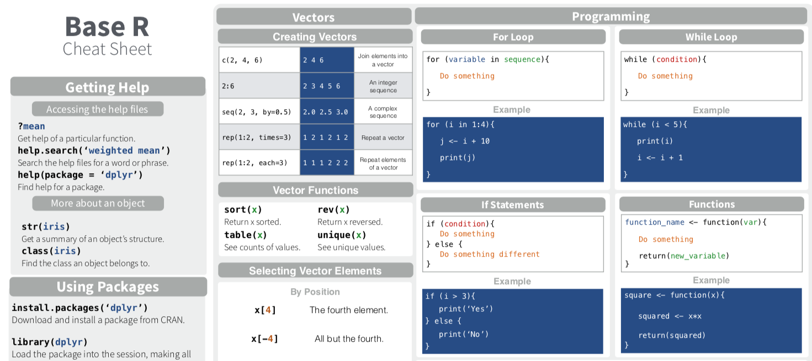

# Who uses R

## {data-background-iframe="http://r4stats.com/articles/popularity"}

[Popularity of Data Science Software](http://r4stats.com/articles/popularity)

# Becoming the Critic.


```r
vlink <- "http://www.perceptualedge.com/example9.php"
titlelink <- paste0('{data-background-iframe="', vlink, '"}')
```

## {data-background-iframe="http://www.perceptualedge.com/example9.php"}

[Visualization of the Day](http://www.perceptualedge.com/example9.php)

## 
> Above all else, show the data

**Tufte**

# The skill of debugging?

## Fix the errors

Do you see any errors in the following code?


```r
library(tidyverse)

ggplot(dota = mpg) + 
  geom_point(mapping = aes(x = displ, y = hwy))

fliter(mpg, cyl = 8)
filter(diamond, carat > 3)
```

## Interpret these error statements

Discuss with your neighbor what the error statement is saying. How would you fix it?


```r
ggplot(dota = mpg) + 
+   geom_point(mapping = aes(x = displ, y = hwy))
#> Error in structure(list(data = data, layers = list(), 
#> scales = scales_list(),  : 
#>  argument "data" is missing, with no default
```


```r
fliter(mpg, cyl = 8)
#> Error in fliter(mpg, cyl = 8) : could not find function "fliter"
```


```r
filter(diamond, carat > 3)
#> Error in filter(diamond, carat > 3) : object 'diamond' not found
```

## Motivational Support

You can do this!


# R Cheatsheets

## Many 'Cheatsheets' available

https://www.rstudio.com/resources/cheatsheets/


## Basic R Data Structures

http://github.com/rstudio/cheatsheets/raw/master/base-r.pdf

## Data Transformation

https://github.com/rstudio/cheatsheets/raw/master/data-transformation.pdf

## Let's get coding...

Now open [today's activity](01_Rintro.html) and work through the exercise.
