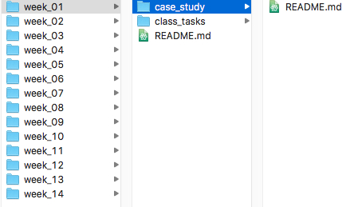

# Reading

- Chapter [8 R for Data Science - Projects](http://r4ds.had.co.nz/workflow-projects.html){target='blank'}
- RStudio and [the Git GUI](https://www.youtube.com/watch?v=E2d91v1Twcc){target='blank'}

## Introduction to Git

See the presentation associated with this task [here](presentations/Week03_Git.html).

## Course Folder Structure

For the rest of the course, you should keep your files organzed in a git-managed repository.  After syncing your local computer with your class repository, you will have a folder structure similar to the image below.

# Tasks

- Install GDAL
- Install the sf package

<i> <small> Adapted from [BYU M335 Data Science Course](https://byuistats.github.io/M335) </small> </i>
