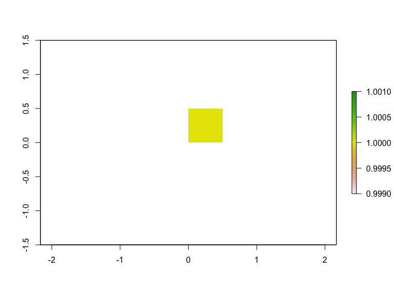
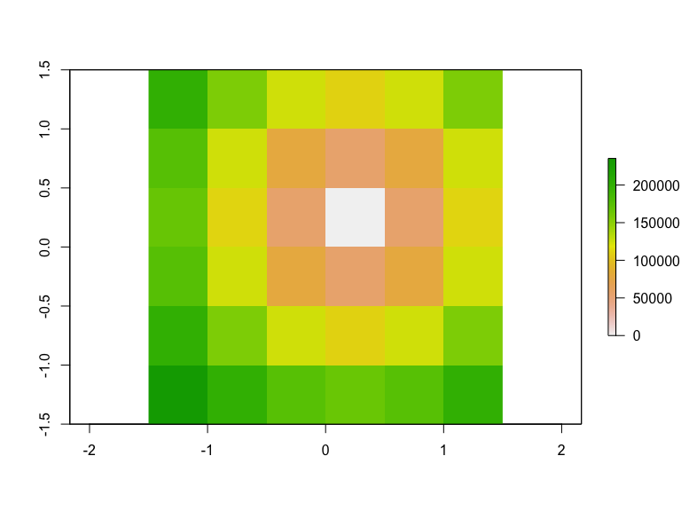
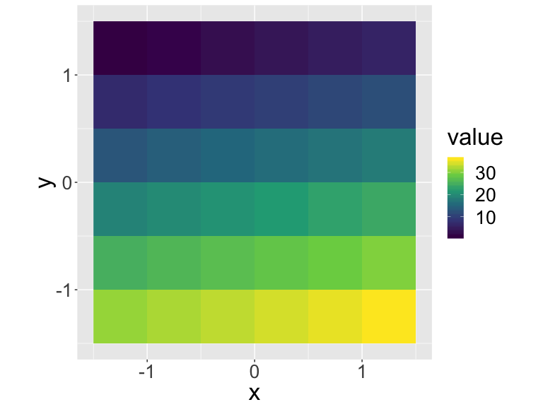

---

## Available Spatial Packages

* `sp`  First major spatial data package/format
* `rgdal` reading and writing spatial data
* `rgeos` Interface to open-source geometry engine (GEOS)
* `sf` Spatial Features in the 'tidyverse'
* `raster` gridded data (like satellite imagery)
* and a few others...

## Common Simple Feature (SF) types


## What about grids?


# Raster Data

## Raster Data Types
Many types including:

* Thematic (classified/thematic) data: land-use or soils data.
* Continuous data (temperature, elevation, spectral)
* Imagery / Pictures (scanned maps, drawings, etc.)

Most Common:

* Satellite Imagery and derived products
* Earth System Models (e.g. climate models)
* Other models


## Raster data in the tidyverse

Raster data is not yet closely connected to the **tidyverse**, however:

- Some functions from `raster` work well in `pipes`
- Convert vector data to `Spatial*` form using `as(my_vector, "Spatial")` for raster-vector interactions
- Some early efforts to bring raster data into the **tidyverse**, including [tabularaster](https://github.com/hypertidy/tabularaster), [sfraster](https://github.com/mdsumner/sfraster), [fasterize](https://github.com/ecohealthalliance/fasterize), and [stars](https://github.com/r-spatial/stars) (multidimensional, large datasets).

## Raster Package

```r
library(raster)
library(spData)
data(elev) #load fake data from spData package
plot(elev) #load fake data from spData package
```


## Raster Data Structure

```r
elev
```

```
## class       : RasterLayer 
## dimensions  : 6, 6, 36  (nrow, ncol, ncell)
## resolution  : 0.5, 0.5  (x, y)
## extent      : -1.5, 1.5, -1.5, 1.5  (xmin, xmax, ymin, ymax)
## coord. ref. : +proj=longlat +datum=WGS84 +ellps=WGS84 +towgs84=0,0,0 
## data source : in memory
## names       : layer 
## values      : 1, 36  (min, max)
```

---

```r
str(elev)
```

```
## Formal class 'RasterLayer' [package "raster"] with 12 slots
##   ..@ file    :Formal class '.RasterFile' [package "raster"] with 13 slots
##   .. .. ..@ name        : chr ""
##   .. .. ..@ datanotation: chr "FLT4S"
##   .. .. ..@ byteorder   : chr "little"
##   .. .. ..@ nodatavalue : num -Inf
##   .. .. ..@ NAchanged   : logi FALSE
##   .. .. ..@ nbands      : int 1
##   .. .. ..@ bandorder   : chr "BIL"
##   .. .. ..@ offset      : int 0
##   .. .. ..@ toptobottom : logi TRUE
##   .. .. ..@ blockrows   : int 0
##   .. .. ..@ blockcols   : int 0
##   .. .. ..@ driver      : chr ""
##   .. .. ..@ open        : logi FALSE
##   ..@ data    :Formal class '.SingleLayerData' [package "raster"] with 13 slots
##   .. .. ..@ values    : int [1:36] 1 2 3 4 5 6 7 8 9 10 ...
##   .. .. ..@ offset    : num 0
##   .. .. ..@ gain      : num 1
##   .. .. ..@ inmemory  : logi TRUE
##   .. .. ..@ fromdisk  : logi FALSE
##   .. .. ..@ isfactor  : logi FALSE
##   .. .. ..@ attributes: list()
##   .. .. ..@ haveminmax: logi TRUE
##   .. .. ..@ min       : int 1
##   .. .. ..@ max       : int 36
##   .. .. ..@ band      : int 1
##   .. .. ..@ unit      : chr ""
##   .. .. ..@ names     : chr ""
##   ..@ legend  :Formal class '.RasterLegend' [package "raster"] with 5 slots
##   .. .. ..@ type      : chr(0) 
##   .. .. ..@ values    : logi(0) 
##   .. .. ..@ color     : logi(0) 
##   .. .. ..@ names     : logi(0) 
##   .. .. ..@ colortable: logi(0) 
##   ..@ title   : chr(0) 
##   ..@ extent  :Formal class 'Extent' [package "raster"] with 4 slots
##   .. .. ..@ xmin: num -1.5
##   .. .. ..@ xmax: num 1.5
##   .. .. ..@ ymin: num -1.5
##   .. .. ..@ ymax: num 1.5
##   ..@ rotated : logi FALSE
##   ..@ rotation:Formal class '.Rotation' [package "raster"] with 2 slots
##   .. .. ..@ geotrans: num(0) 
##   .. .. ..@ transfun:function ()  
##   ..@ ncols   : int 6
##   ..@ nrows   : int 6
##   ..@ crs     :Formal class 'CRS' [package "sp"] with 1 slot
##   .. .. ..@ projargs: chr "+proj=longlat +datum=WGS84 +ellps=WGS84 +towgs84=0,0,0"
##   ..@ history : list()
##   ..@ z       : list()
```

---

### Arrays with metadata

```r
as.array(elev)
```

```
## , , 1
## 
##      [,1] [,2] [,3] [,4] [,5] [,6]
## [1,]    1    2    3    4    5    6
## [2,]    7    8    9   10   11   12
## [3,]   13   14   15   16   17   18
## [4,]   19   20   21   22   23   24
## [5,]   25   26   27   28   29   30
## [6,]   31   32   33   34   35   36
```
Rasters are just arrays / matricies with metadata.

---

### Cell Stats


```r
cellStats(elev, stat = mean, na.rm=T)
```

```
## [1] 18.5
```

```r
cellStats(elev, stat = quantile, na.rm=T)
```

```
##    0%   25%   50%   75%  100% 
##  1.00  9.75 18.50 27.25 36.00
```

---

### Raster Data Memory

```r
inMemory(elev)
```

```
## [1] TRUE
```

```r
canProcessInMemory(elev)
```

```
## [1] TRUE
```
Raster does not try to load or work with large datasets in RAM.  It creates temporary files and processes them in the background.

## Map Algebra

Convert feet to meters

```r
elev_m <- elev*0.3048
plot(elev_m)
```


---

### Simple Filter

```r
high_ground <- elev_m>8
plot(high_ground)
```


---

### Focal

```r
m <- matrix(1,nrow=3,ncol=3)
m
```

```
##      [,1] [,2] [,3]
## [1,]    1    1    1
## [2,]    1    1    1
## [3,]    1    1    1
```

```r
elev_smooth <- focal(elev_m,m,mean)
```
---

```r
par(mfrow=c(1,2))
plot(elev_m)
plot(elev_smooth)
```



## Arbitrary functions


```r
NA16=function(x) ifelse(x == 16,1,NA)
one_cell <- calc(elev,fun = NA16)
plot(one_cell)
```



## Distances to non-NA cells

```r
distance(one_cell)%>%
  plot()
```


Distance unit is meters if RasterLayer is `+proj=longlat`, map units (typically also meters) otherwise.

## And much more

* aggregate (to coarser resolution)
* area (calculate cell area)
* buffer
* contour
* crop
* interpolate
* Moran's I


# Visualization

## ggplot


```r
library(rasterVis)
gplot(elev)+
  geom_raster(aes(fill=value))
```


---

### All ggplot functionality available


```r
gplot(elev)+
  geom_raster(aes(fill=value))+
  coord_equal()+
  scale_fill_viridis_c()
```




