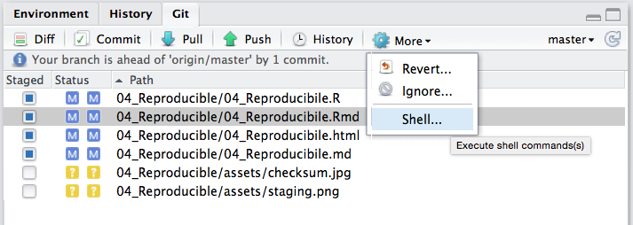

# Keeping up

## DataCamp {data-background-iframe="https://web.archive.org/web/20180909011807/https://www.datacamp.com/"}

https://www.datacamp.com/home

## Advantages of DataCamp

1. Slick dynamic interface
2. Lots of help available
3. Can provide hints (reducing XP points)
4. Easy to earn extra XP points with 'practice'
5. Free access to their 'premium' content (typically $29/month)
6. Additional 'Certification' that you can list on LinkedIn, CV, etc.

## Data Camp Screenshot


## Proposed course restructure

1. DataCamp chapter 'assignments' instead of homeworks
2. Less talking / lecturing material in class
3. More time in class to work on group case studies, ask questions, etc.

# Version Control: \n Keeping track of your files.

---

> "The goal of reproducible research is to tie specific instructions to data analysis and experimental data so that scholarship can be recreated, better understood, and verified."  

<small> Max Kuhn, CRAN Task View: Reproducible Research </small>


## Philosphy  
Remember, the data and code are _real_, the products (tables, figures) are ephemeral...  


## Our work exists on a spectrum of reproducibility


<small>Peng 2011, _Science_ 334(6060) pp. 1226-1227</small>

### The Claerbout Principle
> "An article about computational result is advertising, not scholarship. The actual scholarship is the full software environment, code and data, that produced the result." 

<small> Claerbout and Karrenbach, Proceedings of the 62nd Annual International Meeting of the Society of Exploration Geophysics. 1992</small>


## Tracking changes with version control 

**Payoffs**

- Eases collaboration
- Can track changes in any file type (plain text)
- Can revert file to any point in its tracked history

**Costs**

- Learning curve

# Git

## 

* **Strong support for non-linear development:** Rapid branching and merging,  specific tools for visualizing and navigating a non-linear development history. 
* **Distributed development:** No central server needed, each user has a full copy
* **Efficient handling of large projects:** Designed to manage the Linux OS
* **Cryptographic authentication of history:** The ID of a particular version depends uponthe complete history. Once published, it is not possible to change the old versions without it being noticed. 

## Git Has Integrity
Everything _checksummed_ before storage and then referred by _checksum_. 

> It’s impossible to change the contents of any file or directory without Git knowing. You can’t lose information in transit or get file corruption without Git being able to detect it.

## Checksum
A way of reducing digital information to a unique ID:


A 40-character hexadecimal SHA-1 hash: `24b9da6552252987aa493b52f8696cd6d3b00373`

Git doesn't care about filenames, extensions, etc.  It's the information that matters...

## The 3 states of files

### staged, modified, committed


The important stuff is hidden in the `.git` folder.

# Github

## Think of Github as a...

* Server to back up your files
* Website to share your files
* Method to track changes to your files
* Platform to collaboratively develop code
* Social media to show off your coding wizardry

## Example: course website managed with GitHub

[https://github.com/AdamWilsonLab/SpatialDataScience](https://github.com/AdamWilsonLab/SpatialDataScience)

## Github Alternatives

Host your own server or use another private company, such as BitBucket.

## Git use in this course

1. Set up class repository
2. Make changes (edit the code)
3. Save those changes as you go (ctrl-S)
4. Stage changes (get ready to commit them)
5. Commit changes at various milestones (like the end of the day or when you finish something)
6. Push those changes to github (back them up)
7. repeat

See Tasks [1](Tk_01.html) and [2](Tk_02.html).

## Function of Git Repository for this course

1. Force you to learn git (a little)
2. Force you to organize
3. Prepare you for collaborative coding
4. Allow me to see your in-class _participation_

## Commit to GitHub from within RStudio

### Basic Steps

1. Edit: make changes to a file in the repository you cloned above
2. Stage: tell git which changes you want to commit
3. Commit (with a message)
4. Push: send the updated files to GitHub

## Edit

Git tracks _all_ changes to files inside a repository.

## Stage


Select which changed  files (added, deleted, or edited) you want to commit.

## Commit


Add a _commit message_ and click commit.

## Sync (`push`)


Click the green arrow to sync with GitHub.

## Git File Lifecycle


## And much more!

Git has many, many more features...

#  Let's do it!

## Task 2 {data-background-iframe="../TK_02.html"}

[Task 2](../TK_02.html)

# More advanced Git

## Git command line from RStudio

RStudio has limited functionality.  




## Git help

```{}
$ git help <verb>
$ git <verb> --help
$ man git-<verb>
```
For example, you can get the manpage help for the config command by running `git help config`

## Git status


Similar to info in git tab in RStudio

## Git config
`git config` shows you all the git configuration settings:

* `user.email`
* `remote.origin.url`  (e.g. to connect to GitHub)

## Branching
Branches used to develop features isolated from each other. 


Default: _master_ branch. Use other branches for development/collaboration and merge them back upon completion.

## Basic Branching

```{}
$ git checkout -b devel   # create new branch and switch to it


$ git checkout master  #switch back to master
$ git merge devel  #merge in changes from devel branch
```
But we won't do much with branching in this course...

## Git can do far more!

Check out the (free) book [ProGIT](https://git-scm.com/book/en/v2)


Or the [cheatsheet](https://training.github.com/kit/downloads/github-git-cheat-sheet.pdf).


## Colophon

<small> Slides adapted from Dr. Çetinkaya-Rundel and [Ben Marwick's presentation to the UW Center for Statistics and Social Sciences (12 March 2014)](https://github.com/benmarwick/CSSS-Primer-Reproducible-Research) ([OrcID](http://orcid.org/0000-0001-7879-4531)) </small>

